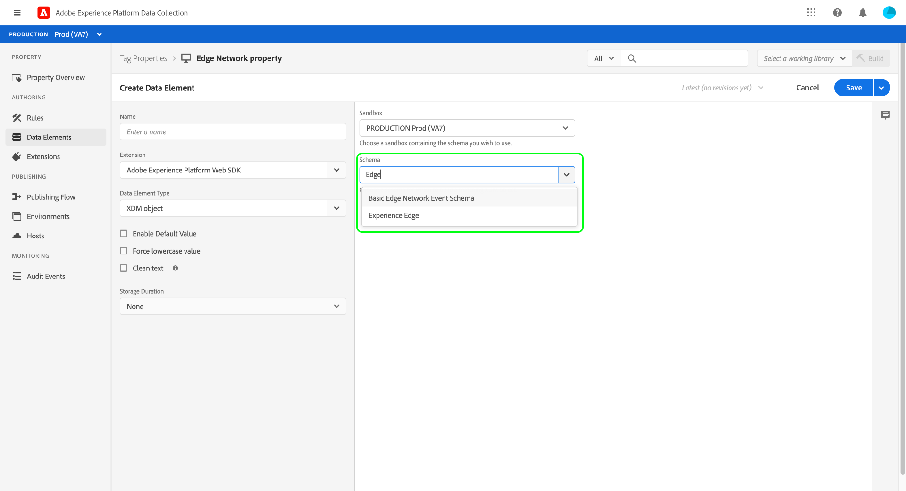
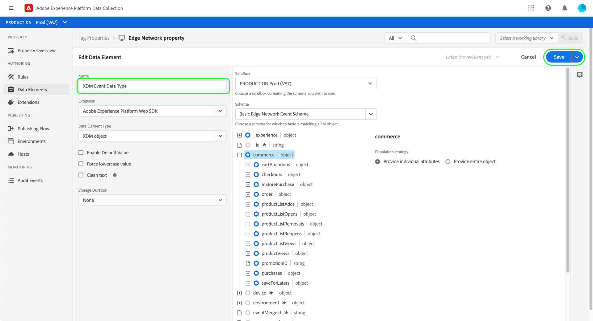

# 資料收集端到端概述

Adobe Experience Platform會收集您的資料並將其傳輸到其他Adobe產品和第三方目的地。 為了將事件資料從您的應用程式發送到Experience Platform邊緣網路，瞭解這些核心技術以及如何配置這些核心技術，以便在您需要時將資料傳輸到您需要的目的地，這一點非常重要。

本指南提供有關如何使用平台的資料收集功能通過邊緣網路發送事件的高級教程。 具體而言，本教程將介紹在資料收集UI(以前稱為Adobe Experience Platform Launch)中安裝和配置Adobe Experience PlatformWeb SDK標籤擴展的步驟。

>[!NOTE]
>
>如果您不想使用標籤，也可以選擇手動安裝和配置SDK，但必須按下面所述完成周圍的步驟。

## 先決條件

本教程使用資料收集UI建立架構、配置資料流並安裝Web SDK。 要在UI中執行這些操作，必須授予您對至少一個Web屬性的訪問權限，並同時執行以下操作 [產權](../tags/ui/administration/user-permissions.md#property-rights):

* 開發
* 管理擴展

請參閱上的指南 [管理資料收集權限](./permissions.md) 瞭解如何授予對屬性和屬性權限的訪問權限。

要使用本指南中提到的各種資料收集產品，您還必須具有對資料流的訪問權限以及建立和管理架構的能力。 如果您需要訪問這些功能中的任何一項，請聯繫您的CSM以幫助您獲得必要的訪問權限。 請注意，如果您尚未購買Adobe Experience Platform,Adobe將為您提供使用SDK的必要訪問權，無需額外付費。

如果您已經擁有平台訪問權限，則必須確保您擁有 [權限](../access-control/home.md#permissions) 在啟用的以下類別下：

* 資料模型製作
* 身分

查看 [訪問控制UI概述](../access-control/ui/overview.md) 瞭解如何向用戶授予平台權能的權限。

## 流程摘要

為您的網站配置資料收集的過程可總結如下：

1. [建立架構](#schema) 確定資料在發送到邊緣網路時的結構。
1. [建立資料流](#datastream) 配置要將資料發送到的目標。
1. [安裝和配置Web SDK](#sdk) 在網站上發生某些事件時將資料發送到資料流。

一旦您能夠將資料發送到邊緣網路，您還可以選擇 [配置事件轉發](#event-forwarding) 你的組織有許可證。

## 建立方案 {#schema}

[體驗資料模型(XDM)](../xdm/home.md) 是一個開源規範，它為模式形式的資料提供通用結構和定義。 換句話說， XDM是一種構建和格式化資料的方法，該方法可由邊緣網路和其他Adobe Experience Cloud應用程式操作。

設定資料收集操作的第一步是建立XDM架構來表示資料。 在本教程的後續步驟中，您將將要發送的資料映射到此架構的結構。

>[!NOTE]
>
>XDM模式是可定製的。 下面介紹的步驟不是過於規範，而是專門針對Web SDK的架構要求。 在這些參數之外，您可以自由定義資料的剩餘結構。

在資料收集UI中，選擇 **[!UICONTROL 架構]** 的子菜單。 從此處，您可以看到屬於您組織的先前建立的架構的清單。 要繼續，請選擇 **[!UICONTROL 建立架構]**，然後選擇 **[!UICONTROL XDM體驗事件]** 的下界。


出現一個對話框，提示您開始向架構添加欄位組。 要使用Web SDK發送事件，必須添加欄位組 **[!UICONTROL AEP Web SDK體驗事件混合]**。 此欄位組包含由Web SDK庫自動收集的資料屬性的定義。

使用搜索欄縮小清單範圍，幫助更輕鬆地查找此欄位組。 找到後，在選擇之前從清單中選擇它 **[!UICONTROL 添加欄位組]**。


此時將顯示架構畫布，其中顯示XDM架構的樹結構，包括Web SDK欄位組提供的欄位。


選擇樹中要開啟的根欄位 **[!UICONTROL 架構屬性]** 在右欄中，您可以提供架構的名稱和可選說明。


如果要向架構添加更多欄位，可通過選擇 **[!UICONTROL 添加]** 下 **[!UICONTROL 欄位組]** 在左欄上。


>[!NOTE]
>
>請參閱上的指南 [添加欄位組](../xdm/ui/resources/schemas.md#add-field-groups) 在XDM文檔中，瞭解有關如何搜索不同欄位組以適合您的使用情形的詳細步驟。
>
>最佳做法是只為計畫通過邊緣網路發送的資料添加欄位。 將欄位添加到架構並保存後，以後只能對架構進行添加更改。 請參閱 [模式演化規則](../xdm/schema/composition.md#evolution) 的子菜單。

添加所需欄位後，選擇 **[!UICONTROL 保存]** 的子菜單。


## 建立資料流 {#datastream}

資料流是一種配置，它告訴邊緣網路要將資料發送到的位置。 具體來說，資料流指定要將資料發送到的Experience Cloud產品，以及希望在每個產品中處理和儲存資料的方式。

>[!NOTE]
>
>如果您想使用 [事件轉發](../tags/ui/event-forwarding/overview.md) （假定您的組織已獲得功能許可），您必須以啟用Adobe產品的方式為資料流啟用它。 有關此流程的詳細資訊，請參閱 [後續部分](#event-forwarding)。

在資料收集UI中，選擇 **[!UICONTROL 資料流]**。 在此，可以從清單中選擇要編輯的現有資料流，或通過選擇 **[!UICONTROL 新建資料流]**。


資料流的配置要求取決於您要將資料發送到哪些產品和功能。 有關每個產品的配置選項的詳細資訊，請參閱 [資料流概述](../edge/datastreams/overview.md)。

## 安裝和配置Web SDK {#install}

建立架構和資料流後，下一步是安裝和配置平台Web SDK，以開始向邊緣網路發送資料。

>[!NOTE]
>
>本節使用資料收集UI配置Web SDK標籤擴展，但您也可以使用原始代碼安裝和配置它。 有關詳細資訊，請參閱以下指南：
>
>* [安裝SDK](../edge/fundamentals/installing-the-sdk.md)
>* [配置SDK](../edge/fundamentals/configuring-the-sdk.md)
>
>另請注意，即使您只想使用事件轉發，仍必須按照說明安裝和配置SDK，然後才能在 [後續步驟](#event-forwarding)。

該過程可概括如下：

1. [在標籤屬性上安裝Adobe Experience PlatformWeb SDK](#install-sdk) 以獲取其功能。
1. [建立XDM對象資料元素](#data-element) 將網站上的變數映射到先前建立的XDM架構的結構。
1. [建立規則](#rule) 告知SDK何時向邊緣網路發送資料。
1. [生成並安裝庫](#library) 在您的網站上執行規則。

### 在標籤屬性上安裝SDK {#install-sdk}

選擇 **[!UICONTROL 標籤]** 的子菜單。 如果需要，您可以選擇要編輯的現有屬性，也可以選擇 **[!UICONTROL 新建屬性]** 的雙曲餘切值。


如果建立新屬性，請提供描述性名稱並設定 [!UICONTROL 平台] 至 **[!UICONTROL Web]**。 提供Web屬性的完整域，然後選擇 **[!UICONTROL 保存]**。


此時將顯示屬性的概述頁。 從此處，選擇 **[!UICONTROL 擴展]** 在左側導航中，然後選擇 **[!UICONTROL 目錄]**。 查找平台Web SDK的清單（可選地使用搜索欄縮小結果範圍），然後選擇 **[!UICONTROL 安裝]**。


此時將顯示SDK的配置頁。 大多數必需值都自動填充了預設值，如果您願意，可以選擇更改這些預設值。


但是，在安裝SDK之前，必須選擇資料流，以便它知道將資料發送到哪裡。 下 **[!UICONTROL 資料流]**，使用下拉菜單選擇在 [前一步](#datastream)。 設定資料流後，選擇 **[!UICONTROL 保存]** 完成將SDK安裝到屬性。


### 建立XDM資料元素 {#data-element}

為了使SDK將資料發送到邊緣網路，必須將該資料映射到您在 [上一步](#schema)。 此映射是通過使用資料元素來完成的。

在UI中，選擇 **[!UICONTROL 資料元素]**，然後選擇 **[!UICONTROL 建立新資料元素]**。


在下一螢幕上，選擇 **[!UICONTROL Adobe Experience PlatformWeb SDK]** 下 [!UICONTROL 擴展] 下拉清單，然後選擇 **[!UICONTROL XDM對象]** 的子菜單。


此時將顯示XDM對象類型的配置對話框。 該對話框會自動選擇您的平台沙箱，從此您可以查看在該沙箱中建立的所有架構。 從清單中選擇先前建立的XDM架構。



將顯示架構的結構。 所有帶星號的欄位(**\***)指示事件觸發時自動填充的欄位。 對於所有其它欄位，可以瀏覽架構的結構並填寫其餘資料。


>[!NOTE]
>
>上面的螢幕快照演示如何從網站的客戶端映射全局可訪問的變數(`cartAbandonsTotal`)到XDM欄位，方法是在 [!UICONTROL 值] 欄位，由百分號(`%`)。
>
>您還可以使用以前建立的其他資料元素來填充這些欄位。 請參閱上的引用 [資料元素](../tags/ui/managing-resources/data-elements.md) 的子菜單。

完成資料到架構的映射後，請在選擇之前為資料元素提供名稱 **[!UICONTROL 保存]**。



### 建立規則

保存資料元素後，下一步是建立規則，該規則將在網站上發生特定事件時（如客戶將產品添加到購物車時）將其發送到邊緣網路。

您幾乎可以為任何可能在您的網站上發生的事件設定規則。 例如，本節說明如何建立客戶提交表單時將觸發的規則。 以下HTML表示一個帶有「添加到購物車」表單的簡單網頁，該表單將是規則的主題：

```html
<!DOCTYPE html>
<html>
<body>

  <form id="add-to-cart-form">
    <label for="item">Product:</label><br>
    <input type="text" id="item" name="item"><br>
    <label for="amount">Amount:</label><br>
    <input type="number" id="amount" name="amount" value="1"><br><br>
    <input type="submit" value="Add to Cart">
  </form> 

</body>
</html>
```

在資料收集UI中，選擇 **[!UICONTROL 規則]** 在左側導航中，然後選擇 **[!UICONTROL 建立新規則]**。


在下一螢幕中，提供規則的名稱。 從此開始，下一步是確定規則的事件（換句話說，規則何時觸發）。 選擇 **[!UICONTROL 添加]** 在 [!UICONTROL 事件]。


此時將顯示事件配置頁。 要配置事件，必須首先選擇事件類型。 事件類型由擴展提供。 例如，要設定「表單提交」事件，請選擇 **[!UICONTROL 核心]** ，然後選擇 **[!UICONTROL 提交]** 在 **[!UICONTROL 窗體]** 的子菜單。

>[!NOTE]
>
>有關AdobeWeb擴展提供的不同事件類型（包括如何配置它們）的詳細資訊，請參見 [Adobe擴展引用](../tags/extensions/web/overview.md) 的下界。

表單提交事件允許您使用 [CSS選擇器](https://www.w3schools.com/css/css_selectors.asp) 引用要啟動的規則的特定元素。 在下面的示例中，ID `add-to-cart-form` 使此規則僅針對「添加到購物車」窗體觸發。 選擇 **[!UICONTROL 保留更改]** 將事件添加到規則。


將重新顯示規則配置頁，顯示已添加事件。 您可以縮小&quot;[!UICONTROL 如果]通過增加規則的附加條件。

否則，下一步是添加規則在觸發時要執行的操作。 選擇 **[!UICONTROL 添加]** 在 **[!UICONTROL 操作]** 繼續。


此時將顯示操作配置頁。 要獲取將資料發送到邊緣網路的規則，請選擇 **[!UICONTROL Adobe Experience PlatformWeb SDK]** 分機，和 **[!UICONTROL 發送事件]** 按鈕。


螢幕將更新，顯示配置發送事件操作的其他選項。 下 **[!UICONTROL 類型]**，可提供自定義類型值以填充 `eventType` XDM欄位。 下 **[!UICONTROL XDM資料]**，提供先前建立的XDM資料類型的名稱（由百分號環繞），或選擇資料庫表徵圖()從清單中選擇。 這是最終將發送到邊緣網路的資料。

選擇 **[!UICONTROL 保留更改]** 的子菜單。


配置完規則後，選擇 **[!UICONTROL 保存]** 完成該過程。


### 生成並安裝庫 {#library}

配置規則後，您就可以將其添加到標籤庫，將該庫構建到環境中，並在您的網站上安裝該庫。

>[!NOTE]
>
>如果尚未在資料收集UI中設定環境，則必須先設定環境，然後才能建立生成。 請參閱 [為Web屬性配置環境](../tags/ui/publishing/environments.md#web-configuration) 的子菜單。

要瞭解如何建立庫、向庫添加擴展和規則以及將庫構建到環境中，請參閱上的指南 [管理庫](../tags/ui/publishing/libraries.md) 的下界。 建立庫時，請確保包含平台Web SDK擴展和以前建立的資料收集規則。

建立庫並將其構建分配給某個環境後，您就可以在網站的客戶端安裝該環境。 請參閱 [安裝環境](../tags/ui/publishing/environments.md#installation) 的子菜單。

在您的網站上安裝了該環境後，您可以 [test您的實施](../tags/ui/publishing/embed-code-testing.md) 使用Adobe Experience Platform調試器。

## 配置事件轉發（可選） {#event-forwarding}

>[!NOTE]
>
>事件轉發僅對已獲得許可的組織可用。

將SDK配置為將資料發送到邊緣網路後，可以設定事件轉發，以告知邊緣網路希望將資料傳送到何處。

要使用事件轉發，必須先建立事件轉發屬性。 選擇 **[!UICONTROL 事件轉發]** 在左導航中，選擇 **[!UICONTROL 新建屬性]**。 在選擇前提供屬性的名稱 **[!UICONTROL 保存]**。

建立事件轉發屬性後，下一步是建立一個規則來確定資料應在何處發送。 事件轉發屬性的規則的構建方式與標籤屬性的構造方式大致相同，但不能指定任何事件（因為事件轉發僅處理它直接從資料流接收的事件）。 對於規則的操作，您可以使用一個可用的事件轉發擴展，或使用自定義代碼來傳遞事件。


與以前類似，配置規則後，必須將其添加到庫並將該庫構建到環境中。

生成完成後，最後一步是更新您的資料流 [先前配置](#datastream) 並啟用事件轉發。 要開始，請導航到 **[!UICONTROL 資料流]** 並從清單中選擇有關的資料流。 在此啟用事件轉發的切換，並提供您剛剛配置的屬性和環境的名稱。


## 後續步驟

本指南提供了如何使用平台Web SDK將資料發送到邊緣網路的高端端到端概述。 請參閱本指南中連結的文檔，瞭解有關各個元件和服務的詳細資訊。
