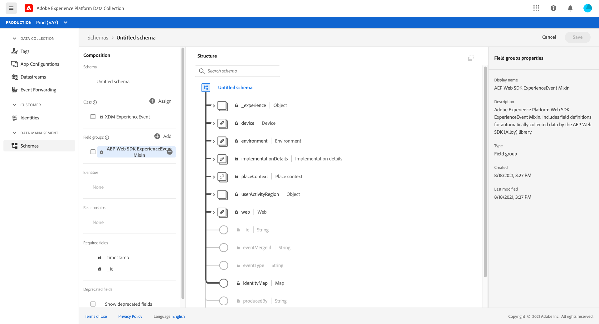
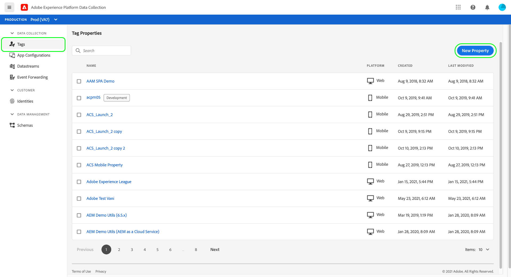
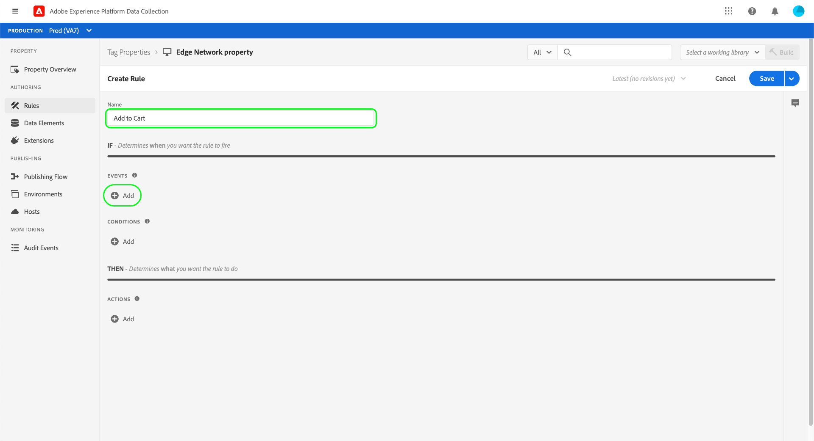

# 資料收集端對端概觀

Adobe Experience Platform會收集您的資料並傳輸至其他Adobe產品和第三方目的地。 若要將事件資料從您的應用程式傳送至Experience Platform邊緣網路，請務必瞭解這些核心技術，以及如何設定這些技術，以便在您需要時將資料傳送至所需的目的地。

本指南提供如何使用Platform的資料收集功能透過Edge Network傳送事件的高階教學課程。 本教學課程會具體說明在資料收集UI (前身為Adobe Experience Platform Launch)中安裝和設定Adobe Experience Platform Web SDK標籤擴充功能的步驟。

>[!NOTE]
>
>如果您不想使用標籤，也可以選擇手動安裝及設定SDK，但周圍的步驟仍必須完成，如下所示。
>
>所有涉及資料收集UI的步驟也可以在Experience PlatformUI中執行。

## 先決條件

本教學課程使用資料收集UI來建立結構、設定資料串流及安裝Web SDK。 若要在UI中執行這些動作，您必須被授予至少一個Web屬性的存取權以及下列內容 [屬性權利](../tags/ui/administration/user-permissions.md#property-rights)：

* 開發
* 管理擴充功能

請參閱指南： [管理資料收集的許可權](./permissions.md) 以瞭解如何授予屬性和屬性許可權的存取權。

若要使用本指南中提到的各種資料收集產品，您也必須有權存取資料串流，並能夠建立和管理結構描述。 如果您需要存取其中任何一項功能，請聯絡您的Adobe帳戶團隊以協助您取得必要的存取權。 請注意，如果您尚未購買Adobe Experience Platform，Adobe會免費提供您使用SDK的必要存取權。

如果您已擁有平台的存取權，請務必確保您已擁有 [許可權](../access-control/home.md#permissions) 啟用下列類別：

* 資料模型製作
* 身分

請參閱 [存取控制UI總覽](../access-control/ui/overview.md) 瞭解如何將Platform功能的許可權授予使用者。

## 程式摘要

為您的網站設定資料收集的程式可概述如下：

1. [建立結構描述](#schema) 以判斷資料傳送至Edge Network時的結構方式。
1. [建立資料串流](#datastream) 以設定要將資料傳送至哪些目的地。
1. [安裝及設定Web SDK](#sdk) 當您的網站上發生某些事件時，將資料傳送至資料串流的方式。

一旦您將資料傳送至Edge Network，您也可以選擇使用 [設定事件轉送](#event-forwarding) 貴組織擁有其授權。

## 建立方案 {#schema}

[體驗資料模型(XDM)](../xdm/home.md) 是開放原始碼規格，以結構描述的形式提供資料的通用結構和定義。 換言之，XDM是一種可讓Edge Network和其他Adobe Experience Cloud應用程式採取動作的方式來建構和格式化資料的方式。

設定資料收集作業的第一步，是建立XDM結構描述來代表您的資料。 在本教學課程的稍後步驟中，您會將您要傳送的資料對應至此結構描述的結構。

>[!NOTE]
>
>XDM結構描述非常可自訂。 以下概述的步驟並非過度規範化，而是特別針對Web SDK的結構描述需求。 在這些引數之外，您可以隨意定義資料的其他結構。

在UI中，選取 **[!UICONTROL 結構描述]** 左側導覽列中。 從這裡，您可以看到屬於您組織之先前建立的結構描述清單。 若要繼續，請選取 **[!UICONTROL 建立結構描述]**，然後選取 **[!UICONTROL XDM ExperienceEvent]** 下拉式選單中的。


會出現一個對話方塊，提示您開始將欄位群組新增到結構描述。 若要使用Web SDK傳送事件，您必須新增欄位群組 **[!UICONTROL AEP Web SDK ExperienceEvent Mixin]**. 此欄位群組包含Web SDK程式庫自動收集之資料屬性的定義。

使用搜尋列縮小清單的範圍，以協助更容易找到此欄位群組。 找到後，從清單中選取它，然後選取 **[!UICONTROL 新增欄位群組]**.


結構畫布隨即出現，顯示XDM結構的樹狀結構，包括Web SDK欄位群組提供的欄位。



在樹狀結構中選取要開啟的根欄位 **[!UICONTROL 結構描述屬性]** 在右側邊欄中，您可以在此為結構描述提供名稱和選擇性說明。


如果您想要將更多欄位新增到結構描述，您可以選取 **[!UICONTROL 新增]** 在 **[!UICONTROL 欄位群組]** 區段。


>[!NOTE]
>
>請參閱指南： [新增欄位群組](../xdm/ui/resources/schemas.md#add-field-groups) XDM檔案中有關如何搜尋不同欄位群組以符合您使用案例的詳細步驟。
>
>最佳實務是只為您計畫透過Edge Network傳送的資料新增欄位。 一旦您將欄位新增到結構描述並儲存後，以後只能對結構描述進行附加變更。 請參閱以下小節： [結構描述演化規則](../xdm/schema/composition.md#evolution) 以取得詳細資訊。

新增所需的欄位後，請選取 **[!UICONTROL 儲存]** 以儲存結構。


## 建立資料串流 {#datastream}

資料串流是一種設定，可告知Edge Network您要將資料傳送至何處。 具體而言，資料串流會指定您要將資料傳送至哪些Experience Cloud產品，以及您要將資料處理及儲存在每個產品中的方式。

>[!NOTE]
>
>如果您想使用 [事件轉送](../tags/ui/event-forwarding/overview.md) （假設您的組織已獲得使用授權），您必須以啟用Adobe產品的相同方式，為資料流啟用它。 有關此程式的詳細資訊，請參見 [稍後章節](#event-forwarding).

選取 **[!UICONTROL 資料串流]** 左側導覽列中。 從這裡，您可以從清單中選取要編輯的現有資料流，也可以透過選取來建立新設定 **[!UICONTROL 新增資料串流]**.


資料串流的設定需求取決於您要將資料傳送至哪些產品和功能。 如需每個產品組態選項的詳細資訊，請參閱 [資料串流概觀](../edge/datastreams/overview.md).

## 安裝及設定Web SDK {#install}

建立方案和資料流後，下一步就是安裝和設定Platform Web SDK，以開始傳送資料給Edge Network。

>[!NOTE]
>
>本節使用資料收集UI來設定Web SDK標籤擴充功能，但您也可以改用原始程式碼來安裝和設定。 如需詳細資訊，請參閱下列指南：
>
>* [安裝SDK](../edge/fundamentals/installing-the-sdk.md)
>* [設定SDK](../edge/fundamentals/configuring-the-sdk.md)
>
>另請注意，即使您只想使用事件轉送，您仍然必須如說明的那樣安裝和設定SDK，才能在 [後續步驟](#event-forwarding).

此程式可歸納如下：

1. [在標籤屬性上安裝Adobe Experience Platform Web SDK](#install-sdk) 以存取其功能。
1. [建立XDM物件資料元素](#data-element) 將網站上的變數對應至您先前建立的XDM結構描述的結構。
1. [建立規則](#rule) 告訴SDK何時應將資料傳送至Edge Network。
1. [建置及安裝程式庫](#library) ，以在您的網站上實作規則。

### 在標籤屬性上安裝SDK {#install-sdk}

選取 **[!UICONTROL 標籤]** 以顯示標籤屬性清單。 您可以視需要選擇要編輯的現有屬性，也可以選取 **[!UICONTROL 新增屬性]** 而非。



如果建立新屬性，請提供描述性名稱並設定 [!UICONTROL Platform] 至 **[!UICONTROL Web]**. 提供Web屬性的完整網域，然後選取 **[!UICONTROL 儲存]**.


隨即顯示屬性的概觀頁面。 從此處選取 **[!UICONTROL 擴充功能]** 在左側導覽中，然後選取 **[!UICONTROL 目錄]**. 尋找Platform Web SDK的清單（可選擇使用搜尋列來縮小結果範圍）並選取 **[!UICONTROL 安裝]**.


SDK的設定頁面隨即顯示。 大多數必要值都會自動填入預設值，您可以視需要選擇變更這些預設值。


不過，在安裝SDK之前，您必須先選取資料流，讓資料流知道要將您的資料傳送至何處。 下 **[!UICONTROL 資料串流]**，使用下拉式選單來選取您在 [更早步驟](#datastream). 設定資料流後，選取 **[!UICONTROL 儲存]** 以完成將SDK安裝到屬性。


### 建立XDM資料元素 {#data-element}

為了讓SDK將資料傳送至Edge Network，該資料必須對應至您在 [上一步](#schema). 此對應可透過使用資料元素來完成。

在UI中，選取 **[!UICONTROL 資料元素]**，然後選取 **[!UICONTROL 建立新資料元素]**.


在下一個畫面中，選取 **[!UICONTROL Adobe Experience Platform Web SDK]** 在 [!UICONTROL 副檔名] 下拉式清單，然後選取 **[!UICONTROL XDM物件]** （資料元素型別）。


XDM物件型別的組態對話方塊隨即出現。 該對話方塊會自動選取您的Platform沙箱，從這裡您可以看到在該沙箱中建立的所有結構描述。 從清單中選取您先前建立的XDM結構描述。


結構描述的結構隨即顯示。 所有欄位都有星號(**\***)表示在事件引發時將自動填入的欄位。 至於所有其他欄位，您可以探索結構描述的結構並填寫其餘資料。


>[!NOTE]
>
>上面的熒幕擷圖示範如何從網站的使用者端(`cartAbandonsTotal`)至XDM欄位，方法為在 [!UICONTROL 值] 欄位，由百分比符號包圍(`%`)。
>
>您也可以使用其他先前建立的資料元素來填入這些欄位。 請參閱參考資料： [資料元素](../tags/ui/managing-resources/data-elements.md) 標籤檔案中以取得詳細資訊。

完成將資料對應至結構描述後，請先提供資料元素的名稱，然後再選取 **[!UICONTROL 儲存]**.


### 建立規則

儲存資料元素後，下一步就是建立規則，每當網站上發生特定事件（例如客戶將產品加入購物車時），就會傳送至Edge Network。

您可以為網站上發生的幾乎任何事件設定規則。 例如，本節說明如何建立客戶提交表單時觸發的規則。 以下HTML代表具有「加入購物車」表單的簡單網頁，這會是規則的主題：

```html
<!DOCTYPE html>
<html>
<body>

  <form id="add-to-cart-form">
    <label for="item">Product:</label><br>
    <input type="text" id="item" name="item"><br>
    <label for="amount">Amount:</label><br>
    <input type="number" id="amount" name="amount" value="1"><br><br>
    <input type="submit" value="Add to Cart">
  </form> 

</body>
</html>
```

在資料收集UI中，選取 **[!UICONTROL 規則]** 在左側導覽中，然後選取 **[!UICONTROL 建立新規則]**.


在下一個畫面中，提供規則的名稱。 從這裡，下一步是決定規則的事件（換句話說，規則將於何時引發）。 選取 **[!UICONTROL 新增]** 在 [!UICONTROL 事件].



事件組態頁面隨即顯示。 若要設定事件，您必須先選取事件型別。 事件型別由擴充功能提供。 例如，若要設定「表單提交」事件，請選取 **[!UICONTROL 核心]** 擴充功能，然後選取 **[!UICONTROL 提交]** 事件型別位於 **[!UICONTROL 表單]** 類別。

>[!NOTE]
>
>如需AdobeWeb擴充功能所提供的各種事件型別（包括如何設定）的詳細資訊，請參閱 [Adobe擴充功能參考](../tags/extensions/client/overview.md) 標籤檔案中。

表單提交事件可讓您使用 [CSS選取器](https://www.w3schools.com/css/css_selectors.asp) 以參照規則要引發的特定元素。 在以下範例中，ID `add-to-cart-form` ，因此此規則只會在「加入購物車」表單中觸發。 選取 **[!UICONTROL 保留變更]** 將事件新增至規則。


規則設定頁面會重新顯示，顯示事件已新增。 您可以縮小&quot;[!UICONTROL 若]」的方式是將其他條件新增至規則。

否則，下一步就是新增動作，讓規則在觸發時執行。 選取 **[!UICONTROL 新增]** 在 **[!UICONTROL 動作]** 以繼續。


動作設定頁面隨即顯示。 若要取得將資料傳送至Edge Network的規則，請選取 **[!UICONTROL Adobe Experience Platform Web SDK]** 擴充功能的，以及 **[!UICONTROL 傳送事件]** （動作型別）。


畫面會更新以顯示其他選項，用於設定傳送事件動作。 下 **[!UICONTROL 型別]**，您可以提供自訂型別值以填入 `eventType` XDM欄位。 下 **[!UICONTROL XDM資料]**，提供您先前建立的XDM資料型別名稱（周圍有百分比符號），或選取資料庫圖示()以從清單中選取它。 這是最終傳送至Edge Network的資料。

選取 **[!UICONTROL 保留變更]** 完成後。


設定完規則後，選取 **[!UICONTROL 儲存]** 以完成程式。


### 建置及安裝程式庫 {#library}

設定規則後，您就可以將其新增至標籤程式庫、將該程式庫建置至環境，並在您的網站上安裝該建置。

>[!NOTE]
>
>如果您尚未在資料收集UI中設定環境，必須先設定環境，然後才能建立組建。 請參閱以下小節： [設定Web屬性的環境](../tags/ui/publishing/environments.md#web-configuration) 標籤檔案中以取得詳細資訊。

若要瞭解如何建立程式庫、將擴充功能和規則新增至程式庫，以及將該程式庫建置至環境，請參閱以下指南中的 [管理程式庫](../tags/ui/publishing/libraries.md) 標籤檔案中。 建立程式庫時，請務必包含Platform Web SDK擴充功能以及您先前建立的資料收集規則。

建立程式庫並將其組建指派給環境後，您就可以將該環境安裝在網站的使用者端。 請參閱以下小節： [安裝環境](../tags/ui/publishing/environments.md#installation) 以取得詳細資訊。

在網站上安裝環境後，您可以 [測試您的實作](../tags/ui/publishing/embed-code-testing.md) 使用Adobe Experience Platform Debugger。

## 設定事件轉送（選擇性） {#event-forwarding}

>[!NOTE]
>
>事件轉送僅適用於已獲得授權的組織。

設定SDK將資料傳送至Edge Network後，您就可以設定事件轉送，通知Edge Network您要將資料傳送至何處。

若要使用事件轉送，您必須先建立事件轉送屬性。 選取 **[!UICONTROL 事件轉送]** 在左側導覽中，然後選取 **[!UICONTROL 新增屬性]**. 在選取之前提供屬性的名稱 **[!UICONTROL 儲存]**.

建立事件轉送屬性後，下一步就是建立規則，決定應傳送資料的位置。 事件轉送屬性規則的建構方式與標籤屬性大致相同，唯一例外是不能指定任何事件（因為事件轉送只會處理直接從資料流接收的事件）。 對於規則的動作，您可以使用其中一個可用的事件轉送擴充功能，或使用自訂程式碼來傳送事件。


與之前類似，設定規則後，您必須將其新增至程式庫，然後將該程式庫建置至環境。

建置完成後，最後一個步驟是更新資料流 [先前設定](#datastream) 並啟用事件轉送。 若要開始，請導覽至 **[!UICONTROL 資料串流]** 並從清單中選取有問題的資料流。 從這裡，啟用事件轉送的切換，並提供您剛才設定的屬性和環境名稱。


## 後續步驟

本指南提供如何使用Platform Web SDK傳送資料至Edge Network的高階端對端總覽。 請參閱本指南中的檔案連結，以取得各種相關元件和服務的詳細資訊。
