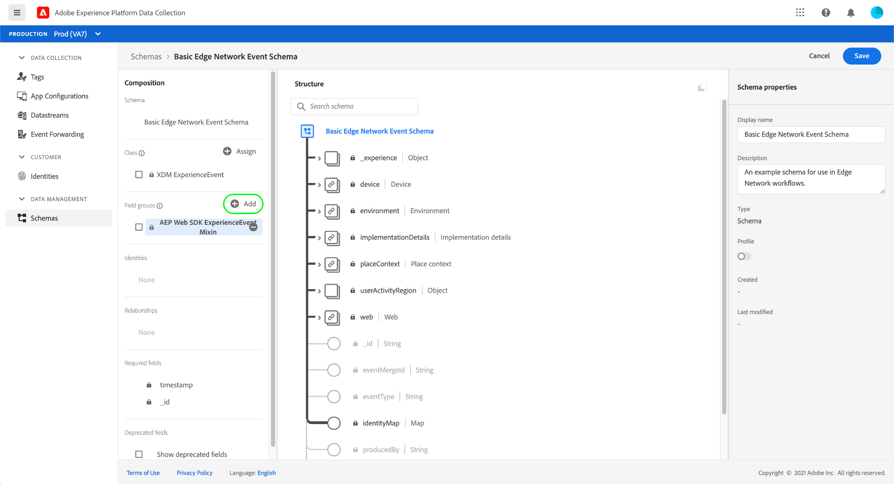
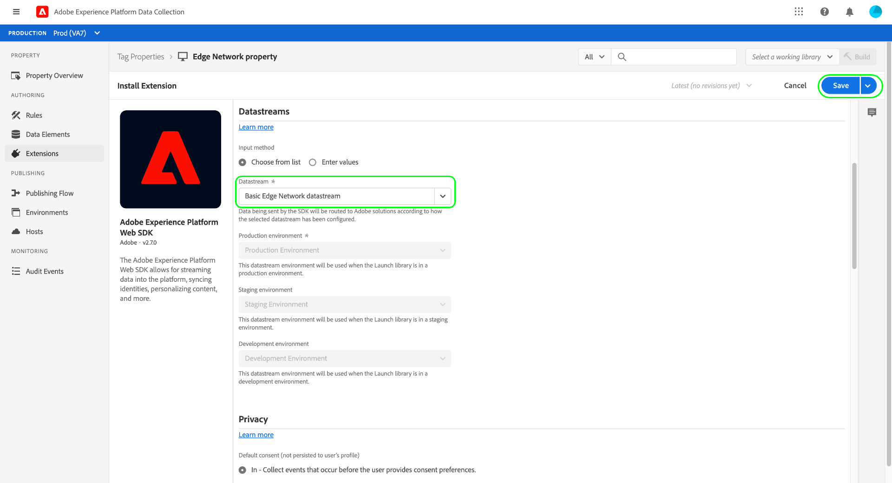

# 資料收集端對端概述

在Adobe Experience Platform中，資料收集是指可共同收集將資料傳輸至其他Adobe產品或第三方目的地的數種技術。 若要將事件資料從您的應用程式傳送至Adobe Experience Platform邊緣網路，請務必了解這些核心技術，以及如何設定這些技術，以便在您需要時將資料傳送至所需的目的地。

本指南提供高階教學課程，說明如何使用資料收集技術透過邊緣網路傳送事件。 具體來說，本教學課程會逐步說明在資料收集UI(原稱為Adobe Experience Platform Launch)中安裝和設定Adobe Experience Platform Web SDK標籤擴充功能的步驟。

>[!NOTE]
>
>如果您不想使用標籤，也可以選擇手動安裝及設定SDK，但相關步驟仍須依照下列說明完成。

## 先決條件

本教學課程使用資料收集UI來建立結構、設定資料流和安裝Web SDK。 若要在UI中執行這些動作，您必須獲得至少一個Web屬性的存取權，以及下列[屬性權限](../tags/ui/administration/user-permissions.md#property-rights):

* 開發
* 管理擴充功能

請參閱[管理標籤權限的指南](../tags/ui/administration/manage-permissions.md) ，了解如何授予屬性和屬性權限的存取權。

若要使用本指南中提及的各種資料收集產品，您還必須擁有資料流的存取權，以及建立和管理結構的功能。 若您需要存取其中一項功能，請聯絡您的CSM以協助您取得必要的存取權。 請注意，如果您尚未購買Adobe Experience Platform,Adobe會免費提供您使用SDK的必要存取權。

如果您已有Platform的存取權，您必須確定已啟用下列類別下的所有[權限](../access-control/home.md#permissions):

* 資料模型製作
* 身分

請參閱[存取控制UI概述](../access-control/ui/overview.md) ，了解如何將Platform功能的權限授與使用者。

## 流程摘要

為您的網站設定資料收集的程式摘要如下：

1. [建立](#schema) 架構，以決定傳送至邊緣網路時資料的結構。
1. [建立資](#datastream) 料流，以設定您要將資料傳送至哪些目的地。
1. [安裝並設定Web SDK,](#sdk) 以在網站上發生特定事件時將資料傳送至資料流。

在您能夠將資料傳送至邊緣網路後，如果貴組織擁有該網路的授權，您也可以選擇性地[配置事件轉發](#event-forwarding)。

## 建立方案 {#schema}

[Experience Data Model(XDM)](../xdm/home.md) 是開放原始碼規格，可為結構形式的資料提供通用結構和定義。換句話說，XDM是以可由邊緣網路和其他Adobe Experience Cloud應用程式操作的方式，來建構和格式化資料。

設定資料收集作業的第一步，是建立XDM結構以呈現資料。 在本教學課程的稍後步驟中，您會將您要傳送的資料對應至此結構。

>[!NOTE]
>
>XDM結構可供自訂。 以下概述的步驟並非過於規範，而是特別著重於Web SDK的結構需求。 在這些參數之外，您可以自由定義資料的剩餘結構。

在資料收集UI中，在左側導覽中選取&#x200B;**[!UICONTROL 結構]**。 從這裡，您可以看到先前建立的結構清單，這些結構屬於您的組織。 若要繼續，請選取「**[!UICONTROL 建立結構]**」，然後從下拉式選單中選取「**[!UICONTROL XDM ExperienceEvent]**」。


將出現一個對話框，提示您開始向架構添加欄位組。 若要使用Web SDK傳送事件，您必須新增欄位群組&#x200B;**[!UICONTROL AEP Web SDK ExperienceEvent Mixin]**。 此欄位群組包含Web SDK程式庫自動收集之資料屬性的定義。

使用搜尋列縮小清單，以便更輕鬆地尋找此欄位群組。 找到它後，在選擇&#x200B;**[!UICONTROL 添加欄位組]**&#x200B;之前從清單中選擇它。


架構畫布隨即顯示，其中顯示XDM架構的樹狀結構，包括Web SDK欄位群組提供的欄位。


在樹中選擇根欄位，以在右側邊欄中開啟&#x200B;**[!UICONTROL 架構屬性]**，您可以在其中提供架構的名稱和可選說明。


如果您想要新增更多欄位至結構，可以選取左側邊欄中&#x200B;**[!UICONTROL 欄位群組]**&#x200B;區段下方的&#x200B;**[!UICONTROL 新增]**。



>[!NOTE]
>
>請參閱XDM檔案中[新增欄位群組](../xdm/ui/resources/schemas.md#add-field-groups)的指南，以取得如何根據您的使用案例搜尋不同欄位群組的詳細步驟。
>
>最佳實務是只新增您計畫透過邊緣網路傳送之資料的欄位。 將欄位新增至架構並儲存後，之後就只能對架構進行加入式變更。 如需詳細資訊，請參閱[架構演化規則](../xdm/schema/composition.md#evolution)上的一節。

新增所需欄位後，請選取&#x200B;**[!UICONTROL Save]**&#x200B;以儲存架構。


## 建立資料流 {#datastream}

資料流是可告訴邊緣網路您要將資料傳送至何處的設定。 具體而言，資料流會指定您要將資料傳送至哪些Experience Cloud產品，以及您希望在每個產品中處理和儲存資料的方式。

>[!NOTE]
>
>如果您想使用[事件轉送](../tags/ui/event-forwarding/overview.md)（假設貴組織已授權使用功能），則必須以啟用Adobe產品的相同方式為資料流啟用它。 [稍後部分](#event-forwarding)將介紹有關此過程的詳細資訊。

在資料收集UI中，選擇&#x200B;**[!UICONTROL Datastreams]**。 從此處，您可以從清單中選擇要編輯的現有資料流，或者通過選擇&#x200B;**[!UICONTROL 新建資料流]**&#x200B;來建立新配置。


資料流的設定需求取決於您要傳送資料的產品和功能。 有關每個產品的配置選項的詳細資訊，請參閱[datastreams overview](../edge/fundamentals/datastreams.md)。

## 安裝及配置Web SDK

建立結構和資料流後，下一步是安裝並設定Platform Web SDK，以開始將資料傳送至邊緣網路。

>[!NOTE]
>
>本節使用資料收集UI來設定Web SDK標籤擴充功能，但您也可以改用原始程式碼來安裝及設定。 如需詳細資訊，請參閱下列指南：
>
>* [安裝SDK](../edge/fundamentals/installing-the-sdk.md)
>* [配置SDK](../edge/fundamentals/configuring-the-sdk.md)

>
>另請注意，即使您只想使用事件轉送，您仍須依照說明安裝及設定SDK，才能在[稍後的步驟](#event-forwarding)中設定事件轉送。

該過程可概括如下：

1. [將Adobe Experience Platform Web SDK安裝在標籤屬性](#install-sdk) 上，以存取其功能。
1. [建立XDM物件資料](#data-element) 元素，將網站上的變數對應至您先前建立之XDM架構的結構。
1. [建立規](#rule) 則以告知SDK應於何時將資料傳送至邊緣網路。
1. [建置並安裝程](#library) 式庫，以在您的網站上實作規則。

### 將SDK安裝在標籤屬性上 {#install-sdk}

在左側導覽中選取&#x200B;**[!UICONTROL 標籤]**&#x200B;以顯示標籤屬性清單。 您可以選擇要編輯的現有屬性，也可以選擇&#x200B;**[!UICONTROL 新屬性]**。


如果建立新屬性，請提供描述性名稱，並將[!UICONTROL Platform]設為&#x200B;**[!UICONTROL Web]**。 為Web屬性提供完整域，然後選擇&#x200B;**[!UICONTROL Save]**。


屬性的概觀頁面隨即顯示。 從此處，在左側導航中選擇&#x200B;**[!UICONTROL 擴展]**，然後選擇&#x200B;**[!UICONTROL 目錄]**。 尋找Platform Web SDK的清單（選擇性使用搜尋列來縮小結果），然後選取&#x200B;**[!UICONTROL Install]**。


此時會出現SDK的設定頁面。 大部分必要值會自動填入預設值，您可以視需要選擇變更。


不過，您必須先選取資料流，資料流才能知道要將資料傳送至何處，才能安裝SDK。 在&#x200B;**[!UICONTROL Datastreams]**&#x200B;下，使用下拉菜單選擇您在[早期步驟](#datastream)配置的資料流。 設定資料流後，請選取&#x200B;**[!UICONTROL Save]**&#x200B;以完成將SDK安裝到屬性。



### 建立XDM資料元素 {#data-element}

為了讓SDK將資料傳送至邊緣網路，該資料必須對應至您在[上一步](#schema)中建立的XDM架構。 此對應是透過使用資料元素來完成。

在UI中，選取&#x200B;**[!UICONTROL 資料元素]**，然後選取&#x200B;**[!UICONTROL 建立新資料元素]**。


在下一個畫面中，選取[!UICONTROL Extension]下拉式清單下方的&#x200B;**[!UICONTROL Adobe Experience Platform Web SDK]**，然後選取資料元素類型的&#x200B;**[!UICONTROL XDM物件]**。


XDM對象類型的配置對話框隨即出現。 對話方塊會自動選取您的Platform沙箱，您可在此處查看該沙箱中建立的所有結構。 從清單中選取您先前建立的XDM架構。


架構的結構隨即出現。 所有具有星號(**\***)的欄位都表示當事件引發時會自動填入的欄位。 對於所有其他欄位，您可以探索架構的結構，並填寫其餘的資料。


>[!NOTE]
>
>上方的螢幕擷取示範如何透過參照[!UICONTROL Value]欄位中的名稱，並以百分比符號(`%`)包住，將可從網站用戶端存取的變數(`cartAbandonsTotal`)對應至XDM欄位。
>
>您也可以使用其他先前建立的資料元素來填入這些欄位。 如需詳細資訊，請參閱標籤檔案中[資料元素](../tags/ui/managing-resources/data-elements.md)上的參考。

將資料映射到架構後，請在選擇&#x200B;**[!UICONTROL Save]**&#x200B;之前提供資料元素的名稱。


### 建立規則

儲存資料元素後，下一步是建立規則，當網站上發生特定事件時（例如客戶新增產品至購物車時），將其傳送至Edge Network。

您幾乎可以為網站上可能發生的任何事件設定規則。 例如，本節說明如何建立客戶提交表單時觸發的規則。 以下HTML代表具有「新增至購物車」表單的簡單網頁，此表單將是規則的主題：

```html
<!DOCTYPE html>
<html>
<body>

  <form id="add-to-cart-form">
    <label for="item">Product:</label><br>
    <input type="text" id="item" name="item"><br>
    <label for="amount">Amount:</label><br>
    <input type="number" id="amount" name="amount" value="1"><br><br>
    <input type="submit" value="Add to Cart">
  </form> 

</body>
</html>
```

在資料收集UI中，在左側導覽中選取&#x200B;**[!UICONTROL 規則]**，然後選取&#x200B;**[!UICONTROL 建立新規則]**。


在下一個畫面中，提供規則的名稱。 接下來的步驟是決定規則的事件（亦即規則將於何時引發）。 在[!UICONTROL Events]下選擇&#x200B;**[!UICONTROL Add]**。


此時將顯示事件配置頁。 若要設定事件，您必須先選取事件類型。 事件類型由擴充功能提供。 例如，若要設定「表單提交」事件，請選取&#x200B;**[!UICONTROL Core]**&#x200B;擴充功能，然後選取&#x200B;**[!UICONTROL Form]**&#x200B;類別下的&#x200B;**[!UICONTROL Submit]**&#x200B;事件類型。

>[!NOTE]
>
>如需Adobe網頁擴充功能所提供不同事件類型的詳細資訊，包括如何設定這些類型，請參閱標籤檔案中的[Adobe擴充功能參考](../tags/extensions/web/overview.md)。

表單提交事件可讓您使用[CSS選取器](https://www.w3schools.com/css/css_selectors.asp)來參照要觸發規則的特定元素。 在以下範例中，使用ID `add-to-cart-form`，使此規則僅針對「新增至購物車」表單觸發。 選取&#x200B;**[!UICONTROL 保留變更]**&#x200B;以將事件新增至規則。


「規則設定」頁面會重新顯示，指出已新增事件。 您可以將其他條件新增至規則，以縮小「[!UICONTROL If]」。

否則，下一步是新增規則的動作，以便規則觸發時執行。 選擇&#x200B;**[!UICONTROL **[!UICONTROL  Actions ]**下的]**&#x200B;以繼續。


此時將顯示操作配置頁。 若要取得將資料傳送至邊緣網路的規則，請為擴充功能選取&#x200B;**[!UICONTROL Adobe Experience Platform Web SDK]**，為動作類型選取&#x200B;**[!UICONTROL 傳送事件]**。


畫面會更新，顯示設定傳送事件動作的其他選項。 在&#x200B;**[!UICONTROL Type]**&#x200B;下，您可以提供自訂類型值以填入`eventType` XDM欄位。 在&#x200B;**[!UICONTROL XDM資料]**&#x200B;下，提供您先前建立的XDM資料類型的名稱（由百分比符號包圍），或選取資料庫圖示（）以從清單中選取它。 這些資料最終會傳送至邊緣網路。

完成後，選擇&#x200B;**[!UICONTROL 保留更改]**。


完成規則配置後，選擇&#x200B;**[!UICONTROL Save]**&#x200B;以完成該過程。


### 建置和安裝程式庫 {#library}

設定規則後，您就可以將其新增至標籤程式庫、將該程式庫建置至環境，然後在您的網站上安裝該組建。

>[!NOTE]
>
>如果您尚未在資料收集UI中設定環境，您必須先設定環境，才能建立組建。 如需詳細資訊，請參閱標籤檔案中的[為Web屬性](../tags/ui/publishing/environments.md#web-configuration)配置環境一節。

若要了解如何建立程式庫、新增擴充功能和規則至程式庫，以及將該程式庫建置至環境，請參閱標籤檔案中[managing libraries](../tags/ui/publishing/libraries.md)的指南。 建立程式庫時，請務必加入Platform Web SDK擴充功能及您先前建立的資料收集規則。

建立程式庫並將其組建指派給環境後，您就可以將該環境安裝在網站的用戶端。 如需詳細資訊，請參閱[安裝環境](../tags/ui/publishing/environments.md#installation)一節。

在網站上安裝環境後，您可以使用Adobe Experience Platform Debugger [測試實作](../tags/ui/publishing/embed-code-testing.md)。

## 設定事件轉送（選用） {#event-forwarding}

>[!NOTE]
>
>事件轉送僅適用於已獲得其授權的組織。

一旦您將SDK設定為將資料傳送至邊緣網路，您可以設定事件轉送，告知邊緣網路您要將該資料傳送至何處。

若要使用事件轉送，您必須先建立事件轉送屬性。 在左側導覽中選取「**[!UICONTROL 事件轉送]**」，然後選取「**[!UICONTROL 新屬性]**」。 在選擇&#x200B;**[!UICONTROL Save]**&#x200B;之前提供屬性的名稱。

建立事件轉送屬性後，下一步就是建立規則，以決定應將資料傳送至何處。 事件轉送屬性的規則的建構方式與標籤屬性大致相同，但無法指定任何事件（因為事件轉送僅處理其直接從資料流收到的事件）。 針對規則的動作，您可以使用其中一個可用的事件轉送擴充功能，或使用自訂程式碼來傳送事件。


與之前類似，設定規則後，您必須將其新增至程式庫，並將該程式庫建置至環境。

建置完成後，最後一步是更新您[先前設定的](#datastream)資料流，並啟用事件轉送。 若要開始，請導覽至&#x200B;**[!UICONTROL 資料流]**&#x200B;並從清單中選取相關資料流。 從這裡，啟用事件轉送的切換按鈕，並提供您剛設定的屬性和環境名稱。


## 後續步驟

本指南提供如何使用Platform Web SDK將資料傳送至邊緣網路的高階端對端概述。 請參閱本指南中連結的檔案，以取得有關各個元件和服務的詳細資訊。
