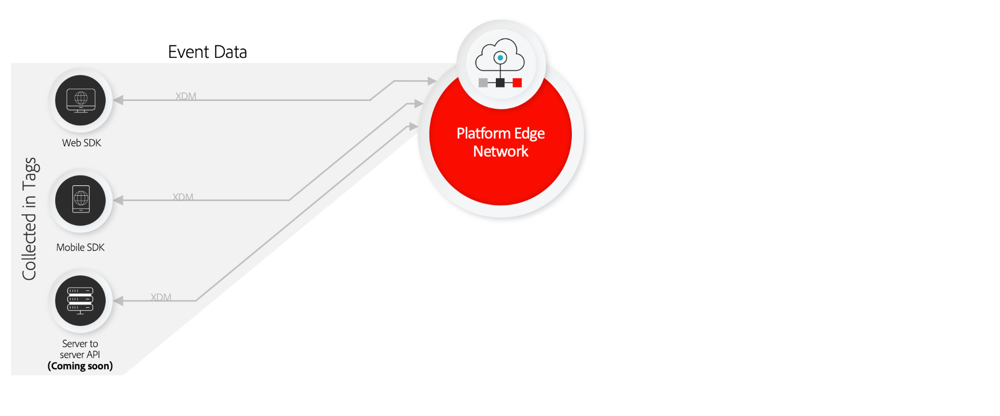

# 資料彙集概觀

Adobe Experience Platform提供了一套技術，使您能夠從客戶端來源收集客戶體驗資料，並將其發送到Adobe Experience Platform邊緣網路，在此，資料可以在幾秒鐘內被豐富、轉換並分發到Adobe或非Adobe目的地。

以下客戶端源支援資料收集：

* 基於Web的應用程式
* 本機移動應用程式
* 頂層(OTT)應用程式

資料收集側重於所攝取資料集的可發現性和可訪問性，包括以下內容：

* [Adobe Experience Platform Edge Network](https://experienceleague.adobe.com/docs/web-sdk-learn/tutorials/introduction-to-web-sdk-and-edge-network.html)
* [標記](../tags/home.md)
* [資料串流](../edge/datastreams/overview.md)
* [事件轉發](../tags/ui/event-forwarding/overview.md)
* [Adobe Experience Platform Web SDK](../edge/home.md)
* [Adobe Experience Platform Mobile SDK](https://aep-sdks.gitbook.io/docs/)
* [Adobe Experience Platform調試器](https://chrome.google.com/webstore/detail/adobe-experience-platform/bfnnokhpnncpkdmbokanobigaccjkpob?hl=en)
* [體驗資料模型(XDM)](../xdm/home.md)
* [Adobe Experience Platform Identity Service](../identity-service/home.md)

本指南提供了關於資料收集及其如何通過平台邊緣網路向Adobe Experience Cloud產品和非Adobe應用程式發送資料的高級介紹。

## 標籤、Web SDK和移動SDK

平台Web SDK和平台移動SDK分別將所有Adobe產品庫折疊並壓縮為用於Web和移動平台的單個開發工具包。 這些可以使用原始代碼或使用 [標籤](../tags/home.md) 通過資料收集UI或Adobe Experience PlatformUI。

壓縮這些庫可加快資料收集速度，並將操作整合到從客戶端設備到平台邊緣網路的單個流中。

## 平台邊緣網路和資料流 {#edge}

平台邊緣網路是一個全球分佈、快速且可靠的伺服器網路，能夠接收和處理大規模的資料。 使用標籤，可以設定 [資料流](../edge/datastreams/overview.md) 對於Adobe Target、Adobe Audience Manager和Adobe Analytics等產品，您可以在伺服器端激活這些產品，而無需更改客戶端代碼。

此外，資料流與幾個平台功能整合，這些功能有助於確保您發送的任何敏感資料都在組織策略和法律法規方面得到適當處理。 請參閱 [處理敏感資料](../edge/datastreams/overview.md#sensitive) 的子菜單。

>[!NOTE]
>
>有關平台邊緣網路的高級介紹，請參閱以下內容 [互動式產品教程](https://adobe-ideacloud.forgedx.com/adobe-adobe-edge-collection/adobe-experience-edge/public/mx?SUID=hgb1a48ICSCpbM6MzBYHbxnsh9DgjUy1)。

## 事件轉發

[事件轉發](../tags/ui/event-forwarding/overview.md) 可以點擊任何Experience Platform資料流，從而允許您以極低的延遲將資料轉換、豐富和發送到任何非Adobe目標，而無需向客戶端設備添加任何第三方代碼。

>[!NOTE]
>
>事件轉發是一種付費功能，它包含在Adobe Real-time Customer Data Platform連接、Prime或Ultimate產品中。

## 後續步驟

本文檔從高級別概括介紹了資料收集如何工作，以自動將收集的客戶體驗資料發送到Adobe產品和第三方目標的過程。

有關通過邊緣網路發送事件資料涉及的一般工作流的詳細資訊，請參閱 [端到端概述](./e2e.md)。
