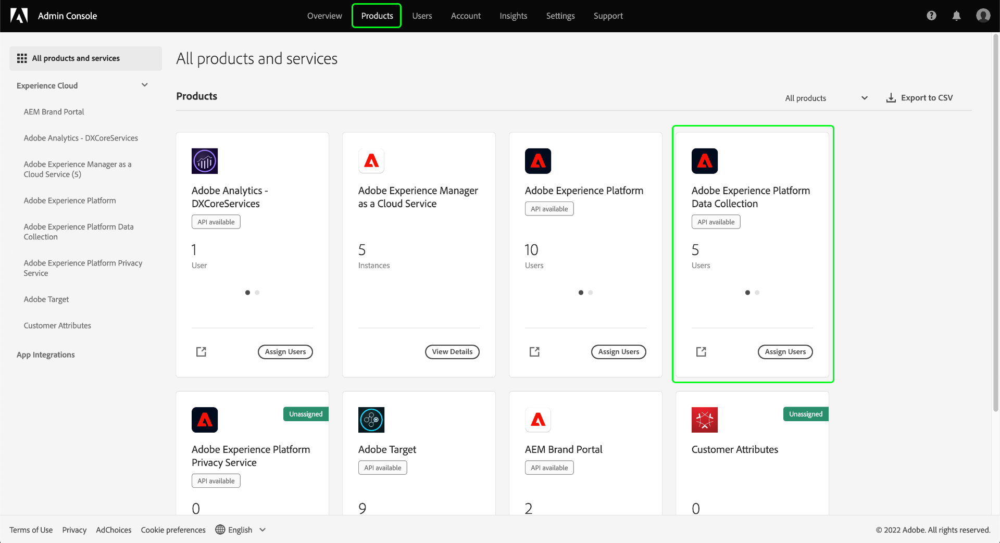
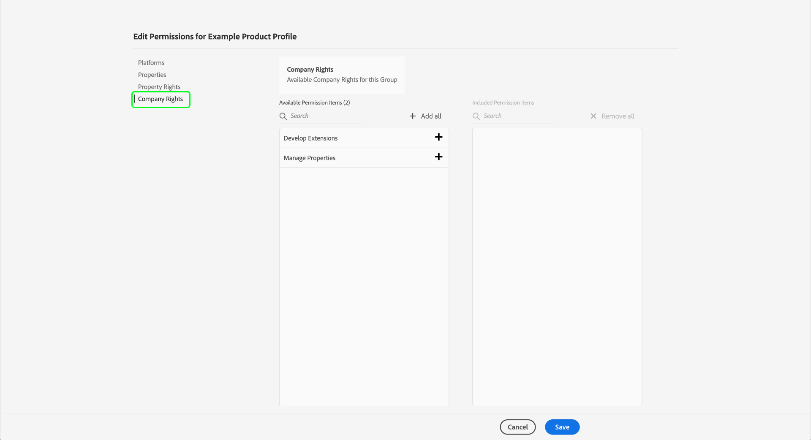

# Experience Platform中資料收集的權限管理

[Adobe Experience Platform資料收集](./home.md) 由幾種不同的技術組成，這些技術可以協同工作來收集和傳輸資料。 對這些技術的訪問是通過Adobe Admin Console的基於角色的細粒度權限控制的。

本指南說明如何管理資料收集功能的權限。

## 快速入門

為配置資料收集的訪問控制，您必須對與Adobe Experience Platform資料收集進行產品整合的組織具有管理員權限。 可授予或撤消權限的最小角色是 **產品配置檔案管理員**。 可管理權限的其他管理員角色包括 **產品管理員** （可以管理產品中的所有配置檔案）和 **系統管理員** （無限制）。 請參閱 [管理角色](https://helpx.adobe.com/enterprise/using/admin-roles.html) 的子菜單。

本指南假定您熟悉基本的Admin Console概念，如產品配置檔案，以及它們如何將產品權限授予各個用戶和組。 有關詳細資訊，請參見 [Admin Console使用手冊](https://helpx.adobe.com/tw/enterprise/using/admin-console.html)。

## 可用權限

通過Admin Console中的兩種產品標識提供資料收集的相關權限： **Adobe Experience Platform** 和 **Adobe Experience Platform資料收集**。 以下各節概述了在每個產品下提供的權限以及它們授予訪問權限的特定功能的說明。

### Adobe Experience Platform權限

Adobe Experience Platform權限包括對資料流、標識、架構和沙箱的訪問。 有關如何配置Adobe Experience Platform權限的步驟，請參見 [訪問控制使用手冊](../access-control/ui/overview.md)。

| 類別 | 權限 | 說明 |
| --- | --- | --- |
| 沙箱 | (不適用) | 取決於 [沙箱](../sandboxes/home.md) 在您的組織下建立的，您可以通過Admin Console中的此權限類別控制對每個權限的訪問。 |
| 資料模型製作 | 管理結構描述 | 授予查看、建立和編輯功能 [體驗資料模型(XDM)架構](../xdm/home.md)。 |
| 資料模型製作 | 檢視結構描述 | 授予對架構的只讀訪問權限。 |
| Identity Management | 管理身分識別命名空間 | 授予查看、建立和編輯功能 [標識命名空間](../identity-service/namespaces.md)。 |
| Identity Management | 檢視身分命名空間 | 授予對標識命名空間的只讀訪問權限。 |
| 資料彙集 | 管理資料流 | 授予查看、建立和編輯功能 [資料流](../edge/datastreams/overview.md)。 |
| 資料彙集 | 查看資料流 | 授予對資料流的只讀訪問權限。 |

{style="table-layout:auto"}

<!-- (Feature not yet available?)
| Dashboards | Manage Custom Dashboards | |
| Dashboards | View Custom Dashboards | |
-->

### Adobe Experience Platform資料收集權限

Adobe Experience Platform資料收集下的權限控制對標籤和事件轉發功能（包括屬性、擴展和環境）的訪問。 有關如何配置Adobe Experience Platform資料收集權限的步驟，請參見 [下面](#manage)。

| 類別 | 權限 | 說明 |
| --- | --- | --- |
| 平台 | Web | 授予訪問 [Web屬性](../tags/ui/administration/companies-and-properties.md) 與其他產權合併。 |
| 平台 | 行動 | 授予訪問 [移動屬性](../tags/ui/administration/companies-and-properties.md) 與其他產權合併。 |
| 屬性 | (不適用) | 根據在您的組織下建立的屬性，您可以通過Admin Console中的此權限類別控制對每個屬性的訪問。  用戶分配的屬性權限僅適用於通過此權限類別授予其訪問權限的屬性。 |
| 屬性權利 | 核准 | 授予將庫構建作為 [發佈流](../tags/ui/publishing/publishing-flow.md)。 |
| 屬性權利 | 開發 | 授予開發作為元件一部分的圖書館構建的能力 [發佈流](../tags/ui/publishing/publishing-flow.md)。 |
| 屬性權利 | 編輯屬性 | 授予編輯用戶有權訪問的屬性的基本配置的功能。 |
| 屬性權利 | 管理環境 | 授予管理 [環境](../tags/ui/publishing/environments.md) 用戶有權訪問的屬性。 |
| 屬性權利 | 管理擴展 | 授予管理 [擴展](../tags/ui/managing-resources/extensions/overview.md) 用戶有權訪問的屬性。 |
| 屬性權利 | 發佈 | 授予將庫構建作為 [發佈流](../tags/ui/publishing/publishing-flow.md)。 |
| 公司權利 | 開發擴展 | 授予建立和修改您的組織擁有的擴展包（包括私有版本和公共版本請求）的能力。 |
| 公司權利 | 管理擴展 | 僅當您擁有Adobe Journey Optimizer的許可證或授予對移動應用內和推送消息的訪問權限的其他解決方案時，此權限才適用。 這允許您管理Adobe Experience Cloud知道的應用以及與Firebase雲消息服務和Apple推送通知服務通信所需的推送憑據。 |

{style="table-layout:auto"}

>[!NOTE]
>
>有關這些權限如何影響標籤中的權能（包括常見方案的管理策略）的詳細資訊，請參閱上的標籤文檔 [用戶權限](../tags/ui/administration/user-permissions.md)。

## 管理權限 {#manage}

如上節所述，資料收集權限通過Admin Console中的兩種產品指定進行管理： **Adobe Experience Platform** 和 **Adobe Experience Platform資料收集**。

要管理這些權限，請登錄到 [Admin Console](https://adminconsole.adobe.com/) 選擇 **[!UICONTROL 產品]** 的上界。 在此處，選擇要配置權限的產品卡。 有關如何管理Admin Console中每個產品下的相關權限的步驟，請參閱以下子部分：

* [Adobe Experience Platform權限](#manage-platform)
* [Adobe Experience Platform資料收集權限](#manage-collection)

### 管理Adobe Experience Platform下的權限 {#manage-platform}

從 **[!UICONTROL 產品]** 在Admin Console中查看，選擇 **[!UICONTROL Adobe Experience Platform資料收集]**。 選擇要編輯其權限的產品配置檔案，然後導航到 **[!UICONTROL 權限]** 頁籤。

要訪問資料收集功能，必須在 **[!UICONTROL 沙箱]**。 **[!UICONTROL 資料建模]**。 **[!UICONTROL Identity Management]**, **[!UICONTROL 資料收集]** 的下界。

查看 [訪問控制UI指南](../access-control/ui/overview.md) 有關管理平台權限的詳細說明。

>[!NOTE]
>
>根據您的組織有權訪問的產品SKU，您可能沒有可用的所有平台權限。

### 管理Adobe Experience Platform資料收集下的權限 {#manage-collection}

從 **[!UICONTROL 產品]** 在Admin Console中查看，選擇 **[!UICONTROL Adobe Experience Platform資料收集]**。

#### 選擇或建立產品配置檔案

下一螢幕顯示組織下資料收集的可用產品配置檔案清單，預設配置檔案 **[!DNL Default Data Collection All Access]**。 如果需要，您可以選擇編輯預設產品配置檔案，也可以選擇 **[!UICONTROL 新建配置檔案]** 建立一個。 如果您的組織中有多個需要不同訪問級別的角色或用戶組，則應為每個角色或用戶組建立單獨的產品配置檔案。

選擇或建立產品配置檔案後，您可以使用 **[!UICONTROL 編輯]** 表徵圖開始 [編輯權限](#edit-permissions) 或選擇 **[!UICONTROL 用戶]** 頁籤 [分配用戶](#assign-users) 到配置檔案。

#### 編輯產品配置檔案的權限 {#edit-permissions}

編輯配置檔案的權限時，可用權限將列在左列中，而包含在配置檔案中的可用權限將列在右列中。 選擇列出的權限以在任一列之間移動它們。

權限按類別進行組織。 要在類別之間切換，請從左側導航中選擇所需的類別。

選擇 **[!UICONTROL 保存]** 完成權限配置後。

產品配置檔案視圖將重新顯示，並反映添加的權限。

#### 將用戶分配給產品配置檔案 {#assign-users}

要將用戶分配給產品配置檔案（並授予他們配置檔案的配置權限），請選擇 **[!UICONTROL 用戶]** 頁籤，後跟 **[!UICONTROL 添加用戶]**。

有關管理產品配置檔案的用戶的詳細資訊，請參閱 [Admin Console文檔](https://helpx.adobe.com/tw/enterprise/using/manage-product-profiles.html)。

## 後續步驟

本指南介紹了資料收集的可用權限以及如何通過Admin Console管理這些權限。 有關管理其他Adobe Experience Platform功能權限的詳細資訊，請參閱 [訪問控制文檔](../access-control/home.md)。
