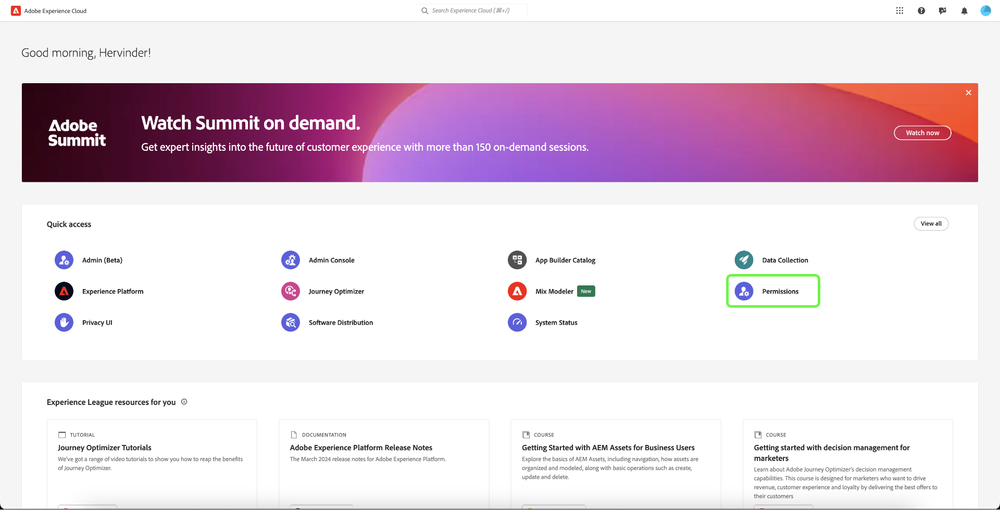

# Experience Platform 中資料收集的權限管理 {#permission-management}

>[!CONTEXTUALHELP]
>id="platform_tags_permissions"
>title="權限"
>abstract="了解在 Adobe Experience Platform 中使用資料流、結構描述、身分識別和沙箱所需的關鍵權限。"

[Adobe Experience Platform](./home.md)中的資料收集是由數種不同的技術所組成，這些技術可共同收集並傳輸您的資料。 這些技術的存取權可透過Adobe Admin Console中精細的角色型許可權加以控制。

本指南說明如何管理資料收集功能的許可權。

## 快速入門

若要設定資料收集的存取控制，您必須針對與Adobe Experience Platform資料收集產品整合的組織擁有管理員許可權。 若要能授予或撤回權限，至少要擁有&#x200B;**產品設定檔管理員**&#x200B;的角色。其他可管理權限的管理員角色為&#x200B;**產品管理員** (可管理產品內的所有輪廓) 和&#x200B;**系統管理員** (沒有任何限制)。如需詳細資訊，請參閱 Adobe 企業版管理指南中有關[管理角色](https://helpx.adobe.com/enterprise/using/admin-roles.html)的文章。

本指南假設您熟悉基本的 Admin Console 概念，例如產品設定檔以及它們如何授予個別使用者和群組產品權限。如需詳細資訊，請參閱 [Admin Console 使用手冊](https://helpx.adobe.com/tw/enterprise/using/admin-console.html)。

## 可用權限

資料收集的相關許可權是透過Admin Console中的兩個產品指定來提供： **Adobe Experience Platform**&#x200B;和&#x200B;**Adobe Experience Platform資料收集**。 以下各節概述每個產品底下提供的許可權，以及這些許可權授予存取權的特定功能的說明。

### Adobe Experience Platform許可權

Adobe Experience Platform底下的許可權包括存取資料串流、身分、結構描述和沙箱。 如需設定Adobe Experience Platform許可權的詳細步驟，請參閱[存取控制使用手冊](../access-control/ui/overview.md)。

| 類別 | 權限 | 說明 |
| --- | --- | --- |
| 沙箱 | （不適用） | 根據您組織下建立的[沙箱](../sandboxes/home.md)，您可以在Admin Console中透過此許可權類別控制每個沙箱的存取權。 |
| 資料模型製作 | 管理結構描述 | 授與檢視、建立和編輯[體驗資料模型(XDM)結構描述](../xdm/home.md)的能力。 |
| 資料模型製作 | 檢視結構描述 | 授予結構描述的唯讀存取權。 |
| Identity Management | 管理身分識別名稱空間 | 授與檢視、建立和編輯[身分識別名稱空間](../identity-service/features/namespaces.md)的能力。 |
| Identity Management | 檢視身分識別名稱空間 | 授予識別名稱空間的唯讀存取權。 |
| 資料收集 | 管理資料串流 | 授與檢視、建立和編輯[資料串流](../datastreams/overview.md)的能力。 |
| 資料收集 | 檢視資料串流 | 授予資料串流的唯讀存取權。 |

{style="table-layout:auto"}

### Adobe Experience Platform資料收集許可權

Adobe Experience Platform資料收集下的許可權可控制對標籤和事件轉送功能（包括屬性、擴充功能和環境）的存取權。 如需設定Adobe Experience Platform資料收集許可權的相關步驟，請參閱下方的[一節](#manage)。

| 類別 | 權限 | 說明 |
| --- | --- | --- |
| 平台 | Web | 與其他屬性許可權結合時，授予[Web屬性](../tags/ui/administration/companies-and-properties.md)的存取權。 |
| 平台 | 行動 | 與其他屬性許可權結合時，授予[行動屬性](../tags/ui/administration/companies-and-properties.md)的存取權。 |
| 平台 | Edge | 與其他屬性許可權結合時，授予[事件轉送Edge屬性](../tags/ui/event-forwarding/getting-started.md)的存取權。 |
| 屬性 | （不適用） | 根據貴組織下已建立的屬性，您可以在Admin Console中透過此許可權類別控制每個屬性的存取權。  使用者的屬性許可權只適用於透過此許可權類別授予其存取權的屬性。 |
| 屬性權利 | 核准 | 授予核准程式庫組建做為[發佈流程](../tags/ui/publishing/publishing-flow.md)之一部份的能力。 |
| 屬性權利 | 開發 | 授與開發程式庫組建作為[發佈流程](../tags/ui/publishing/publishing-flow.md)之一部份的能力。 |
| 屬性權利 | 編輯屬性 | 授予編輯使用者有權存取之屬性的基本設定的能力。 |
| 屬性權利 | 管理環境 | 授予管理使用者有權存取之屬性的[環境](../tags/ui/publishing/environments.md)的能力。 |
| 屬性權利 | 管理擴充功能 | 授予管理使用者有權存取之屬性的[擴充功能](../tags/ui/managing-resources/extensions/overview.md)的能力。 |
| 屬性權利 | 發佈 | 授與將程式庫組建發佈為[發佈流程](../tags/ui/publishing/publishing-flow.md)之一部分的能力。 |
| 公司權利 | 開發擴充功能 | 授予建立及修改組織擁有的擴充功能套件的能力，包括私人發行和公開發行要求。 |
| 公司權利 | 管理應用程式設定 | 此許可權僅適用於您擁有Adobe Journey Optimizer或其他解決方案的授權，可授予行動應用程式內及推送訊息存取權的情況。 這可讓您管理Adobe Experience Cloud知道的應用程式，以及與Firebase雲端傳訊服務和Apple推播通知服務通訊所需的推播認證。 |
| 公司權利 | 管理屬性 | 授予您建立和管理標籤（Web屬性）、事件轉送（邊緣屬性）和行動屬性的能力。 |

{style="table-layout:auto"}

>[!NOTE]
>
>如需這些許可權如何影響標籤中功能的詳細資訊，包括常見案例的管理策略，請參閱[使用者許可權](../tags/ui/administration/user-permissions.md)的標籤檔案。

## 管理權限 {#manage}

資料收集的許可權是透過兩個產品指定來管理： **Adobe Experience Platform**&#x200B;和&#x200B;**Adobe Experience Platform資料收集**。

如需如何在Admin Console中管理每個產品底下相關許可權的步驟，請參閱以下各小節：

* [Adobe Experience Platform許可權](#manage-platform)
* [Adobe Experience Platform資料收集許可權](#manage-collection)

### 在Adobe Experience Platform下管理許可權 {#manage-platform}

>[!NOTE]
>
>若要管理角色的許可權，您需要管理員許可權。 如果您沒有管理員許可權，請聯絡您的系統管理員。

Experience Cloud的&#x200B;**[!UICONTROL 許可權]**&#x200B;區段可讓您定義使用者角色和原則，以管理產品應用程式內功能和物件的存取權。

透過[!UICONTROL 許可權]，您可以建立和管理角色，並為這些角色指派所需的資源許可權。

若要存取資料收集功能，您必須啟用&#x200B;**[!UICONTROL 沙箱]**、**[!UICONTROL 資料模型]**、**[!UICONTROL Identity Management]**&#x200B;和&#x200B;**[!UICONTROL 資料收集]**&#x200B;類別中的所有許可權。

如需管理Platform許可權的詳細指示，請參閱[存取控制UI指南](../access-control/ui/overview.md)。

>[!NOTE]
>
>根據您的組織有權存取的產品SKU，您可能沒有每個可用的平台許可權。

### 在Adobe Experience Platform Data Collection下管理許可權 {#manage-collection}

若要管理這些許可權，請登入Admin Console並從頂端導覽列中選取&#x200B;**[!UICONTROL 產品]**，然後選取&#x200B;**[!UICONTROL Adobe Experience Platform資料彙集]**。

#### 選取或建立產品設定檔

下一個畫面顯示貴組織下資料收集的可用產品設定檔清單，預設設定檔為&#x200B;**[!DNL Default Data Collection All Access]**。 您可以視需要選擇編輯預設的產品設定檔，也可以選擇&#x200B;**[!UICONTROL 新增設定檔]**&#x200B;來建立設定檔。 如果您在貴組織中有多個角色或使用者群組，而這些需要不同層級的存取權限，則應為每個角色或使用者建立單獨的產品設定檔。

選取或建立產品設定檔後，您可以使用&#x200B;**[!UICONTROL 編輯]**&#x200B;圖示來開始[編輯設定檔的許可權](#edit-permissions)，或選取&#x200B;**[!UICONTROL 使用者]**&#x200B;索引標籤來開始[將使用者](#assign-users)指派給設定檔。

#### 編輯產品設定檔的許可權 {#edit-permissions}

編輯輪廓的權限時，可用權限會顯示在左欄的清單中，而輪廓中包含的權限則會顯示在右欄的清單中。選取清單中的權限在任一欄之間移動。

的許可權

將權限歸類到不同類別。若要在類別之間切換，請從左側導覽中選取所需的類別。

底下

完成設定權限後，即可選取「**[!UICONTROL 儲存]**」。

產品設定檔檢視會重新顯示，並新增所反映的權限。

#### 將使用者指派給產品設定檔 {#assign-users}

若要將使用者指派至產品設定檔 (並授予他們輪廓的設定權限)，請選取「**[!UICONTROL 使用者]**」索引標籤，接著選取「**[!UICONTROL 新增使用者]**」。

如需有關如何管理產品設定檔的使用者的詳細資訊，請參閱 [Admin Console 文件](https://helpx.adobe.com/tw/enterprise/using/manage-product-profiles.html)。

## 後續步驟

本指南說明資料收集的可用許可權，以及如何透過Admin Console管理這些許可權。 如需有關如何管理其他 Adob&#x200B;&#x200B;e Experience Platform 功能的權限的詳細資訊，請參閱[存取控制文件](../access-control/home.md)。
