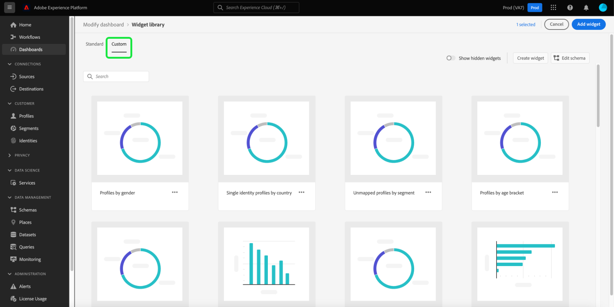
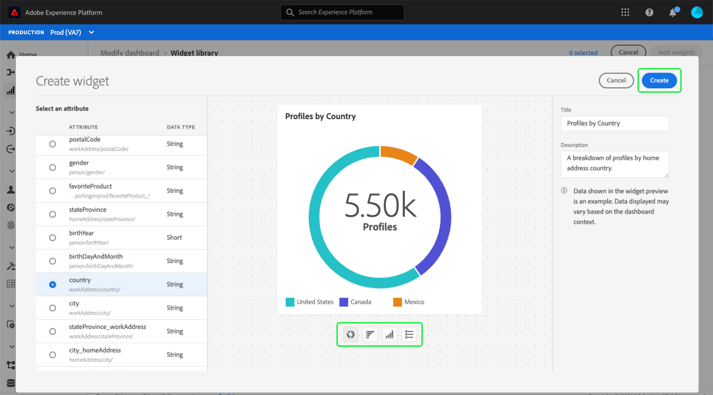

# 為儀表板建立自定義小部件

在Adobe Experience Platform，您可以使用多個儀表板查看組織的資料並與其進行交互。 您還可以通過向儀表板視圖添加新小部件來更新某些儀表板。 除了Adobe提供的標準小部件外，您還可以建立自定義小部件並在整個組織中共用它們。

本指南提供有關建立自定義小部件並將其添加到 [!UICONTROL 配置檔案]。 [!UICONTROL 段], [!UICONTROL 目標] 平台UI中的儀表板。

要瞭解有關標準小部件的詳細資訊，請參閱指南 [將標準小部件添加到儀表板](standard-widgets.md)。

>[!NOTE]
>
>中顯示的小部件 [!UICONTROL 許可證使用] 無法自定義儀表板。 要瞭解有關此唯一儀表板的詳細資訊，請閱讀 [許可證使用儀表板文檔](../guides/license-usage.md)。

## 小部件庫 {#widget-library}

本指南要求訪問 [!UICONTROL 小部件庫] Experience Platform。 要瞭解有關小部件庫的詳細資訊以及如何在UI中訪問它，請首先閱讀 [構件庫概述](widget-library.md)。

## 自定義小部件入門

在小部件庫中， **[!UICONTROL 自定義]** 頁籤，您可以建立小部件並與組織中的其他用戶共用這些小部件，以便自定義儀表板的外觀。

>[!IMPORTANT]
>
>您的組織可以在小部件庫中最多建立20個自定義小部件。

選擇 **[!UICONTROL 自定義]** 頁籤，以開始建立自定義小部件或查看您的組織已建立的自定義小部件。

## 建立自定義小部件

要建立自定義小部件，請選擇 **[!UICONTROL 建立小部件]** 從小部件庫的右上角，或者，如果這是您組織的第一個自定義小部件，請選擇 **[!UICONTROL 建立]** 從小部件庫的中心。

在 **[!UICONTROL 建立小部件]** 對話框，提供新小部件的標題和說明，然後選擇希望小部件顯示的屬性。

>[!NOTE]
>
>可用屬性清單取決於為您的組織配置的架構。 要瞭解有關屬性選擇和架構配置的詳細資訊，請閱讀上的指南 [編輯架構以建立自定義小部件](edit-schema.md)。

要選擇屬性，請選擇要添加的屬性旁邊的單選按鈕。

>[!NOTE]
>
>每個小部件只能選擇一個屬性，每個屬性只能建立一個小部件。 如果已為屬性建立了小部件，則該屬性將顯示為灰色。

## 選擇可視化

選擇屬性後，新小部件的預覽將顯示在對話框中。 人工智慧用於自動選擇最適合屬性資料的可視化，並提供可手動選擇的附加可視化選項。

根據屬性，AI推薦不同的可視化選項。 可視化的完整清單包括：

* 水準條形圖：水準線用於表示值。
* 垂直條形圖：垂直線用於表示值。
* 甜圈圖：與餅圖類似，值顯示為整體的一部分或部分。
* 散點圖：使用水準軸和垂直軸來指示值。
* 折線圖：使用單行顯示值以顯示一段時間內的更改。
* 號碼卡：顯示一個匯總編號以表示單個鍵值。
* 資料表：值以行的形式顯示在表中。

>[!NOTE]
>
>當前所有屬性支援的唯一度量是配置檔案計數。
>
>示例小部件中顯示的資料僅供圖示使用。 預覽不顯示組織的實際資料。

保存新小部件並返回到 [!UICONTROL 自定義] 頁籤 **[!UICONTROL 建立]**。

現在，可以通過從庫中選擇該小部件並選擇，將新小部件添加到儀表板 **[!UICONTROL 添加小部件]**。

## 隱藏自定義小部件

將小部件添加到庫後，可以通過選擇橢圓(`...`)，然後選擇 **[!UICONTROL 隱藏小部件]**。 也可以從同一下拉清單中預覽和編輯小部件。

要查看已隱藏的小部件，請選擇 **[!UICONTROL 顯示隱藏小部件]** 控制項庫的右上角。

>[!WARNING]
>
>在庫中隱藏小部件不會從單個用戶的儀表板中刪除該小部件。 如果組織中不再使用小部件，請確保您直接將該小部件與所有平台用戶通信，因為他們需要從他們的儀表板中刪除該小部件。

## 編輯自定義小部件

通過選擇橢圓(`...`)，然後選擇 **[!UICONTROL 編輯]** 的下界。

在 **[!UICONTROL 編輯小部件]** 對話框，您可以編輯小部件的標題和說明，以及預覽和選擇不同的可視化效果。 編輯完成後，選擇 **[!UICONTROL 保存]** 以保存更改並返回到「自定義小部件」頁籤。

>[!WARNING]
>
>在庫中編輯小部件不會更新單個用戶的小部件。 如果小部件已更新，請確保您直接將此內容與所有平台用戶通信，因為他們需要從其儀表板中刪除過期的小部件，然後從小部件庫中選擇並添加更新的小部件。

## 後續步驟

讀取此文檔後，您可以訪問小部件庫，並使用它為您的組織建立和添加自定義小部件。 要修改儀表板中顯示的小部件的大小和位置，請參閱 [修改儀表板指南](modify.md)。
