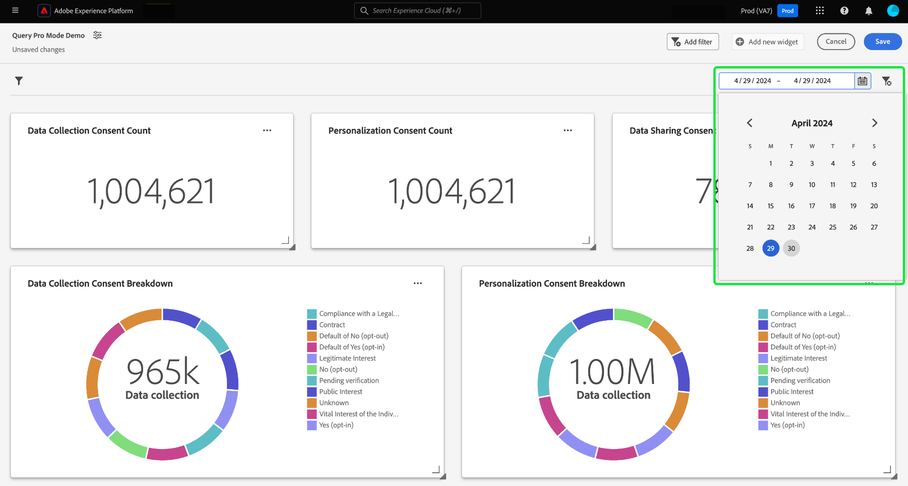

# 建立日期篩選 {#create-date-filter}

若要依日期篩選您的深入分析，您必須將引數新增至可以接受日期限制的SQL查詢。 這是作為查詢專家模式見解建立工作流程的一部分完成的。 請參閱[query pro mode檔案](#query-pro-mode)，瞭解如何輸入SQL作為您的深入分析。

查詢引數可讓您使用動態資料，因為它們會作為您在執行時新增值的預留位置。 這些預留位置值可以透過UI更新，並讓技術較差的使用者根據日期範圍更新深入分析。

如果您不熟悉查詢引數，請參閱有關如何實作引數化查詢](../../../../query-service/ui/parameterized-queries.md)的[指南檔案。

## 將日期篩選器套用至您的儀表板 {#apply-date-filter}

若要套用日期篩選，請從您的儀表板檢視的下拉式功能表中選取&#x200B;**[!UICONTROL 新增篩選]**，然後選取&#x200B;**[!UICONTROL 日期篩選]**。


## 編輯您的SQL以包含日期查詢引數 {#include-date-parameters}

接下來，請確定您的SQL包含查詢引數，以允許日期範圍。 如果您尚未在SQL中合併查詢引數，請編輯您的深入分析以包含這些引數。 請參閱檔案以瞭解如何[編輯分析](../query-pro-mode.md#edit)的說明。

>[!TIP]
>
>建議您在要啟用日期篩選的每個圖表中，將`$START_DATE`和`$END_DATE`引數新增至SQL陳述式。

>[!NOTE]
>
>日期篩選器不支援時間限制。 此篩選條件僅適用於日期範圍。 這表示如果您在24小時內擁有多個報表，則無法區分同一天內的不同小時。 因此，建議您將時間元件轉換為日期。

如果您正在分析的資料模型或表格有時間元件，您可以依日期將資料分組，然後套用這些日期篩選器。

以下範例SQL陳述式示範如何整合`$START_DATE`和`$END_DATE`引數，並使用`cast`將時間元件框定為日期。

```sql
SELECT Sum(personalization_consent_count) AS Personalization,
       Sum(datacollection_consent_count)  AS Datacollection,
       Sum(datasharing_consent_count)     AS Datasharing
FROM   fact_daily_consent_aggregates f
       INNER JOIN dim_consent_valued
               ON f.consent_value_id = d.consent_value_id
WHERE  f.date BETWEEN Upper(Coalesce(Cast('$START_DATE' AS date), '')) AND Upper
                      (
                             Coalesce(Cast('$END_DATE' AS date), ''))
       AND ( ( Upper(Coalesce($consent_value_filter, '')) IN ( '', 'NULL' ) )
              OR ( f.consent_value_id IN ( $consent_value_filter ) ) )
LIMIT  0; 
```

下面的熒幕擷圖會強調納入SQL陳述式及查詢引數索引鍵值配對中的日期限制。

>[!NOTE]
>
>在query pro模式中構成陳述式時，您必須提供每個引數的範例值，才能執行SQL陳述式並建置圖表。 構成陳述式時提供的範例值，會由您在執行階段為日期（或全域）篩選器選取的實際值取代。

![含有SQL中反白之日期引數的[!UICONTROL 輸入SQL]對話方塊。](../../../images/customizable-insights/sql-date-parameters.png)

## 在每個深入分析中啟用日期引數 {#enable-date-parameters}

將適當的引數併入您的深入分析SQL後，`Start_date`和`End_date`變數現在可在Widget Composer中作為切換使用。 如需如何編輯深入分析的資訊，請參閱[查詢專業模式Widget母體部分](#populate-widget)。

在Widget撰寫器中，選取切換以啟用`Start_date`和`End_date`引數。


接著，從下拉式選單中選取適當的查詢引數。


最後，選取&#x200B;**[!UICONTROL 儲存並關閉]**&#x200B;以返回您的儀表板。 現在已針對所有具有開始和結束日期引數的深入分析啟用日期篩選器。

## 使用日期篩選

若要使用自訂日期篩選，請選取行事曆圖示，然後從行事曆檢視中選擇開始和結束。

>[!IMPORTANT]
>
>僅新增日期篩選器不會改變圖表。 您必須編輯您的每個深入分析，以包含您選擇的開始和結束日期。



當您從儀表板選取日期範圍後，在SQL中有日期引數的深入分析會在Widget撰寫器中看到日期篩選選項。

>[!NOTE]
>
>在控制面板上選取日期範圍，會在分析建立工作流程中顯示日期篩選的切換。

## 刪除日期篩選 {#delete-date-filter}

若要移除您的日期篩選，請選取刪除篩選圖示（）。


