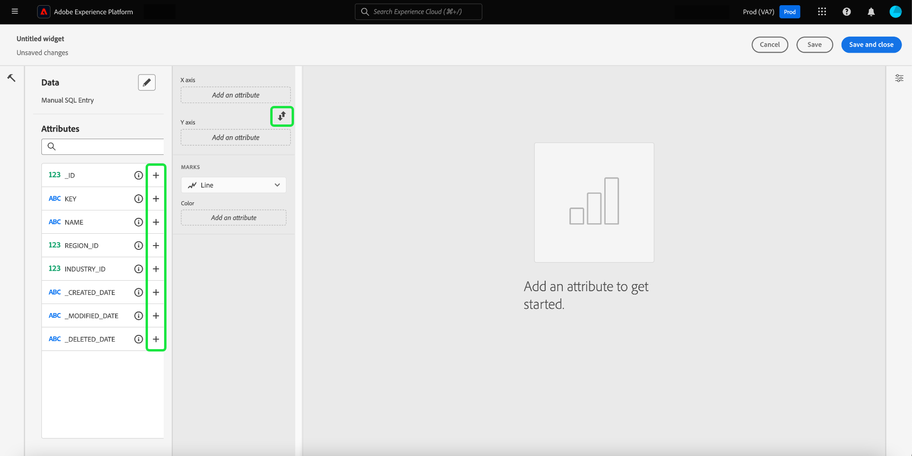

# Query pro模式 {#query-pro-mode}

Query pro模式是一種SQL編輯器型工作流程，可引導您在Adobe Experience Platform UI中使用自訂SQL查詢來產生深入分析。 您必須先使用自訂SQL查詢產生深入分析，才能使用 [建立儀表板](./overview.md#create-custom-dashboard).

## 撰寫SQL {#compose-sql}

一旦您選擇使用查詢專業模式來建立圖示板， **[!UICONTROL 輸入SQL]** 對話方塊隨即顯示。 從下拉式選單中選取要查詢的資料庫（見解資料模型），然後在查詢專家編輯器中為您的資料集輸入合適的查詢。

>[!NOTE]
>
>查詢專業模式僅適用於已購買Data Distiller SKU的使用者。 此 [[!UICONTROL 引導式設計模式]](../../user-defined-dashboards.md) 可供所有使用者從現有資料模型建立深入分析。

請參閱 [查詢編輯器使用手冊](../../../query-service/ui/user-guide.md#query-authoring) 以取得其UI元素的相關資訊。

![此 [!UICONTROL 輸入SQL] 對話方塊，其中的「資料集」下拉式功能表和執行圖示強調顯示。此對話方塊已填入SQL查詢，且顯示查詢引數索引標籤。](../../images/customizable-insights/enter-sql-database-dropdown.png)

### 查詢引數 {#query-parameters}

要包含 [全域](./filters/global-filter.md) 或 [日期篩選](./filters/date-filter.md) 您的查詢 **必須** 使用查詢引數。 在query pro模式下構成陳述式時，如果查詢使用查詢引數，則必須提供範例值。 範例值可讓您執行SQL陳述式並建立圖表。 請注意，構成陳述式時提供的範例值，會由您在執行階段為日期或全域篩選選取的實際值取代。

>[!IMPORTANT]
>
>如果要使用全域篩選，您必須在SQL中放置查詢引數，然後將該查詢引數連結到Widget撰寫器中的全域篩選。 在下方的熒幕擷圖中， `CONSENT_VALUE_FILTER` 在SQL中作為全域篩選的查詢引數使用。 請參閱 [全域篩選檔案](./filters/global-filter.md#enable-global-filter) 以取得執行此動作的詳細資訊。

若要執行查詢，請選取執行圖示()。「查詢編輯器」會顯示結果標籤。 接下來，若要確認您的設定並開啟Widget Composer，請選取 **[!UICONTROL 選取]**.

>[!TIP]
>
>如果您的查詢使用查詢引數，請執行一次查詢以預先填入所有使用的查詢引數索引鍵。 查詢將會失敗，但UI會自動顯示查詢引數索引標籤並列出所有包含的索引鍵。 為您的金鑰新增適當的值。

![此 [!UICONTROL 輸入SQL] 對話方塊中顯示SQL輸入、結果頁簽顯示，以及反白顯示「選取」。](../../images/customizable-insights/enter-sql-select.png)

## 填入Widget {#populate-widget}

Widget撰寫器現在會填入已執行SQL中的欄。 控制面板的型別會顯示在左上方，在此例中為 [!UICONTROL 手動SQL輸入]. 選取鉛筆圖示()，以隨時編輯SQL。

>[!TIP]
>
>可用的屬性是從已執行SQL中取得的資料行。

若要建立Widget，請使用 [!UICONTROL 屬性] 欄。 您可以使用搜尋列來尋找屬性或捲動清單。

### 新增屬性 {#add-attributes}

若要將屬性新增至您的Widget，請選取加號圖示()。 顯示的下拉式功能表可讓您從SQL決定的選項將屬性加入圖表。 不同的圖表型別有不同的選項，例如X軸和Y軸下拉式清單。

在此環形圖範例中，選項為大小和顏色。 顏色會劃分環圈圖結果，而大小是實際使用的量度。 將屬性新增至 [!UICONTROL 顏色] 欄位，根據結果的屬性構成將結果分割成不同的顏色。

>[!TIP]
>
>選取向上和向下箭頭圖示()，以切換長條圖或折線圖上X和Y軸的排列。

若要變更Widget的圖形或圖表型別，請從 [!UICONTROL 標籤] 下拉式清單。 選項包括 [!UICONTROL 折線圖]， [!UICONTROL 環形圖]， [!UICONTROL 大數字]、和 [!UICONTROL 長條圖]. 選取後，系統會產生Widget目前設定的預覽視覺效果。

## Widget屬性 {#properties}

選取屬性圖示()以開啟「屬性」面板。 在 [!UICONTROL 屬性] 面板，在「 」中輸入介面工具集的名稱 **[!UICONTROL Widget標題]** 文字欄位。 您也可以重新命名圖表的各個方面。

>[!NOTE]
>
>屬性側邊欄中可用的特定欄位會依您編輯的圖表型別而有所不同。

## 儲存您的Widget {#save-widget}

在Widget Composer中儲存時，會將Widget本機儲存至您的儀表板。 如果要儲存工作並稍後繼續，請選取 **[!UICONTROL 儲存]**. Widget名稱下方的勾號圖示表示已儲存Widget。 或者，當您滿意您的Widget時，請選取 **[!UICONTROL 儲存並關閉]** 讓Widget可供其他可存取您控制面板的使用者使用。 選取「取消」以放棄您的工作並返回您的自訂儀表板。

## 編輯您的儀表板和圖表 {#edit}

選取 **[!UICONTROL 編輯]** 以編輯您的整個儀表板或任何深入分析。 從編輯模式中，您可以調整Widget的大小、編輯SQL，或建立並套用全域和暫時性篩選器。 這些篩選器會限制儀表板Widget中顯示的資料。 這是快速更新和微調不同使用案例深入分析的便利方式。

選取 **[!UICONTROL 新增篩選器]** 若要建立 [[!UICONTROL 日期篩選]](#create-date-filter) 或 [[!UICONTROL 全域篩選器]](#create-global-filter). 建立後，所有全域和日期篩選器都可從取得 [篩選器圖示](#select-global-filter) ()。

## 編輯、複製或刪除分析

請參閱自訂儀表板指南，瞭解如何 [編輯、複製或刪除現有的Widget](../../user-defined-dashboards.md#duplicate).

## 後續步驟

閱讀本檔案後，您現在知道如何在Adobe Experience Platform UI中撰寫SQL查詢，以便為您的自訂儀表板產生圖表。 接下來，您應該瞭解如何透過以下方式進一步豐富您的資料 [建立日期篩選](./filters/date-filter.md)，或 [建立全域篩選](./filters/global-filter.md).

您也可以進一步瞭解其他自訂的深入分析功能，包括 [SQL分析資料的不同檢視選項](./view-more.md) 或如何 [檢視自訂深入分析背後的SQL](./view-sql.md).
