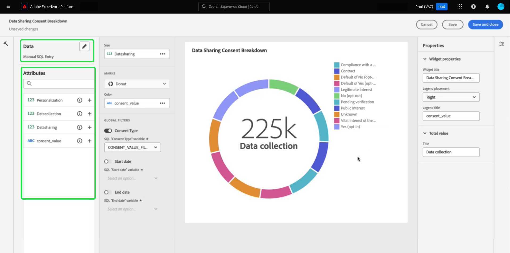

# Query pro模式概觀 {#query-pro-mode}

Query pro模式是一種SQL編輯器型工作流程，可引導您在Adobe Experience Platform UI中使用自訂SQL查詢來產生深入分析。 您必須先[建立儀表板](./overview.md#create-custom-dashboard)，才能使用自訂SQL查詢產生深入分析。

## 撰寫SQL {#compose-sql}

當您選擇以查詢專業模式建立儀表板後，**[!UICONTROL 進入SQL]**&#x200B;對話方塊就會顯示。 從下拉式選單中選取要查詢的資料庫（見解資料模型），然後在查詢專家編輯器中為您的資料集輸入合適的查詢。

>[!NOTE]
>
>查詢專業模式僅適用於已購買Data Distiller SKU的使用者。 [[!UICONTROL 引導式設計模式]](../../user-defined-dashboards.md)可供所有使用者從現有資料模型建立深入分析。

請參閱[查詢編輯器使用手冊](../../../query-service/ui/user-guide.md#query-authoring)，瞭解其UI元素的資訊。

![此對話方塊[!UICONTROL 輸入SQL]並反白顯示資料集下拉式功能表和執行圖示。此對話方塊已填入SQL查詢，且顯示查詢引數索引標籤。](../../images/sql-insights/enter-sql-database-dropdown.png)

### 查詢參數 {#query-parameters}

若要包含[全域](./filters/global-filter.md)或[日期篩選器](./filters/date-filter.md)，您的查詢&#x200B;**必須**&#x200B;使用查詢引數。 在query pro模式下構成陳述式時，如果查詢使用查詢引數，則必須提供範例值。 範例值可讓您執行SQL陳述式並建立圖表。 請注意，構成陳述式時提供的範例值，會由您在執行階段為日期或全域篩選選取的實際值取代。

>[!IMPORTANT]
>
>如果要使用全域篩選，您必須在SQL中放置查詢引數，然後將該查詢引數連結到Widget撰寫器中的全域篩選。 在下方的熒幕擷圖中，`CONSENT_VALUE_FILTER`在SQL中作為全域篩選的查詢引數使用。 如需如何執行此動作的詳細資訊，請參閱[全域篩選檔案](./filters/global-filter.md#enable-global-filter)。

若要執行查詢，請選取執行圖示()。 「查詢編輯器」會顯示結果標籤。 接下來，若要確認您的設定並開啟Widget Composer，請選取&#x200B;**[!UICONTROL 選取]**。

>[!TIP]
>
>如果您的查詢使用查詢引數，請執行一次查詢以預先填入所有使用的查詢引數索引鍵。 查詢將會失敗，但UI會自動顯示查詢引數索引標籤並列出所有包含的索引鍵。 為您的金鑰新增適當的值。

![包含SQL輸入的[!UICONTROL 輸入SQL]對話方塊、顯示的結果索引標籤，以及反白顯示的[選取]。](../../images/sql-insights/enter-sql-select.png)

## 填入Widget {#populate-widget}

Widget撰寫器現在會填入已執行SQL中的欄。 儀表板型別會顯示在左上方，在此例中是[!UICONTROL 手動SQL專案]。 選取鉛筆圖示()隨時編輯SQL。

>[!TIP]
>
>可用的屬性是從已執行SQL中取得的資料行。

若要建立您的Widget，請使用[!UICONTROL 屬性]欄中列出的屬性。 您可以使用搜尋列來尋找屬性或捲動清單。

### 新增屬性 {#add-attributes}

若要新增屬性至您的Widget，請選取加號圖示()。 顯示的下拉式功能表可讓您從SQL決定的選項將屬性加入圖表。 不同的圖表型別有不同的選項，例如X軸和Y軸下拉式清單。

在此環形圖範例中，選項為大小和顏色。 顏色會劃分環圈圖結果，而大小是實際使用的量度。 將屬性新增至[!UICONTROL Color]欄位，以便根據結果的該屬性構成將結果分割成不同的顏色。

>[!TIP]
>
>選取向上和向下箭頭圖示()，以切換長條圖或折線圖上X軸與Y軸的排列。

若要變更Widget的圖形或圖表型別，請從[!UICONTROL 標籤]下拉式清單的可用選項中選取。 選項包括[!UICONTROL Line]、[!UICONTROL Donut]、[!UICONTROL Big number]和[!UICONTROL Bar]。 選取後，系統會產生Widget目前設定的預覽視覺效果。

## 進階表格屬性 {#advanced-attributes}

若要套用表格中任何或所有欄的自動排序功能，請選取&#x200B;**[!UICONTROL 編輯]**&#x200B;以編輯整個儀表板。

在表格圖表中選取要新增欄排序的省略符號(`...`)，然後選取&#x200B;**[!UICONTROL 編輯]**。

![顯示[編輯]醒目提示的省略符號功能表的表格。](../../images/query-pro-mode/advanced-table-edit.png)

若要啟用任何欄的排序，請核取&#x200B;**[!UICONTROL 可排序]**&#x200B;方塊。

選取屬性圖示()以開啟[!UICONTROL 屬性]面板。 在&#x200B;**[!UICONTROL 屬性]**&#x200B;面板中，使用下拉式清單來選取&#x200B;**[!UICONTROL 預設排序]**&#x200B;資料行，然後使用下拉式清單來選取&#x200B;**[!UICONTROL 排序方向]**。 最後，選取&#x200B;**[!UICONTROL 儲存並關閉]**。

若要進一步瞭解如何使用排序、調整欄大小和分頁功能，請參閱[檢視更多](./view-more.md)。

## Widget 屬性 {#properties}

選取屬性圖示()以開啟屬性面板。 在[!UICONTROL 屬性]面板的&#x200B;**[!UICONTROL Widget標題]**&#x200B;文字欄位中，輸入Widget的名稱。 您也可以重新命名圖表的各個方面。

>[!NOTE]
>
>屬性側邊欄中可用的特定欄位會依您編輯的圖表型別而有所不同。

## 儲存您的Widget {#save-widget}

在Widget Composer中儲存時，會將Widget本機儲存至您的儀表板。 如果您要儲存工作並稍後繼續，請選取&#x200B;**[!UICONTROL 儲存]**。 Widget名稱下方的勾號圖示表示已儲存Widget。 或者，當您滿意您的Widget時，選取&#x200B;**[!UICONTROL 儲存並關閉]**，讓其他所有可存取您控制面板的使用者都能使用此Widget。 選取「取消」以放棄您的工作並返回您的自訂儀表板。

## 編輯您的儀表板和圖表 {#edit}

選取「**[!UICONTROL 編輯]**」以編輯您的整個儀表板或任何深入分析。 從編輯模式中，您可以調整Widget的大小、編輯SQL，或建立並套用全域和暫時性篩選器。 這些篩選器會限制儀表板Widget中顯示的資料。 這是快速更新和微調不同使用案例深入分析的便利方式。

選取&#x200B;**[!UICONTROL 新增篩選器]**&#x200B;以建立[[!UICONTROL 日期篩選器]](#create-date-filter)或[[!UICONTROL 全域篩選器]](#create-global-filter)。 建立後，所有全域和日期篩選器都可以從[篩選器圖示](#select-global-filter) ()。

![反白顯示[新增篩選器]下拉式選單的自訂儀表板。](../../images/query-pro-mode/add-filter.png)

## 編輯、複製或刪除分析

請參閱自訂儀表板指南，取得如何[編輯、複製或刪除現有Widget](../../user-defined-dashboards.md#duplicate)的說明。

## 後續步驟

閱讀本檔案後，您現在知道如何在Adobe Experience Platform UI中撰寫SQL查詢，以便為您的自訂儀表板產生圖表。 接下來，您應該瞭解如何透過[建立日期篩選器](./filters/date-filter.md)，或[建立全域篩選器](./filters/global-filter.md)，進一步豐富您的資料。

您也可以深入瞭解其他自訂深入分析功能，包括[針對您SQL分析資料的不同檢視選項](./view-more.md)或如何[檢視自訂深入分析背後的SQL](./view-sql.md)。
