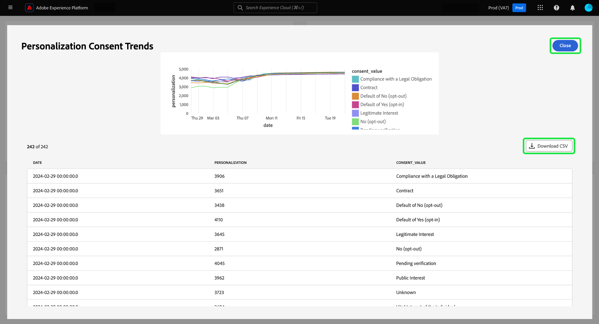

# 檢視更多資訊 {#view-more}

使用[query pro mode](./overview.md)建立[自訂分析](../sql-insights/overview.md)後，您就可以檢視不同格式的圖表資料。 您可以檢視以表格形式呈現的結果，或是以CSV檔案格式下載資料，以便在試算表中檢視。

## 清單化結果 {#tabulated-results}

對於透過SQL使用查詢專業模式編寫的每個圖表，您可以在Experience PlatformUI中檢視分析的清單結果。

從您的自訂儀表板，選取任何Widget上的省略符號(`...`)以存取[!UICONTROL 檢視更多]和[!UICONTROL 檢視SQL]選項。

![包含深入分析之省略符號下拉式功能表及[檢視更多]和[檢視SQL]選項的自訂儀表板。](../../images/sql-insights/ellipses-dropdown.png)

## 下載 CSV {#download-csv}

[!UICONTROL 檢視更多]功能會以表格形式顯示圖表的特定資料點。 若要簡化資料共用和操控的程式，您可以從此對話方塊下載CSV格式的已處理資料。 選取「**[!UICONTROL 下載CSV]**」以下載您的資料。

>[!NOTE]
>
>CSV下載僅限於前500筆記錄。

## 後續步驟

閱讀本檔案後，您現在知道如何檢視自訂圖表的SQL分析清單結果，以及將資料下載為CSV檔案。 請參閱檢視SQL檔案，瞭解如何[檢視自訂深入分析背後的SQL](./view-more.md)。

您也可以瞭解如何使用[引導式設計模式指南](../../user-defined-dashboards.md)，從Adobe Experience Platform UI中的現有資料模型產生圖表。
