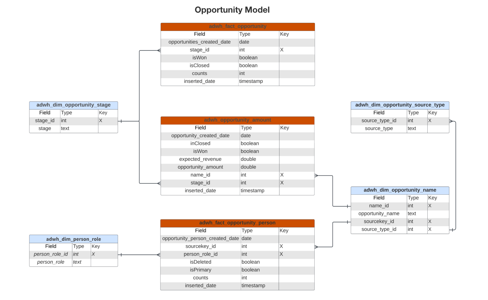

# Real-time Customer Data Platform Insights資料模型B2B版本

B2B版本的Real-time Customer Data Platform Insights資料模型會公開支援[帳戶設定檔](https://experienceleague.adobe.com/en/docs/experience-platform/rtcdp/account/account-profile-overview)深入分析的資料模型和SQL。 您可以自訂這些SQL查詢範本，以建立B2B行銷和關鍵績效指標(KPI)使用案例的Real-Time CDP報表。 這些深入分析接著可作為控制面板的自訂Widget使用。

>[!AVAILABILITY]
>
>已購買Real-Time CDP Prime和Ultimate套件的客戶可使用此功能。 如需詳細資訊，請參閱可用[Real-Time CDP版本](../../rtcdp/overview.md#rtcdp-editions)的相關檔案，或聯絡您的Adobe代表。

<!-- 
See the query accelerated store reporting insights documentation to learn [how to build a reporting insights data model through Query Service for use with accelerated store data and user-defined dashboards](../../query-service/data-distiller/sql-insights/reporting-insights-data-model.md).
 -->

## 先決條件

本指南需要深入瞭解自訂儀表板。 在繼續本指南之前，請先閱讀有關[如何建立自訂儀表板](../standard-dashboards.md)的檔案。

## Real-Time CDP B2B深入分析報表與使用案例 {#B2B-insight-reports-and-use-cases}

Real-Time CDP B2B報告提供您帳戶設定檔資料以及帳戶與商機之間關係的深入分析。 開發下列Star結構描述模型來回答各種常見行銷使用案例，每個資料模型可支援數個使用案例。

>[!IMPORTANT]
>
>用於Real-Time CDP B2B報告的資料對於所選的合併原則和最近的每日快照而言是準確的。

### 帳戶設定檔模型 {#account-profile-model}

帳戶設定檔模型包含八個資料集：

- `adwh_dim_industry`
- `adwh_dim_account_name`
- `adwh_dim_geo`
- `adwh_dim_account_type`
- `adwh_fact_account`
- `account_revenue_employee`

下圖顯示每個資料集中的相關資料欄位、其資料型別，以及將資料集連結在一起的外來索引鍵。


#### 依產業使用案例的新帳戶 {#accounts-by-industry}

[!UICONTROL 依產業分類的新帳戶]分析所使用的邏輯，會根據帳戶設定檔的數目和彼此的相對大小，傳回前五個產業。 如需詳細資訊，請參閱[[!UICONTROL 依產業的新帳戶] Widget檔案](../guides/account-profiles.md#accounts-by-industry)。

>[!TIP]
>
>您可以自訂此SQL查詢，以傳回大致前五個產業。

可摺疊的區段顯示依據產業]分析產生[!UICONTROL 新帳戶的SQL。

+++SQL查詢

```sql
WITH RankedIndustries AS (
    SELECT
        i.industry,
        SUM(f.counts) AS total_accounts,
        ROW_NUMBER() OVER (ORDER BY SUM(f.counts) DESC) AS industry_rank
    FROM
        adwh_fact_account f
    INNER JOIN adwh_dim_industry i ON f.industry_id = i.industry_id
    WHERE f.accounts_created_date between UPPER(COALESCE('$START_DATE', '')) and UPPER(COALESCE('$END_DATE', ''))
    GROUP BY
        i.industry
)
SELECT
    CASE
        WHEN industry_rank <= 5 THEN industry
        ELSE 'Others'
    END AS industry_group,
    SUM(total_accounts) AS total_accounts
FROM
    RankedIndustries
GROUP BY
    CASE
        WHEN industry_rank <= 5 THEN industry
        ELSE 'Others'
    END
ORDER BY
    total_accounts DESC
LIMIT 5000;
```

+++

#### 新帳戶（依型別分類）使用案例 {#accounts-by-type}

依型別]分析用於[!UICONTROL 新帳戶的邏輯會傳回依型別劃分帳戶的數值明細。 此深入分析可協助引導業務策略與營運，包括資源分配或行銷策略。 如需詳細資訊，請參閱依型別]的[[!UICONTROL 新帳戶Widget檔案](../guides/account-profiles.md#accounts-by-type)。

在下面的可摺疊區段中可看見依型別]分析產生[!UICONTROL 新帳戶的SQL。

+++SQL查詢

```sql
SELECT t.account_type,
       Sum(f.counts) AS account_count
FROM   adwh_fact_account f
       JOIN adwh_dim_account_type t
         ON f.account_type_id = t.account_type_id
WHERE  accounts_created_date BETWEEN Upper(Coalesce('$START_DATE', '')) AND
                                     Upper(
                                     Coalesce('$END_DATE', ''))
GROUP  BY t.account_type
LIMIT  5000; 
```

+++

### 機會模型 {#opportunity-model}

Opportunity模型包含七個資料集：

- `adwh_dim_opportunity_stage`
- `adwh_dim_person_role`
- `adwh_dim_opportunity_source_type`
- `adwh_dim_opportunity_name`
- `adwh_fact_opportunity`
- `adwh_opportunity_amount`
- `adwh_fact_opportunity_person`

下圖顯示每個資料集中的相關資料欄位。


