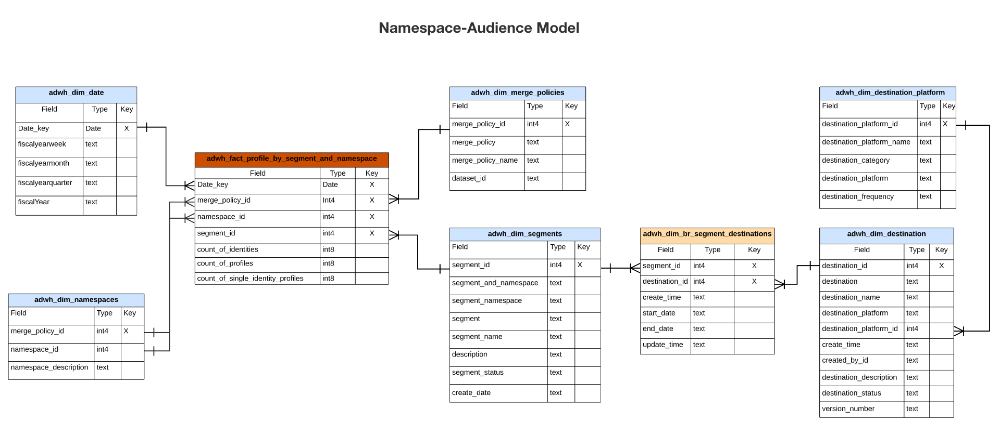

# Real-time Customer Data Platform Insights資料模型B2C版本

[B2C Edition](../../rtcdp/overview.md#rtcdp-b2c)的Real-time Customer Data Platform Insights資料模型會公開為各種設定檔、目的地和分段Widget提供深入分析的資料模型和SQL。 您可以自訂這些SQL查詢範本，以針對行銷和關鍵績效指標(KPI)使用案例建立Real-Time CDP報表。 這些深入分析接著可作為自訂Widget用於您使用者定義的儀表板。 請參閱query accelerated store reporting insights檔案，以瞭解[如何透過Query Service建立報告見解資料模型，以搭配使用accelerated store資料和使用者定義的儀表板](../../query-service/data-distiller/sql-insights/reporting-insights-data-model.md)。

>[!NOTE]
>
>Adobe Experience Platform系統中的「區段」一詞已更新為「對象」。 檔案路徑和資料集命名慣例仍會使用某些區段參照。

## 先決條件

本指南需要您實際瞭解[使用者定義儀表板功能](../user-defined-dashboards.md)。 請先閱讀檔案，再繼續閱讀本指南。

## Real-Time CDP深入分析報表與使用案例

Real-Time CDP報表可讓您深入分析設定檔資料，以及資料與對象和目的地的關係。 我們開發了各種star結構描述模型來回答各種常見行銷使用案例，每個資料模型可支援數個使用案例。

>[!IMPORTANT]
>
>用於Real-Time CDP報表的資料對於所選的合併原則和最近的每日快照而言是準確的。

### 設定檔模型 {#profile-model}

設定檔模型由三個資料集組成：

- `adwh_dim_date`
- `adwh_fact_profile`
- `adwh_dim_merge_policies`

下圖包含每個資料集中的相關資料欄位。


#### 設定檔計數使用案例 {#profile-count}

用於[!UICONTROL 設定檔計數] Widget的邏輯會傳回建立快照時設定檔存放區中合併的設定檔總數。 如需詳細資訊，請參閱[[!UICONTROL 設定檔計數] Widget檔案](../guides/profiles.md#profile-count)。

產生[!UICONTROL 設定檔計數] Widget的SQL會顯示在下方的可摺疊區段中。

+++SQL查詢

```sql
SELECT qsaccel.profile_agg.adwh_dim_merge_policies.merge_policy_name,
       sum(qsaccel.profile_agg.adwh_fact_profile.count_of_profiles) CNT
  FROM qsaccel.profile_agg.adwh_fact_profile
  LEFT OUTER JOIN qsaccel.profile_agg.adwh_dim_merge_policies ON qsaccel.profile_agg.adwh_dim_merge_policies.merge_policy_id=adwh_fact_profile.merge_policy_id
  WHERE qsaccel.profile_agg.adwh_fact_profile.date_key='2024-01-10'
    AND qsaccel.profile_agg.adwh_fact_profile.merge_policy_id = 2027892989
  GROUP BY qsaccel.profile_agg.adwh_dim_merge_policies.merge_policy_name;
```

+++

#### 單一身分設定檔使用案例 {#single-identity-profiles}

用於[!UICONTROL 單一身分設定檔] Widget的邏輯會提供貴組織只有一種型別識別碼型別的設定檔計數，以建立其身分。 如需詳細資訊，請參閱[[!UICONTROL 單一身分設定檔]介面工具檔案](../guides/profiles.md#single-identity-profiles)。

產生[!UICONTROL 單一身分設定檔] Widget的SQL會顯示在下方的可摺疊區段中。

+++SQL查詢

```sql
SELECT qsaccel.profile_agg.adwh_dim_merge_policies.merge_policy_name,
       sum(qsaccel.profile_agg.adwh_fact_profile.count_of_Single_Identity_profiles) CNT
  FROM qsaccel.profile_agg.adwh_fact_profile
  LEFT OUTER JOIN qsaccel.profile_agg.adwh_dim_merge_policies ON qsaccel.profile_agg.adwh_dim_merge_policies.merge_policy_id=adwh_fact_profile.merge_policy_id
  WHERE qsaccel.profile_agg.adwh_fact_profile.date_key='2024-01-10'
    AND qsaccel.profile_agg.adwh_fact_profile.merge_policy_id = 2027892989
  GROUP BY qsaccel.profile_agg.adwh_dim_merge_policies.merge_policy_name;
```

+++

### 名稱空間模型 {#namespace-model}

名稱空間模型由以下資料集組成：

- `adwh_dim_date`
- `adwh_fact_profile_by_namespace`
- `adwh_dim_merge_policies`
- `adwh_dim_namespaces`

下圖包含每個資料集中的相關資料欄位。


#### 依身分使用案例的設定檔 {#profiles-by-identity}

依身分割槽分的[!UICONTROL 設定檔] Widget會顯示您設定檔存放區中所有合併設定檔的身分劃分。 如需詳細資訊，請參閱[[!UICONTROL 依身分割槽分的設定檔] Widget檔案](../guides/profiles.md#profiles-by-identity)。

可摺疊的區段顯示依身分]介面產生[!UICONTROL 設定檔的SQL。

+++SQL查詢

```sql
SELECT qsaccel.profile_agg.adwh_dim_namespaces.namespace_description,
        sum(qsaccel.profile_agg.adwh_fact_profile_by_namespace_trendlines.count_of_profiles) count_of_profiles
  FROM qsaccel.profile_agg.adwh_fact_profile_by_namespace_trendlines
  LEFT OUTER JOIN qsaccel.profile_agg.adwh_dim_namespaces ON qsaccel.profile_agg.adwh_fact_profile_by_namespace_trendlines.namespace_id = qsaccel.profile_agg.adwh_dim_namespaces.namespace_id
  AND qsaccel.profile_agg.adwh_fact_profile_by_namespace_trendlines.merge_policy_id = qsaccel.profile_agg.adwh_dim_namespaces.merge_policy_id
  WHERE qsaccel.profile_agg.adwh_fact_profile_by_namespace_trendlines.merge_policy_id = 2027892989
    AND qsaccel.profile_agg.adwh_fact_profile_by_namespace_trendlines.date_key = '2024-01-10'
  GROUP BY qsaccel.profile_agg.adwh_fact_profile_by_namespace_trendlines.date_key,
          qsaccel.profile_agg.adwh_fact_profile_by_namespace_trendlines.merge_policy_id,
          qsaccel.profile_agg.adwh_dim_namespaces.namespace_description
  ORDER BY count_of_profiles DESC;
```

+++

#### 依身分使用案例區分的單一身分設定檔 {#single-identity-profiles-by-identity}

依身分]用於[!UICONTROL 單一身分設定檔的邏輯Widget可說明僅以單一唯一識別碼識別的設定檔總數。 如需詳細資訊，請參閱依身分Widget檔案的[單一身分設定檔](../guides/profiles.md#single-identity-profiles-by-identity)。

可摺疊的區段顯示透過身分]介面產生[!UICONTROL 單一身分設定檔的SQL。

+++SQL查詢

```sql
SELECT qsaccel.profile_agg.adwh_dim_namespaces.namespace_description,
        sum(qsaccel.profile_agg.adwh_fact_profile_by_namespace_trendlines.count_of_Single_Identity_profiles) count_of_Single_Identity_profiles
  FROM qsaccel.profile_agg.adwh_fact_profile_by_namespace_trendlines
  LEFT OUTER JOIN qsaccel.profile_agg.adwh_dim_namespaces ON qsaccel.profile_agg.adwh_fact_profile_by_namespace_trendlines.namespace_id = qsaccel.profile_agg.adwh_dim_namespaces.namespace_id
  AND qsaccel.profile_agg.adwh_fact_profile_by_namespace_trendlines.merge_policy_id = qsaccel.profile_agg.adwh_dim_namespaces.merge_policy_id
  WHERE qsaccel.profile_agg.adwh_fact_profile_by_namespace_trendlines.merge_policy_id = 2027892989
    AND qsaccel.profile_agg.adwh_fact_profile_by_namespace_trendlines.date_key = '2024-01-10'
  GROUP BY qsaccel.profile_agg.adwh_fact_profile_by_namespace_trendlines.date_key,
          qsaccel.profile_agg.adwh_fact_profile_by_namespace_trendlines.merge_policy_id,
          qsaccel.profile_agg.adwh_dim_namespaces.namespace_description;
```

+++

### 對象模型 {#audience-model}

對象模型由以下資料集組成：

- `adwh_dim_date`
- `adwh_fact_profile_by_segment`
- `adwh_dim_merge_policies`
- `adwh_dim_segments`
- `adwh_dim_br_segment_destinations`
- `adwh_dim_destination`
- `adwh_dim_destination_platform`

下圖包含每個資料集中的相關資料欄位。


#### 對象人數使用案例 {#audience-size}

用於[!UICONTROL 對象大小] Widget的邏輯會傳回在最新快照集時所選對象內的合併設定檔總數。 如需詳細資訊，請參閱[[!UICONTROL 對象大小] Widget檔案](../guides/audiences.md#audience-size)。

可摺疊的區段顯示產生[!UICONTROL 對象大小] Widget的SQL。

+++SQL查詢

```sql
SELECT
  sum(
    qsaccel.profile_agg.adwh_fact_profile_by_segment_trendlines.count_of_profiles
  ) count_of_profiles
FROM
  qsaccel.profile_agg.adwh_fact_profile_by_segment_trendlines
  LEFT OUTER JOIN qsaccel.profile_agg.adwh_dim_segments ON qsaccel.profile_agg.adwh_fact_profile_by_segment_trendlines.segment_id = qsaccel.profile_agg.adwh_dim_segments.segment_id
WHERE
  qsaccel.profile_agg.adwh_fact_profile_by_segment_trendlines.segment_id = -1323307941
  AND qsaccel.profile_agg.adwh_fact_profile_by_segment_trendlines.merge_policy_id = 1914917902
  AND qsaccel.profile_agg.adwh_fact_profile_by_segment_trendlines.date_key = '2024-01-12';
```

+++

#### 對象人數變化趨勢使用案例 {#audience-size-change-trend}

用於[!UICONTROL 對象人數變更趨勢] Widget的邏輯會提供最近每日快照之間符合指定對象資格的設定檔總數差異的線圖說明。 如需詳細資訊，請參閱[[!UICONTROL 對象人數變更趨勢] Widget檔案](../guides/audiences.md#audience-size-change-trend)。

可摺疊的區段顯示產生[!UICONTROL 對象人數變化趨勢] Widget的SQL。

+++SQL查詢

```sql
SELECT date_key,
      Profiles_added
  FROM
    (SELECT rn_num,
            date_key,
            (count_of_profiles-lag(count_of_profiles, 1, 0) over(
                                                                ORDER BY date_key))Profiles_added
    FROM
      (SELECT date_key,
              sum(x.count_of_profiles)count_of_profiles,
              row_number() OVER (
                                  ORDER BY date_key) rn_num
        FROM qsaccel.profile_agg.adwh_fact_profile_by_segment_trendlines x
        INNER JOIN
          (SELECT MAX(process_date) last_process_date,
                  merge_policy_id
          FROM qsaccel.profile_agg.adwh_lkup_process_delta_log
          WHERE process_name = 'FACT_TABLES_PROCESSING'
            AND process_status = 'SUCCESSFUL'
          GROUP BY merge_policy_id) y ON x.merge_policy_id = y.merge_policy_id
        WHERE segment_id = 1333234510
          AND x.date_key >= dateadd(DAY, -30 -1, y.last_process_date)
        GROUP BY x.date_key) a)b
  WHERE rn_num > 1;
```

+++

#### 最常使用的目的地使用案例 {#most-used-destinations}

[!UICONTROL 最常使用的目的地] Widget中使用的邏輯，會根據對應至您組織最常使用的目的地對象數目，列出這些目的地。 此排名可讓您深入瞭解正在使用的目的地，同時可能會顯示可能未充分利用的目的地。 如需詳細資訊，請參閱[[!UICONTROL 最常使用的目的地] Widget](../guides/destinations.md#most-used-destinations)的相關檔案。

產生[!UICONTROL 最常使用的目的地] Widget的SQL會顯示在下方的可摺疊區段中。

+++SQL查詢

```sql
SELECT qsaccel.profile_agg.adwh_dim_destination.destination_name,
       qsaccel.profile_agg.adwh_dim_destination.destination_id,
       qsaccel.profile_agg.adwh_dim_destination.destination,
       count(DISTINCT qsaccel.profile_agg.adwh_dim_br_segment_destinations.segment_id) segment_count
  FROM qsaccel.profile_agg.adwh_dim_destination
  JOIN qsaccel.profile_agg.adwh_dim_br_segment_destinations ON qsaccel.profile_agg.adwh_dim_destination.destination_id = qsaccel.profile_agg.adwh_dim_br_segment_destinations.destination_id
  WHERE qsaccel.profile_agg.adwh_dim_destination.destination_name IS NOT NULL
  GROUP BY qsaccel.profile_agg.adwh_dim_destination.destination_name,
           qsaccel.profile_agg.adwh_dim_destination.destination,
           qsaccel.profile_agg.adwh_dim_destination.destination_id
  ORDER BY segment_count DESC
  LIMIT 20;
```

+++

#### 最近啟用的對象使用案例 {#recently-activated-audiences}

[!UICONTROL 最近啟用的對象] Widget的邏輯提供最近對應到目的地的對象清單。 此清單提供系統中目前使用中的對象和目的地的快照，可協助疑難排解任何錯誤的對應。 如需詳細資訊，請參閱[[!UICONTROL 最近啟用的對象] Widget檔案](../guides/destinations.md#recently-activated-audiences)。

產生[!UICONTROL 最近啟用的對象] Widget的SQL會顯示在下方的可摺疊區段中。

+++SQL查詢

```sql
SELECT
  segment_name,
  segment,
  destination_name,
  a.create_time create_time
FROM
  qsaccel.profile_agg.adwh_dim_br_segment_destinations a
  INNER JOIN qsaccel.profile_agg.adwh_dim_segments b ON a.segment_id = b.segment_id
  INNER JOIN qsaccel.profile_agg.adwh_dim_destination c ON a.destination_id = c.destination_id
ORDER BY
  create_time DESC,
  segment
LIMIT
  20;
```

+++

### 名稱空間 — 對象模型 {#namespace-audience-model}

名稱空間 — 對象模型由以下資料集組成：

- `adwh_dim_date`
- `adwh_dim_namespaces`
- `adwh_fact_profile_by_segment_and_namespace`
- `adwh_dim_merge_policies`
- `adwh_dim_segments`
- `adwh_dim_br_segment_destinations`
- `adwh_dim_destination`
- `adwh_dim_destination_platform`

下圖包含每個資料集中的相關資料欄位。



#### 依對象使用案例的身分割槽分的設定檔 {#audience-profiles-by-identity}

依身分]設定檔中的[!UICONTROL 設定檔所使用的邏輯，會針對指定對象，提供設定檔存放區中所有合併設定檔的身分劃分。 如需詳細資訊，請參閱[[!UICONTROL 依身分割槽分的設定檔] Widget檔案](../guides/audiences.md#profiles-by-identity)。

可摺疊的區段顯示依身分]介面產生[!UICONTROL 設定檔的SQL。

+++SQL查詢

```sql
SELECT qsaccel.profile_agg.adwh_dim_namespaces.namespace_description,
        sum(qsaccel.profile_agg.adwh_fact_profile_by_segment_and_namespace_trendlines.count_of_profiles) count_of_profiles
  FROM qsaccel.profile_agg.adwh_fact_profile_by_segment_and_namespace_trendlines
  LEFT OUTER JOIN qsaccel.profile_agg.adwh_dim_namespaces ON qsaccel.profile_agg.adwh_fact_profile_by_segment_and_namespace_trendlines.namespace_id = qsaccel.profile_agg.adwh_dim_namespaces.namespace_id
  AND qsaccel.profile_agg.adwh_fact_profile_by_segment_and_namespace_trendlines.merge_policy_id = qsaccel.profile_agg.adwh_dim_namespaces.merge_policy_id
  WHERE qsaccel.profile_agg.adwh_fact_profile_by_segment_and_namespace_trendlines.segment_id = 1333234510
    AND qsaccel.profile_agg.adwh_fact_profile_by_segment_and_namespace_trendlines.merge_policy_id = 1709997014
    AND qsaccel.profile_agg.adwh_fact_profile_by_segment_and_namespace_trendlines.date_key = '2024-01-10'
  GROUP BY qsaccel.profile_agg.adwh_dim_namespaces.namespace_description
  ORDER BY count_of_profiles DESC;
```

+++

### 重疊名稱空間模型

重疊名稱空間模型由下列資料集組成：

- `adwh_dim_date`
- `adwh_dim_overlap_namespaces`
- `adwh_fact_profile_overlap_of_namespace`
- `adwh_dim_merge_policies`

下圖包含每個資料集中的相關資料欄位。


#### 身分重疊（設定檔）使用案例 {#profiles-identity-overlap}

[!UICONTROL 身分重疊] Widget中使用的邏輯會顯示您&#x200B;**設定檔存放區**&#x200B;中包含兩個所選身分的設定檔重疊。 如需詳細資訊，請參閱[!UICONTROL 設定檔]儀表板檔案](../guides/profiles.md#identity-overlap)的[[!UICONTROL 身分重疊] Widget區段。

可摺疊的區段顯示產生[!UICONTROL 身分重疊] Widget的SQL。

+++SQL查詢

```sql
SELECT Sum(overlap_col1) overlap_col1,
        Sum(overlap_col2) overlap_col2,
        coalesce(Sum(overlap_count), 0) overlap_count
  FROM
    (SELECT 0 overlap_col1,
            0 overlap_col2,
            Sum(count_of_profiles) overlap_count
    FROM qsaccel.profile_agg.adwh_fact_profile_overlap_of_namespace
    WHERE qsaccel.profile_agg.adwh_fact_profile_overlap_of_namespace.merge_policy_id = 2027892989
      AND qsaccel.profile_agg.adwh_fact_profile_overlap_of_namespace.date_key = '2024-01-10'
      AND qsaccel.profile_agg.adwh_fact_profile_overlap_of_namespace.overlap_id IN
        (SELECT a.overlap_id
          FROM
            (SELECT qsaccel.profile_agg.adwh_dim_overlap_namespaces.overlap_id overlap_id,
                    count(*) cnt_num
            FROM qsaccel.profile_agg.adwh_dim_overlap_namespaces
            WHERE qsaccel.profile_agg.adwh_dim_overlap_namespaces.merge_policy_id = 2027892989
              AND qsaccel.profile_agg.adwh_dim_overlap_namespaces.overlap_namespaces in ('avid',
                                                                                          'crmid')
            GROUP BY qsaccel.profile_agg.adwh_dim_overlap_namespaces.overlap_id)a
          WHERE a.cnt_num>1 )
    UNION ALL SELECT count_of_profiles overlap_col1,
                      0 overlap_col2,
                      0 overlap_count
    FROM qsaccel.profile_agg.adwh_fact_profile_by_namespace_trendlines
    JOIN qsaccel.profile_agg.adwh_dim_namespaces ON qsaccel.profile_agg.adwh_fact_profile_by_namespace_trendlines.namespace_id = qsaccel.profile_agg.adwh_dim_namespaces.namespace_id
    AND qsaccel.profile_agg.adwh_fact_profile_by_namespace_trendlines.merge_policy_id = qsaccel.profile_agg.adwh_dim_namespaces.merge_policy_id
    WHERE qsaccel.profile_agg.adwh_fact_profile_by_namespace_trendlines.merge_policy_id = 2027892989
      AND qsaccel.profile_agg.adwh_fact_profile_by_namespace_trendlines.date_key = '2024-01-10'
      AND qsaccel.profile_agg.adwh_dim_namespaces.namespace_description = 'avid'
    UNION ALL SELECT 0 overlap_col1,
                      count_of_profiles overlap_col2,
                      0 Overlap_count
    FROM qsaccel.profile_agg.adwh_fact_profile_by_namespace_trendlines
    JOIN qsaccel.profile_agg.adwh_dim_namespaces ON qsaccel.profile_agg.adwh_fact_profile_by_namespace_trendlines.namespace_id = qsaccel.profile_agg.adwh_dim_namespaces.namespace_id
    AND qsaccel.profile_agg.adwh_fact_profile_by_namespace_trendlines.merge_policy_id = qsaccel.profile_agg.adwh_dim_namespaces.merge_policy_id
    WHERE qsaccel.profile_agg.adwh_fact_profile_by_namespace_trendlines.merge_policy_id = 2027892989
      AND qsaccel.profile_agg.adwh_fact_profile_by_namespace_trendlines.date_key = '2024-01-10'
      AND qsaccel.profile_agg.adwh_dim_namespaces.namespace_description = 'crmid' )a;
```

+++

### 依對象模型重疊名稱空間 {#overlap-namespace-by-audience-model}

依對象模型的重疊名稱空間是由下列資料集組成：

- `adwh_dim_date`
- `adwh_dim_overlap_namespaces`
- `adwh_fact_profile_overlap_of_namespace_by_segment`
- `adwh_dim_merge_policies`
- `adwh_dim_segments`
- `adwh_dim_br_segment_destinations`
- `adwh_dim_destination`
- `adwh_dim_destination_platform`

下圖包含每個資料集中的相關資料欄位。


#### 身分重疊（對象）使用案例 {#audiences-identity-overlap}

在[!UICONTROL 對象]儀表板[!UICONTROL 身分重疊]介面工具中使用的邏輯可說明包含特定對象之兩個所選身分的設定檔重疊。 如需詳細資訊，請參閱[!UICONTROL 對象]儀表板檔案](../guides/audiences.md#identity-overlap)的[[!UICONTROL 身分重疊] Widget區段。

可摺疊的區段顯示產生[!UICONTROL 身分重疊] Widget的SQL。

+++SQL查詢

```sql
SELECT Sum(overlap_col1) overlap_col1,
        Sum(overlap_col2) overlap_col2,
        Sum(overlap_count) Overlap_count
  FROM
    (SELECT 0 overlap_col1,
            0 overlap_col2,
            Sum(count_of_profiles) Overlap_count
    FROM qsaccel.profile_agg.adwh_fact_profile_overlap_of_namespace_by_segment
    WHERE qsaccel.profile_agg.adwh_fact_profile_overlap_of_namespace_by_segment.segment_id = 1333234510
      AND qsaccel.profile_agg.adwh_fact_profile_overlap_of_namespace_by_segment.merge_policy_id = 1709997014
      AND qsaccel.profile_agg.adwh_fact_profile_overlap_of_namespace_by_segment.date_key = '2024-01-10'
      AND qsaccel.profile_agg.adwh_fact_profile_overlap_of_namespace_by_segment.overlap_id IN
        (SELECT a.overlap_id
          FROM
            (SELECT qsaccel.profile_agg.adwh_dim_overlap_namespaces.overlap_id overlap_id,
                    count(*) cnt_num
            FROM qsaccel.profile_agg.adwh_dim_overlap_namespaces
            WHERE qsaccel.profile_agg.adwh_dim_overlap_namespaces.merge_policy_id = 1709997014
              AND qsaccel.profile_agg.adwh_dim_overlap_namespaces.overlap_namespaces in ('crmid',
                                                                                          'email')
            GROUP BY qsaccel.profile_agg.adwh_dim_overlap_namespaces.overlap_id)a
          WHERE a.cnt_num>1 )
    UNION ALL SELECT count_of_profiles overlap_col1,
                      0 overlap_col2,
                      0 Overlap_count
    FROM qsaccel.profile_agg.adwh_fact_profile_by_segment_and_namespace_trendlines
    LEFT OUTER JOIN qsaccel.profile_agg.adwh_dim_namespaces ON qsaccel.profile_agg.adwh_fact_profile_by_segment_and_namespace_trendlines.namespace_id = qsaccel.profile_agg.adwh_dim_namespaces.namespace_id
    AND qsaccel.profile_agg.adwh_fact_profile_by_segment_and_namespace_trendlines.merge_policy_id = qsaccel.profile_agg.adwh_dim_namespaces.merge_policy_id
    WHERE qsaccel.profile_agg.adwh_dim_namespaces.namespace_description = 'crmid'
      AND qsaccel.profile_agg.adwh_fact_profile_by_segment_and_namespace_trendlines.segment_id = 1333234510
      AND qsaccel.profile_agg.adwh_fact_profile_by_segment_and_namespace_trendlines.merge_policy_id = 1709997014
      AND qsaccel.profile_agg.adwh_fact_profile_by_segment_and_namespace_trendlines.date_key = '2024-01-10'
    UNION ALL SELECT 0 overlap_col1,
                      count_of_profiles overlap_col2,
                      0 Overlap_count
    FROM qsaccel.profile_agg.adwh_fact_profile_by_segment_and_namespace_trendlines
    LEFT OUTER JOIN qsaccel.profile_agg.adwh_dim_namespaces ON qsaccel.profile_agg.adwh_fact_profile_by_segment_and_namespace_trendlines.namespace_id = qsaccel.profile_agg.adwh_dim_namespaces.namespace_id
    AND qsaccel.profile_agg.adwh_fact_profile_by_segment_and_namespace_trendlines.merge_policy_id = qsaccel.profile_agg.adwh_dim_namespaces.merge_policy_id
    WHERE qsaccel.profile_agg.adwh_dim_namespaces.namespace_description = 'email'
      AND qsaccel.profile_agg.adwh_fact_profile_by_segment_and_namespace_trendlines.segment_id = 1333234510
      AND qsaccel.profile_agg.adwh_fact_profile_by_segment_and_namespace_trendlines.merge_policy_id = 1709997014
      AND qsaccel.profile_agg.adwh_fact_profile_by_segment_and_namespace_trendlines.date_key = '2024-01-10' ) a;
```

+++

<!-- Commented out as Anil wanted to add something but did not provide information yet:
### Overlap Namespace-Audience model {#overlap-namespace-audience-model}

The overlap namespace-audience model is comprised of the following datasets: 

- `adwh_fact_profile_overlap_by_namespace_and_segment`
- `adwh_dim_date`
- `adwh_dim_namespace`
- `adwh_dim_overlap_namespaces`
- `adwh_dim_merge_policies`
- `adwh_dim_segments`
- `adwh_dim_br_segment_destinations`
- `adwh_dim_destination`
- `adwh_dim_destination_platform`

 -->

<!-- What insights are gathered from this particular data model? -->

<!-- Commented out as Anil wanted to add something but did not provide information yet:
### AI model {#ai-model}

The AI model is comprised of the following datasets: 

- `adwh_fact_profile_ai_models`
- `adwh_dim_date`
- `adwh_dim_merge_policies`
- `adwh_dim_ai_models`

 -->

<!-- What insights are gathered from this particular data model? -->

