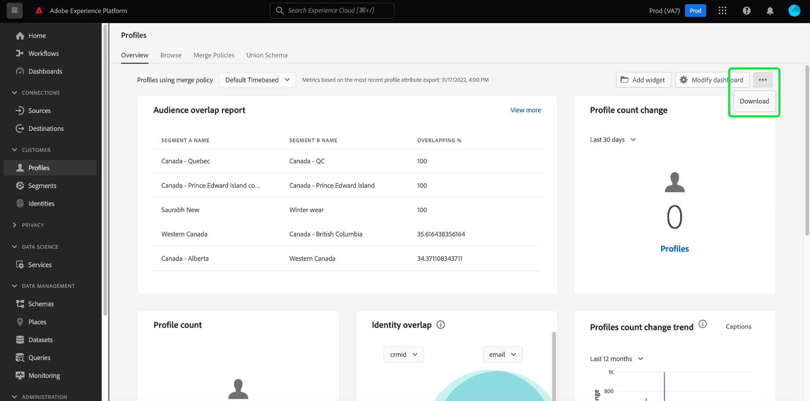

# 將控制面板下載為PDF

Adobe Experience Platform中的控制面板可從Platform使用者介面下載為PDF，方便與組織成員共用資訊。

本檔案提供如何使用Platform UI下載控制面板，以及使用預設瀏覽器列印功能表將控制面板儲存為PDF的摘要。

>[!WARNING]
>
>控制面板中包含的資料可能包含客戶的個人識別資訊(PII)，或與組織相關的敏感資料。 任何儲存為PDF的控制面板資料，都應根據貴組織的資料隱私權准則妥善處理。

## 下載控制面板

若要開始下載控制面板，請導覽至您要下載的控制面板（例如[!UICONTROL Profiles]控制面板），然後從控制面板的右上角選取更多選項功能表(**`...`**)。 接下來，選擇&#x200B;**[!UICONTROL Download]**。

## 預覽PDF

選擇&#x200B;**[!UICONTROL Download]**&#x200B;後，將開啟瀏覽器的預設打印菜單。 在此範例中，會顯示Google Chrome列印功能表。

打印菜單允許您預覽要保存的PDF。 PDF是Platform UI中顯示的控制面板小工具的真實表示，而PDF的大小會自動調整，以在單一頁面上顯示所有目前可見的控制面板小工具。

PDF包含自動產生的標題，其中包含Experience Platform標誌、控制面板的名稱、您的名稱，以及控制面板的下載日期和時間。 此資訊為唯讀資訊，無法在PDF中編輯。

## 另存為PDF

預覽PDF後，選擇&#x200B;**Save**&#x200B;以選擇要保存PDF的位置。

>[!NOTE]
>
>如有必要，如果您未自動選取該選項，可以使用&#x200B;**目標**&#x200B;下拉式清單來選取&#x200B;**另存為PDF**。

## 自訂控制面板PDF

產生的PDF會符合您在UI中看到的控制面板，並僅包含目前顯示在控制面板上的小工具。 某些控制面板可以自定義，以更改小部件的大小和位置，或添加小部件並從視圖中刪除小部件。 在Platform UI中自訂控制面板的外觀，也會變更產生的PDF外觀。

例如，您可以修改設定檔控制面板的外觀，以包含多個堆疊在三個標準介面工具集上的全寬介面工具集。

選擇以下載更新的控制面板，可產生符合自訂設定檔控制面板外觀的新PDF預覽。 它還會自動調整PDF的大小，以確保所有可見小部件都包含在單頁PDF中。

若要進一步了解自訂控制面板，請先閱讀[控制面板自訂概述](customize/overview.md)。

## 後續步驟

現在您已下載控制面板並儲存為PDF，您可以重複這些步驟來下載其他控制面板，或與組織成員共用PDF。