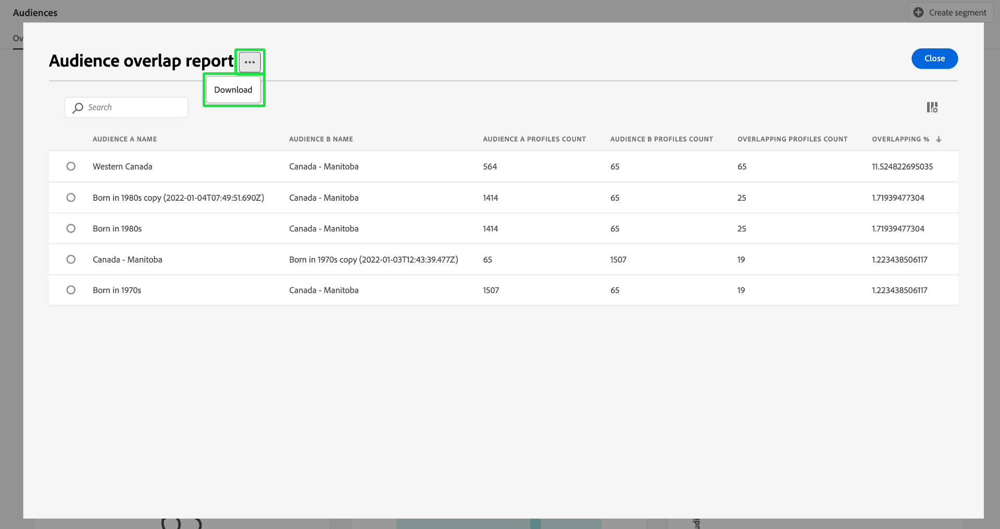

# [!UICONTROL 受眾] 儀表板 {#audiences-dashboard}

Adobe Experience Platform使用者介面(UI)提供了一個儀表板，您可以透過該儀表板檢視有關受眾的重要資訊，如每日快照期間所擷取。 本指南概述如何存取及使用 [!UICONTROL 受眾] UI中的控制面板，並提供控制面板中顯示之視覺效果的詳細資訊。

如需Platform使用者介面中所有Adobe Experience Platform Segmentation Service功能的總覽，請造訪 [Segmentation Service UI指南](../../segmentation/ui/overview.md).

## [!UICONTROL 受眾] 儀表板資料

此 [!UICONTROL 受眾] 儀表板會顯示貴組織在Experience Platform的設定檔存放區中擁有的屬性（記錄）資料快照。 快照不包含任何事件（時間序列）資料。

快照中的屬性資料顯示的資料與拍攝快照的特定時間點完全相同。 換言之，快照不是資料的近似或樣本，而且 [!UICONTROL 受眾] 儀表板未即時更新。

>[!NOTE]
>
>自拍攝快照以來對資料所做的任何變更或更新都不會反映在儀表板中，直到拍攝下一個快照為止。

## 探索 [!UICONTROL 受眾] 儀表板 {#explore}

若要導覽至 [!UICONTROL 受眾] 在Platform UI中，選取 **[!UICONTROL 受眾]** 在左側欄中，然後選取 **[!UICONTROL 概觀]** 標籤來顯示控制面板。

>[!NOTE]
>
>如果您的組織剛開始使用Platform，但尚未建立作用中的設定檔資料集或合併原則， [!UICONTROL 受眾] 儀表板不可見。 而是 [!UICONTROL 概觀] 索引標籤會顯示連結和檔案，以幫助您開始使用細分。

![此 [!UICONTROL 受眾] 儀表板 [!UICONTROL 概觀] 定位方式 [!UICONTROL 受眾] 和 [!UICONTROL 概觀] 反白顯示。](../images/audiences/dashboard-overview.png)

### 修改 [!UICONTROL 受眾] 儀表板 {#modify}

您可以修改 [!UICONTROL 受眾] 儀表板，選取 **[!UICONTROL 修改儀表板]**. 這可讓您從儀表板移動、新增和移除Widget，以及存取 **[!UICONTROL Widget資料庫]** 探索可用的Widget並為您的組織建立自訂Widget。

請參閱 [修改儀表板](../customize/modify.md) 和 [Widget程式庫概觀](../customize/widget-library.md) 檔案以深入瞭解。

### 新增Widget {#add-widget}

選取 **[!UICONTROL 新增Widget]** 導覽至Widget資料庫，並檢視可新增至控制面板的可用Widget清單。

![此 [!UICONTROL 受眾] 儀表板總覽 [!UICONTROL 新增Widget] 反白顯示。](../images/audiences/audiences-overview-add-widget.png)

在Widget資料庫中，您可以瀏覽標準與自訂對象Widget的選取專案。 如需如何新增Widget的相關資訊，請參閱如何新增Widget的程式庫檔案 [新增Widget](../customize/widget-library.md#add-widgets).

## 選取對象 {#select-audience}

控制面板會自動選取要顯示的對象。 不過，您可以使用下拉式選單或對象選擇器來變更對象。

若要選擇其他對象，請選取對象名稱旁的下拉式清單，或使用對象選擇器開啟對象選擇對話方塊。

>[!IMPORTANT]
>
>只有設定檔計數大於零的受眾才會顯示在可選受眾清單中。

![此 [!UICONTROL 選取對象] 顯示所有可用對象的對話方塊。](../images/audiences/select-audience-dialog.png)

## Widget和量度 {#widgets-and-metrics}

此 [!UICONTROL 受眾] 控制面板由Widget組成，這些是唯讀量度，可提供有關您所選對象的重要資訊。

最近一次快照的日期和時間會顯示在最上方 [!UICONTROL 概觀] 「對象」下拉式清單旁的標籤。 截至該日期和時間，所有Widget資料都是準確的。 快照的時間戳記會以UTC提供；而不是在個別使用者或組織的時區中。

## 預設Widget {#default-widgets}

Adobe Experience Platform的所有新執行個體都會提供預設Widget載出，以強調資料中最新可用的深入分析。 下列Widget從一開始便已在您的區段檢視中預先設定。 有關Widget用途和功能的完整詳細資訊，請參閱其各自章節。

* [[!UICONTROL 對象規模]](#audience-size)
* [[!UICONTROL 對象人數變化趨勢]](#audience-size-change-trend)
* [[!UICONTROL 身分識別覆蓋]](#identity-overlap)
* [[!UICONTROL 依身分識別劃分的設定檔]](#profiles-by-identity)

>[!NOTE]
>
>截至2023年7月26日， [!UICONTROL 設定檔]， [!UICONTROL 受眾]、和 [!UICONTROL 目的地] 對於所有在前六個月未修改檢視的使用者，概述儀表板已重設為新的預設Widget載出。
>請參閱以下檔案： [設定檔](./profiles.md#default-widgets) 和 [目的地](./destinations.md#default-widgets) 預設Widget區段，以取得關於哪些小工具屬於預設Widget載入一部分的詳細資訊。 您可以繼續如往常一樣自訂您的儀表板Widget。

## 標準Widget {#standard-widgets}

Adobe提供多個標準的Widget，您可用來視覺化與對象相關的不同量度。 您也可以使用建立自訂Widget並與您的組織共用 [!UICONTROL Widget資料庫]. 若要進一步瞭解如何建立自訂Widget，請先閱讀 [Widget程式庫概觀](../customize/widget-library.md).

若要進一步瞭解每個可用的標準Widget，請從下列清單中選取Widget的名稱：

* [[!UICONTROL 對象規模]](#audience-size)
* [[!UICONTROL 對象啟用順序]](#audience-activation-order)
* [[!UICONTROL 對象規模趨勢]](#audience-size-trend)
* [[!UICONTROL 對象人數變化趨勢]](#audience-size-change-trend)
* [[!UICONTROL 依身分割槽分的對象人數趨勢]](#audience-size-trend-by-identity)
* [[!UICONTROL 對象重疊]](#audience-overlap)
* [[!UICONTROL 對象重疊報表]](#audience-overlap-report)
* [[!UICONTROL 身分識別覆蓋]](#identity-overlap)
* [[!UICONTROL 依身分識別劃分的設定檔]](#profiles-by-identity)
* [[!UICONTROL 排定的啟用]](#scheduled-activations)

### [!UICONTROL 對象規模] {#audience-size}

>[!CONTEXTUALHELP]
>id="platform_dashboards_segments_audiencesize"
>title="對象規模"
>abstract="此 Widget 會顯示選取對象內合併設定檔的總數。此數字會依據套用於您的資料的合併原則而定，並且在最近快照時是正確的。"

此 **[!UICONTROL 對象人數]** widget會顯示擷取快照時所選對象中的合併設定檔總數。 此數字是將對象合併原則套用至您的設定檔資料，以將設定檔片段合併在一起，並為對象中的每個人形成單一設定檔的結果。

如需片段及合併設定檔的詳細資訊，請參閱 [即時客戶個人檔案總覽](../../profile/home.md).

![此 [!UICONTROL 受眾] 控制面板概述 [!UICONTROL 對象人數] 醒目提示Widget。](../images/audiences/audience-size.png)

### [!UICONTROL 對象規模趨勢] {#audience-size-trend}

>[!CONTEXTUALHELP]
>id="platform_dashboards_segments_audiencesizetrend"
>title="對象規模趨勢"
>abstract="此 Widget 會提供有關符合&#x200B;**任何**&#x200B;區段定義標準的設定檔總數的資訊，這會在過去 30 天、90 天或 12 個月每日快照期間擷取。"

此 **[!UICONTROL 對象人數趨勢]** Widget提供符合資格的設定檔總數的線圖插圖 **任何** 一段指定時間內的對象。 對象人數趨勢可在30天、90天和12個月的期間內以視覺化方式呈現。 期間是從Widget的下拉式功能表中選擇。 對象人數會反映在y軸，而時間則反映在x軸。

此Widget也包含自動 [!UICONTROL 註解] 機器學習模型會分析圖表和受眾資料，並自動產生註解以說明主要趨勢和重要事件的功能。 選取 **[!UICONTROL 註解]** 以開啟自動註解對話方塊。

![此 [!UICONTROL 受眾] 概述會顯示對象人數趨勢Widget。](../images/audiences/audience-size-trend-captions.png)

自動註解對話方塊隨即開啟，提供您資料的深入分析。

若要進一步瞭解對象評估，以及設定檔如何符合資格及退出對象，請參閱 [分段服務檔案](../../segmentation/home.md).

### [!UICONTROL 對象人數變化趨勢] {#audience-size-change-trend}

此Widget提供最近每日快照之間符合指定對象資格的設定檔總數差異的線圖。 選擇分析的對象是從概述下拉式清單中選取。 趨勢分析的期間可以視覺化為30天、90天和12個月的期間。 期間是從Widget的下拉式功能表中選擇。 對象人數會反映在y軸，而時間則反映在x軸。

### [!UICONTROL 依身分割槽分的對象人數趨勢] {#audience-size-trend-by-identity}

此Widget會根據從Widget下拉式選單中選擇的身分型別，說明特定對象的對象人數趨勢。 分析對象是從概述下拉式清單中選取。 趨勢分析的期間可以視覺化為30天、90天和12個月的期間。 期間是從Widget的下拉式功能表中選擇。

### [!UICONTROL 對象啟用順序] {#audience-activation-order}

此 [!UICONTROL 對象啟用順序] widget提供三欄表格，列出目的地名稱、平台和對象啟用日期。 清單會根據造訪間隔從高到低的順序排列，最多可容納10列。

### [!UICONTROL 對象重疊] {#audience-overlap}

此Widget使用文氏圖表來視覺化符合兩個對象條件的人員數量。 您可從Widget下拉式選單中選取用於比較的對象。 透過將游標移至圓形或文氏圖表交集上，可檢視相關區段定義中包含的設定檔總數。

此Widget可讓您透過視覺化細分定義結果中的相似性，將細分策略最佳化。

### [!UICONTROL 對象重疊報表] {#audience-overlap-report}

此Widget會將特定對象的設定檔重疊資料製成表格化。 從畫面頂端的下拉式功能表所選取的對象，會獲得從最高重疊百分比到最低重疊百分比排名的五個對象清單。 為清楚起見，您選擇的對象會列在 [!UICONTROL 對象A名稱] 欄。 對象重疊分析是針對 [!UICONTROL 對象B名稱] 欄。 第三欄提供重疊百分比，精確至小數點十二位數。

對象重疊報表可協助您建立新的高效能對象。 觀察高百分比的重疊可讓您抑制受眾，並防止將相同的受眾傳送至不同的目的地。 它們也可協助您識別隱藏的深入分析，可能有助於更佳的分段。 低百分比重疊有助於找到要追蹤的不重複設定檔。

選取 **[!UICONTROL 檢視更多]** 以開啟包含更多對象重疊資料的全熒幕對話方塊。

此 [!UICONTROL 對象重疊報表] 對話方塊隨即顯示。 此對話方塊最多可包含50列對象重疊分析，並分為6欄。 選取設定圖示()以從表格中移除或新增欄。

>[!NOTE]
>
>選取 **[!UICONTROL 重疊]** 欄標題，將結果排名從最高變更為最低，或從最低變更為最高。

若要以PDF格式下載整個報表，請選取選項功能表(**`...`**)後接 **[!UICONTROL 下載]**.

從報表中選取一列，以開啟重疊分析的文氏圖表。 將游標停留在文氏圖表的某個區段上，即可在對話方塊中檢視設定檔計數。

選取 **[!UICONTROL 關閉]** 以返回 [!UICONTROL 受眾] 儀表板。

### [!UICONTROL 身分識別覆蓋] {#identity-overlap}

>[!CONTEXTUALHELP]
>id="platform_dashboards_segments_identityoverlap"
>title="身分識別覆蓋"
>abstract="此 Widget 會顯示包含兩個所選身分識別的對象中設定檔的覆蓋。圓圈會顯示每個身分識別的相對大小。包含兩個命名空間的設定檔的數量由圓圈之間的覆蓋表示。"

此 **[!UICONTROL 身分重疊]** Widget會顯示文氏圖表或集合圖表，顯示您的對象中包含多個身分的設定檔重疊情形。

使用Widget上的下拉式選單來選取您要比較的身分。 圓圈會顯示每個所選身分的相對大小，包含兩個名稱空間的設定檔數目會以圓圈之間的重疊大小表示。

如果客戶透過多個管道與您的品牌互動，則多個身分將會與該個別客戶相關聯。 此情況可能會讓您的組織有多個包含多個身分識別片段的設定檔。

若要進一步瞭解身分，請造訪 [Identity Service檔案](../../identity-service/home.md).

![此 [!UICONTROL 受眾] 醒目提示身分重疊Widget的儀表板總覽。](../images/audiences/identity-overlap.png)

### [!UICONTROL 依身分識別劃分的設定檔] {#profiles-by-identity}

>[!CONTEXTUALHELP]
>id="platform_dashboards_segments_profilesbyidentity"
>title="依身分識別劃分的設定檔"
>abstract="此 Widget 會顯示選取對象中每個合併設定檔身分識別的劃分。"

此 **[!UICONTROL 依身分割槽分的設定檔]** widget會顯示您所選對象中每個合併設定檔的身分劃分。 依身分割槽分的設定檔總數可能會高於對象中的設定檔總數，因為一個設定檔可能會有多個相關聯的身分。 換言之，將每個身分顯示的值加總在一起，可能會超過總對象人數。 這是因為如果客戶透過多個管道與您的品牌互動，則多個身分可能會與該個別客戶相關聯。

選取 **[!UICONTROL 註解]** 以開啟自動註解對話方塊。

![此 [!UICONTROL 受眾] 儀表板總覽中，「依身分割槽分的設定檔Widget和註解」選項會強調顯示。](../images/audiences/profiles-by-identity.png)

機器學習模型會通過分析資料的整體分佈與關鍵維度，自動產生資料深入分析。

若要進一步瞭解身分，請造訪 [Identity Service檔案](../../identity-service/home.md).

### 排定的啟用 {#scheduled-activations}

此 [!UICONTROL 排定的啟用] Widget以表格化方式呈現最近啟用目的地的檢視。 此表格包含目的地平台、流向此目的地的啟用流程名稱，以及所選對象的啟用開始和結束日期。 如果沒有提供啟用的結束日期，則會顯示為 [!UICONTROL 進行中]. 分析對象是從頁面頂端的下拉式清單中選取。

Widget可讓您一眼就發現正在啟用對象的位置和時間，並讓重複或不必要的啟用更透明。 此累積資訊也會反白標示任何啟用被遺漏的位置。

## 後續步驟

依照此檔案，您現在應該能夠找到 [!UICONTROL 受眾] 控制面板並選取要檢視的對象。 您也應該瞭解可用介面工具列中顯示的量度。 若要進一步瞭解如何在Experience Platform UI中使用對象，請參閱 [Segmentation Service UI指南](../../segmentation/ui/overview.md).
