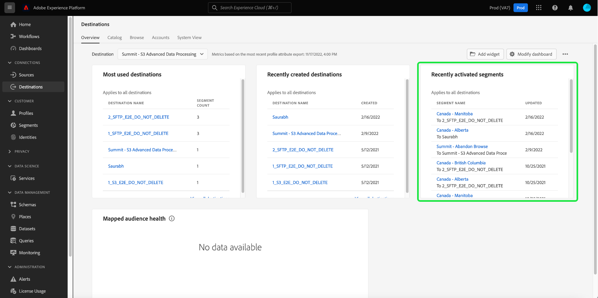

# [!UICONTROL 目的地] 儀表板

Adobe Experience Platform使用者介面(UI)提供了一個儀表板，您可以通過該儀表板檢視有關您組織的有效目的地的重要資訊，如每日快照期間所擷取。 本指南概述如何在UI中存取和使用目標儀表板，並提供有關儀表板中顯示的量度的詳細資訊。

如需目的地概觀，以及Experience Platform中所有可用目的地的目錄，請造訪 [目的地檔案](../../destinations/home.md).

## [!UICONTROL 目的地] 儀表板資料 {#destinations-dashboard-data}

目的地儀表板會顯示貴組織在Experience Platform中啟用的目的地的快照。 快照中的資料顯示的資料與拍攝快照的特定時間點完全相同。 換言之，快照不是資料的近似或範例，而且目的地儀表板沒有即時更新。

>[!NOTE]
>
>自建立快照以來對資料所做的任何變更或更新，都不會反映在控制面板中，直到建立下一個快照為止。

## 探索 [!UICONTROL 目的地] 儀表板 {#explore}

若要導覽至Platform UI中的目的地控制面板，請選取「 」 **[!UICONTROL 目的地]** 在左側欄中，然後選取 **[!UICONTROL 概觀]** 標籤來顯示控制面板。

最近一次快照的日期和時間會顯示在最上方 [!UICONTROL 概觀] 位於目的地下拉式清單旁。 截至該日期和時間，所有Widget資料都是準確的。 快照的時間戳記會以UTC提供，而不是在個別使用者或組織的時區中。

>[!NOTE]
>
>如果您的組織剛開始使用Experience Platform，但尚未擁有作用中的目的地，則目的地控制面板和 [!UICONTROL 概觀] 標籤不可見。 請改為選取 [!UICONTROL 目的地] 左側導覽會顯示 [!UICONTROL 目錄] 標籤。 若要進一步瞭解 [!UICONTROL 目錄] 索引標籤中，請參閱 [[!UICONTROL 目的地] workspace指南](../../destinations/ui/destinations-workspace.md).

### 修改 [!UICONTROL 目的地] 儀表板 {#modify}

選取 **[!UICONTROL 修改儀表板]** 以變更目的地控制面板的外觀。 這可讓您從儀表板移動、新增和移除Widget，以及存取Widget資料庫。 在Widget資料庫中，您可以探索可用的Widget並為您的組織建立自訂Widget。

請參閱 [修改儀表板](../customize/modify.md) 和 [Widget程式庫概觀](../customize/widget-library.md) 檔案，以瞭解更多。

### 新增Widget {#add-widget}

選取 **[!UICONTROL 新增Widget]** 導覽至Widget程式庫，並檢視可新增至儀表板的可用Widget清單。

在Widget資料庫中，您可以瀏覽標準與自訂區段Widget的選取專案。 如需如何新增Widget的詳細資訊，請參閱Widget程式庫檔案，瞭解如何 [新增Widget](../customize/widget-library.md#add-widgets).

## 標準Widget {#standard-widgets}

「Adobe」提供多種標準Widget，可用來視覺化與目的地相關的不同量度，並評估資料分析可用區段的完整性。 您也可以使用建立自訂Widget並與您的組織共用 [!UICONTROL Widget資料庫]. 若要進一步瞭解如何建立自訂Widget，請先閱讀 [Widget程式庫概觀](../customize/widget-library.md).

### 先決條件 {#prerequisites}

繼續說明標準Widget之前，請務必熟悉本檔案中使用的下列重要辭彙定義：

* **區段：** 區段是 **規則集** 屬性與事件資料，可讓多個設定檔符合對象資格。
* **對象**：對象為 **設定檔集** 符合區段定義條件的區段。
* **已對應/對應**：資料對應是將來源資料欄位對應到目的地中相關目標欄位的程式。
* **身分**：身分識別碼是唯一代表個別客戶的識別碼，例如Cookie ID、裝置ID或電子郵件ID。
* **啟動**：啟動是使用者為了將區段或設定檔對應到目的地(例如Oracle Eloqua、Google或SalesforceMarketing Cloud)而採取的動作。

若要進一步瞭解每個可用的標準Widget，請從下列清單中選取Widget的名稱：

* [[!UICONTROL 最常用的目的地]](#most-used-destinations)
* [[!UICONTROL 最近建立的目的地]](#recently-created-destinations)
* [[!UICONTROL 最近啟動的區段]](#recently-activated-segments)
* [[!UICONTROL 最近啟動的區段 (按目的地)]](#recently-activated-segments-by-destination)
* [[!UICONTROL 對象規模趨勢]](#audience-size-trend)
* [[!UICONTROL 按身份識別的未對應區段]](#unmapped-segments-by-identity)
* [[!UICONTROL 按身分識別的未對應區段]](#mapped-segments-by-identity)
* [[!UICONTROL 常見對象]](#common-audiences)
* [[!UICONTROL 對應的對象]](#mapped-audiences)
* [[!UICONTROL 對應的對象健康情況]](#mapped-audience-health)
* [[!UICONTROL 目的地計數]](#destinations-count)
* [[!UICONTROL 目的地狀態]](#destination-status)
* [[!UICONTROL 依目的地平台區分的有效目的地]](#active-destinations-by-destination-platform)
* [[!UICONTROL 所有目的地中的啟用對象]](#activated-audiences-across-all-destinations)
* [[!UICONTROL 啟用的對象]](#activated-audiences)

### [!UICONTROL 最常用的目的地] {#most-used-destinations}

>[!CONTEXTUALHELP]
>id="platform_dashboards_destinations_mostuseddestinations"
>title="最常用的目的地"
>abstract="此 Widget 會依據對應的區段數顯示您的組織最活躍的目的地。這些數字在上次快照時是準確的。此排名會提供對目前使用最多的目的地的分析，同時會強調可能未受到充分利用的目的地。"

此 **[!UICONTROL 最常使用的目的地]** Widget會依對應區段數顯示您組織的最上層目的地（截至上次快照為止）。 此排名可讓您深入瞭解正在使用的目的地，同時可能還會顯示那些可能未充分利用的目的地。

例如，如果您昨天設定了目的地，但尚未將任何區段對應至該目的地，您就會發現該目的地目前利用不足。

區段計數欄中顯示的對應區段數，自上次每日快照起都是準確的。 將新區段對應到目的地時，只有在拍攝下一個快照後，才會更新計數。

從Widget上顯示的清單中選取目的地的名稱，您就會轉至從連結的目的地詳細資訊 **[!UICONTROL 瀏覽]** 標籤。 您也可以選取 **[!UICONTROL 檢視全部]** 導覽至 **[!UICONTROL 瀏覽]** 標籤，然後選取目的地名稱以檢視其詳細資訊。

### [!UICONTROL 最近建立的目的地] {#recently-created-destinations}

>[!CONTEXTUALHELP]
>id="platform_dashboards_destinations_recentlycreateddestinations"
>title="最近建立的目的地"
>abstract="此 Widget 會顯示您組織內最近設定的目的地清單。"

此 **[!UICONTROL 最近建立的目的地]** widget可讓您檢視貴組織最近設定之目的地的清單。

顯示的建立日期與上次的每日快照相符。 換言之，如果您建立新的目的地，則在拍攝下一個快照之後，它才會出現在清單中。

從Widget上顯示的清單中選取目的地的名稱，您就會轉至從連結的目的地詳細資訊 **[!UICONTROL 瀏覽]** 標籤。 您也可以選取 **[!UICONTROL 檢視全部]** 導覽至 **[!UICONTROL 瀏覽]** 標籤，然後選取目的地名稱以檢視其詳細資訊。

若要進一步瞭解如何設定特定型別的目的地，請造訪 [目的地檔案](../../destinations/home.md).

### [!UICONTROL 最近啟動的區段] {#recently-activated-segments}

>[!CONTEXTUALHELP]
>id="platform_dashboards_destinations_recentlyactivatedsegments"
>title="最近啟動的區段"
>abstract="此 Widget 會提供最近對應至目的地的區段清單。此清單會提供系統中正在使用的區段和目的地的快照，能有助於對任何錯誤的對應進行移難排解。"

此 **[!UICONTROL 最近啟用的區段]** Widget提供最近對應至目的地的區段清單。 此清單會提供系統中正在使用的區段和目的地的快照，能有助於對任何錯誤的對應進行移難排解。

顯示的更新日期會顯示上次將區段啟動至目的地的時間，而且與上次每日快照的日期相符。 換言之，如果您啟用區段至目的地，則更新的日期要等到拍攝下一個快照後才會變更。

從Widget上顯示的清單中選取區段名稱，可帶您前往區段詳細資訊。 您也可以選取 **[!UICONTROL 檢視全部]** 導覽至「區段瀏覽」標籤，然後選取區段名稱以檢視其詳細資訊。

如需在Experience Platform中使用區段的詳細資訊，請參閱 [Segmentation Service概述](../../segmentation/home.md).

### [!UICONTROL 最近啟動的區段 (按目的地)] {#recently-activated-segments-by-destination}

>[!CONTEXTUALHELP]
>id="platform_dashboards_destinations_recentlyactivatedsegmentsbydestination"
>title="最近啟動的區段 (按目的地)"
>abstract="此 Widget 會根據在概觀下拉式清單中選擇的目的地以遞減的方式顯示最近啟動的前五個區段。"

此 **[!UICONTROL 目的地最近啟用的區段]** Widget會根據在概述下拉式清單中選擇的目的地，以遞減順序顯示最近啟用的前五個區段。 它類似於 [!UICONTROL 最近啟用的區段] Widget，但顯示的資料 **僅限** 套用至選取的目的地。

此Widget包含兩個量度：區段名稱和上次啟用區段至目的地的日期。 顯示的資料與上次的每日快照相同。

您可以從顯示的清單中選取區段名稱，以檢視區段的詳細資訊。

請參閱的先決條件一節 [使用辭彙的定義](#prerequisites) 在此說明中。

### [!UICONTROL 對象規模趨勢] {#audience-size-trend}

>[!CONTEXTUALHELP]
>id="platform_dashboards_destinations_audiencesizetrend"
>title="對象規模趨勢"
>abstract="此 Widget 會說明區段中包含的設定檔數量，這會每天傳送到目的地帳戶。第一個下拉式選單會調整對象趨勢的時段。第二個 Widget 下拉式選單會選取要分析的區段。可從概觀的下拉式清單中選擇目的地。"

此 **[!UICONTROL 對象人數趨勢]** Widget會針對已對應至目的地帳戶的區段，描述一段時間內設定檔計數之間的關係。 Widget會使用線圖來說明每天傳送至目的地帳戶的區段中包含的設定檔數量。

過去30天、90天或12個月的對象趨勢時段，可以使用第一個下拉式功能表調整。

第二個下拉式功能表會列出所有可傳送至控制面板頂端所選目的地帳戶的可用區段。

此 **[!UICONTROL 對象人數趨勢]** Widget提供 [!UICONTROL 註解] 按鈕。 選取 **[!UICONTROL 註解]** 以開啟自動註解對話方塊。 機器學習模型會通過分析圖表和區段資料自動產生字幕，以說明關鍵趨勢和重要事件。

### [!UICONTROL 按身份識別的未對應區段] {#unmapped-segments-by-identity}

>[!CONTEXTUALHELP]
>id="platform_dashboards_destinations_unmappedsegmentsbyidentity"
>title="按身份識別的未對應區段"
>abstract="此 Widget 會針對特定目的地和身分識別列出按遞減的身分識別計數排名的前五個&#x200B;**未對應**&#x200B;區段。Widget 下拉式清單中列出的篩選器 ID 會根據在概觀頁面頂部選取的目的地帳戶而變更。"

此 **[!UICONTROL 依身分割槽分的未對應區段]** widget列出前五名 **未對應** 依指定目的地和身分的遞減身分計數排名的區段。 它會根據所選ID反白標示最有利於對應至所選目的地帳戶的區段。

目的地ID下拉式清單會篩選您可用的區段。  下拉式清單中列出的篩選器 ID 會根據在概觀頁面頂部選取的目的地帳戶而變更。

身分欄會計算區段內可對應至Widget ID下拉式清單中所選ID的來源ID數量。

請參閱的先決條件一節 [使用辭彙的定義](#prerequisites) 在此說明中。

### [!UICONTROL 按身分識別的未對應區段] {#mapped-segments-by-identity}

>[!CONTEXTUALHELP]
>id="platform_dashboards_destinations_mappedsegmentsbyidentity"
>title="按身分識別的未對應區段"
>abstract="此 Widget 會提供前五個&#x200B;**對應**&#x200B;區段清單。該清單會根據區段中包含的來源 ID 的數量從高到低排序。要計算的目的地 ID 會從 Widget 標題下方的下拉式選單中選取。此 Widget 下拉式清單中可用的目的地 ID 會依據在概觀儀表板頂部選擇的目的地而定。"

此 Widget 會提供前五個&#x200B;**對應**&#x200B;區段清單。該清單會根據區段中包含的來源 ID 的數量從高到低排序。要計算的目的地 ID 會從 Widget 標題下方的下拉式選單中選取。Widget中下拉式清單可用的目的地ID會根據在總覽儀表板頂端選擇的目的地帳戶篩選器而變更。

此 **[!UICONTROL 依身分割槽分的對應區段]** widget會強調一覽，在所選目的地內成功鎖定促銷活動之設定檔商機的可能性。 有效率的目標促銷活動不取決於傳送至目的地的設定檔數量，而是取決於與目的地ID可能相符以提供有用且可操作資料的來源ID數量。

### 常見對象 {#common-audiences}

>[!CONTEXTUALHELP]
>id="platform_dashboards_destinations_commonaudiences"
>title="常見對象"
>abstract="此 Widget 會提供在頁面頂部選擇的目的地帳戶中啟動的前五個區段的清單，以及在 Widget 下拉式清單中選取的目的地。區段清單會根據啟動的時間排序。啟動時間最近的區段會顯示在頂部。"

此 **[!UICONTROL 常見對象]** Widget提供在頁面上方所選目的地帳戶，以及在Widget下拉式清單中選取的目的地中，啟用的前五個區段的清單。 區段清單會根據啟動的時間排序。啟動時間最近的區段會顯示在頂部。

此 [!UICONTROL 對象規模] 欄提供每個列出區段的總設定檔計數。

### 對應的對象 {#mapped-audiences}

此 [!UICONTROL 對應的對象] widget會顯示可啟動至頁面頂端所選目的地的對應對象總數。

選取 **[!UICONTROL 區段]** 導覽至「區段」控制面板 [!UICONTROL 瀏覽] 標籤。 此工作區會顯示貴組織的所有區段定義清單。

### 對應的對象健康情況 {#mapped-audience-health}

>[!CONTEXTUALHELP]
>id="platform_dashboards_destinations_mappedaudiencehealth"
>title="對應的對象健康情況"
>abstract="此 Widget 會提供包含最多 20 個對應區段的清單，這些區段的總設定檔計數和對應至該目的地的 30 天平均對象規模至少有一個標準差的因素偏差。這會為過去 30 天內對象規模和平均值的差異提供計算量度。對象規模的排序為由高至低。"

Widget提供最多20個對應區段的清單，截至上次每日快照時，這些區段的總設定檔計數與對應至該目的地的30天平均對象人數至少有一個標準差。

簡言之，它提供過去30天內從平均值算起的受眾人數分散的計算量度。 它會比較今天的對象人數是否超出過去30天資料中所見的歷史標準差。

系統中的所有受眾規模都是從高到低的受眾規模排序，如 [!UICONTROL 最新大小] 欄。

如果您的區段對應設定檔計數超過過去30天平均對應設定檔大小的一個標準差，這表示系統中出現異常，應進行調查。

如果區段位於 [!UICONTROL 對應的對象健康狀況] Widget偏差較大，您應該參閱對象人數趨勢圖並找出異常區段。 此趨勢可讓您深入瞭解區段的健康情況。

>[!NOTE]
>
>對應對象健康情況Widget的預設大小可能會妨礙表格資訊。 請修改Widget的大小，以改善對應區段名稱和欄標題的清晰度。 如需相關指引，請參閱修改控制面板檔案 [如何調整Widget大小](../customize/modify.md).

### [!UICONTROL 目的地計數] {#destinations-count}

>[!CONTEXTUALHELP]
>id="platform_dashboards_destinations_destinationscount"
>title="目的地計數"
>abstract="此 Widget 會提供可以在系統內啟動和傳遞對象的可用端點總數。此數字包括使用中和非使用中的目的地。"

此 [!UICONTROL 目的地計數] widget提供可在系統中啟用及傳送對象的可用端點總數。 此數字包括使用中和非使用中的目的地。

在總計數之下，選取 **[!UICONTROL 目的地]** 導覽至「目的地瀏覽」標籤。 此頁面列出您到目前為止已建立連線的所有目的地。

### [!UICONTROL 目的地狀態] {#destination-status}

此 [!UICONTROL 目的地狀態] widget會將啟用的目的地總數顯示為單一量度，並使用環形圖來說明啟用和停用目的地之間的比例差異。

當游標暫留在環圈圖的個別區段上時，啟用或停用目的地的個別計數會顯示在對話方塊中。

### [!UICONTROL 依目的地平台區分的有效目的地] {#active-destinations-by-destination-platform}

Widget提供兩欄表格，顯示作用中目的地平台的清單及每個目的地平台的作用中目的地總數。 目的地平台清單的順序是從高到低。

### [!UICONTROL 所有目的地中的啟用對象] {#activated-audiences-across-all-destinations}

此 [!UICONTROL 所有目的地中的啟用對象] Widget會提供在單一量度中跨所有目的地啟用的對象總數。

>[!NOTE]
>
>此Widget顯示對象數，而非區段數。

此數字與最近的快照相符。

選取 **[!UICONTROL 受眾]** 以導覽至目的地 [!UICONTROL 瀏覽] 標籤。 此頁面提供所有已啟用目的地的清單以及各種相關量度。 請參閱檔案以取得以下專案的詳細資訊： [[!UICONTROL 瀏覽] 標籤](../../destinations/ui/destinations-workspace.md#browse).

請參閱的先決條件一節 [使用辭彙的定義](#prerequisites) 在此說明中。

### [!UICONTROL 啟用的對象] {#activated-audiences}

此Widget針對啟用至目的地的對象總數提供單一量度。

選取 **[!UICONTROL 受眾]** 導覽至目的地控制面板的詳細資訊頁面。 此 [!UICONTROL 啟用資料] tab會顯示已對應至目的地的區段清單，包括其開始日期和結束日期（如果適用），以及資料匯出的其他相關資訊，例如匯出型別、排程和頻率。 若要檢視特定區段的詳細資訊，請從清單中選取其名稱。

此Widget可協助您根據一目瞭然啟用的受眾數量，瞭解目的地的價值。 它也能讓您輕鬆存取更多詳細資訊，以便進一步分析。

請參閱的先決條件一節 [使用辭彙的定義](#prerequisites) 在此說明中。

## 後續步驟

依照本檔案操作，您現在應該能夠找到目的地控制面板，並瞭解可用介面工具列中顯示的量度。 若要進一步瞭解如何在Experience Platform中使用目的地，請參閱 [目的地檔案](../../destinations/home.md).
