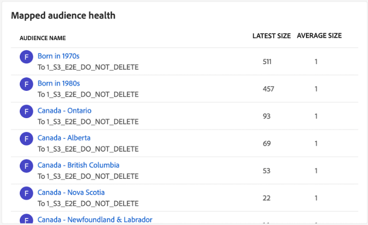

# [!UICONTROL 目標] 儀表板

Adobe Experience Platform用戶介面(UI)提供了一個儀表板，您可以通過該儀表板查看有關組織活動目標的重要資訊，這些資訊在每日快照中捕獲。 本指南概述了如何訪問和使用UI中的目標儀表板，並提供了有關儀表板中顯示的度量的詳細資訊。

有關目的地的概述，以及Experience Platform內所有可用目的地的目錄，請訪問 [目標文檔](../../destinations/home.md)。

## [!UICONTROL 目標] 儀表板資料 {#destinations-dashboard-data}

「目標」控制面板顯示您的組織在Experience Platform中啟用的目標的快照。 快照中的資料與拍攝快照時在特定時間點顯示的資料完全相同。 換句話說，快照不是資料的近似值或示例，目標儀表板不會即時更新。

>[!NOTE]
>
>自拍攝快照以來對資料所做的任何更改或更新不會反映在儀表板中，直到拍攝下一個快照。

## 瀏覽 [!UICONTROL 目標] 儀表板 {#explore}

要導航到平台UI中的目標儀表板，請選擇 **[!UICONTROL 目標]** 在左滑軌中，選擇 **[!UICONTROL 概述]** 頁籤。

最近快照的日期和時間顯示在 [!UICONTROL 概述] 目標下拉清單旁邊。 截至該日期和時間，所有小部件資料都準確。 快照的時間戳以UTC提供；它不在單個用戶或組織的時區中。

>[!NOTE]
>
>如果您的組織是新Experience Platform的，並且尚沒有活動目標，則「目標」控制面板和 [!UICONTROL 概述] 頁籤不可見。 而是選擇 [!UICONTROL 目標] 從左側導航顯示 [!UICONTROL 目錄] 頁籤。 瞭解有關 [!UICONTROL 目錄] ，請參閱 [[!UICONTROL 目標] 工作區指南](../../destinations/ui/destinations-workspace.md)。

### 修改 [!UICONTROL 目標] 儀表板 {#modify}

選擇 **[!UICONTROL 修改儀表板]** 更改目標儀表板的外觀。 這使您能夠從儀表板中移動、添加和刪除小部件以及訪問小部件庫。 在小部件庫中，您可以瀏覽可用小部件並為組織建立自定義小部件。

請參閱 [修改儀表板](../customize/modify.md) 和 [構件庫概述](../customize/widget-library.md) 文檔以瞭解詳細資訊。

### 添加小部件 {#add-widget}

選擇 **[!UICONTROL 添加小部件]** 導航到小部件庫，並查看要添加到儀表板的可用小部件的清單。

從小部件庫中，可以瀏覽選擇的標準小部件和自定義段小部件。 有關如何添加小部件的資訊，請參閱小部件庫文檔，瞭解如何 [添加小部件](../customize/widget-library.md#add-widgets)。

## 標準小部件 {#standard-widgets}

Adobe提供了多個標準小部件，您可以使用這些部件來可視化與目標相關的不同度量，並評估可用於資料分析的段的完整性。 您也可以使用 [!UICONTROL 小部件庫]。 要瞭解有關建立自定義小部件的詳細資訊，請首先閱讀 [小部件庫概述](../customize/widget-library.md)。

### 先決條件 {#prerequisites}

在繼續介紹標準小部件的說明之前，請確保您熟悉在文檔中使用的下列關鍵術語的定義：

* **段：** 分段為 **一組規則** 包括屬性和事件資料，這些屬性和事件資料將多個配置檔案限定為受眾。
* **觀眾**:觀眾是 **配置檔案集** 符合段定義的條件。
* **映射/映射**:資料映射是將源資料欄位映射到目標中相關目標欄位的過程。
* **身份**:標識是唯一表示單個客戶的標識符，如Cookie ID、設備ID或電子郵件ID。
* **激活**:激活是用戶將段或配置檔案映射到目標(如OracleEloca、Google或SalesforceMarketing Cloud)所採取的操作。

要瞭解有關每個可用標準小部件的詳細資訊，請從以下清單中選擇小部件的名稱：

* [[!UICONTROL 最常用的目的地]](#most-used-destinations)
* [[!UICONTROL 最近建立的目的地]](#recently-created-destinations)
* [[!UICONTROL 最近啟動的區段]](#recently-activated-segments)
* [[!UICONTROL 最近啟動的區段 (按目的地)]](#recently-activated-segments-by-destination)
* [[!UICONTROL 對象規模趨勢]](#audience-size-trend)
* [[!UICONTROL 按身份識別的未對應區段]](#unmapped-segments-by-identity)
* [[!UICONTROL 按身分識別的未對應區段]](#mapped-segments-by-identity)
* [[!UICONTROL 常見對象]](#common-audiences)
* [[!UICONTROL 映射的受眾]](#mapped-audiences)
* [[!UICONTROL 對應的對象健康情況]](#mapped-audience-health)
* [[!UICONTROL 目的地計數]](#destinations-count)
* [[!UICONTROL 目標狀態]](#destination-status)
* [[!UICONTROL 按目標平台列出的活動目標]](#active-destinations-by-destination-platform)
* [[!UICONTROL 已激活所有目標的受眾]](#activated-audiences-across-all-destinations)
* [[!UICONTROL 激活的觀眾]](#activated-audiences)

### [!UICONTROL 最常用的目的地] {#most-used-destinations}

>[!CONTEXTUALHELP]
>id="platform_dashboards_destinations_mostuseddestinations"
>title="最常用的目的地"
>abstract="此 Widget 會依據對應的區段數顯示您的組織最活躍的目的地。這些數字在上次快照時是準確的。此排名會提供對目前使用最多的目的地的分析，同時會強調可能未受到充分利用的目的地。"

的 **[!UICONTROL 最常用的目標]** 小部件按映射的段數顯示組織的頂級目標，截止到上次快照。 此排名可以深入瞭解哪些目標正被利用，同時可能還顯示那些可能未充分利用的目標。

例如，如果您昨天配置了目標，但尚未將任何段映射到該目標，則您將能夠看到該目標當前未充分利用。

在段計數列中顯示的映射段數截至最後一個每日快照時是準確的。 將新段映射到目標將不會更新計數，直到拍攝下一個快照。

從小部件上顯示的清單中選擇目標名稱將帶您轉到連結自 **[!UICONTROL 瀏覽]** 頁籤。 也可以選擇 **[!UICONTROL 全部查看]** 導航至 **[!UICONTROL 瀏覽]** 頁籤，然後選擇目標名稱以查看其詳細資訊。

### [!UICONTROL 最近建立的目的地] {#recently-created-destinations}

>[!CONTEXTUALHELP]
>id="platform_dashboards_destinations_recentlycreateddestinations"
>title="最近建立的目的地"
>abstract="此 Widget 會顯示您組織內最近設定的目的地清單。"

的 **[!UICONTROL 最近建立的目標]** 構件使您可以查看組織最近配置的目標的清單。

顯示的建立日期與最後一個每日快照準確無誤。 換句話說，如果建立新目標，則在拍攝下一個快照之前，它不會出現在清單中。

從小部件上顯示的清單中選擇目標名稱將帶您轉到連結自 **[!UICONTROL 瀏覽]** 頁籤。 也可以選擇 **[!UICONTROL 全部查看]** 導航至 **[!UICONTROL 瀏覽]** 頁籤，然後選擇目標名稱以查看其詳細資訊。

要瞭解有關如何配置特定目標類型的詳細資訊，請訪問 [目標文檔](../../destinations/home.md)。

### [!UICONTROL 最近啟動的區段] {#recently-activated-segments}

>[!CONTEXTUALHELP]
>id="platform_dashboards_destinations_recentlyactivatedsegments"
>title="最近啟動的區段"
>abstract="此 Widget 會提供最近對應至目的地的區段清單。此清單會提供系統中正在使用的區段和目的地的快照，能有助於對任何錯誤的對應進行移難排解。"

的 **[!UICONTROL 最近激活的段]** 構件提供最近映射到目標的段的清單。 此清單會提供系統中正在使用的區段和目的地的快照，能有助於對任何錯誤的對應進行移難排解。

顯示的更新日期顯示段上次激活到目標的時間，並且與上次的每日快照準確。 換句話說，如果將段激活到目標，則更新的日期在拍攝下一個快照之後才會更改。

從小部件上顯示的清單中選擇段的名稱將帶您進入段詳細資訊。 也可以選擇 **[!UICONTROL 全部查看]** 導航到段瀏覽頁籤，然後選擇段名稱以查看其詳細資訊。

有關使用Experience Platform中的段的詳細資訊，請參閱 [分段服務概述](../../segmentation/home.md)。

### [!UICONTROL 最近啟動的區段 (按目的地)] {#recently-activated-segments-by-destination}

>[!CONTEXTUALHELP]
>id="platform_dashboards_destinations_recentlyactivatedsegmentsbydestination"
>title="最近啟動的區段 (按目的地)"
>abstract="此 Widget 會根據在概觀下拉式清單中選擇的目的地以遞減的方式顯示最近啟動的前五個區段。"

的 **[!UICONTROL 按目標最近激活的段]** 小部件根據在概述下拉清單中選擇的目標按降序顯示前五個最近激活的段。 與 [!UICONTROL 最近激活的段] 小部件，但顯示的資料 **僅** 應用於所選目標。

此小部件包含兩個度量：段名稱和段上次激活到目標的日期。 顯示的資料自上次的每日快照時起是正確的。

通過從顯示的清單中選擇段名稱，可以查看段的詳細資訊。

請參閱的先決條件部分 [所用術語的定義](#prerequisites) 中。

### [!UICONTROL 對象規模趨勢] {#audience-size-trend}

>[!CONTEXTUALHELP]
>id="platform_dashboards_destinations_audiencesizetrend"
>title="對象規模趨勢"
>abstract="此 Widget 會說明區段中包含的設定檔數量，這會每天傳送到目的地帳戶。第一個下拉式選單會調整對象趨勢的時段。第二個 Widget 下拉式選單會選取要分析的區段。可從概觀的下拉式清單中選擇目的地。"

的 **[!UICONTROL 受眾規模趨勢]** 小部件描述已映射到該目標帳戶的段的配置檔案計數在一段時間內的關係。 構件使用線形圖來說明段中包含的每天發送到目標帳戶的配置檔案數。

過去30天、90天或12個月的受眾趨勢時段可以使用第一個下拉菜單進行調整。

第二個下拉菜單列出了每個可發送到儀表板頂部所選目標帳戶的可用段。

的 **[!UICONTROL 受眾規模趨勢]** 小部件提供 [!UICONTROL 字幕] 按鈕。 選擇 **[!UICONTROL 字幕]** 的子菜單。 機器學習模型通過分析圖表和分段資料自動生成描述關鍵趨勢和重要事件的字幕。

### [!UICONTROL 按身份識別的未對應區段] {#unmapped-segments-by-identity}

>[!CONTEXTUALHELP]
>id="platform_dashboards_destinations_unmappedsegmentsbyidentity"
>title="按身份識別的未對應區段"
>abstract="此 Widget 會針對特定目的地和身分識別列出按遞減的身分識別計數排名的前五個&#x200B;**未對應**&#x200B;區段。Widget 下拉式清單中列出的篩選器 ID 會根據在概觀頁面頂部選取的目的地帳戶而變更。"

的 **[!UICONTROL 按標識未映射的段]** 小部件列出前五 **未映射** 按給定目標和標識的降序標識計數排序的段。 它突出顯示基於所選ID映射到所選目標帳戶最有益的段。

目標ID下拉清單將篩選可用段。  下拉式清單中列出的篩選器 ID 會根據在概觀頁面頂部選取的目的地帳戶而變更。

標識列計算段內可映射到構件ID下拉清單中選擇的ID的源ID數。

請參閱的先決條件部分 [所用術語的定義](#prerequisites) 中。

### [!UICONTROL 按身分識別的未對應區段] {#mapped-segments-by-identity}

>[!CONTEXTUALHELP]
>id="platform_dashboards_destinations_mappedsegmentsbyidentity"
>title="按身分識別的未對應區段"
>abstract="此 Widget 會提供前五個&#x200B;**對應**&#x200B;區段清單。該清單會根據區段中包含的來源 ID 的數量從高到低排序。要計算的目的地 ID 會從 Widget 標題下方的下拉式選單中選取。此 Widget 下拉式清單中可用的目的地 ID 會依據在概觀儀表板頂部選擇的目的地而定。"

此 Widget 會提供前五個&#x200B;**對應**&#x200B;區段清單。該清單會根據區段中包含的來源 ID 的數量從高到低排序。要計算的目的地 ID 會從 Widget 標題下方的下拉式選單中選取。從構件中的下拉清單中可用的目標ID將根據在概述儀表板頂部選擇的目標帳戶篩選器進行更改。

的 **[!UICONTROL 按標識映射的段]** 小部件一覽表就會突出顯示，成功鎖定所選目標內市場活動的配置檔案機會的可能性。 有效的目標市場活動不取決於發送到目標的配置檔案數量，而取決於可能與目標ID匹配以提供有用且可操作資料的源ID數量。

### 常見對象 {#common-audiences}

>[!CONTEXTUALHELP]
>id="platform_dashboards_destinations_commonaudiences"
>title="常見對象"
>abstract="此 Widget 會提供在頁面頂部選擇的目的地帳戶中啟動的前五個區段的清單，以及在 Widget 下拉式清單中選取的目的地。區段清單會根據啟動的時間排序。啟動時間最近的區段會顯示在頂部。"

的 **[!UICONTROL 普通觀眾]** 小部件提供了在頁面頂部選擇的目標帳戶中激活的前五個段以及在小部件下拉清單中選擇的目標的清單。 區段清單會根據啟動的時間排序。啟動時間最近的區段會顯示在頂部。

的 [!UICONTROL 受眾大小] 列提供每個列出段的總配置檔案計數。

### 映射的受眾 {#mapped-audiences}

的 [!UICONTROL 映射的受眾] 小部件顯示可激活到頁面頂部所選目標的映射受眾總數。

選擇 **[!UICONTROL 段]** 導航到段控制板 [!UICONTROL 瀏覽] 頁籤。 此工作區顯示組織的所有段定義的清單。

### 對應的對象健康情況 {#mapped-audience-health}

>[!CONTEXTUALHELP]
>id="platform_dashboards_destinations_mappedaudiencehealth"
>title="對應的對象健康情況"
>abstract="此 Widget 會提供包含最多 20 個對應區段的清單，這些區段的總設定檔計數和對應至該目的地的 30 天平均對象規模至少有一個標準差的因素偏差。這會為過去 30 天內對象規模和平均值的差異提供計算量度。對象規模的排序為由高至低。"

該小部件提供一個清單，列出多達20個映射的段，其截至最後一個每日快照，其配置檔案總數與映射到該目標的30天平均受眾大小的至少一個標準偏差因子。

簡而言之，它提供了計算過去30天中觀眾人數的平均分佈的指標。 它比較了今天的受眾規模是否超出了過去30天資料中所見的歷史標準差。

系統中的所有觀眾大小按高到低的觀眾大小排序，如 [!UICONTROL 最新大小] 的雙曲餘切值。

如果您的段映射配置檔案計數與過去30天內的平均映射配置檔案大小不在一個標準偏差範圍之內，則表明系統中存在異常，應對其進行調查。

如果 [!UICONTROL 映射的受眾健康] 小部件偏差較大，您應參考受眾大小趨勢圖並查找異常段。 這一趨勢可以進一步瞭解您所在細分市場的健康狀況。

>[!NOTE]
>
>映射的受眾健康小部件的預設大小可能會妨礙表資訊。 請修改小部件的大小，以提高映射的段名稱和列標題的可讀性。 請參閱修改儀表板文檔以獲取有關 [如何調整小部件的大小](../customize/modify.md)。

### [!UICONTROL 目的地計數] {#destinations-count}

>[!CONTEXTUALHELP]
>id="platform_dashboards_destinations_destinationscount"
>title="目的地計數"
>abstract="此 Widget 會提供可以在系統內啟動和傳遞對象的可用端點總數。此數字包括使用中和非使用中的目的地。"

的 [!UICONTROL 目標計數] 構件提供了可在系統中激活和傳遞受眾的可用終結點總數。 此數字包括使用中和非使用中的目的地。

在總計數以下，選擇 **[!UICONTROL 目標]** 導航至目標瀏覽頁籤。 此頁列出了您已建立與迄今為止的連接的所有目標。

### [!UICONTROL 目標狀態] {#destination-status}

的 [!UICONTROL 目標狀態] 小部件將啟用的目標的總數顯示為單個度量，並使用環形圖來說明啟用和禁用的目標之間的比例差異。

當游標懸停在圓形圖的相應部分上時，對話框中顯示啟用或禁用目標的單個計數。

### [!UICONTROL 按目標平台列出的活動目標] {#active-destinations-by-destination-platform}

該小部件提供一個兩清單，用於顯示活動目標平台的清單以及每個目標平台的活動目標總數。 目標平台清單從高到低排序。

### [!UICONTROL 已激活所有目標的受眾] {#activated-audiences-across-all-destinations}

的 [!UICONTROL 已激活所有目標的受眾] 構件提供單個度量中所有目標上激活的受眾總數。

>[!NOTE]
>
>此小部件顯示受眾數，而不顯示段數。

此數字對於最近的快照是準確的。

選擇 **[!UICONTROL 觀眾]** 導航至目標 [!UICONTROL 瀏覽] 頁籤。 此頁提供所有已啟用的目標和各種相關度量的清單。 有關 [[!UICONTROL 瀏覽] 頁籤](../../destinations/ui/destinations-workspace.md#browse)。

請參閱的先決條件部分 [所用術語的定義](#prerequisites) 中。

### [!UICONTROL 激活的觀眾] {#activated-audiences}

此小部件提供單個度量，以確定激活到目標的受眾總數。

選擇 **[!UICONTROL 觀眾]** 導航至目標儀表板的詳細資訊頁。 的 [!UICONTROL 激活資料] 頁籤顯示已映射到目標的段的清單，包括其起始日期和終止日期（如果適用），以及用於資料導出的其他相關資訊，如導出類型、計畫和頻率。 要查看特定段的詳細資訊，請從清單中選擇其名稱。

此小部件可幫助您根據一覽式激活的受眾數量瞭解目標的價值。 它還提供了對更詳細資訊的輕鬆訪問，以便進一步分析。

請參閱的先決條件部分 [所用術語的定義](#prerequisites) 中。

## 後續步驟

現在，通過遵循本文檔，您應該能夠找到目標儀表板並瞭解可用小部件中顯示的度量。 要瞭解有關使用Experience Platform中的目標的詳細資訊，請參閱 [目標文檔](../../destinations/home.md)。
