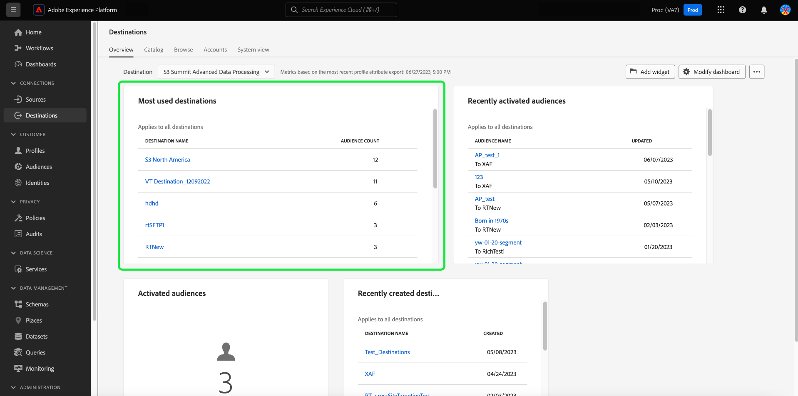

# [!UICONTROL 目標] 儀表板

Adobe Experience Platform用戶介面(UI)提供了一個儀表板，您可以通過該儀表板查看有關組織活動目標的重要資訊，這些資訊在每日快照中捕獲。 本指南概述了如何訪問和使用UI中的目標儀表板，並提供了有關儀表板中顯示的度量的詳細資訊。

有關目的地的概述，以及Experience Platform內所有可用目的地的目錄，請訪問 [目標文檔](../../destinations/home.md)。

## [!UICONTROL 目標] 儀表板資料 {#destinations-dashboard-data}

的 [!UICONTROL 目標] 儀表板顯示您的組織在Experience Platform中啟用的目標的快照。 快照中的資料與拍攝快照時在特定時間點顯示的資料完全相同。 換句話說，快照不是資料的近似值或示例，目標儀表板不會即時更新。

>[!NOTE]
>
>自拍攝快照以來對資料所做的任何更改或更新不會反映在儀表板中，直到拍攝下一個快照。

## 瀏覽目標儀表板

要導航到平台UI中的目標儀表板，請選擇 **[!UICONTROL 目標]** 在左滑軌中，選擇 **[!UICONTROL 概述]** 頁籤。

>[!NOTE]
>
>如果您的組織是新Experience Platform的，且尚未有活動目標， [!UICONTROL 目標] 儀表板和 [!UICONTROL 概述] 頁籤不可見。 而是選擇 [!UICONTROL 目標] 從左側導航顯示 [!UICONTROL 目錄] 頁籤。 瞭解有關 [!UICONTROL 目錄] ，請參閱 [[!UICONTROL 目標] 工作區指南](../../destinations/ui/destinations-workspace.md)。

### 修改目標儀表板

通過選擇 **[!UICONTROL 修改儀表板]**。 這使您能夠從儀表板中移動、添加和刪除小部件，以及訪問 **[!UICONTROL 小部件庫]** 瀏覽可用小部件並為您的組織建立自定義小部件。

請參閱 [修改儀表板](../customize/modify.md) 和 [構件庫概述](../customize/widget-library.md) 文檔以瞭解詳細資訊。

## 標準小部件

Adobe提供了多個標準小部件，您可以使用這些部件來可視化與目標相關的不同度量。 您也可以使用 [!UICONTROL 小部件庫]。 要瞭解有關建立自定義小部件的詳細資訊，請首先閱讀 [構件庫概述](../customize/widget-library.md)。

要瞭解有關每個可用標準小部件的詳細資訊，請從以下清單中選擇小部件的名稱：

* [[!UICONTROL 最常用的目標]](#most-used-destinations)
* [[!UICONTROL 最近建立的目標]](#recently-created-destinations)
* [[!UICONTROL 最近激活的段]](#recently-activated-segments)

### [!UICONTROL 最常用的目標] {#most-used-destinations}

的 **[!UICONTROL 最常用的目標]** 小部件按映射的段數顯示組織的頂級目標，截止到上次快照。 此排名可以深入瞭解哪些目標正被利用，同時可能還顯示那些可能未充分利用的目標。

例如，如果您昨天配置了目標，但尚未將任何段映射到該目標，則您將能夠看到該目標當前未充分利用。

在段計數列中顯示的映射段數截至最後一個每日快照時是準確的。 將新段映射到目標將不會更新計數，直到拍攝下一個快照。

從小部件上顯示的清單中選擇目標名稱將帶您轉到連結自 **[!UICONTROL 瀏覽]** 頁籤。 也可以選擇 **[!UICONTROL 全部查看]** 導航至 **[!UICONTROL 瀏覽]** 頁籤，然後選擇目標名稱以查看其詳細資訊。

### [!UICONTROL 最近建立的目標] {#recently-created-destinations}

的 **[!UICONTROL 最近建立的目標]** 構件使您可以查看組織最近配置的目標的清單。

顯示的建立日期與最後一個每日快照準確無誤。 換句話說，如果建立新目標，則在拍攝下一個快照之前，它不會出現在清單中。

從小部件上顯示的清單中選擇目標名稱將帶您轉到連結自 **[!UICONTROL 瀏覽]** 頁籤。 也可以選擇 **[!UICONTROL 全部查看]** 導航至 **[!UICONTROL 瀏覽]** 頁籤，然後選擇目標名稱以查看其詳細資訊。

要瞭解有關如何配置特定目標類型的詳細資訊，請訪問 [目標文檔](../../destinations/home.md)。

### [!UICONTROL 最近激活的段] {#recently-activated-segments}

的 **[!UICONTROL 最近激活的段]** 構件提供最近映射到目標的段的清單。 此清單提供了系統中正在使用哪些段和目標的快照，並有助於排除任何錯誤映射。

顯示的更新日期顯示段上次激活到目標的時間，並且與上次的每日快照準確。 換句話說，如果將段激活到目標，則更新的日期在拍攝下一個快照之後才會更改。

從小部件上顯示的清單中選擇段的名稱將帶您進入段詳細資訊。 也可以選擇 **[!UICONTROL 全部查看]** 導航到段瀏覽頁籤，然後選擇段名稱以查看其詳細資訊。

有關使用Experience Platform中段的詳細資訊，請首先閱讀 [分段服務概述](../../segmentation/home.md)。

## 後續步驟

現在，通過遵循本文檔，您應該能夠找到目標儀表板並瞭解可用小部件中顯示的度量。 要瞭解有關使用Experience Platform中的目標的詳細資訊，請參閱 [目標文檔](../../destinations/home.md)。
