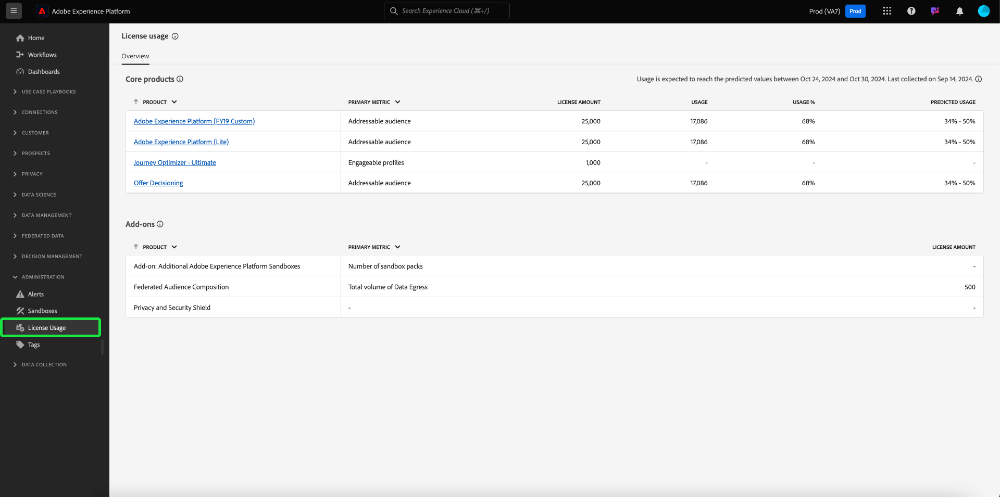

# 授權使用情況儀表板 {#license-usage-dashboard}

Adobe Experience Platform使用者介面(UI)提供了一個儀表板，您可以通過該儀表板檢視有關您組織的授權使用的重要資訊，如每日快照期間所擷取。 本指南概述如何存取和使用UI中的授權使用儀表板，並提供有關儀表板中顯示的視覺效果的更多資訊。

如需Platform UI的一般概覽，請造訪 [Experience Platform UI指南](../../landing/ui-guide.md).

## 授權使用情況儀表板資料

授權使用儀表板會顯示貴組織授權相關資料的快照，以供Experience Platform。 儀表板中的資料與快照拍攝時的特定時間點顯示的資料完全相同。 換句話說，快照不是資料的近似或樣本，而且圖示板並未即時更新。

>[!NOTE]
>
>自拍攝快照以來對資料所做的任何變更或更新都不會反映在儀表板中，直到拍攝下一個快照為止。

## 探索授權使用儀表板

若要導覽至Platform UI中的授權使用儀表板，請選取「 」 **[!UICONTROL 授權使用情況]** 在左側邊欄中。 如此將可開啟 **[!UICONTROL 概觀]** 標籤顯示控制面板。

>[!NOTE]
>
>授權使用儀表板預設為未啟用。 必須授與使用者「檢視授權使用儀表板」許可權，才能檢視儀表板。 如需授與存取許可權以檢視授權使用儀表板的步驟，請參閱 [儀表板許可權指南](../permissions.md).

### 選取沙箱

若要選擇要在儀表板中檢視的沙箱，請選取 [!UICONTROL 生產] 或 [!UICONTROL 開發]. 沙箱名稱旁的選項按鈕會指出選取的沙箱。

相同型別的所有沙箱的沙箱消耗報告都是累積的。 換言之，選取 [!UICONTROL 生產] 或 [!UICONTROL 開發] 分別提供所有生產或開發沙箱的使用量報表。

>[!WARNING]
>
>必須在沙箱層級指定檢視授權使用儀表板的許可權。 這表示檢視儀表板的許可權必須新增到每個個別沙箱。 此限制將在未來版本中解決。 同時，提供下列因應措施：
>
>1. 在Adobe Admin Console中建立產品設定檔。
>2. 在沙箱類別的許可權下，新增您想在授權使用儀表板中檢視的所有沙箱。
>3. 在「使用者儀表板許可權」類別下方，新增「檢視授權使用儀表板」許可權。

### 選取日期範圍

選取沙箱後，您可以使用日期範圍下拉式清單來選取要在控制面板中顯示的時段。 有多個可用選項，包括過去30天的預設值。

您也可以選取 **[!UICONTROL 自訂日期]** 以選擇顯示的時段。

## Widget

授權使用儀表板由Widget組成，其中顯示唯讀量度，提供關於您組織授權使用的重要資訊。 可見的量度取決於您組織的特定授權(請參閱 [可用量度](#available-metrics) 區段以取得詳細資訊)。

每個Widget都會顯示折線圖，將貴組織的實際數量與貴組織授權的總可用數量進行比較，並提供使用總數的百分比。

## 可用量度

授權使用儀表板會報告四個關鍵量度，後續版本中會新增更多量度。 可用的量度包括：

* [!UICONTROL 可定址的受眾]
* [!UICONTROL 平均設定檔豐富度]
* [!UICONTROL 每個分段掃描的資料比率]
* [!UICONTROL 使用的儲存空間總數]

這些量度的可用性，以及每個量度的特定定義，會因貴組織已購買的授權而有所不同。 如需各個量度的詳細定義，請參閱適當的產品說明檔案：

| 授權 | 產品說明 |
|---|---|
| <ul><li>Adobe Experience Platform：OD LITE</li><li>Adobe Experience Platform：OD STANDARD</li><li>Adobe Experience Platform：OD HEAVY</li></ul> | [Adobe Experience Platform](https://helpx.adobe.com/legal/product-descriptions/adobe-experience-platform.html) |
| <ul><li>Adobe Experience Platform：OD</li></ul> | [Experience Platform、應用程式服務和智慧型服務](https://helpx.adobe.com/legal/product-descriptions/exp-platform-app-svcs.html) |
| <ul><li>RT客戶資料平台：OD</li><li>RT CUSTOMER DATA PLATFORM：OD PRFL至10M</li><li>RT客戶資料平台：OD PRFL至50M</li></ul> | [Adobe Real-time Customer Data Platform](https://helpx.adobe.com/jp/legal/product-descriptions/real-time-customer-data-platform.html) |
| <ul><li>AEP：OD啟用</li><li>AEP：OD啟用PRFL至10M</li><li>AEP：OD啟用PRFL，最高50米</li></ul> | [Adobe Experience Platform啟用](https://helpx.adobe.com/legal/product-descriptions/adobe-experience-platform0.html) |
| <ul><li>AEP：OD INTELLIGENCE</li></ul> | [Adobe Experience Platform Intelligence](https://helpx.adobe.com/legal/product-descriptions/adobe-experience-platform-intelligence---product-description.html) |
| <ul><li>Journey Optimizer SELECT：OD</li><li>Journey Optimizer PRIME：OD</li><li>Journey Optimizer ULTIMATE：OD</li><li>UNP AJO PRIME入門者：OD</li><li>UNP AJO ULTIMATE STARTER：OD</li><li>UNP Real-Time CDP：OD設定檔協調流程</li></ul> | [Adobe Journey Optimizer](https://helpx.adobe.com/tw/legal/product-descriptions/adobe-journey-optimizer.html) |

>[!WARNING]
>
>授權使用儀表板只會報告貴組織已布建的最新授權。 如果貴組織布建的最新授權未出現在上表中的話，授權使用儀表板可能無法正確顯示。 計畫在未來的版本中，支援單一組織中的其他授權和多個授權。

## 後續步驟

閱讀本檔案後，您可以找到授權使用儀表板，並選取要檢視的沙箱。 您也可以根據貴組織已購買的授權，找到更多有關貴組織可用量度的資訊。

若要進一步瞭解Experience Platform UI中可用的其他功能，請參閱 [Platform UI指南](../../landing/ui-guide.md).
