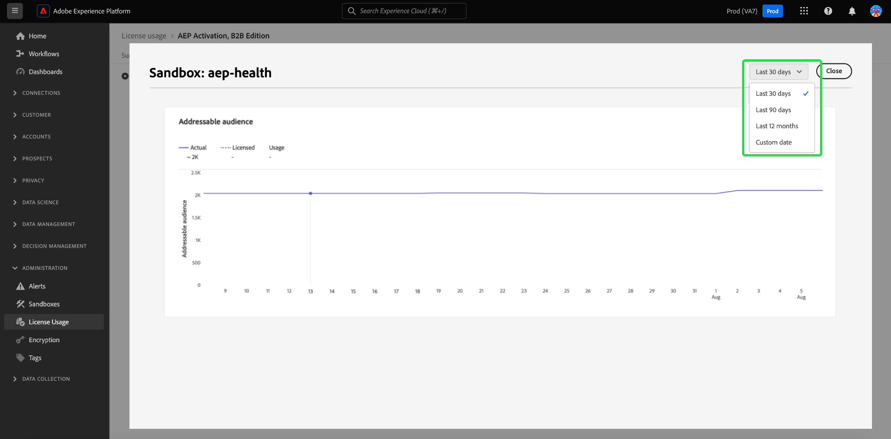

# 授權使用量儀表板 {#license-usage-dashboard}

>[!CONTEXTUALHELP]
>id="testy-mctestface"
>title="不應該顯示的測試對話框"
>abstract="有人在 {date} 檢視物件 {name}。"

>[!CONTEXTUALHELP]
>id="platform_dashboards_licenseusage_core"
>title="核心產品表"
>abstract="表格中列出的核心產品有自己的量度、使用情況追蹤和沙箱層級的鑽研式視圖。這些核心產品提供關鍵量度以利追蹤，而且任何附加元件皆包含在這些量度中。"

>[!CONTEXTUALHELP]
>id="platform_dashboards_licenseusage_addons"
>title="附加元件表"
>abstract="附加元件表列出授權數量與核心產品所支援的量度結合之產品。這些附加元件沒有個別的量度，但能增強與其相關之核心產品的使用情況追蹤。"

>[!CONTEXTUALHELP]
>id="platform_dashboards_licenseUsage"
>title="授權使用量儀表板"
>abstract="授權使用量儀表板讓您可深入了解您已購買的 Adobe Experience Platform 產品。儀表板概觀會顯示您產品的主要量度，包括每個主要量度的使用量以及您的合約授權數量。詳細資料工作區顯示特定沙箱中每個產品的量度劃分。"
>additional-url="https://experienceleague.adobe.com/zh-hant/docs/experience-platform/data-lifecycle/ui/dataset-expiration" text="自動化資料集期限"
>additional-url="https://experienceleague.adobe.com/zh-hant/docs/experience-platform/profile/pseudonymous-profiles" text="匿名輪廓資料期限"

>[!CONTEXTUALHELP]
>id="platform_licenseusage"
>title="授權使用量儀表板"
>abstract="授權使用量儀表板讓您可深入了解您已購買的 Adobe Experience Platform 產品。儀表板概觀會顯示您產品的主要量度，包括每個主要量度的使用量以及您的合約授權數量。詳細資料工作區顯示特定沙箱中每個產品的量度劃分。"
>additional-url="https://experienceleague.adobe.com/zh-hant/docs/experience-platform/data-lifecycle/ui/dataset-expiration" text="自動化資料集期限"
>additional-url="https://experienceleague.adobe.com/zh-hant/docs/experience-platform/profile/pseudonymous-profiles" text="匿名輪廓資料期限"

>[!CONTEXTUALHELP]
>id="platform_dashboards_licenseusage_predictedusage_computehours"
>title="預測的運算小時數"
>abstract="您的使用量可能會達到已授權數量。若要評估或減少運算小時數，請導覽至「查詢 > 記錄」以查看查詢歷史記錄。如果您沒有「查詢」工作區的存取權限，請聯絡您的管理員。"

您可以透過Adobe Experience Platform [!UICONTROL 授權使用情況]儀表板，檢視貴組織授權使用情況的重要資訊。 此處顯示的資訊是在Platform執行個體的每日快照期間擷取。

授權使用報告提供授權使用量度之高度精細度。 控制面板提供每個已購買產品（及相關附加元件）的使用量度、所有生產或開發沙箱中量度的整合使用量，以及特定沙箱的使用量度。 以下Experience Platform應用程式可透過使用量度進行追蹤：Real-time Customer Data Platform、Adobe Journey Optimizer和Customer Journey Analytics。

本指南概述如何存取和使用UI中的授權使用儀表板，並提供有關儀表板中顯示的視覺效果的更多資訊。

如需Platform UI的一般概觀，請參閱[Experience PlatformUI指南](../../landing/ui-guide.md)。

## [!UICONTROL 授權使用情況]儀表板資料

[!UICONTROL 授權使用情況]儀表板會顯示您已購買的所有Experience Platform產品清單，以及這些產品的任何附加元件。 在此控制面板中，您可以找到組織授權相關資料的快照，以便Experience Platform任何關聯的沙箱。

此儀表板中的資料會顯示在拍攝快照的特定時間點上。 換句話說，快照不是資料的近似或樣本，而且圖示板並未即時更新。

>[!NOTE]
>
>自拍攝快照以來對資料所做的任何變更或更新都不會反映在儀表板中，直到拍攝下一個快照為止。

## 探索授權使用儀表板 {#explore}

若要導覽至Platform UI中的授權使用儀表板，請在左側邊欄中選取&#x200B;**[!UICONTROL 授權使用]**。 [!UICONTROL 總覽]標籤隨即開啟，顯示可用產品的清單。

>[!NOTE]
>
>授權使用儀表板預設為未啟用。 必須授予使用者「檢視授權使用儀表板」許可權才能檢視儀表板。 如需授與存取許可權以檢視授權使用儀表板的步驟，請參閱[儀表板許可權指南](../permissions.md)。

![授權使用儀表板的[概觀]索引標籤，在左側導覽側邊欄中反白顯示[授權使用]。](../images/license-usage/dashboard-overview.png)

## [!UICONTROL 概觀]索引標籤 {#overview-tab}

[!UICONTROL 授權使用情況]儀表板顯示兩個不同的表格： **核心產品**&#x200B;和&#x200B;**附加元件**。

- **[!UICONTROL 核心產品]表格**：此表格列出貴組織授權的主要Adobe Experience Platform產品。 每個核心產品在沙箱層級都有自己的量度、使用追蹤和鑽研檢視。 這些核心產品提供關鍵量度以利追蹤，而且任何附加元件皆包含在這些量度中。

- **[!UICONTROL 附加元件]資料表**：此資料表列出其授權金額與核心產品支援的量度結合的其他產品。 附加元件沒有獨立的量度，但可加強對相關核心產品的使用追蹤。

| 欄名稱 | 說明 |
|---|---|
| **[!UICONTROL 產品]** | 貴組織授權的Adobe解決方案。 |
| **[!UICONTROL 主要量度]** | 該產品中用於追蹤的主要量度。 |
| **[!UICONTROL 授權金額]** | 產品授權合約中同意的主要量度數量上限的合約值。 |
| **[!UICONTROL 使用狀況]** | 您使用的主要量度數量。 此值提供該量度在所有沙箱（生產或開發）中的總使用量。 |
| **[!UICONTROL 使用狀況%]** | 根據您的授權數量使用的主要量度百分比。 |
| **[!UICONTROL 預測使用量]** | 根據您的授權數量，主要量度的預測使用百分比。 |

>[!NOTE]
>
>附加元件的授權金額包含在核心產品的[!UICONTROL 授權金額]中。 例如，如果您購買一包5個沙箱作為附加元件，則金額會加入基本產品的金額中。 附加元件表格顯示附加元件特定的[!UICONTROL 授權金額]，但實際使用量會透過基礎產品追蹤。

這些表格會指出每個產品的主要量度，因為每個產品都可以追蹤許多量度。

### 預估使用量 {#predicted-usage}

>[!CONTEXTUALHELP]
>id="platform_dashboards_licenseUsage_prediction"
>title="預估使用量"
>abstract="根據過去 6 至 7 個月的使用量進行預估，並於每月 15 日產生預估結果。請注意，授權用量預估是根據過去使用量計算的近似值。您有責任了解組織的實際使用量，並確保使用量不會超過組織獲得 Adobe 授權的範圍。若要減少使用量，您可以針對沙箱和資料集設定資料集期限或匿名輪廓資料期限。"
>additional-url="https://experienceleague.adobe.com/zh-hant/docs/experience-platform/data-lifecycle/ui/dataset-expiration" text="自動化資料集期限"
>additional-url="https://experienceleague.adobe.com/zh-hant/docs/experience-platform/profile/pseudonymous-profiles" text="匿名輪廓資料期限"

>[!CONTEXTUALHELP]
>id="platform_licenseusage_prediction"
>title="預估使用量"
>abstract="根據過去 6 至 7 個月的使用量進行預估，並於每月 15 日產生預估結果。請注意，授權用量預估是根據過去使用量計算的近似值。您有責任了解組織的實際使用量，並確保使用量不會超過組織獲得 Adobe 授權的範圍。若要減少使用量，您可以針對沙箱和資料集設定資料集期限或匿名輪廓資料期限。"
>additional-url="https://experienceleague.adobe.com/zh-hant/docs/experience-platform/data-lifecycle/ui/dataset-expiration" text="自動化資料集期限"
>additional-url="https://experienceleague.adobe.com/zh-hant/docs/experience-platform/profile/pseudonymous-profiles" text="匿名輪廓資料期限"

根據深入的使用預測主動管理並最佳化您的授權資源。 [!UICONTROL 預計使用量]欄可精確地預測您所有購買產品在所有生產及開發沙箱中沙箱層級的未來授權使用量。 此警示功能會根據您截至本日曆月15日的使用情況，提供未來六週內授權使用情況的預測。 預測提供上下限。

>[!IMPORTANT]
>
>預測每月都會重新整理。 重新整理的日期包含在資訊圖示中()在欄標題上方。

若要檢視產品的權益使用摘要，請從[!UICONTROL 核心產品]表格中選取產品。

![產品及預測使用量資料行醒目提示的[!UICONTROL 授權使用量] [!UICONTROL 總覽]。](../images/license-usage/product-predicted-usage.png)

摘要標籤隨即顯示。 您可以使用[!UICONTROL 摘要]和[!UICONTROL 詳細資料]標籤上提供的精細預測，確保做出明智的決策，以有效使用授權。

>[!NOTE]
>
>請注意，授權用量預估是根據過去使用量計算的近似值。您有責任瞭解貴組織的實際使用情況，並確保使用情況不會超出貴組織的Adobe授權範圍。

預計使用量的百分比取決於以下因素：

- 如果上下界限明顯不同，則會顯示為範圍（例如32% - 35%）。
- 如果上下界限幾乎完全相同且不為零，則會顯示為近似值（例如，~34%）。
- 如果上下界限幾乎完全相同且為0，則會顯示為0%。

>[!NOTE]
>
>在此上下文中，「幾乎相同」表示值對於小數點兩位數的統計顯著性（例如，0.342的下限和0.344的上限都會四捨五入為34%）。

預測的使用量功能支援下列量度：

- [!UICONTROL 可定址對象]
- [!UICONTROL 計算時數]
- [!UICONTROL 客戶歷程對象列數]
- [!UICONTROL 資料磁碟區總數]

## [!UICONTROL 摘要]索引標籤 {#summary-tab}

若要檢視更多量度和您產品授權使用方式的詳細深入分析，請從清單中選取產品名稱。 該產品的[!UICONTROL 摘要]檢視即會顯示。 所有可用的量度都會顯示在[!UICONTROL 摘要]索引標籤上。 可用的量度取決於授權產品。 此檢視提供&#x200B;**所有生產或開發沙箱中所有量度的整合檢視**。 生產沙箱和開發沙箱會提供相同等級的分析。

在摘要標籤上，表格包含[!UICONTROL 量度]欄。 這些人類看得懂的說明會指出用於該型別沙箱的所有量度。

### 選取沙箱 {#select-sandbox}

若要變更生產及開發沙箱型別之間的檢視，請選取[!UICONTROL 生產沙箱]或[!UICONTROL 開發沙箱]。 沙箱名稱旁的選項按鈕會指出選取的沙箱型別。

相同型別的所有沙箱的沙箱消耗報告都是累積的。 換句話說，選取[!UICONTROL 生產]或[!UICONTROL 開發]會分別提供所有生產或開發沙箱的耗用報告。

>[!WARNING]
>
>必須在沙箱層級指定檢視授權使用儀表板的許可權。 新增許可權至每個個別沙箱，以在控制面板中檢視它們。 此限制將在未來版本中解決。 同時，提供下列因應措施：
>
>1. 在Adobe Admin Console中建立產品設定檔。
>2. 在沙箱類別的許可權下，新增您想在授權使用儀表板中檢視的所有沙箱。
>3. 在「使用者儀表板許可權」類別下方，新增「檢視授權使用儀表板」許可權。

## [!UICONTROL 詳細資料]標籤 {#details-tab}

若要檢視來自特定沙箱的&#x200B;**特定使用量度**，請瀏覽至[!UICONTROL 詳細資料]標籤。 [!UICONTROL 詳細資料]索引標籤會顯示「生產」或「開發」沙箱中所有可用的沙箱。

您可以從此檢視中選取可檢視該量度的視覺效果。 隨即開啟對話方塊，其中包含該量度的視覺效果。

### 視覺效果 {#visualizations}

每個視覺效果Widget都包含下列方面：

- 追蹤量度隨時間變化的折線圖
- 折線圖的鍵
- 沙箱名稱
- 用於調整折線圖時段的下拉式功能表

折線圖會比較貴組織的使用量數目與貴組織授權可用的使用量總數，並提供使用量總數的百分比。

您可以從下拉式選單中調整分析的回顧期間。 過去30天的預設值

若要選取日期範圍，您可以使用日期範圍下拉式選單來選取要在控制面板中顯示的時段。 有多個可用選項，包括過去30天的預設值。

您也可以選取&#x200B;**[!UICONTROL 自訂日期]**&#x200B;以選擇顯示的時段。

![授權使用儀表板的[概觀]索引標籤中反白顯示自訂日期範圍選項。](../images/license-usage/custom-date-range.png)

## 可用量度 {#available-metrics}

>[!IMPORTANT]
>
>自8月20日起，擁有&#39;[!UICONTROL 平均設定檔豐富度]&#39;和&#39;[!UICONTROL 總儲存空間]&#39;許可權的客戶在授權使用儀表板中看到&#39;[!UICONTROL 總資料量]&#39;。 客戶權益沒有變動，只是追蹤量度的簡化。 [!UICONTROL 總資料量]代表Adobe Experience Platform設定檔服務中可用於參與和個人化工作流程的資料。 此簡化量度改善了個人資料服務使用的管理和測量。 我們鼓勵客戶聯絡其Adobe代表，以進一步釐清這項變更。

授權使用儀表板會報告適用於組織中多個產品的多個不重複量度。 可用的量度包括：

| 量度 | 說明 |
|---|---|
| [!UICONTROL Audience Activation大小] | 一年內任何以檔案為基礎的目的地啟用的設定檔總大小。 注意：這不包括透過串流目的地傳送的設定檔。 |
| [!UICONTROL 可定址對象] | 您的業務受眾權益與消費者受眾權益的總和。 消費者受眾的定義是銷售訂單上識別為「消費者受眾」的個人檔案數。 業務對象定義為銷售訂單上識別為「業務對象」的業務人員個人檔案數。 |
| [!UICONTROL Adhoc Query Service使用者套件] | 一個附加元件，可讓您的授權並行查詢服務使用者權益增加5個額外的並行查詢服務使用者，以及每個套件一個額外的並行執行特定查詢。 可以授權多個其他Ad Hoc Query使用者套件。 |
| [!UICONTROL 平均設定檔豐富度] | **已棄用** — 任何時間點儲存在集線器設定檔服務中的所有生產資料總和，除以授權企業人員設定檔數目的五倍。 [!UICONTROL 平均設定檔豐富度]是共用功能。 |
| [!UICONTROL 可用的CJA資料列] | 可在Analysis中分析的每日平均資料列Customer Journey Analytics。 |
| [!UICONTROL 計算屬性] | 彙總的個人資料行為資料的總數。 彙總的個人資料行為資料是根據體驗事件，這些事件會轉換為個人資料屬性，並可包含在個人資料或企業個人資料中。 |
| [!UICONTROL 消費者對象] | 銷售訂單上識別為「消費者對象」的個人設定檔數目。 |
| [!UICONTROL 資料匯出大小] | 一年內透過資料集啟用傳送的資料量。 |
| [!UICONTROL 資料匯出] | 一年內可匯出至任何非Adobe解決方案（直接或間接）的資料集總大小。 |
| [!UICONTROL 資料湖儲存空間] | Adobe Experience Platform中分析資料存放區的使用數量。 |
| [!UICONTROL 可參與的對象] | 此量度代表可參與設定檔的對象。 可參與的設定檔是代表個人的資訊記錄，並顯示在「設定檔服務」中。 這些記錄是您在過去12個月中，嘗試使用Journey Optimizer的編寫、決策、傳送、實驗或協調功能所使用的設定檔。 |
| [!UICONTROL 相似對象] | 將現有消費者對象模型化，以識別與現有消費者對象類似之個人設定檔所產生的對象計數。 |
| [!UICONTROL 個AMM模型] | 機器學習模型(內建Adobe Mix Modeler)的計數，用於根據您的投資測量和/或預測指定的結果。 |
| [!UICONTROL 沙箱數目] | 存取Adobe Experience Platform隔離資料和作業的任何Adobe隨選服務例項中的邏輯分隔計數。 |
| [!UICONTROL 設定檔豐富度（Pack數目）] | 每個額外設定檔豐富度套件的授權總資料量會增加25 KB。 |
| [!UICONTROL 查詢服務計算時數] | 測量執行批次查詢時，查詢服務引擎讀取、處理和將資料寫入資料湖所花費的時間。 |
| [!UICONTROL 串流區段數Pack] | 當新資料透過串流流進入「細分服務」時，套件會更新個人設定檔的區段會籍。 評估區段會籍時會根據目前人員設定檔屬性和目前事件的值，而不考慮歷史行為。 串流區段是一項共用功能。 |
| [!UICONTROL 資料磁碟區總數] | 參與工作流程中可供Adobe Experience Platform設定檔服務使用的資料總數。 如需瞭解詳細資訊，請參閱關於總資料量](../../landing/license-usage-and-guardrails/total-data-volume.md)的[常見問題。 |

<!-- |  [!UICONTROL Sandbox No of Packs] |  A logical separation within your instance of any Adobe On-demand Service that accesses Adobe Experience Platform isolating data and operations | -->

>[!TIP]
>
>您可以在銷售訂單中檢查授權權利，以計算「儲存空間津貼」等量度。 例如，<ul><li>儲存容量=合約中「授權設定檔」的數量X平均設定檔豐富度</li></ul>

這些量度的可用性，以及每個量度的特定定義，會因貴組織已購買的授權而有所不同。 如需每個量度的詳細定義，請參閱適當的產品說明檔案：

| 授權 | 產品說明 |
| --- | --- |
| <ul><li>Adobe Experience Platform：OD LITE</li><li>Adobe Experience Platform：OD STANDARD</li><li>Adobe Experience Platform：OD HEAVY</li></ul> | [Adobe Experience Platform](https://helpx.adobe.com/legal/product-descriptions/adobe-experience-platform.html) |
| <ul><li>Adobe Experience Platform：OD</li></ul> | [Experience Platform、應用程式服務和智慧型服務](https://helpx.adobe.com/legal/product-descriptions/exp-platform-app-svcs.html) |
| <ul><li>RT客戶資料平台：OD</li><li>RT CUSTOMER DATA PLATFORM：OD PRFL至10M</li><li>RT客戶資料平台：OD PRFL至50M</li></ul> | [Adobe Real-time Customer Data Platform](https://helpx.adobe.com/jp/legal/product-descriptions/real-time-customer-data-platform.html) |
| <ul><li>AEP：OD啟用</li><li>AEP：OD啟用PRFL至10M</li><li>AEP：OD啟用PRFL，最高50米</li></ul> | [Adobe Experience Platform啟用](https://helpx.adobe.com/legal/product-descriptions/adobe-experience-platform0.html) |
| <ul><li>AEP：OD INTELLIGENCE</li></ul> | [Adobe Experience Platform Intelligence](https://helpx.adobe.com/legal/product-descriptions/adobe-experience-platform-intelligence---product-description.html) |
| <ul><li>Journey Optimizer SELECT：OD</li><li>Journey Optimizer PRIME：OD</li><li>Journey Optimizer ULTIMATE：OD</li><li>UNP AJO PRIME簡易版：OD</li><li>UNP AJO ULTIMATE簡易版：OD</li><li>UNP Real-Time CDP：OD設定檔協調流程</li></ul> | [Adobe Journey Optimizer](https://helpx.adobe.com/tw/legal/product-descriptions/adobe-journey-optimizer.html) |

>[!WARNING]
>
>授權使用儀表板只會報告貴組織已布建的最新授權。 如果貴組織布建的最新授權未出現在上表中的話，授權使用儀表板可能無法正確顯示。 計畫在未來的版本中，支援單一組織中的其他授權和多個授權。

## 後續步驟

閱讀本檔案後，您可以找到授權使用儀表板，並檢視每個已購買產品、所有生產或開發沙箱以及特定沙箱的使用量度。 您可以根據貴組織已購買的授權，找到更多有關貴組織可用量度的資訊。

若要進一步瞭解Experience Platform UI中可用的其他功能，請參閱[平台UI指南](../../landing/ui-guide.md)。
