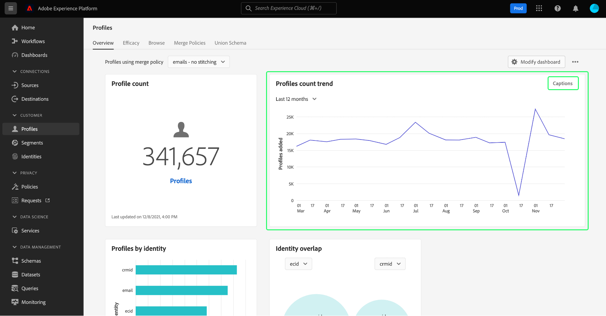

# [!UICONTROL 設定檔] 儀表板

Adobe Experience Platform使用者介面(UI)提供控制面板，供您檢視有關您 [!DNL Real-time Customer Profile] 資料，如在每日快照期間捕獲。 本指南概述如何存取及使用 [!UICONTROL 設定檔] 控制面板，並提供控制面板中所顯示度量的相關資訊。

如需Experience Platform使用者介面中所有設定檔功能的概觀，請造訪 [即時客戶個人檔案UI指南](../../profile/ui/user-guide.md).

## 設定檔控制面板資料

此 [!UICONTROL 設定檔] 控制面板顯示您的組織在「設定檔存放區」內Experience Platform的屬性（記錄）資料快照。 快照不包含任何事件（時間系列）資料。

快照中的屬性資料與建立快照時在特定時間點顯示的資料完全相同。 換句話說，快照不是資料的近似值或樣本，而且「配置檔案」儀表板不會即時更新。

>[!NOTE]
>
>自拍攝快照以來對資料所做的任何更改或更新都不會反映在儀表板中，直到拍攝下一個快照。

## 探索 [!UICONTROL 設定檔] 儀表板

導覽至 [!UICONTROL 設定檔] 平台UI中的控制面板，請選取 **[!UICONTROL 設定檔]** 在左側邊欄中，選取 **[!UICONTROL 概述]** 標籤來顯示控制面板。

>[!NOTE]
>
>如果您的組織剛接觸Platform，且尚未建立作用中的設定檔資料集或合併原則，請 [!UICONTROL 設定檔] 控制面板未顯示。 反之， [!UICONTROL 概述] 索引標籤會顯示連結和檔案，協助您開始使用即時客戶設定檔。

### 修改 [!UICONTROL 設定檔] 儀表板

您可以修改 [!UICONTROL 設定檔] 控制面板，選取 **[!UICONTROL 修改控制面板]**. 這可讓您從控制面板移動、新增和移除小工具，以及存取 **[!UICONTROL 介面工具集程式庫]** 探索可用的介面工具集，並為貴組織建立自訂介面工具集。

請參閱 [修改控制面板](../customize/modify.md) 和 [介面工具集程式庫概述](../customize/widget-library.md) 檔案以深入了解。

## 合併策略 {#merge-policies}

顯示於 [!UICONTROL 設定檔] 控制面板是根據套用至您即時客戶設定檔資料的合併原則。 從多個來源匯整資料以建立客戶設定檔時，資料可能會包含衝突值（例如，一個資料集可能會將客戶列為「單一」，而另一個資料集可能將客戶列為「已婚」）。 合併原則的工作是決定要優先排列哪些資料，並在設定檔中顯示這些資料。

有關合併策略的詳細資訊，包括如何為貴組織建立、編輯和聲明預設合併策略，請從閱讀 [合併策略概述](../../profile/merge-policies/overview.md).

控制面板將自動選擇要顯示的合併策略，但您可以使用下拉菜單更改所選的合併策略。 要選擇不同的合併策略，請選擇合併策略名稱旁的下拉清單，然後選擇要查看的合併策略。

>[!NOTE]
>
>下拉式功能表只會顯示與XDM個別設定檔類別相關的合併原則，但是，如果貴組織已建立多個合併原則，可能表示您需要捲動才能檢視完整的可用合併原則清單。

## Widget和量度

控制面板由Widget組成，Widget是唯讀量度，提供關於設定檔資料的重要資訊。

介面工具集上的「上次更新」日期和時間會顯示資料的最後快照拍攝時間。 快照的日期和時間以UTC提供；不在個別使用者或IMS組織的時區。

## 標準介面工具集

Adobe提供多個標準Widget，您可用來視覺化與設定檔資料相關的不同量度。 您也可以使用 [!UICONTROL 介面工具集程式庫]. 若要進一步了解建立自訂Widget，請先閱讀 [介面工具集程式庫概述](../customize/widget-library.md).

若要進一步了解每個可用的標準介面工具集，請從下列清單中選取介面工具集的名稱：

* [[!UICONTROL 設定檔計數]](#profile-count)
* [[!UICONTROL 新增的設定檔]](#profiles-added)
* [[!UICONTROL 設定檔計數趨勢]](#profiles-count-trend)
* [[!UICONTROL 依身分設定檔]](#profiles-by-identity)
* [[!UICONTROL 身分重疊]](#identity-overlap)

### [!UICONTROL 設定檔計數] {#profile-count}

此 **[!UICONTROL 設定檔計數]** 介面工具集會顯示建立快照時「設定檔存放區」內合併的設定檔總數。 此數字是您的設定檔資料所套用的所選合併原則的結果，以便將設定檔片段合併在一起，以便為每個個人建立單一設定檔。

請參閱 [本文檔前面的合併策略一節](#merge-policies) 了解更多。

>[!NOTE]
>
>此 [!UICONTROL 設定檔計數] 介面工具集可能會顯示與上顯示的設定檔計數不同的數字 [!UICONTROL 瀏覽] 標籤 [!UICONTROL 設定檔] 區段，原因有多。 最常見的原因是 [!UICONTROL 瀏覽] 索引標籤會根據您組織的預設合併原則來參照合併設定檔的總數，而 [!UICONTROL 設定檔計數] 介面工具集會根據您選取要在控制面板中檢視的合併原則，參考合併設定檔的總數。
>
>另一個常見原因是，拍攝控制面板快照的時間與為 [!UICONTROL 瀏覽] 標籤。 您可以查看 [!UICONTROL 設定檔計數] 上次更新介面工具集的方式是查看介面工具集上的時間戳記，以及進一步了解如何在介面工具集上觸發範例工作 [!UICONTROL 瀏覽] 頁簽，請參閱 [即時客戶個人檔案UI指南中的設定檔計數區段](https://experienceleague.adobe.com/docs/experience-platform/profile/ui/user-guide.html?lang=en#profile-count).

### [!UICONTROL 新增的設定檔] {#profiles-added}

此 **[!UICONTROL 新增的設定檔]** 介面工具集顯示自上次拍攝快照起已新增至設定檔存放區的合併設定檔總數。 此數字是您的設定檔資料所套用的所選合併原則的結果，以便將設定檔片段合併在一起，以便為每個個人建立單一設定檔。 您可以使用下拉式選取器，檢視過去30天、90天或12個月內新增的設定檔。

>[!NOTE]
>
>此 [!UICONTROL 新增的設定檔] 介面工具集會反映設定檔存放區和擷取設定檔後新增的設定檔數量。 換言之，如果您的組織設定設定檔存放區並在第1天擷取4,000,000，則24小時內即可使用控制面板，不過 [!UICONTROL 新增的設定檔] 介面工具集將設為0。 這麼做是為了避免初次將設定檔擷取至系統時產生的尖峰。 在接下來的30天內，您的組織會將額外1,000,000個設定檔擷取至設定檔存放區。 建立下一個快照後， [!UICONTROL 新增的設定檔] 介面工具集會顯示共新增1,000,000個設定檔，而 [!UICONTROL 設定檔計數] 介面工具集將顯示總計5,000,000個設定檔。

### [!UICONTROL 設定檔計數趨勢] {#profiles-count-trend}

此 **[!UICONTROL 設定檔計數趨勢]** 介面工具集會顯示過去30天、90天或12個月內，每天新增至設定檔存放區的合併設定檔總數。 拍攝快照時每天都會更新此數字，因此，如果您要將設定檔內嵌至Platform，則在拍攝下一個快照前不會反映設定檔數。 新增的設定檔計數是將選取的合併原則套用至您的設定檔資料的結果，以便將設定檔片段合併在一起，以便為每個個人建立單一設定檔。

請參閱 [本文檔前面的合併策略一節](#merge-policies) 了解更多。

此 **[!UICONTROL 設定檔計數趨勢]** 介面工具集在介面工具集的右上角顯示「標題」按鈕。 選擇 **[!UICONTROL 字幕]** 開啟自動字幕對話框。

機器學習模型通過分析圖表和資料自動生成用於描述關鍵趨勢和重要事件的標題。

### [!UICONTROL 依身分設定檔] {#profiles-by-identity}

此 **[!UICONTROL 依身分設定檔]** 介面工具集會顯示您的個人資料存放區中所有合併設定檔的身分劃分。 依身分劃分的設定檔總數（換句話說，將每個命名空間顯示的值加總）可能高於合併的設定檔總數，因為一個設定檔可能有多個相關聯的命名空間。 例如，如果客戶在多個管道上與您的品牌互動，則多個命名空間將會與該個別客戶相關聯。

請參閱 [本文檔前面的合併策略一節](#merge-policies) 了解更多。

若要進一步了解身分，請造訪 [Adobe Experience Platform Identity Service檔案](../../identity-service/home.md).

### [!UICONTROL 身分重疊] {#identity-overlap}

此 **[!UICONTROL 身分重疊]** 介面工具集會顯示Venn圖表或設定圖表，顯示您的設定檔存放區中包含多個身分的設定檔重疊。

使用介面工具集上的下拉式功能表來選取您要比較的身分後，圓圈會顯示每個身分的相對大小，包含兩個命名空間的設定檔數目會以圓圈之間重疊的大小來表示。 如果客戶在多個管道上與您的品牌互動，則多個身分會與該個別客戶相關聯，因此您的組織可能會有多個設定檔，其中包含來自多個身分的片段。

如需設定檔片段的詳細資訊，請先閱讀 [設定檔片段與合併的設定檔](https://experienceleague.adobe.com/docs/experience-platform/profile/home.html?lang=en#profile-fragments-vs-merged-profiles) （在即時客戶個人檔案概觀中）。

若要進一步了解身分，請造訪 [Adobe Experience Platform Identity Service檔案](../../identity-service/home.md).

## 後續步驟

依照本檔案操作，您現在應該能夠找到「設定檔」控制面板，並了解可用介面工具集中顯示的量度。 若要進一步了解如何使用 [!DNL Profile] Experience PlatformUI中的資料，請參閱 [即時客戶個人檔案UI指南](../../profile/ui/user-guide.md).
