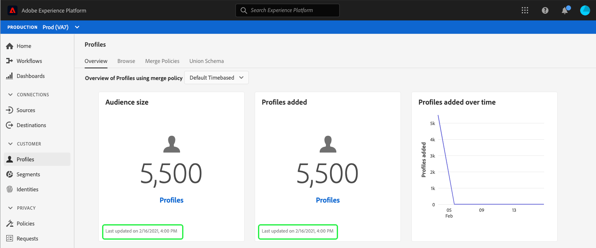
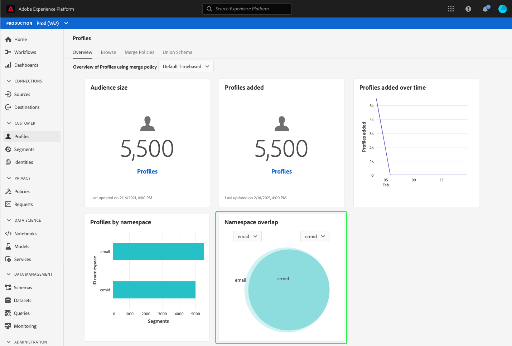

# （測試版）[!UICONTROL Profiles]控制面板

>[!IMPORTANT]
>
>本檔案中概述的控制面板功能目前為測試版，並非所有使用者都能使用。 文件和功能可能會有所變更。

Adobe Experience Platform用戶介面(UI)提供一個儀表板，通過它可以查看有關[!DNL Real-time Customer Profile]資料的重要資訊（在每日快照中捕獲）。 本指南概述如何存取和使用UI中的[!UICONTROL Profiles]控制面板，並提供控制面板中顯示之量度的相關資訊。

如需Experience Platform使用者介面中所有描述檔功能的概述，請造訪[即時客戶描述檔UI指南](../../profile/ui/user-guide.md)。

## 描述檔控制面板資料

[!UICONTROL Profiles]控制面板顯示您的組織在「配置式儲存」中Experience Platform的屬性（記錄）資料的快照。 快照不包含任何事件（時間系列）資料。

快照中的屬性資料與拍攝快照時在特定時間點顯示的資料完全相同。 換言之，快照不是資料的近似值或範例，而「描述檔」控制面板不會即時更新。

>[!NOTE]
>
>自快照建立以來對資料所做的任何變更或更新，在下一個快照建立之前，不會反映在控制面板中。

## 瀏覽[!UICONTROL Profiles]控制面板

若要導覽至平台UI中的[!UICONTROL Profiles]控制面板，請在左側導軌中選取&#x200B;**[!UICONTROL Profiles]**，然後選取&#x200B;**[!UICONTROL Overview]**&#x200B;標籤以顯示控制面板。

### 選擇合併策略

顯示在[!UICONTROL Profiles]控制面板中的量度是以套用至即時客戶資料的合併原則為基礎。 當從多個來源匯整資料時，資料可能包含衝突值（例如，一個資料集可將客戶列為「單一」，而另一個資料集可將客戶列為「已結婚」），而合併原則的工作是判斷哪些資料要優先排序並顯示為描述檔的一部分。

控制面板將自動選擇要顯示的合併策略，但您可以更改使用下拉菜單選擇的合併策略。 要選擇不同的合併策略，請選擇合併策略名稱旁的下拉式清單，然後選擇要查看的合併策略。

>[!NOTE]
>
>下拉菜單僅顯示與XDM單個配置檔案類相關的合併策略，但是，如果您的組織已建立多個合併策略，則可能表示您需要滾動才能查看可用合併策略的完整清單。

有關合併策略的詳細資訊，包括如何為組織建立、編輯和聲明預設的合併策略，請訪問[合併策略UI指南](../../profile/ui/merge-policies.md)。

### Widget和量度

控制面板由widget組成，widget是唯讀量度，提供您描述檔資料的重要資訊。 介面工具集上的「上次更新」日期和時間會顯示資料的最後快照拍攝的時間。

## 可用的Widget

Experience Platform提供多個Widget，您可使用這些Widget來視覺化與您的描述檔資料相關的不同量度。 選取下方介面工具集的名稱，以瞭解更多：

* [[!UICONTROL Audience size]](#audience-size)
* [[!UICONTROL Profiles added]](#profiles-added)
* [[!UICONTROL Profiles added over time]](#profiles-added-over-time)
* [[!UICONTROL Profiles by namespace]](#profiles-by-namespace)
* [[!UICONTROL Namespace overlap]](#namespace-overlap)

### [!UICONTROL Audience size] {#audience-size}

**[!UICONTROL Audience size]**&#x200B;介面工具集顯示拍攝快照時Profile資料儲存中合併的配置檔案總數。 此數字是選定合併策略應用於您的配置檔案資料的結果，以便將配置檔案碎片合併到一起，為每個個人形成單個配置檔案。

有關碎片和合併配置檔案的詳細資訊，請首先閱讀[即時客戶配置檔案概述](../../profile/home.md)的&#x200B;*配置檔案片段與合併配置檔案*&#x200B;部分。

>[!NOTE]
>
>用於計算此量度的合併原則與用於計算[!UICONTROL License usage]控制面板中[!UICONTROL Addressable audiences]的系統產生的合併原則不同，因此[!UICONTROL Profiles]和[!UICONTROL License usage]控制面板中的觀眾計數不太可能完全相同。

### [!UICONTROL Profiles added] {#profiles-added}

**[!UICONTROL Profiles added]**&#x200B;介面工具集顯示自上次拍攝快照以來已添加到配置檔案資料儲存的合併配置檔案總數。 此數字是選定合併策略應用於您的配置檔案資料的結果，以便將配置檔案碎片合併到一起，為每個個人形成單個配置檔案。

### [!UICONTROL Profiles added over time] {#profiles-added-over-time}

**[!UICONTROL Profiles added over time]**&#x200B;介面工具集會顯示最近30天每天新增至描述檔資料儲存的合併描述檔總數。 快照建立時每天都會更新此數字，因此，如果要將配置檔案添加到平台中，則在建立下一個快照之前不會反映配置檔案的數量。

新增的描述檔計數是選取的合併原則套用至您的描述檔資料的結果，以便將描述檔片段合併為每個個人的單一描述檔。

### [!UICONTROL Profiles by namespace] {#profiles-by-namespace}

**[!UICONTROL Profiles by namespace]**&#x200B;介面工具集會顯示描述檔儲存區中所有合併描述檔的識別名稱空間劃分。 [!UICONTROL ID namespace]的描述檔總數（換言之，將每個名稱空間顯示的值加在一起）可能高於合併描述檔總數，因為一個描述檔可能有多個與其關聯的名稱空間。 例如，如果客戶在多個通道上與您的品牌互動，則多個名稱空間將與該個別客戶關聯。

若要進一步瞭解身分名稱空間，請造訪[Adobe Experience Platform身分服務檔案](../../identity-service/home.md)。

### [!UICONTROL Namespace overlap] {#namespace-overlap}

**[!UICONTROL Namespace overlap]**&#x200B;介面工具集會顯示一個Venn圖，或設定圖，顯示包含多個身份名稱空間的描述檔商店中的描述檔重疊。

使用介面工具集上的下拉式功能表來選取您要比較的身分名稱空間後，會顯示社交圈，顯示每個名稱空間的相對大小，其中包含兩個名稱空間的描述檔數目，由社交圈之間重疊的大小來表示。

如果客戶在多個通道上與您的品牌互動，則多個名稱空間將與該個別客戶相關聯，因此您的組織可能會有多個描述檔，其中包含來自多個身分名稱空間的片段。

若要進一步瞭解身分名稱空間，請造訪[Adobe Experience Platform身分服務檔案](../../identity-service/home.md)。

## 後續步驟

遵循本檔案，您現在應該可以找到「描述檔」控制面板，並瞭解可用Widget中顯示的量度。 若要進一步瞭解如何在Experience PlatformUI中使用[!DNL Profile]資料，請參閱[即時客戶資料UI指南](../../profile/ui/user-guide.md)。
