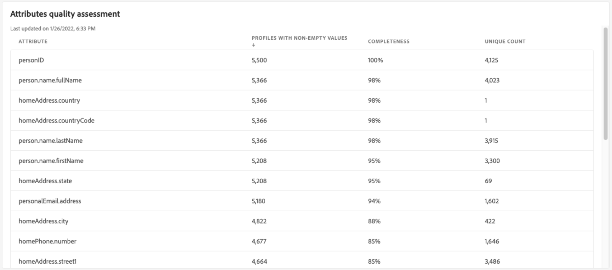
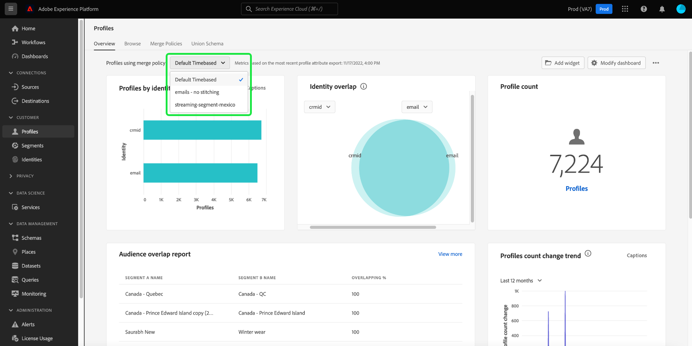

# [!UICONTROL 設定檔] 儀表板

Adobe Experience Platform使用者介面(UI)提供控制面板，供您檢視有關您 [!DNL Real-Time Customer Profile] 資料，如在每日快照期間捕獲。 本指南概述如何存取和使用UI中的「設定檔」控制面板，並提供控制面板中所顯示量度的相關資訊。

如需Experience Platform使用者介面中所有設定檔功能的概觀，請參閱 [即時客戶個人檔案UI指南](../../profile/ui/user-guide.md).

## 設定檔控制面板資料

「設定檔」控制面板會顯示您的組織在「設定檔存放區」內Experience Platform的屬性（記錄）資料快照。 快照不包含任何事件（時間系列）資料。

快照中的屬性資料與建立快照時在特定時間點顯示的資料完全相同。 換句話說，快照不是資料的近似值或樣本，而且「配置檔案」儀表板不會即時更新。

>[!NOTE]
>
>自拍攝快照以來對資料所做的任何更改或更新都不會反映在儀表板中，直到拍攝下一個快照。

## 探索設定檔控制面板

若要導覽至Platform UI中的「設定檔」控制面板，請選取 **[!UICONTROL 設定檔]** 在左側邊欄中，選取 **[!UICONTROL 概述]** 標籤來顯示控制面板。

>[!NOTE]
>
>如果您的組織是初次使用Platform，且尚未建立作用中的設定檔資料集或合併原則，則不會顯示設定檔控制面板。 反之， [!UICONTROL 概述] 索引標籤會顯示連結和檔案，協助您開始使用即時客戶設定檔。

### 修改設定檔控制面板

通過選擇 **[!UICONTROL 修改控制面板]**. 這可讓您從控制面板移動、新增和移除小工具，以及存取 **[!UICONTROL 介面工具集程式庫]** 探索可用介面工具集，並為貴組織建立自訂介面工具集。

請參閱 [修改控制面板](../customize/modify.md) 和 [介面工具集程式庫概觀](../customize/widget-library.md) 檔案以深入了解。

### 新增介面工具集 {#add-widget}

選擇 **[!UICONTROL 新增介面工具集]** 導覽至介面工具集庫，並查看可新增至控制面板的可用介面工具集清單。

從介面工具集庫中，您可以瀏覽標準和自定義段介面工具集的選擇。有關如何添加介面工具集的資訊，請參閱介面工具集庫文檔，了解如何 [新增介面工具集](../customize/widget-library.md#add-widgets).

<!-- ## (Beta) Profile efficacy insights {#profile-efficacy-insights}

>[!IMPORTANT]
>
>The profile efficacy insight functionality is currently in beta and are not available to all users. The documentation and the functionality are subject to change.

The [!UICONTROL Efficacy] tab provides metrics on the quality and completeness of your profile data through the use of profile efficacy widgets. These widgets illustrate at a glance the composition of your profiles, trends in completeness over time, and assessments on the quality of your profile data.

See the [profile efficacy widgets section](#profile-efficacy-widgets) for more information on the widgets currently available.

The layout of this dashboard is also customizable by selecting [**[!UICONTROL Modify dashboard]**](../customize/modify.md) from the [!UICONTROL Overview] tab. -->

## 瀏覽設定檔 {#browse-profiles}

此 [!UICONTROL 瀏覽] 索引標籤可讓您搜尋及檢視內嵌至您組織的唯讀設定檔。 從這裡，您可以看到屬於設定檔的有關其偏好設定、過去事件、互動和區段的重要資訊

若要進一步了解Platform UI中提供的設定檔檢視功能，請參閱 [瀏覽Adobe Real-time Customer Data Platform中的設定檔](../../rtcdp/profile/profile-browse.md).

## 合併策略 {#merge-policies}

「設定檔」控制面板中顯示的量度是以套用至您即時客戶設定檔資料的合併原則為基礎。 從多個來源匯整資料以建立客戶設定檔時，資料可能會包含衝突的值。 例如，某個資料集可能會將客戶列為「單一」，而另一個資料集可能將客戶列為「已婚」。 合併原則的工作是決定要優先排列哪些資料，並在設定檔中顯示這些資料。

有關合併策略的詳細資訊，包括如何建立、編輯和聲明組織的預設合併策略，請參閱 [合併策略概述](../../profile/merge-policies/overview.md).

控制面板將自動選擇要使用的合併策略。 可以使用合併策略名稱旁邊的下拉菜單更改應用的合併策略。

>[!NOTE]
>
>下拉式功能表只會顯示使用的合併原則 `_xdm.context.profile` 綱要。 但是，如果貴組織已建立多個合併策略，則可能意味著您需要滾動才能查看可用合併策略的完整清單。

## 聯合結構

此 [!UICONTROL 聯合架構] 控制面板顯示特定XDM類別的聯合結構。 選取 **[!UICONTROL 類別]** 下拉式清單中，您可以檢視不同XDM類別的聯合結構。

聯合結構描述由共用相同類別並已為設定檔啟用的多個結構描述組成。它們可讓您在單一檢視中查看共用相同類別之每個架構中所包含之每個欄位的合併。

請參閱聯合結構描述UI指南，深入了解 [在Platform UI中檢視聯合結構](../../profile/ui/union-schema.md#view-union-schemas).

## Widget和量度

控制面板由Widget組成，Widget是唯讀量度，提供關於設定檔資料的重要資訊。

最新快照的日期和時間會顯示在 [!UICONTROL 概述] 標籤（位於「合併策略」下拉清單旁）。 自該日期和時間起，所有介面工具集資料都是準確的。 快照的時間戳以UTC提供；不在個別使用者或組織的時區。

## 標準介面工具集 {#standard-widgets}

Adobe提供多個標準Widget，您可用來視覺化與設定檔資料相關的不同量度。 您也可以使用 [!UICONTROL 介面工具集程式庫]. 若要進一步了解建立自訂Widget，請先閱讀 [介面工具集程式庫概觀](../customize/widget-library.md).

若要進一步了解每個可用的標準介面工具集，請從下列清單中選取介面工具集的名稱：

* [[!UICONTROL 設定檔計數]](#profile-count)
* [[!UICONTROL 設定檔計數趨勢]](#profile-count-trend)
* [[!UICONTROL 設定檔計數變更]](#profile-count-change)
* [[!UICONTROL 設定檔計數變更趨勢]](#profiles-count-change-trend)
* [[!UICONTROL 依身分設定檔計數變更趨勢]](#profiles-count-change-trend-by-identity)
* [[!UICONTROL 依身分識別劃分的設定檔]](#profiles-by-identity)
* [[!UICONTROL 身分識別覆蓋]](#identity-overlap)
* [[!UICONTROL 單一身分識別設定檔]](#single-identity-profiles)
* [[!UICONTROL 依身分的單一身分設定檔]](#single-identity-profiles-by-identity)
* [[!UICONTROL 無區段設定檔]](#unsegmented-profiles)
* [[!UICONTROL 未細分的設定檔變更趨勢]](#unsegmented-profiles-change-trend)
* [[!UICONTROL 依身分識別劃分的無區段設定檔]](#unsegmented-profiles-by-identity)
* [[!UICONTROL 受眾]](#audiences)
* [[!UICONTROL 對應至目的地狀態的對象]](#audiences-mapped-to-destination-status)
* [[!UICONTROL 對象大小]](#audiences-size)
* [[!UICONTROL 受眾重疊（依合併原則）]](#audience-overlap-by-merge-policy)
* [[!UICONTROL 對象重疊報表]](#audience-overlap-report)

### [!UICONTROL 設定檔計數] {#profile-count}

>[!CONTEXTUALHELP]
>id="platform_dashboards_profiles_profilecount"
>title="設定檔計數"
>abstract="此 Widget 會顯示取得快照時設定檔存放區內合併的設定檔總數。該數量取決於套用至您設定檔資料的所選合併原則。"

此 **[!UICONTROL 設定檔計數]** 介面工具集會顯示建立快照時「設定檔存放區」內合併的設定檔總數。 此數字是您的設定檔資料所套用的所選合併原則的結果，以便將設定檔片段合併在一起，以便為每個個人建立單一設定檔。

請參閱 [本文檔前面的合併策略一節](#merge-policies) 了解更多。

>[!NOTE]
>
>此 [!UICONTROL 設定檔計數] 介面工具集可能會顯示與上顯示的設定檔計數不同的數字 [!UICONTROL 瀏覽] 標籤 [!UICONTROL 設定檔] 區段，原因有多。 最常見的原因是 [!UICONTROL 瀏覽] 索引標籤會根據您組織的預設合併原則來參照合併設定檔的總數，而 [!UICONTROL 設定檔計數] 介面工具集會根據您選取要在控制面板中檢視的合併原則，參考合併設定檔的總數。
>
>另一個常見原因是，拍攝控制面板快照的時間與為 [!UICONTROL 瀏覽] 標籤。 您可以查看 [!UICONTROL 設定檔計數] 上次更新介面工具集的方式是查看介面工具集的時間戳記。 若要進一步了解如何在 [!UICONTROL 瀏覽] 頁簽，請參閱 [即時客戶設定檔UI指南中的設定檔計數區段](https://experienceleague.adobe.com/docs/experience-platform/profile/ui/user-guide.html?lang=en#profile-count).

### [!UICONTROL 設定檔計數趨勢] {#profile-count-trend}

此 [!UICONTROL 設定檔計數趨勢] 介面工具集使用折線圖來說明系統包含的設定檔總數在一段時間內的趨勢。 此總數包括自上次每日快照以來導入到系統的任何配置檔案。 資料可在30天、90天和12個月期間內視覺化。 時段是從介面工具集的下拉式選單中選擇。

### [!UICONTROL 設定檔計數變更] {#profile-count-change}

>[!CONTEXTUALHELP]
>id="platform_dashboards_profiles_profilescountchange"
>title="設定檔計數變更"
>abstract="此 Widget 會顯示上一次快照時&#x200B;**新增**&#x200B;至設定檔存放區之合併的設定檔總數。該數量取決於套用至您設定檔資料的所選合併原則。"

此 **[!UICONTROL 設定檔計數變更]** 介面工具集顯示自上次快照以來新增至設定檔存放區的合併設定檔數量。 此數字是您的設定檔資料所套用的所選合併原則的結果，以便將設定檔片段合併在一起，以便為每個個人建立單一設定檔。 您可以使用下拉式選取器，檢視過去30天、90天或12個月內新增的設定檔數量。

>[!NOTE]
>
>此 [!UICONTROL 設定檔計數變更] 介面工具集會反映新增的設定檔數 **after** 初始設定檔擷取和設定檔存放區。 換言之，如果您的組織設定設定檔存放區並在第1天擷取4,000,000，則24小時內即可使用控制面板，不過 [!UICONTROL 設定檔計數變更] 介面工具集將設為0。 這麼做是為了避免初次將設定檔擷取至系統時產生的尖峰。 在接下來的30天內，您的組織會將額外1,000,000個設定檔擷取至設定檔存放區。 建立下一個快照後， [!UICONTROL 設定檔計數變更] 介面工具集會顯示共新增1,000,000個設定檔，而 [!UICONTROL 設定檔計數] 介面工具集將顯示總計5,000,000個設定檔。

### [!UICONTROL 設定檔計數變更趨勢] {#profiles-count-change-trend}

>[!CONTEXTUALHELP]
>id="platform_dashboards_profiles_profilesaddedtrend"
>title="設定檔計數變更趨勢"
>abstract="此 Widget 會顯示在過去 30 天、90 天或 12 個月內每天新增至設定檔存放區之合併設定檔的數量。該數量也取決於套用至您設定檔資料的所選合併原則。"

此 **[!UICONTROL 設定檔計數變更趨勢]** 介面工具集會顯示過去30天、90天或12個月內，每天新增至設定檔存放區的合併設定檔總數。 拍攝快照時每天都會更新此數字，因此，如果您要將設定檔內嵌至Platform，則在拍攝下一個快照前不會反映設定檔數。 新增的設定檔計數是將選取的合併原則套用至您的設定檔資料的結果，以便將設定檔片段合併在一起，以便為每個個人建立單一設定檔。

請參閱 [本文檔前面的合併策略一節](#merge-policies) 了解更多。

此 **[!UICONTROL 設定檔計數變更趨勢]** 介面工具集在介面工具集的右上角顯示「標題」按鈕。 選擇 **[!UICONTROL 字幕]** 開啟自動字幕對話框。

機器學習模型通過分析圖表和資料自動生成用於描述關鍵趨勢和重要事件的標題。 圖表中會根據註解新增註解。 選取標題以聚焦於其對應的註解。

### [!UICONTROL 依身分設定檔計數變更趨勢] {#profiles-count-change-trend-by-identity}

<!-- This widget uses a line graph to illustrate the change in number of profiles filtered by a chosen source identity and merge policy. -->

此Widget會根據選取的來源識別和合併原則來篩選設定檔計數，然後使用折線圖來說明不同期間的數量變更。 從頁面頂端的「概述」下拉式清單中選取合併原則，從Widget下拉式功能表中選取來源身分和時段。 趨勢可以在30天、90天和12個月期間內視覺化。

此介面工具集可協助您展示依必要身分篩選的設定檔成長模式，以管理您的目的地啟用需求。

### [!UICONTROL 依身分識別劃分的設定檔] {#profiles-by-identity}

>[!CONTEXTUALHELP]
>id="platform_dashboards_profiles_profilesbyidentity"
>title="依身分識別劃分的設定檔"
>abstract="此 Widget 會顯示設定檔存放區中依身分劃分的所有合併的設定檔。"

此 **[!UICONTROL 依身分設定檔]** 介面工具集會顯示您的個人資料存放區中所有合併設定檔的身分劃分。 依身分劃分的設定檔總數（換句話說，將每個命名空間顯示的值加總）可能高於合併的設定檔總數，因為一個設定檔可能有多個相關聯的命名空間。 例如，如果客戶在多個管道上與您的品牌互動，則多個命名空間將會與該個別客戶相關聯。

請參閱 [本文檔前面的合併策略一節](#merge-policies) 了解更多。

選擇 **[!UICONTROL 字幕]** 開啟自動字幕對話框。

機器學習模型會透過分析資料的整體分佈和關鍵維度，自動產生資料洞察。

若要進一步了解身分，請造訪 [Adobe Experience Platform Identity Service檔案](../../identity-service/home.md).

### [!UICONTROL 身分識別覆蓋] {#identity-overlap}

>[!CONTEXTUALHELP]
>id="platform_dashboards_profiles_identityoverlap"
>title="身分識別覆蓋"
>abstract="此 Widget 會使用文氏圖表顯示設定檔存放區中包含兩個所選身分的設定檔覆蓋。"

此 **[!UICONTROL 身分重疊]** 介面工具集會使用Venn圖表或設定圖表，來顯示設定檔存放區中包含兩個所選身分的設定檔重疊。

使用介面工具集下拉式功能表，選取您要比較的身分。 社交圈會顯示包含每個身分的設定檔相對總計。 包含兩個身分的設定檔數目會以圓圈之間重疊的大小表示。 如果客戶在多個管道上與您的品牌互動，則多個身分會與該個別客戶相關聯，因此您的組織可能會有多個設定檔，其中包含來自多個身分的片段。

如需設定檔片段的詳細資訊，請參閱 [設定檔片段與合併的設定檔](https://experienceleague.adobe.com/docs/experience-platform/profile/home.html?lang=en#profile-fragments-vs-merged-profiles) （在即時客戶個人檔案概觀中）。

若要進一步了解身分，請造訪 [Adobe Experience Platform Identity Service檔案](../../identity-service/home.md).

### [!UICONTROL 單一身分識別設定檔] {#single-identity-profiles}

>[!CONTEXTUALHELP]
>id="platform_dashboards_profiles_singleidentityprofiles"
>title="單一身分識別設定檔"
>abstract="此 Widget 會提供您組織的設定檔計數，這些設定檔只有一種可以建立其身分識別的 ID 類型。此 ID 類型可以是電子郵件或 ECID。"

此 [!UICONTROL 單一身分設定檔] 介面工具集會提供貴組織的設定檔計數，這些設定檔只有一種可建立其身分的ID類型。 此 ID 類型可以是電子郵件或 ECID。配置檔案計數從最近快照中包含的資料生成。

### [!UICONTROL 依身分的單一身分設定檔] {#single-identity-profiles-by-identity}

此介面工具集使用長條圖來說明僅以單一唯一識別碼識別的設定檔總數。 介面工具集最多可支援5種最常發生的身分識別。

將滑鼠指標暫留在個別列上，即可查看對話方塊，其中詳列身分的設定檔總數。

### [!UICONTROL 無區段設定檔] {#unsegmented-profiles}

>[!CONTEXTUALHELP]
>id="platform_dashboards_profiles_unsegmentedprofiles"
>title="無區段設定檔"
>abstract="此 Widget 會提供未附加到任何區段的所有設定檔總數，代表在整個組織中啟用設定檔的機會。"

此 [!UICONTROL 未分段的設定檔] 介面工具集提供未附加至任何區段的所有設定檔總數。 生成的數字與上次快照時的資料一致，並代表整個組織的配置檔案激活機會。 它還表示了擴展不提供足夠ROI的配置檔案的機會。

### [!UICONTROL 未細分的設定檔變更趨勢] {#unsegmented-profiles-change-trend}

>[!CONTEXTUALHELP]
>id="platform_dashboards_profiles_unsegmentedprofilestrend"
>title="無區段設定檔趨勢"
>abstract="此 Widget 會提供折線圖，說明在特定時段內未附加到任何區段的所有設定檔數量。可以將 30 天、90 天和 12 個月時段內未附加到任何區段的設定檔趨勢視覺化。"

此 [!UICONTROL 未細分的設定檔變更趨勢] 介面工具集使用折線圖來說明自上次每日快照後新增而未附加至任何區段的設定檔數量。 未附加至任何區段的設定檔變更趨勢可在30天、90天和12個月期間內視覺化。 時段是從介面工具集的下拉式選單中選擇。 輪廓計數會反映在y軸上，而時間會反映在x軸上。

### [!UICONTROL 依身分識別劃分的無區段設定檔] {#unsegmented-profiles-by-identity}

>[!NOTE]
>
>自2022年10月起，「依身分Widget劃分的未細分設定檔」已淘汰，不再提供使用。

<!-- 

>[!CONTEXTUALHELP]
>id="platform_dashboards_profiles_unsegmentedprofilesbyidentity"
>title="Unsegmented profiles by identity"
>abstract="This widget categorizes the total number of unsegmented profiles by their unique identifier."

The [!UICONTROL Unsegmented Profiles by Identity] widget categorizes the total number of unsegmented profiles by their unique identifier. The data is visualized in a bar chart for ease of comparison. 

 -->

### [!UICONTROL 受眾] {#audiences}

此介面工具集會根據套用至設定檔資料的所選合併原則，提供可啟動的區段總數。

選擇 **[!UICONTROL 對象]** 導覽至 [!UICONTROL 區段] 儀表板 [!UICONTROL 瀏覽] 標籤。 您可以從該處看到組織的所有區段定義清單。

<!-- https://jira.corp.adobe.com/browse/PLAT-115291 -->

<!-- * [[!UICONTROL Audiences change trend]](#audiences-change-trend) -->
<!-- ### [!UICONTROL Audiences change trend] {#audiences-change-trend}

This line graph widget visualizes the change in the total number of audiences each day, trending over time. The change in the number of audiences is dependent on the selected merge policy being applied to your profile data. The period of analysis is selected from the widget dropdown menu. The bar chart can be visualized over 30 days, 90 days, and 12-month periods.  

The visualization allows you to monitor the overall health of audiences within Adobe Experience Platform by understanding trends in the growth or decline of the total number of audiences. -->

<!--  -->

### [!UICONTROL 對象重疊報表] {#audience-overlap-report}

此Widget會列出合併原則篩選之所有可用區段中的對象重疊資料。 針對從螢幕頂端的下拉式功能表中選擇的合併原則，提供從最高到最低重疊百分比排名的五個對象清單。 兩個分析區段列於 [!UICONTROL 區段名稱] 和 [!UICONTROL 區段B名稱] 欄。 第三欄中提供的重疊百分比精確至十二位小數。

對象重疊報表可協助您建立新的高效能區段。 觀察高百分比重疊可讓您隱藏對象，並防止將相同的對象傳送至不同的目的地。 它們也可協助您識別隱藏的深入分析，以協助您改善細分。 低百分比重疊有助於找到要追蹤的唯一設定檔。

選擇 **[!UICONTROL 查看更多]** 開啟包含更多對象重疊資料的全螢幕對話方塊。

此 [!UICONTROL 對象重疊報表] 對話框。 此對話方塊最多可包含50列受眾重疊分析，分為六欄。 選取設定圖示()，移除或新增表格中的欄。

>[!NOTE]
>
>選取 **[!UICONTROL 重疊]** 欄標題，將結果的排名從最高到最低或從最低到最高。

若要以PDF格式下載整個報表，請選取選項功能表(**`...`**)後面跟著 **[!UICONTROL 下載]**.

從報表中選取一列，以開啟重疊分析的文氏圖表。 將滑鼠指標暫留在Venn圖表的某個區段上，即可在對話方塊中查看設定檔計數。

選擇 **[!UICONTROL 關閉]** 返回 [!UICONTROL 設定檔] 控制面板。

### [!UICONTROL 對應至目的地狀態的對象] {#audiences-mapped-to-destination-status}

此 [!UICONTROL 對應至目的地狀態的對象] 介面工具集會在單一量度中顯示已映射和未映射對象的總數，並使用甜甜圈圖來說明其總計之間的比例差異。 計算的數字取決於選擇的合併策略。

游標停留在環圈圖的個別區段上時，對話方塊中會顯示已對應或未對應對象的個別計數。

### [!UICONTROL 對象大小] {#audiences-size}

此 [!UICONTROL 對象大小] 介面工具集提供兩欄的表格，列出最多20個區段，以及每個區段中包含的對象總數。 清單會根據對象總數從高到低排序。 總對象大小數字取決於套用的合併原則。

若要查看區段的完整資訊，請從提供的清單中選取區段名稱，以導覽至 [!UICONTROL 區段] [!UICONTROL 詳細資料] 頁面。 此外，選取 **[!UICONTROL 檢視所有區段]** 從介面工具集的結尾，您可以導覽至 [!UICONTROL 區段] [!UICONTROL 瀏覽] 標籤來尋找任何現有區段。

如需 [[!UICONTROL 區段] [!UICONTROL  瀏覽] 標籤](https://experienceleague.adobe.com/docs/experience-platform/segmentation/ui/overview.html#browse).

### [!UICONTROL 受眾重疊（依合併原則）] {#audience-overlap-by-merge-policy}

此介面工具集使用文氏圖表來顯示兩個所選區段的重疊。 合併原則是從頁面頂端的「概觀」下拉式清單中選取，而分析的區段是從介面工具集內的兩個下拉式功能表中選取。 將滑鼠游標暫留在社交圈或交集上，即可查看相關區段定義中包含的設定檔總數。

當介面工具集顯示區段定義的視覺交叉時，您可以透過研究區段定義之間的相似性來最佳化您的區段策略。

<!-- ## (Beta) Profile efficacy widgets {#profile-efficacy-widgets}

>[!IMPORTANT]
>
>The profile efficacy widgets are currently in Beta and are not available to all users. The documentation and the functionality are subject to change.

Adobe provides multiple widgets to assess the completeness of the ingested profiles available for your data analysis. Each of the profile efficacy widgets can be filtered by the merge policy. To change the merge policy filter, select the[!UICONTROL Profiles using merge policy] dropdown and choose the appropriate policy from the available list.

To learn more about each of the profile efficacy widgets, select the name of a widget from the following list:

* [[!UICONTROL Attribute quality assessment]](#attributes-quality-assessment)
* [[!UICONTROL Profiles by completeness]](#profiles-by-completeness)
* [[!UICONTROL Profiles completeness trend]](#profiles-completeness-trend)

### (Beta) [!UICONTROL Attributes quality assessment] {#attributes-quality-assessment}

>[!CONTEXTUALHELP]
>id="platform_dashboards_profiles_attributesqualityassessment"
>title="Attributes quality assessment"
>abstract="This widget shows the completeness and cardinality of all profiles according to their attributes. Each row describes one attribute. The **Profiles** column provides the number of profiles that have this attribute and are filled with non-null values. The **Completeness** percentage is determined by the total number of profiles that have this attribute and are filled with non-null values divided by the total number of non-empty values in the profiles for that attribute. **Cardinality** provides the total number of unique non-null values of this attribute across all attributes."

The [!UICONTROL Attribute quality assessment] widget shows the completeness and cardinality of all profiles according to their attributes. The data is accurate to the last processing date. This information is presented as a table with four columns where each row in the table represents a single attribute.

| Column  | Description  |
|---|---|
| Attribute  | The name of the attribute.  |
| Profiles  | The number of profiles that have this attribute and are filled with non-null values.  |
| Completeness  | This percentage is determined by the total number of profiles that have this attribute and are filled with non-null values. The number is calculated by dividing the total number of profiles by the total number of non-empty values in the profiles for that attribute.  |
| Cardinality  | The total number of **unique** non-null values of this attribute. It is measured across all profiles. |

### (Beta) [!UICONTROL Profiles by completeness] {#profiles-by-completeness}

>[!CONTEXTUALHELP]
>id="platform_dashboards_profiles_profilesbycompleteness"
>title="Profiles by completeness"
>abstract="The donut chart displays the percentage of profile attributes that are filled with non-null values among all observed attributes. It illustrates the proportion of profiles that are of high, medium, or low completeness. High completeness profiles have more than 70% of their attributes filled. Medium completeness profiles have between 30% and 70% of their attributes filled. Low completeness profiles have less than 30% of their attributes filled."

The [!UICONTROL Profiles by completeness] widget creates a donut chart of profile completeness since the last processing date. The completeness of a profile is measured by the percentage of attributes that are filled with non-null values among all observed attributes.

This widget shows the proportion of profiles that are of high, medium, or low completeness. By default, there are three levels of completeness configured: 

* High completeness: Profiles have more than 70% of their attributes filled. 
* Medium completeness: Profiles have between 30% and 70% of their attributes filled. 
* Low completeness: Profiles have less than 30% of their attributes filled. 

### (Beta) [!UICONTROL Profiles completeness trend] {#profiles-completeness-trend}

>[!CONTEXTUALHELP]
>id="platform_dashboards_profiles_profilescompletenesstrend"
>title="Profiles completeness trend"
>abstract="This widget creates a stacked area chart to depict the trend of profile completeness over time. Completeness is measured by the percentage of attributes that are filled with non-null values among all observed attributes."

This widget creates a stacked area chart to depict the trend of profile completeness over time. Completeness is measured by the percentage of attributes filled with non-null values among all observed attributes. It categorizes the profile completeness as high, medium, or low completeness since the last processing date.

The x-axis represents time, the y-axis represents the number of profiles, and the colors represent the three levels of profile completeness. 

The three levels of completeness are:

* High completeness: Profiles have more than 70% of attributes filled. 
* Medium completeness: Profiles have less than 70% and more than 30% of attributes filled. 
* Low completeness: Profiles have less than 30% of attributes filled.

 -->

## 後續步驟

依照本檔案操作，您現在應該能夠找到設定檔控制面板，並了解可用介面工具集中顯示的量度。 若要進一步了解如何使用 [!DNL Profile] Experience PlatformUI中的資料，請參閱 [即時客戶個人檔案UI指南](../../profile/ui/user-guide.md).
