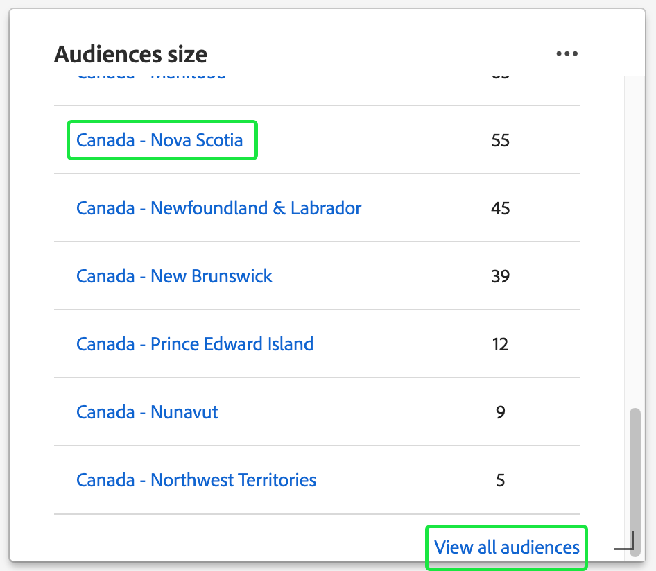

# [!UICONTROL 設定檔]儀表板

Adobe Experience Platform使用者介面(UI)提供儀表板，您可以透過儀表板檢視有關您的[!DNL Real-Time Customer Profile]資料的重要資訊，如每日快照期間所擷取。 本指南概述如何存取和使用UI中的設定檔控制面板，並提供控制面板中顯示的量度相關資訊。

請參閱[即時客戶設定檔UI指南](../../profile/ui/user-guide.md)，以瞭解Experience Platform使用者介面中的設定檔功能概觀。

## 設定檔儀表板資料

設定檔儀表板會顯示貴組織在Experience Platform的設定檔存放區中擁有的屬性（記錄）資料快照。 快照不包含任何事件（時間序列）資料。

快照中的屬性資料顯示的資料與拍攝快照的特定時間點完全相同。 換言之，快照不是資料的近似或樣本，而且「設定檔」圖示板不會即時更新。

>[!NOTE]
>
>自拍攝快照以來對資料所做的任何變更或更新都不會反映在儀表板中，直到拍攝下一個快照為止。

## 探索設定檔控制面板 {#explore-dashboard}

若要導覽至Experience Platform UI中的「設定檔」儀表板，請在左側邊欄中選取「**[!UICONTROL 設定檔]**」，然後選取「**[!UICONTROL 概觀]**」標籤以顯示儀表板。

>[!NOTE]
>
>如果您的組織剛開始使用Experience Platform，但尚未建立作用中的設定檔資料集或合併原則，則不會顯示設定檔控制面板。 [!UICONTROL 總覽]標籤會顯示連結和檔案，協助您開始使用即時客戶個人檔案。

### 修改設定檔儀表板 {#modify-dashboard}

您可以選取&#x200B;**[!UICONTROL 修改儀表板]**，以修改設定檔儀表板的外觀。 您可以從儀表板移動、新增、調整大小及移除Widget，以及存取&#x200B;**[!UICONTROL Widget資料庫]**&#x200B;以探索可用的Widget，並為您的組織建立自訂Widget。

若要瞭解詳細資訊，請參閱[修改儀表板](../customize/modify.md)和[Widget程式庫概觀](../customize/widget-library.md)檔案。

### 新增Widget {#add-widget}

選取&#x200B;**[!UICONTROL 新增Widget]**&#x200B;以瀏覽至Widget資料庫，並檢視可新增至您控制面板的可用Widget清單。

在Widget資料庫中，您可以瀏覽標準與自訂對象Widget的選取專案。 如需如何新增Widget的詳細資訊，請參閱如何[新增Widget](../customize/widget-library.md#add-widgets)的Widget資料庫檔案。

### 檢視 SQL {#view-sql}

您可以透過在[!UICONTROL 總覽]工作區上的切換來檢視產生視覺化分析的SQL。 您可以從現有見解的SQL獲得靈感，以建立新的查詢，這些查詢會根據您的業務需求從Experience Platform資料獲得獨特的見解。 若要深入瞭解此功能，請參閱[檢視SQL UI指南](../view-sql.md)。

<!-- ## (Beta) Profile efficacy insights {#profile-efficacy-insights}

>[!IMPORTANT]
>
>The profile efficacy insight functionality is currently in beta and are not available to all users. The documentation and the functionality are subject to change.

The [!UICONTROL Efficacy] tab provides metrics on the quality and completeness of your profile data through the use of profile efficacy widgets. These widgets illustrate at a glance the composition of your profiles, trends in completeness over time, and assessments on the quality of your profile data.

See the [profile efficacy widgets section](#profile-efficacy-widgets) for more information on the widgets currently available.

The layout of this dashboard is also customizable by selecting [**[!UICONTROL Modify dashboard]**](../customize/modify.md) from the [!UICONTROL Overview] tab. -->

## 瀏覽設定檔 {#browse-profiles}

[!UICONTROL 瀏覽]索引標籤可讓您搜尋並檢視擷取至您組織的唯讀設定檔。 從這裡，您可以看到屬於設定檔的重要資訊，其中包含其偏好設定、過去事件、互動和對象。

## 輪廓詳細資料 {#profile-details}

若要開啟[!UICONTROL 設定檔] [!UICONTROL 詳細資料]工作區，請從清單中選取[!UICONTROL 設定檔識別碼]。

![反白設定檔識別碼的[設定檔瀏覽]索引標籤。](../images/profiles/profile-id.png)

[!UICONTROL 設定檔] [!UICONTROL 詳細資料]工作區會顯示數個預先設定的Widget，其中會傳達該設定檔的特定資訊。 此資訊可讓您一眼瞭解設定檔的關鍵屬性。 您也可以建立自己的Widget，以自訂您的[!UICONTROL 設定檔] [!UICONTROL 詳細資料]工作區。 如需詳細資訊，請參閱[如何新增Widget](#add-widgets)的相關章節。

![反白顯示[!UICONTROL 詳細資料]索引標籤的[!UICONTROL 設定檔] [!UICONTROL 詳細資料]工作區。](../images/profiles/profile-details-workspace.png)

### 設定檔詳細資訊Widget {#widgets}

預先設定的設定檔詳細資訊Widget如下：

#### 客戶輪廓 {#customer-profile}

[!UICONTROL 客戶設定檔] Widget會顯示與該設定檔相關聯之使用者的名字和姓氏，以及其[!UICONTROL 設定檔ID]。 設定檔ID是與身分型別相關聯的自動產生識別碼，代表設定檔。 若要深入瞭解身分識別與身分識別名稱空間，請參閱[身分識別總覽](../../rtcdp/profile/identities-overview.md)。

#### 基本屬性 {#basic-attributes}

[!UICONTROL 基本屬性] Widget會顯示定義個別設定檔時最常使用的屬性。

#### 連結的身分識別 {#linked-identities}

[!UICONTROL 連結的身分] Widget會顯示與設定檔相關聯的任何其他身分。

若要更深入檢視設定檔的身分詳細資訊，並瀏覽至[!UICONTROL 身分]工作區，請選取&#x200B;**[!UICONTROL 檢視身分圖表]**。

#### 管道偏好設定 {#channel-preferences}

[!UICONTROL 管道偏好設定] Widget會顯示使用者同意接收通訊的通訊管道。 核取記號表示使用者已同意接收通訊的每個管道。

<!-- image needs a blue tick added below -->

客戶同意和聯絡人偏好設定是複雜的主題。 若要瞭解如何在Experience Platform中收集、處理和篩選同意和內容偏好設定，建議您閱讀下列檔案：

* 若要瞭解根據Adobe標準[收集同意資料所需的結構描述欄位群組](../../landing/governance-privacy-security/consent/adobe/overview.md)，請參閱這些啟用設定檔的結構描述欄位群組的相關檔案。
   * [[!UICONTROL 同意和偏好設定詳細資料]](../../xdm/field-groups/profile/consents.md)
   * [[!UICONTROL IdentityMap]](../../xdm/field-groups/profile/identitymap.md) (若使用Experience Platform Web或Mobile SDK傳送同意訊號則為必要)
* 若要瞭解如何使用Adobe標準處理客戶同意和偏好設定資料，請參閱Experience Platform](../../landing/governance-privacy-security/consent/adobe/overview.md)中[同意處理的概述。
* 合併的資料治理和同意原則可用於根據其同意偏好設定和您建立的組織規則篩選要分段的設定檔。 若要瞭解如何建立和使用這些合併原則，請參閱[管理資料使用原則](../../data-governance/policies/user-guide.md#combine-policies)的使用手冊。

### 新增Widget {#add-widgets}

若要將自訂Widget新增至您的[!UICONTROL 設定檔] [!UICONTROL 詳細資料]工作區，請選取&#x200B;**[!UICONTROL 自訂設定檔詳細資料]**。

![包含[!UICONTROL 自訂設定檔詳細資料]的設定檔詳細資料工作區已反白顯示。](../images/profiles/customize-profile-details.png)

您現在可以透過調整大小或重新定位Widget來編輯工作區。 選取&#x200B;**[!UICONTROL 新增Widget]**&#x200B;以建立具有自訂屬性的Widget。

![設定檔[!UICONTROL 詳細資料]工作區中反白顯示[!UICONTROL 新增Widget]。](../images/profiles/add-widget.png)

Widget建立器隨即出現。 在[!UICONTROL 卡片標題]文字欄位中輸入您Widget的描述性名稱，並選取&#x200B;**[!UICONTROL 新增屬性]**。

![具有[!UICONTROL 卡片標題]欄位和[!UICONTROL 新增屬性]的Widget建立者畫布已反白顯示。](../images/profiles/widget-creator.png)

隨即出現一個對話方塊，其中包含設定檔聯合結構的視覺效果。 使用搜尋欄位或捲動來尋找您要以您的Widget報告的屬性。 選取您要包含的任何屬性的核取方塊。 選取&#x200B;**[!UICONTROL 選取]**&#x200B;以繼續建立工作流程。

>[!TIP]
>
>選取頂層核取方塊時，會包含任何子元素。

![含忠誠度屬性核取方塊和[!UICONTROL 選取]的聯集結構描述圖表已反白顯示。](../images/profiles/union-schema-attributes.png)

畫布上會顯示已完成的Widget預覽。 在您滿意所選的屬性後，請選取&#x200B;**[!UICONTROL 儲存]**&#x200B;以確認您的選擇，並返回[!UICONTROL 設定檔] [!UICONTROL 詳細資料]工作區。 新建立的Widget現在會顯示在工作區中。

## 合併原則 {#merge-policies}

設定檔控制面板中顯示的量度，是根據套用至即時客戶設定檔資料的合併原則。 將來自多個來源的資料彙集在一起以建立客戶設定檔時，資料可能會包含衝突值。 例如，一個資料集可能將客戶列為「單身」，而另一個資料集可能將客戶列為「已婚」。 合併原則的工作是決定哪些資料要優先處理，並顯示為設定檔的一部分。

如需有關合併原則的詳細資訊，包括如何建立、編輯和宣告組織的預設合併原則，請參閱[合併原則概觀](../../profile/merge-policies/overview.md)。

儀表板會自動選取要使用的合併原則。 您可使用合併原則名稱旁邊的下拉式選單來變更套用的合併原則。

>[!NOTE]
>
>下拉式功能表只會顯示使用`_xdm.context.profile`結構描述的合併原則。 但是，如果貴組織已建立多個合併原則，則可能表示您需要捲動才能檢視可用合併原則的完整清單。

## 聯合結構描述

[!UICONTROL 聯合結構描述]儀表板會顯示特定XDM類別的聯合結構描述。 選取&#x200B;**[!UICONTROL 類別]**&#x200B;下拉式清單，即可檢視不同XDM類別的聯合結構描述。

聯合結構描述由共用相同類別並已為設定檔啟用的多個結構描述組成。 它們可讓您在單一檢視中看到，共用相同類別的每個結構描述中包含的每個欄位都合併在一起。

若要深入瞭解[在Experience Platform UI](../../profile/ui/union-schema.md#view-union-schemas)中檢視聯合結構描述，請參閱聯合結構描述UI指南。

## Widget和量度

儀表板由Widget組成，這些是唯讀量度，可提供有關設定檔資料的重要資訊。

最近快照的日期和時間會顯示在合併原則下拉式清單旁的[!UICONTROL 概觀]索引標籤頂端。 截至該日期和時間，所有Widget資料都是準確的。 快照的時間戳記會以UTC提供；而不是在個別使用者或組織的時區中。

![反白顯示最近快照時間戳記的[設定檔儀表板概觀]索引標籤。](../images/profiles/snapshot-timestamp.png)

## 預設Widget {#default-widgets}

Adobe Experience Platform的所有新執行個體都會提供預設Widget載出，以強調資料中最新可用的深入分析。 下列Widget從一開始便已在您的區段檢視中預先設定。 有關Widget用途和功能的完整詳細資訊，請參閱下文。

* [[!UICONTROL 設定檔計數]](#profile-count)
* [[!UICONTROL 設定檔計數變更]](#profile-count-change)
* [[!UICONTROL 設定檔計數變更趨勢]](#profiles-count-change-trend)
* [[!UICONTROL 依身分識別劃分的設定檔]](#profiles-by-identity)
* [[!UICONTROL 身分識別覆蓋]](#identity-overlap)

>[!NOTE]
>
>自2023年7月26日起，[!UICONTROL 設定檔]、[!UICONTROL 對象]和[!UICONTROL 目標]總覽儀表板已重設為未在前六個月修改其檢視的所有使用者之新預設Widget載出。 請參閱[目的地](./destinations.md#default-widgets)與[對象](./audiences.md#default-widgets)預設Widget區段中的檔案，以取得關於哪些小工具包含在預設Widget載入中的詳細資訊。 您可以繼續如往常一樣自訂您的儀表板Widget。

## Customer AI Widget {#customer-ai-profiles-widgets}

Customer AI 可產生自訂傾向評分，例如大規模個別設定檔的流失和轉換情形。Customer AI透過分析現有的消費者體驗事件資料來預測&#x200B;**流失或轉換傾向分數**&#x200B;來執行此操作。 這些高精確度的客戶傾向模型可讓您進行更精確的分段和目標定位。 分數](#customer-ai-distribution-of-scores)和[評分摘要](#customer-ai-scoring-summary)深入分析的[分佈會示範您對象中的部門。 它們會強調哪些設定檔為高/低/中傾向，以及它們在您的設定檔計數中的分配方式。

* [[!UICONTROL Customer AI 評分摘要]](#customer-ai-scoring-summary)
* [[!UICONTROL Customer AI 分數的分佈]](#customer-ai-distribution-of-scores)

### [!UICONTROL Customer AI 分數的分佈] {#customer-ai-distribution-of-scores}

>[!CONTEXTUALHELP]
>id="platform_dashboards_profiles_distributionOfScores"
>title="分數分佈"
>abstract="這個小工具會依傾向分數 (以 5% 的增量) 將設定檔總數的分佈視覺化。設定檔計數的分佈由 AI 模式和所選合併原則決定。您可以從小工具標題下的下拉選單中變更 AI 模式。"

分數]的[!UICONTROL Customer AI分佈Widget會依傾向分數分類個人檔案總數。 設定檔計數的分佈取決於AI模型和所選的合併原則，然後以5%的增量進行視覺化，表示其傾向。 設定檔的計數會沿Y軸提供，而傾向分數則會沿X軸提供。

>[!NOTE]
>
>如果視覺效果是轉換傾向分數，則高分會以綠色顯示，低分會以紅色顯示。 如果您預測的是流失傾向，則系統會加以逆轉，高分會以紅色顯示，低分則會以綠色顯示。 無論您選擇哪種傾向型別，中段貯體都會保持黃色。

決定傾向分數的AI模型可從Widget標題下方的下拉式選擇器中選取。 下拉式清單包含所有已設定的Customer AI模型清單。 從可用模型清單中為您的分析選取適當的AI模型。 如果沒有可用的Customer AI模型，Widget中的訊息會指示您設定至少一個Customer AI模型，並提供指向Customer AI模型設定頁面的超連結。 請參閱檔案以瞭解[如何設定Customer AI執行個體](../../intelligent-services/customer-ai/user-guide/configure.md)的說明。

>[!NOTE]
>
>選取概述標籤正下方的下拉式清單，以變更決定分析中包含哪些設定檔的合併原則。 請參閱[合併原則](#merge-policies)的相關章節以取得簡要說明，或參閱[合併原則概觀](../../profile/merge-policies/overview.md)以取得詳細資料。

若要導覽至所選Customer AI模型的詳細深入分析頁面，請選取「**[!UICONTROL 檢視模型詳細資料]**」。

![Experience Platform Audiences儀表板，含有[!UICONTROL 分數的Customer AI分佈]介面工具集和[!UICONTROL 檢視模型詳細資料]強調顯示。](../images/segments/customer-ai-distribution-of-scores.png)

詳細模型深入分析頁面隨即顯示。

您可以在[探索見解UI指南](../../intelligent-services/customer-ai/user-guide/discover-insights.md)中找到有關Customer AI的更多資訊。

### [!UICONTROL Customer AI 評分摘要] {#customer-ai-scoring-summary}

>[!CONTEXTUALHELP]
>id="platform_dashboards_profiles_scoringSummary"
>title="分數摘要"
>abstract="這個小工具會顯示已評分設定檔的總數，並將其分類到包含高、中、低傾向的貯體。圓環圖說明了高、中、低傾向設定檔總數的比例構成。"

此Widget顯示已評分的個人檔案總數，並將其分類為分別包含高、中及低傾向的綠色、黃色及紅色貯體。 環形圖可說明高、中和低傾向性之間設定檔的成比例構成。 設定檔符合75歲以上的高傾向、25到74歲之間的中傾向，以及24歲以下的低傾向。 圖例會指出色彩代碼和傾向性臨界值。 當游標暫留在環圈圖的個別區段上時，高、中和低傾向性的設定檔計數會顯示在對話方塊中。

>[!NOTE]
>
>如果視覺效果是轉換傾向分數，則高分會以綠色顯示，低分會以紅色顯示。 如果您預測的是流失傾向，則系統會加以逆轉，高分會以紅色顯示，低分則會以綠色顯示。 無論您選擇哪種傾向型別，中段貯體都會保持黃色。

Widget標題下方的下拉式選單提供所有已設定的Customer AI模型清單。 從可用模型清單中為您的分析選取適當的AI模型。 如果沒有可用的Customer AI模型，Widget中的訊息會指示您設定至少一個Customer AI模型，並提供指向Customer AI模型設定頁面的超連結。 如需詳細指示，請參閱[如何設定Customer AI執行個體](../../intelligent-services/customer-ai/user-guide/configure.md)的相關檔案。

>[!NOTE]
>
>計算的設定檔總數取決於所選的合併原則。 若要變更所使用的合併原則，請選取概述標籤正下方的下拉式清單。 請參閱[合併原則](#merge-policies)的相關章節以取得簡要說明，或參閱[合併原則概觀](../../profile/merge-policies/overview.md)以取得詳細資料。

若要導覽至所選Customer AI模型的詳細深入分析頁面，請選取「**[!UICONTROL 檢視模型詳細資料]**」。 您可以在[探索見解UI指南](../../intelligent-services/customer-ai/user-guide/discover-insights.md)中找到有關Customer AI的更多資訊。

## 標準小工具 {#standard-widgets}

Adobe提供多個標準Widget，您可用來視覺化與設定檔資料相關的不同量度。 您也可以使用[!UICONTROL Widget資料庫]建立自訂Widget並與您的組織共用。 若要深入瞭解如何建立自訂Widget，請先閱讀[Widget程式庫概觀](../customize/widget-library.md)。

若要進一步瞭解每個可用的標準Widget，請從下列清單中選取Widget的名稱：

* [[!UICONTROL 設定檔計數]](#profile-count)
* [[!UICONTROL 設定檔計數趨勢]](#profile-count-trend)
* [[!UICONTROL 設定檔計數變更]](#profile-count-change)
* [[!UICONTROL 設定檔計數變更趨勢]](#profiles-count-change-trend)
* [[!UICONTROL 依身分割槽分的設定檔計數變更趨勢]](#profiles-count-change-trend-by-identity)
* [[!UICONTROL 依身分識別劃分的設定檔]](#profiles-by-identity)
* [[!UICONTROL 身分識別覆蓋]](#identity-overlap)
* [[!UICONTROL 單一身分識別設定檔]](#single-identity-profiles)
* [[!UICONTROL 依身分割槽分的單一身分設定檔]](#single-identity-profiles-by-identity)
* [[!UICONTROL 未細分的設定檔]](#unsegmented-profiles)
* [[!UICONTROL 未細分的設定檔變化趨勢]](#unsegmented-profiles-change-trend)
* [[!UICONTROL 依身分識別劃分的未細分的設定檔]](#unsegmented-profiles-by-identity)
* [[!UICONTROL 對象]](#audiences)
* [[!UICONTROL 對應到目的地狀態的對象]](#audiences-mapped-to-destination-status)
* [[!UICONTROL 對象人數]](#audiences-size)
* [[!UICONTROL 依合併原則區分的對象重疊]](#audience-overlap-by-merge-policy)
* [[!UICONTROL 對象重疊報表]](#audience-overlap-report)

### [!UICONTROL 設定檔計數] {#profile-count}

>[!CONTEXTUALHELP]
>id="platform_dashboards_profiles_profilecount"
>title="設定檔計數"
>abstract="這個小工具會顯示取得快照時設定檔存放區內合併的設定檔總數。該數量取決於套用至您設定檔資料的所選合併原則。"

**[!UICONTROL 設定檔計數]** Widget會顯示拍攝快照時設定檔存放區中合併的設定檔總數。 此數字是已將選取的合併原則套用至您的設定檔資料的結果，以便將設定檔片段合併在一起，為每個個人形成一個設定檔。

請參閱本檔案](#merge-policies)中先前關於合併原則的[一節，瞭解更多資訊。

>[!NOTE]
>
>基於多種原因，[!UICONTROL 設定檔計數]介面工具集可能會在UI的[!UICONTROL 設定檔]區段中，顯示與[!UICONTROL 瀏覽]索引標籤上顯示的設定檔計數不同的數字。 此差異最常見的原因是，[!UICONTROL 瀏覽]索引標籤會根據您組織的預設合併原則參考合併的設定檔總數，而[!UICONTROL 設定檔計數]介面工具會根據您選擇在儀表板中檢視的合併原則參考合併的設定檔總數。
>
>另一個常見的原因是，擷取儀表板快照的時間與[!UICONTROL 瀏覽]索引標籤執行範例作業的時間不同。 您可以檢視Widget上的時間戳記，以檢視[!UICONTROL 設定檔計數]個Widget的上次更新時間。 若要進一步瞭解如何在[!UICONTROL 瀏覽]標籤上觸發範例工作，請參閱「即時客戶設定檔UI指南](../../profile/ui/user-guide.md#profile-count)」中的[設定檔計數區段。

### [!UICONTROL 設定檔計數趨勢] {#profile-count-trend}

[!UICONTROL 設定檔計數trend] Widget會使用線圖來說明系統中包含之設定檔總數在一段時間內的趨勢。 此總數包含自上次每日快照以來匯入系統的任何設定檔。 30天、90天和12個月期間的資料可視覺化。 期間是從Widget的下拉式功能表中選擇。

### [!UICONTROL 設定檔計數變更] {#profile-count-change}

>[!CONTEXTUALHELP]
>id="platform_dashboards_profiles_profilescountchange"
>title="設定檔計數變更"
>abstract="這個小工具會顯示上一次快照時&#x200B;**新增**&#x200B;至設定檔存放區合併的設定檔總數。該數量取決於套用至您設定檔資料的所選合併原則。"

**[!UICONTROL 設定檔計數變更]** Widget會顯示自前次快照後新增至設定檔存放區的合併設定檔數目。 此數字是已將選取的合併原則套用至您的設定檔資料的結果，以便將設定檔片段合併在一起，為每個個人形成一個設定檔。 您可以使用下拉式選擇器來檢視過去30天、90天或12個月內新增的設定檔數。

>[!NOTE]
>
>[!UICONTROL 設定檔計數變更] Widget反映了在初始設定檔擷取和設定檔存放區設定&#x200B;**之後新增的設定檔數量**。 換言之，如果您的組織設定了設定檔存放區並在第1天擷取4,000,000個，則儀表板在24小時內即可使用，但[!UICONTROL 設定檔計數變更] Widget將設為0。 此計數方法旨在避免與將設定檔初始擷取至系統相關的尖峰。 在接下來的30天中，您的組織會額外擷取1,000,000個設定檔至設定檔存放區。 拍攝下一個快照後，[!UICONTROL 設定檔計數變更]介面工具集將顯示總計已新增1,000,000個設定檔，而[!UICONTROL 設定檔計數]介面工具集將顯示總計已新增5,000,000個設定檔。

### [!UICONTROL 設定檔計數變更趨勢] {#profiles-count-change-trend}

>[!CONTEXTUALHELP]
>id="platform_dashboards_profiles_profilesaddedtrend"
>title="設定檔計數變更趨勢"
>abstract="這個小工具會顯示在過去 30 天、90 天或 12 個月內每天新增至設定檔存放區的合併設定檔數量。該數量也取決於套用至您設定檔資料的所選合併原則。"

**[!UICONTROL 設定檔計數變更趨勢]** Widget會顯示過去30天、90天或12個月每日新增至設定檔存放區的合併設定檔總數。 此數字會每天在擷取快照時更新，因此如果您要將設定檔擷取到Experience Platform，則要等到下次擷取快照時才會反映設定檔的數量。 新增的設定檔計數是選定的合併原則套用至設定檔資料的結果，以便將設定檔片段合併在一起，為每個個人形成一個設定檔。

若要深入瞭解，請參閱此檔案](#merge-policies)中先前合併原則的[一節。

**[!UICONTROL 設定檔計數變更趨勢]** Widget會在Widget的右上角顯示「標題」按鈕。 若要開啟自動註解對話方塊，請選取&#x200B;**[!UICONTROL 註解]**。

機器學習模型會通過分析圖表和資料自動產生描述主要趨勢和重要事件的標題。 註解會根據註解新增到圖表中。 選取註解以專注於其對應的註解。

### [!UICONTROL 依身分割槽分的設定檔計數變更趨勢] {#profiles-count-change-trend-by-identity}

<!-- This widget uses a line graph to illustrate the change in number of profiles filtered by a chosen source identity and merge policy. -->

此Widget會根據選取的來源身分識別來篩選設定檔計數，並合併原則，然後使用線圖說明各個期間的數目變更。 合併原則是從頁面頂端的概述下拉式清單中選取，來源身分和時段是從Widget下拉式選單中選取。 趨勢可以視覺化呈現超過30天、90天和12個月的期間。

此Widget可協助您示範依所需身分篩選的設定檔成長模式，以管理目的地啟用需求。

### [!UICONTROL 依身分識別劃分的設定檔] {#profiles-by-identity}

>[!CONTEXTUALHELP]
>id="platform_dashboards_profiles_profilesbyidentity"
>title="依身分識別劃分的設定檔"
>abstract="這個小工具會顯示設定檔存放區中依身分識別劃分的所有合併的設定檔。"

依身分割槽分的&#x200B;**[!UICONTROL 設定檔]** Widget會顯示您設定檔存放區中所有合併設定檔的身分劃分。 依身分割槽分的設定檔總數（也就是將每個名稱空間顯示的值相加）可能會高於合併的設定檔總數，因為一個設定檔可能會有多個相關聯的名稱空間。 例如，如果客戶在多個頻道上與您的品牌互動，則多個名稱空間會與該個別客戶相關聯。

若要深入瞭解，請參閱此檔案](#merge-policies)中先前合併原則的[一節。

若要開啟自動註解對話方塊，請選取&#x200B;**[!UICONTROL 註解]**。

機器學習模型會通過分析資料的整體分佈與關鍵維度，自動產生資料深入分析。

若要深入瞭解身分，請參閱[Adobe Experience Platform Identity Service檔案](../../identity-service/home.md)。

### [!UICONTROL 身分識別覆蓋] {#identity-overlap}

>[!CONTEXTUALHELP]
>id="platform_dashboards_profiles_identityoverlap"
>title="身分識別覆蓋"
>abstract="這個小工具使用文氏圖表顯示設定檔存放區中包含兩個所選身分識別的設定檔重疊。"

**[!UICONTROL 身分重疊]** Widget使用文氏圖表或設定圖表，顯示個人資料存放區中包含兩個所選身分的設定檔重疊。

使用Widget下拉式選單來選取您要比較的身分。 圓圈會顯示包含每個身分的設定檔相對總數。 包含兩種身分的設定檔數目會以圓圈之間的重疊大小表示。 如果客戶透過多個管道與您的品牌互動，則多個身分將會與該個別客戶相關聯。 在此情況下，您的組織可能會有多個包含多個身分識別片段的設定檔。

如需設定檔片段的詳細資訊，請參閱即時客戶設定檔總覽中有關[設定檔片段與合併的設定檔](../../profile/home.md#profile-fragments-vs-merged-profiles)的區段。

若要深入瞭解身分，請參閱[Adobe Experience Platform Identity Service檔案](../../identity-service/home.md)。

### [!UICONTROL 單一身分識別設定檔] {#single-identity-profiles}

>[!CONTEXTUALHELP]
>id="platform_dashboards_profiles_singleidentityprofiles"
>title="單一身分識別設定檔"
>abstract="這個小工具會提供您組織的設定檔計數，這些設定檔只有一種可以建立其身分識別的 ID 類型。此 ID 類型可以是電子郵件或 ECID。"

[!UICONTROL 單一身分設定檔] Widget會提供您組織的設定檔計數，這些設定檔只有一種建立其身分識別的ID型別。 此ID型別可以是電子郵件或ECID。 設定檔計數是從最近快照中所包含的資料產生。

### [!UICONTROL 依身分割槽分的單一身分設定檔] {#single-identity-profiles-by-identity}

此Widget使用長條圖來說明僅以單一唯一識別碼識別的設定檔總數。 Widget最多可支援五種最常發生的身分識別。

若要檢視詳細說明身分設定檔總數的對話方塊，請使用游標暫留在個別長條上。

### [!UICONTROL 未細分的設定檔] {#unsegmented-profiles}

>[!CONTEXTUALHELP]
>id="platform_dashboards_profiles_unsegmentedprofiles"
>title="未細分的設定檔"
>abstract="此小工具會提供未附加到任何對象的所有設定檔總數，代表在整個組織中啟用設定檔的機會。"

[!UICONTROL 未分段的設定檔] Widget提供未附加至任何對象的所有設定檔總數。 產生的數字在最後一個快照集之前是準確的，代表您組織內設定檔啟用的機會。 它還表示有機會刪除未提供足夠ROI的個人檔案。

### [!UICONTROL 未細分的設定檔變化趨勢] {#unsegmented-profiles-change-trend}

>[!CONTEXTUALHELP]
>id="platform_dashboards_profiles_unsegmentedprofilestrend"
>title="未細分的設定檔的趨勢"
>abstract="此小工具會提供一個折線圖，說明在特定時段內未附加到任何對象的所有設定檔數量。可以將 30 天、90 天和 12 個月時段內未附加到任何對象的設定檔趨勢視覺化。"

[!UICONTROL 未分段的設定檔變更趨勢] Widget會使用線圖來說明自上次每日快照後新增的未附加至任何對象的設定檔數量。 未附加至任何對象的設定檔變化趨勢可以在30天、90天和12個月期間進行視覺化。 期間是從Widget的下拉式功能表中選擇。 輪廓計數會反映在y軸上，而時間則反映在x軸上。

### [!UICONTROL 依身分識別劃分的未細分的設定檔] {#unsegmented-profiles-by-identity}

>[!NOTE]
>
>截至2022年10月，「依身分識別Widget未分段的設定檔」已遭淘汰，不再提供。

<!-- 

>[!CONTEXTUALHELP]
>id="platform_dashboards_profiles_unsegmentedprofilesbyidentity"
>title="Unsegmented profiles by identity"
>abstract="This widget categorizes the total number of unsegmented profiles by their unique identifier."

The [!UICONTROL Unsegmented Profiles by Identity] widget categorizes the total number of unsegmented profiles by their unique identifier. The data is visualized in a bar chart for ease of comparison. 

 -->

### [!UICONTROL 對象] {#audiences}

此Widget會根據套用至您設定檔資料的所選合併原則，提供準備啟用的對象總數。

選取&#x200B;**[!UICONTROL 對象]**&#x200B;以瀏覽至[!UICONTROL 對象]儀表板[!UICONTROL 瀏覽]標籤。 從那裡，您可以看到組織的所有區段定義清單。

<!-- https://jira.corp.adobe.com/browse/PLAT-115291 -->

<!-- * [[!UICONTROL Audiences change trend]](#audiences-change-trend) -->
<!-- ### [!UICONTROL Audiences change trend] {#audiences-change-trend}

This line graph widget visualizes the change in the total number of audiences each day, trending over time. The change in the number of audiences is dependent on the selected merge policy being applied to your profile data. The period of analysis is selected from the widget dropdown menu. The bar chart can be visualized over 30 days, 90 days, and 12-month periods.

The visualization allows you to monitor the overall health of audiences within Adobe Experience Platform by understanding trends in the growth or decline of the total number of audiences. -->

<!--  -->

### [!UICONTROL 對象重疊報表] {#audience-overlap-report}

此Widget會將合併原則所篩選的所有可用對象中資料重疊的表格化。 針對從畫面頂端的下拉式選單中選擇的合併原則，提供從最高到最低重疊百分比排名的五個對象清單。 兩個已分析的對象列在[!UICONTROL 對象A名稱]和[!UICONTROL 對象B名稱]欄中。 第三欄提供重疊百分比，精確至小數點十二位數。

對象重疊報表可協助您建立新的高效能對象。 觀察高百分比的重疊可讓您抑制受眾，並防止將相同的受眾傳送至不同的目的地。 它們也可協助您識別隱藏的深入分析，可能有助於更佳的分段。 低百分比重疊有助於找到要追蹤的不重複設定檔。

選取&#x200B;**[!UICONTROL 檢視更多]**&#x200B;以開啟包含更多對象重疊資料的全熒幕對話方塊。

[!UICONTROL 對象重疊報表]對話方塊就會顯示。 此對話方塊最多可包含50列對象重疊分析，並分為6欄。 若要從表格移除或新增欄，請選取設定圖示（）。

>[!NOTE]
>
>若要將結果的排名從最高變更為最低，或從最低變更為最高，請選取&#x200B;**[!UICONTROL 重疊]**&#x200B;欄標題。

若要以PDF格式下載整個報表，請選取選項功能表(**`...`**)，然後選取&#x200B;**[!UICONTROL 下載]**。

若要開啟重疊分析的文氏圖表，請從報表中選取一列。 若要在對話方塊中檢視設定檔計數，請將游標停留在文氏圖表的某個區段上。

選取&#x200B;**[!UICONTROL 關閉]**&#x200B;以返回[!UICONTROL 設定檔]儀表板。

### [!UICONTROL 對應到目的地狀態的對象] {#audiences-mapped-to-destination-status}

對應至目的地狀態的[!UICONTROL 對象] Widget會在單一量度中顯示對應和未對應的對象總數，並使用環形圖來說明總數之間的比例差異。 計算出的數字取決於所選的合併原則。

當游標暫留在環圈圖的個別區段上時，已對應或未對應對象的個別計數會顯示在對話方塊中。

### [!UICONTROL 對象人數] {#audiences-size}

[!UICONTROL 對象大小] Widget提供兩欄表格，列出最多20個對象的名稱以及每個對象中包含的設定檔總數。 此清單會根據對象中包含的設定檔總數從高到低排序。 總對象人數取決於套用的合併原則。

若要檢視對象的完整資訊，請從提供的清單中選取對象名稱，以導覽至[!UICONTROL 對象] [!UICONTROL 詳細資料]頁面。 此外，選取Widget結尾的&#x200B;**[!UICONTROL 檢視所有對象]**，您就可以導覽至[!UICONTROL 對象] [!UICONTROL 瀏覽]標籤，以尋找任何現有的對象。

有關對象詳細資料的更多資訊可以在[對象入口網站檔案](../../segmentation/ui/audience-portal.md)中找到。

### [!UICONTROL 依合併原則區分的對象重疊] {#audience-overlap-by-merge-policy}

此Widget使用文氏圖表來顯示兩個所選對象之間的重疊。 合併原則是從頁面頂端的概述下拉式清單中選取，而要分析的對象是從介面工具內的兩個下拉式選單中選取。 透過將滑鼠懸停在圓或交集上可看到相關區段定義中包含的輪廓總數。

由於Widget會顯示區段定義的視覺交叉，因此您可以研究區段定義之間的相似性，以最佳化區段策略。

<!-- ## (Beta) Profile efficacy widgets {#profile-efficacy-widgets}

>[!IMPORTANT]
>
>The profile efficacy widgets are currently in Beta and are not available to all users. The documentation and the functionality are subject to change.

Adobe provides multiple widgets to assess the completeness of the ingested profiles available for your data analysis. Each of the profile efficacy widgets can be filtered by the merge policy. To change the merge policy filter, select the[!UICONTROL Profiles using merge policy] dropdown and choose the appropriate policy from the available list.

To learn more about each of the profile efficacy widgets, select the name of a widget from the following list:

* [[!UICONTROL Attribute quality assessment]](#attributes-quality-assessment)
* [[!UICONTROL Profiles by completeness]](#profiles-by-completeness)
* [[!UICONTROL Profiles completeness trend]](#profiles-completeness-trend)

### (Beta) [!UICONTROL Attributes quality assessment] {#attributes-quality-assessment}

>[!CONTEXTUALHELP]
>id="platform_dashboards_profiles_attributesqualityassessment"
>title="Attributes quality assessment"
>abstract="This widget shows the completeness and cardinality of all profiles according to their attributes. Each row describes one attribute. The **Profiles** column provides the number of profiles that have this attribute and are filled with non-null values. The **Completeness** percentage is determined by the total number of profiles that have this attribute and are filled with non-null values divided by the total number of non-empty values in the profiles for that attribute. **Cardinality** provides the total number of unique non-null values of this attribute across all attributes."

The [!UICONTROL Attribute quality assessment] widget shows the completeness and cardinality of all profiles according to their attributes. The data is accurate to the last processing date. This information is presented as a table with four columns where each row in the table represents a single attribute.

| Column  | Description  |
|---|---|
| Attribute  | The name of the attribute.  |
| Profiles  | The number of profiles that have this attribute and are filled with non-null values.  |
| Completeness  | This percentage is determined by the total number of profiles that have this attribute and are filled with non-null values. The number is calculated by dividing the total number of profiles by the total number of non-empty values in the profiles for that attribute.  |
| Cardinality  | The total number of **unique** non-null values of this attribute. It is measured across all profiles. |

### (Beta) [!UICONTROL Profiles by completeness] {#profiles-by-completeness}

>[!CONTEXTUALHELP]
>id="platform_dashboards_profiles_profilesbycompleteness"
>title="Profiles by completeness"
>abstract="The donut chart displays the percentage of profile attributes that are filled with non-null values among all observed attributes. It illustrates the proportion of profiles that are of high, medium, or low completeness. High completeness profiles have more than 70% of their attributes filled. Medium completeness profiles have between 30% and 70% of their attributes filled. Low completeness profiles have less than 30% of their attributes filled."

The [!UICONTROL Profiles by completeness] widget creates a donut chart of profile completeness since the last processing date. The completeness of a profile is measured by the percentage of attributes that are filled with non-null values among all observed attributes.

This widget shows the proportion of profiles that are of high, medium, or low completeness. By default, there are three levels of completeness configured: 

* High completeness: Profiles have more than 70% of their attributes filled. 
* Medium completeness: Profiles have between 30% and 70% of their attributes filled. 
* Low completeness: Profiles have less than 30% of their attributes filled. 

### (Beta) [!UICONTROL Profiles completeness trend] {#profiles-completeness-trend}

>[!CONTEXTUALHELP]
>id="platform_dashboards_profiles_profilescompletenesstrend"
>title="Profiles completeness trend"
>abstract="This widget creates a stacked area chart to depict the trend of profile completeness over time. Completeness is measured by the percentage of attributes that are filled with non-null values among all observed attributes."

This widget creates a stacked area chart to depict the trend of profile completeness over time. Completeness is measured by the percentage of attributes filled with non-null values among all observed attributes. It categorizes the profile completeness as high, medium, or low completeness since the last processing date.

The x-axis represents time, the y-axis represents the number of profiles, and the colors represent the three levels of profile completeness. 

The three levels of completeness are:

* High completeness: Profiles have more than 70% of attributes filled. 
* Medium completeness: Profiles have less than 70% and more than 30% of attributes filled. 
* Low completeness: Profiles have less than 30% of attributes filled.

 -->

## 後續步驟

閱讀本檔案後，您現在應該能夠找到設定檔控制面板，並瞭解可用介面工具列中顯示的量度。 若要進一步瞭解如何在Experience Platform UI中使用[!DNL Profile]資料，請參閱[即時客戶設定檔UI指南](../../profile/ui/user-guide.md)。
