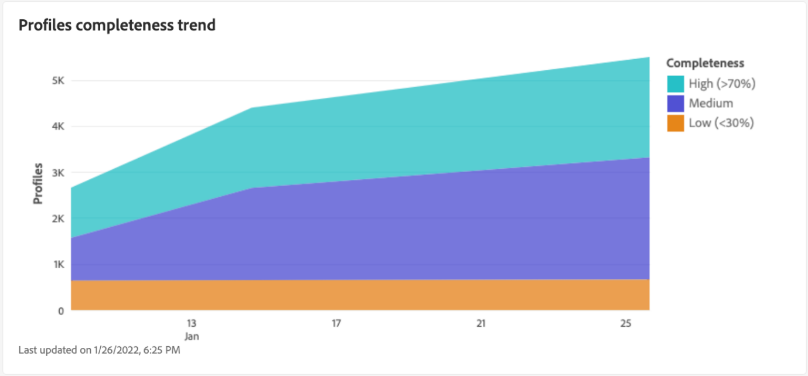

# [!UICONTROL 設定檔] 儀表板

Adobe Experience Platform使用者介面(UI)提供了一個儀表板，您可以通過該儀表板檢視有關您的解決方案的重要資訊。 [!DNL Real-Time Customer Profile] 資料，在每日快照期間擷取。 本指南概述如何存取和使用UI中的設定檔控制面板，並提供控制面板中顯示的量度相關資訊。

如需Experience Platform使用者介面中所有設定檔功能的概觀，請參閱 [Real-Time Customer Profile UI指南](../../profile/ui/user-guide.md).

## 設定檔儀表板資料

設定檔儀表板會顯示貴組織在Experience Platform的設定檔存放區中擁有的屬性（記錄）資料快照。 快照不包含任何事件（時間序列）資料。

快照中的屬性資料顯示的資料與拍攝快照的特定時間點完全相同。 換言之，快照不是資料的近似或樣本，而且「輪廓」圖示板不會即時更新。

>[!NOTE]
>
>自建立快照以來對資料所做的任何變更或更新，都不會反映在控制面板中，直到建立下一個快照為止。

## 探索設定檔儀表板

若要導覽至Platform UI中的設定檔控制面板，請選取「 」 **[!UICONTROL 設定檔]** 在左側欄中，然後選取 **[!UICONTROL 概觀]** 標籤來顯示控制面板。

>[!NOTE]
>
>如果您的組織剛開始使用Platform，但尚未建立作用中的設定檔資料集或合併原則，則不會顯示設定檔控制面板。 取而代之的是 [!UICONTROL 概觀] 索引標籤會顯示連結和檔案，以幫助您開始使用即時客戶個人檔案。

### 修改設定檔儀表板

您可以選取「 」，修改「輪廓」圖示板的外觀 **[!UICONTROL 修改儀表板]**. 這可讓您從儀表板移動、新增和移除Widget，以及存取 **[!UICONTROL Widget資料庫]** 探索可用的Widget，並為您的組織建立自訂Widget。

請參閱 [修改儀表板](../customize/modify.md) 和 [Widget程式庫概觀](../customize/widget-library.md) 檔案，以瞭解更多。

### 新增Widget {#add-widget}

選取 **[!UICONTROL 新增Widget]** 導覽至Widget程式庫，並檢視可新增至儀表板的可用Widget清單。

從Widget資料庫中，您可以瀏覽標準與自訂對象Widget的選取專案。 如需如何新增Widget的詳細資訊，請參閱Widget程式庫檔案，瞭解如何 [新增Widget](../customize/widget-library.md#add-widgets).

<!-- ## (Beta) Profile efficacy insights {#profile-efficacy-insights}

>[!IMPORTANT]
>
>The profile efficacy insight functionality is currently in beta and are not available to all users. The documentation and the functionality are subject to change.

The [!UICONTROL Efficacy] tab provides metrics on the quality and completeness of your profile data through the use of profile efficacy widgets. These widgets illustrate at a glance the composition of your profiles, trends in completeness over time, and assessments on the quality of your profile data.

See the [profile efficacy widgets section](#profile-efficacy-widgets) for more information on the widgets currently available.

The layout of this dashboard is also customizable by selecting [**[!UICONTROL Modify dashboard]**](../customize/modify.md) from the [!UICONTROL Overview] tab. -->

## 瀏覽設定檔 {#browse-profiles}

此 [!UICONTROL 瀏覽] 索引標籤可讓您搜尋和檢視擷取到您組織的唯讀設定檔。 從這裡，您可以看到屬於設定檔的重要資訊，這些資訊有關於其偏好設定、過去事件、互動和對象。

若要進一步瞭解Platform UI中提供的設定檔檢視功能，請參閱以下檔案： [在Adobe Real-time Customer Data Platform中瀏覽設定檔](../../rtcdp/profile/profile-browse.md).

## 合併政策 {#merge-policies}

設定檔控制面板中顯示的量度，是根據套用至即時客戶設定檔資料的合併原則。 將來自多個來源的資料彙集在一起以建立客戶設定檔時，資料可能包含衝突的值。 例如，一個資料集可能將客戶列為「單身」，而另一個資料集可能將客戶列為「已婚」。 合併原則的工作是決定哪些資料要優先處理，並將其顯示為設定檔的一部分。

如需有關合併原則的詳細資訊，包括如何為組織建立、編輯和宣告預設合併原則，請參閱 [合併原則概觀](../../profile/merge-policies/overview.md).

儀表板會自動選取要使用的合併原則。 您可使用合併原則名稱旁邊的下拉式選單來變更套用的合併原則。

>[!NOTE]
>
>下拉式功能表只會顯示使用 `_xdm.context.profile` 結構描述。 但是，如果貴組織已建立多個合併原則，則可能表示您需要捲動才能檢視可用合併原則的完整清單。

## 聯合結構描述

此 [!UICONTROL 聯合結構描述] 儀表板顯示特定XDM類別的聯合結構描述。 藉由選取 **[!UICONTROL 類別]** 下拉式清單，您可以檢視不同XDM類別的聯合結構描述。

聯合結構描述由共用相同類別並已為設定檔啟用的多個結構描述組成。它們可讓您在單一檢視中看到，共用相同類別的每個結構描述中包含的每個欄位都合併。

請參閱聯合結構描述UI指南以瞭解更多關於 [在Platform UI中檢視聯合結構描述](../../profile/ui/union-schema.md#view-union-schemas).

## Widget和量度

儀表板由Widget組成，這些是唯讀量度，提供有關您的設定檔資料的重要資訊。

最近一次快照的日期和時間會顯示在最上方 [!UICONTROL 概觀] 並列於合併原則下拉式清單旁的索引標籤。 截至該日期和時間，所有Widget資料都是準確的。 快照的時間戳記會以UTC提供，而不是在個別使用者或組織的時區中。

## 標準Widget {#standard-widgets}

Adobe提供多個標準Widget，您可用來視覺化與設定檔資料相關的不同量度。 您也可以使用建立自訂Widget並與您的組織共用 [!UICONTROL Widget資料庫]. 若要進一步瞭解如何建立自訂Widget，請先閱讀 [Widget程式庫概觀](../customize/widget-library.md).

若要進一步瞭解每個可用的標準Widget，請從下列清單中選取Widget的名稱：

* [[!UICONTROL 設定檔計數]](#profile-count)
* [[!UICONTROL 設定檔計數趨勢]](#profile-count-trend)
* [[!UICONTROL 設定檔計數變更]](#profile-count-change)
* [[!UICONTROL 設定檔計數變更趨勢]](#profiles-count-change-trend)
* [[!UICONTROL 依身分列出的設定檔計數變更趨勢]](#profiles-count-change-trend-by-identity)
* [[!UICONTROL 依身分識別劃分的設定檔]](#profiles-by-identity)
* [[!UICONTROL 身分識別覆蓋]](#identity-overlap)
* [[!UICONTROL 單一身分識別設定檔]](#single-identity-profiles)
* [[!UICONTROL 依身分割槽分的單一身分設定檔]](#single-identity-profiles-by-identity)
* [[!UICONTROL 無區段設定檔]](#unsegmented-profiles)
* [[!UICONTROL 未分段的設定檔變化趨勢]](#unsegmented-profiles-change-trend)
* [[!UICONTROL 依身分識別劃分的無區段設定檔]](#unsegmented-profiles-by-identity)
* [[!UICONTROL 對象]](#audiences)
* [[!UICONTROL 對應到目的地狀態的對象]](#audiences-mapped-to-destination-status)
* [[!UICONTROL 對象人數]](#audiences-size)
* [[!UICONTROL 依合併原則區分的對象重疊]](#audience-overlap-by-merge-policy)
* [[!UICONTROL 對象重疊報表]](#audience-overlap-report)

### [!UICONTROL 設定檔計數] {#profile-count}

>[!CONTEXTUALHELP]
>id="platform_dashboards_profiles_profilecount"
>title="設定檔計數"
>abstract="此 Widget 會顯示取得快照時設定檔存放區內合併的設定檔總數。該數量取決於套用至您設定檔資料的所選合併原則。"

此 **[!UICONTROL 設定檔計數]** widget會顯示拍攝快照時設定檔存放區中合併的設定檔總數。 此數字是已將選取的合併原則套用至您的設定檔資料的結果，以便將設定檔片段合併在一起，為每個個人形成一個設定檔。

請參閱 [本檔案中關於合併原則的章節](#merge-policies) 以深入瞭解。

>[!NOTE]
>
>此 [!UICONTROL 設定檔計數] Widget顯示的數字可能會與上顯示的設定檔計數不同。 [!UICONTROL 瀏覽] 索引標籤中的 [!UICONTROL 設定檔] 部分。 最常見的原因是 [!UICONTROL 瀏覽] 索引標籤會根據貴組織的預設合併原則來參考合併的設定檔總數，而 [!UICONTROL 設定檔計數] Widget會根據您選取在儀表板中檢視的合併原則，參照合併的設定檔總數。
>
>另一個常見原因是擷取儀表板快照的時間與執行範例作業的時間不同。 [!UICONTROL 瀏覽] 標籤。 您會看到 [!UICONTROL 設定檔計數] Widget上次更新是透過檢視Widget上的時間戳記進行。 若要進一步瞭解範例工作如何在 [!UICONTROL 瀏覽] 標籤中，請參閱 [即時客戶設定檔UI指南中的設定檔計數區段](https://experienceleague.adobe.com/docs/experience-platform/profile/ui/user-guide.html?lang=en#profile-count).

### [!UICONTROL 設定檔計數趨勢] {#profile-count-trend}

此 [!UICONTROL 設定檔計數趨勢] Widget使用線圖來說明系統中包含的設定檔總數隨時間變化的趨勢。 此總數包含自上次每日快照以來匯入系統的任何設定檔。 30天、90天和12個月期間的資料都可視覺化。 從Widget的下拉式選單中選擇時段。

### [!UICONTROL 設定檔計數變更] {#profile-count-change}

>[!CONTEXTUALHELP]
>id="platform_dashboards_profiles_profilescountchange"
>title="設定檔計數變更"
>abstract="此 Widget 會顯示上一次快照時&#x200B;**新增**&#x200B;至設定檔存放區之合併的設定檔總數。該數量取決於套用至您設定檔資料的所選合併原則。"

此 **[!UICONTROL 設定檔計數變更]** Widget會顯示自上次快照以來，新增至設定檔存放區的合併設定檔數目。 此數字是已將選取的合併原則套用至您的設定檔資料的結果，以便將設定檔片段合併在一起，為每個個人形成一個設定檔。 您可以使用下拉式選擇器來檢視過去30天、90天或12個月內新增的設定檔數量。

>[!NOTE]
>
>此 [!UICONTROL 設定檔計數變更] Widget會反映新增的設定檔數量 **晚於** 初始設定檔擷取和設定檔存放區設定。 換言之，如果您的組織設定了設定檔存放區，並在第1天擷取了4,000,000個設定檔，則儀表板將在24小時內可用，但 [!UICONTROL 設定檔計數變更] widget會設為0。 這樣做是為了避免與初始將設定檔擷取到系統相關的尖峰。 在接下來的30天內，您的組織會額外擷取1,000,000個設定檔至設定檔存放區。 拍攝下一個快照後， [!UICONTROL 設定檔計數變更] widget會顯示總共新增1,000,000個設定檔，而 [!UICONTROL 設定檔計數] widget總共會顯示5,000,000個設定檔。

### [!UICONTROL 設定檔計數變更趨勢] {#profiles-count-change-trend}

>[!CONTEXTUALHELP]
>id="platform_dashboards_profiles_profilesaddedtrend"
>title="設定檔計數變更趨勢"
>abstract="此 Widget 會顯示在過去 30 天、90 天或 12 個月內每天新增至設定檔存放區之合併設定檔的數量。該數量也取決於套用至您設定檔資料的所選合併原則。"

此 **[!UICONTROL 設定檔計數變更趨勢]** widget會顯示過去30天、90天或12個月中，每日新增至設定檔存放區的合併設定檔總數。 此數字會在每天擷取快照時更新，因此，如果您要將設定檔擷取到Platform，則在擷取下一個快照時才會反映設定檔的數量。 新增的設定檔計數是所選合併原則套用至設定檔資料的結果，以便將設定檔片段合併在一起，為每個個人形成一個設定檔。

請參閱 [本檔案中關於合併原則的章節](#merge-policies) 以深入瞭解。

此 **[!UICONTROL 設定檔計數變更趨勢]** Widget會在Widget的右上角顯示「註解」按鈕。 選取 **[!UICONTROL 註解]** 以開啟自動註解對話方塊。

機器學習模型會通過分析圖表和資料自動產生描述主要趨勢和重要事件的字幕。 註解會根據註解新增至圖表。 選取註解以專注於其對應的註解。

### [!UICONTROL 依身分列出的設定檔計數變更趨勢] {#profiles-count-change-trend-by-identity}

<!-- This widget uses a line graph to illustrate the change in number of profiles filtered by a chosen source identity and merge policy. -->

此Widget會根據選取的來源身分和合併原則來篩選設定檔計數，然後使用線圖來說明各種期間的數目變更。 從頁面頂端的概述下拉式清單中選取合併原則，從Widget下拉式選單中選取來源身分和時段。 趨勢可以視覺化呈現超過30天、90天和12個月期間。

此Widget可示範依所需身分篩選的設定檔成長模式，協助您管理目的地啟用需求。

### [!UICONTROL 依身分識別劃分的設定檔] {#profiles-by-identity}

>[!CONTEXTUALHELP]
>id="platform_dashboards_profiles_profilesbyidentity"
>title="依身分識別劃分的設定檔"
>abstract="此 Widget 會顯示設定檔存放區中依身分劃分的所有合併的設定檔。"

此 **[!UICONTROL 依身分割槽分的設定檔]** widget會顯示您的個人資料存放區中所有合併個人資料的身分劃分。 依身分割槽分的設定檔總數（換言之，將針對每個名稱空間顯示的值相加）可能會高於合併的設定檔總數，因為一個設定檔可能會有多個相關聯的名稱空間。 例如，如果客戶在多個頻道上與您的品牌互動，則多個名稱空間會與該個別客戶相關聯。

請參閱 [本檔案中關於合併原則的章節](#merge-policies) 以深入瞭解。

選取 **[!UICONTROL 註解]** 以開啟自動註解對話方塊。

機器學習模型會通過分析資料的整體分佈和關鍵維度來自動產生資料見解。

若要進一步瞭解身分，請造訪 [Adobe Experience Platform Identity Service檔案](../../identity-service/home.md).

### [!UICONTROL 身分識別覆蓋] {#identity-overlap}

>[!CONTEXTUALHELP]
>id="platform_dashboards_profiles_identityoverlap"
>title="身分識別覆蓋"
>abstract="此 Widget 會使用文氏圖表顯示設定檔存放區中包含兩個所選身分的設定檔覆蓋。"

此 **[!UICONTROL 身分重疊]** Widget會使用Venn圖表或設定圖表，顯示個人資料存放區中包含兩個所選身分識別的重疊個人資料。

使用Widget下拉式選單來選取您要比較的身分。 圓圈會顯示包含每個身分的設定檔相對總數。 包含兩個身分的設定檔數目會以圓圈之間的重疊大小表示。 如果客戶在多個頻道上與您的品牌互動，則多個身分將會與該個別客戶相關聯，因此您的組織可能會有多個包含多個身分識別片段的設定檔。

如需設定檔片段的詳細資訊，請參閱以下章節： [設定檔片段與合併的設定檔](https://experienceleague.adobe.com/docs/experience-platform/profile/home.html?lang=en#profile-fragments-vs-merged-profiles) 在即時客戶個人檔案總覽中。

若要進一步瞭解身分，請造訪 [Adobe Experience Platform Identity Service檔案](../../identity-service/home.md).

### [!UICONTROL 單一身分識別設定檔] {#single-identity-profiles}

>[!CONTEXTUALHELP]
>id="platform_dashboards_profiles_singleidentityprofiles"
>title="單一身分識別設定檔"
>abstract="此 Widget 會提供您組織的設定檔計數，這些設定檔只有一種可以建立其身分識別的 ID 類型。此 ID 類型可以是電子郵件或 ECID。"

此 [!UICONTROL 單一身分設定檔] widget會提供貴組織設定檔的計數，而這些設定檔只有一種建立其身分識別的ID型別。 此 ID 類型可以是電子郵件或 ECID。設定檔計數是從最近快照中所包含的資料產生的。

### [!UICONTROL 依身分割槽分的單一身分設定檔] {#single-identity-profiles-by-identity}

此Widget使用長條圖來說明僅以單一唯一識別碼識別的設定檔總數。 Widget支援最多五個最常發生的身分識別。

將滑鼠停留在個別長條上，即可檢視詳細說明身分之設定檔總數的對話方塊。

### [!UICONTROL 無區段設定檔] {#unsegmented-profiles}

>[!CONTEXTUALHELP]
>id="platform_dashboards_profiles_unsegmentedprofiles"
>title="無區段設定檔"
>abstract="此 Widget 會提供未附加到任何對象的所有設定檔總數，代表在整個組織中啟用設定檔的機會。"

此 [!UICONTROL 未分段的設定檔] widget會提供未附加至任何對象的所有設定檔總數。 產生的數字自上次快照以來都是準確的，代表您組織內個人資料啟用的機會。 這也表示有機會淘汰未提供足夠ROI的個人檔案。

### [!UICONTROL 未分段的設定檔變化趨勢] {#unsegmented-profiles-change-trend}

>[!CONTEXTUALHELP]
>id="platform_dashboards_profiles_unsegmentedprofilestrend"
>title="無區段設定檔趨勢"
>abstract="此 Widget 會提供一個折線圖，說明在特定時段內未附加到任何對象的所有設定檔數量。可以將 30 天、90 天和 12 個月時段內未附加到任何對象的設定檔趨勢視覺化。"

此 [!UICONTROL 未分段的設定檔變化趨勢] Widget使用線圖來說明自上次每日快照以來新增的未附加至任何對象的設定檔數量。 未附加至任何對象的設定檔變化趨勢可以在30天、90天和12個月期間進行視覺化。 從Widget的下拉式選單中選擇時段。 輪廓計數會反映在y軸上，而時間則反映在x軸上。

### [!UICONTROL 依身分識別劃分的無區段設定檔] {#unsegmented-profiles-by-identity}

>[!NOTE]
>
>「依身分識別Widget區分的未分段設定檔」自2022年10月起已過時，不再提供。

<!-- 

>[!CONTEXTUALHELP]
>id="platform_dashboards_profiles_unsegmentedprofilesbyidentity"
>title="Unsegmented profiles by identity"
>abstract="This widget categorizes the total number of unsegmented profiles by their unique identifier."

The [!UICONTROL Unsegmented Profiles by Identity] widget categorizes the total number of unsegmented profiles by their unique identifier. The data is visualized in a bar chart for ease of comparison. 

 -->

### [!UICONTROL 對象] {#audiences}

此Widget會根據套用至您設定檔資料的所選合併原則，提供準備好啟用的對象總數。

選取 **[!UICONTROL 受眾]** 導覽至 [!UICONTROL 區段] 儀表板 [!UICONTROL 瀏覽] 標籤。 您可以在此檢視組織的所有區段定義清單。

<!-- https://jira.corp.adobe.com/browse/PLAT-115291 -->

<!-- * [[!UICONTROL Audiences change trend]](#audiences-change-trend) -->
<!-- ### [!UICONTROL Audiences change trend] {#audiences-change-trend}

This line graph widget visualizes the change in the total number of audiences each day, trending over time. The change in the number of audiences is dependent on the selected merge policy being applied to your profile data. The period of analysis is selected from the widget dropdown menu. The bar chart can be visualized over 30 days, 90 days, and 12-month periods.  

The visualization allows you to monitor the overall health of audiences within Adobe Experience Platform by understanding trends in the growth or decline of the total number of audiences. -->

<!--  -->

### [!UICONTROL 對象重疊報表] {#audience-overlap-report}

此Widget會將合併原則所篩選之所有可用受眾的資料重疊以表格方式排列。 從畫面頂端的下拉式選單中選擇合併原則，系統會提供從最高重疊百分比到最低重疊百分比排名的五個對象清單。 兩個已分析的對象會列於 [!UICONTROL 對象A名稱] 和 [!UICONTROL 對象B名稱] 欄。 第三欄提供精確到十二位小數的重疊百分比。

對象重疊報表可協助您建立新的高效能對象。 觀察高百分比的重疊可讓您抑制受眾，並防止將相同的受眾傳送至不同的目的地。 它們也可協助您識別隱藏的深入分析，可能有助於更佳的分段。 低百分比重疊有助於找到要追蹤的不重複設定檔。

選取 **[!UICONTROL 檢視更多]** 以開啟包含更多對象重疊資料的全熒幕對話方塊。

此 [!UICONTROL 對象重疊報表] 對話方塊隨即顯示。 此對話方塊最多可包含50列對象重疊分析，並分為6欄。 選取設定圖示()，以從表格中移除或新增欄。

>[!NOTE]
>
>選取 **[!UICONTROL 重疊]** 欄標題，將結果的排名從最高變更為最低，或從最低變更為最高。

若要以PDF格式下載整個報表，請選取選項功能表(**`...`**)後接 **[!UICONTROL 下載]**.

從報表中選取一列，以開啟重疊分析的文氏圖表。 將滑鼠游標停留在文氏圖表的某個區段上，即可在對話方塊中檢視設定檔計數。

選取 **[!UICONTROL 關閉]** 以返回 [!UICONTROL 設定檔] 儀表板。

### [!UICONTROL 對應到目的地狀態的對象] {#audiences-mapped-to-destination-status}

此 [!UICONTROL 對應到目的地狀態的對象] Widget會顯示單一量度中已對應和未對應的對象總數，並使用環圈圖來說明總數之間的比例差異。 計算出的數字取決於所選的合併原則。

當游標暫留在環圈圖的個別區段上時，對應或未對應對象的個別計數會顯示在對話方塊中。

### [!UICONTROL 對象人數] {#audiences-size}

此 [!UICONTROL 對象人數] widget提供兩欄表格，列出最多20個對象的名稱以及每個對象中包含的設定檔總數。 清單會根據對象中包含的設定檔總數從高到低排序。 對象人數總計取決於套用的合併原則。

若要檢視對象的完整資訊，請從提供的清單中選取對象名稱，以導覽至 [!UICONTROL 受眾] [!UICONTROL 詳細資訊] 頁面。 此外，透過選取 **[!UICONTROL 檢視所有對象]** 從Widget的結尾，您可以導覽至 [!UICONTROL 受眾] [!UICONTROL 瀏覽] 索引標籤以尋找任何現有的對象。

請參閱檔案以取得以下專案的詳細資訊： [[!UICONTROL 受眾] [!UICONTROL  瀏覽] 標籤](https://experienceleague.adobe.com/docs/experience-platform/segmentation/ui/overview.html#browse).

### [!UICONTROL 依合併原則區分的對象重疊] {#audience-overlap-by-merge-policy}

此Widget使用文氏圖表來顯示兩個所選對象之間的重疊。 合併原則是從頁面頂端的概述下拉式清單中選取，而要分析的對象是從介面工具內的兩個下拉式選單中選取。 將滑鼠懸停在圓形或交集上，可以看到相關區段定義中包含的輪廓總數。

由於Widget會顯示區段定義的視覺交叉，您可以透過研究區段定義之間的相似性來最佳化分段策略。

<!-- ## (Beta) Profile efficacy widgets {#profile-efficacy-widgets}

>[!IMPORTANT]
>
>The profile efficacy widgets are currently in Beta and are not available to all users. The documentation and the functionality are subject to change.

Adobe provides multiple widgets to assess the completeness of the ingested profiles available for your data analysis. Each of the profile efficacy widgets can be filtered by the merge policy. To change the merge policy filter, select the[!UICONTROL Profiles using merge policy] dropdown and choose the appropriate policy from the available list.

To learn more about each of the profile efficacy widgets, select the name of a widget from the following list:

* [[!UICONTROL Attribute quality assessment]](#attributes-quality-assessment)
* [[!UICONTROL Profiles by completeness]](#profiles-by-completeness)
* [[!UICONTROL Profiles completeness trend]](#profiles-completeness-trend)

### (Beta) [!UICONTROL Attributes quality assessment] {#attributes-quality-assessment}

>[!CONTEXTUALHELP]
>id="platform_dashboards_profiles_attributesqualityassessment"
>title="Attributes quality assessment"
>abstract="This widget shows the completeness and cardinality of all profiles according to their attributes. Each row describes one attribute. The **Profiles** column provides the number of profiles that have this attribute and are filled with non-null values. The **Completeness** percentage is determined by the total number of profiles that have this attribute and are filled with non-null values divided by the total number of non-empty values in the profiles for that attribute. **Cardinality** provides the total number of unique non-null values of this attribute across all attributes."

The [!UICONTROL Attribute quality assessment] widget shows the completeness and cardinality of all profiles according to their attributes. The data is accurate to the last processing date. This information is presented as a table with four columns where each row in the table represents a single attribute.

| Column  | Description  |
|---|---|
| Attribute  | The name of the attribute.  |
| Profiles  | The number of profiles that have this attribute and are filled with non-null values.  |
| Completeness  | This percentage is determined by the total number of profiles that have this attribute and are filled with non-null values. The number is calculated by dividing the total number of profiles by the total number of non-empty values in the profiles for that attribute.  |
| Cardinality  | The total number of **unique** non-null values of this attribute. It is measured across all profiles. |

### (Beta) [!UICONTROL Profiles by completeness] {#profiles-by-completeness}

>[!CONTEXTUALHELP]
>id="platform_dashboards_profiles_profilesbycompleteness"
>title="Profiles by completeness"
>abstract="The donut chart displays the percentage of profile attributes that are filled with non-null values among all observed attributes. It illustrates the proportion of profiles that are of high, medium, or low completeness. High completeness profiles have more than 70% of their attributes filled. Medium completeness profiles have between 30% and 70% of their attributes filled. Low completeness profiles have less than 30% of their attributes filled."

The [!UICONTROL Profiles by completeness] widget creates a donut chart of profile completeness since the last processing date. The completeness of a profile is measured by the percentage of attributes that are filled with non-null values among all observed attributes.

This widget shows the proportion of profiles that are of high, medium, or low completeness. By default, there are three levels of completeness configured: 

* High completeness: Profiles have more than 70% of their attributes filled. 
* Medium completeness: Profiles have between 30% and 70% of their attributes filled. 
* Low completeness: Profiles have less than 30% of their attributes filled. 

### (Beta) [!UICONTROL Profiles completeness trend] {#profiles-completeness-trend}

>[!CONTEXTUALHELP]
>id="platform_dashboards_profiles_profilescompletenesstrend"
>title="Profiles completeness trend"
>abstract="This widget creates a stacked area chart to depict the trend of profile completeness over time. Completeness is measured by the percentage of attributes that are filled with non-null values among all observed attributes."

This widget creates a stacked area chart to depict the trend of profile completeness over time. Completeness is measured by the percentage of attributes filled with non-null values among all observed attributes. It categorizes the profile completeness as high, medium, or low completeness since the last processing date.

The x-axis represents time, the y-axis represents the number of profiles, and the colors represent the three levels of profile completeness. 

The three levels of completeness are:

* High completeness: Profiles have more than 70% of attributes filled. 
* Medium completeness: Profiles have less than 70% and more than 30% of attributes filled. 
* Low completeness: Profiles have less than 30% of attributes filled.

 -->

## 後續步驟

依照此檔案，您現在應該能夠找到設定檔控制面板，並瞭解可用介面工具列中顯示的量度。 若要進一步瞭解使用 [!DNL Profile] Experience PlatformUI中的資料，請參閱 [Real-Time Customer Profile UI指南](../../profile/ui/user-guide.md).
