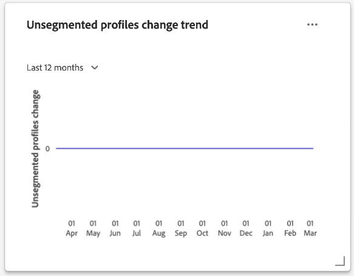

# [!UICONTROL 配置檔案] 儀表板

Adobe Experience Platform用戶介面(UI)提供了一個儀表板，您可以通過該儀表板查看有關 [!DNL Real-Time Customer Profile] 資料，在每日快照期間捕獲。 本指南概述了如何訪問和使用UI中的「配置式」儀表板，並提供了有關儀表板中顯示的度量的資訊。

有關Experience Platform用戶介面中所有配置式功能的概述，請參閱 [即時客戶概要檔案UI指南](../../profile/ui/user-guide.md)。

## 配置檔案儀表板資料

「配置式」控制面板顯示您的組織在「配置式儲存」Experience Platform中擁有的屬性（記錄）資料的快照。 快照不包括任何事件（時間系列）資料。

快照中的屬性資料與拍攝快照時在特定時間點顯示的資料完全相同。 換句話說，快照不是資料的近似值或示例，而「配置檔案」儀表板不會即時更新。

>[!NOTE]
>
>自拍攝快照以來對資料所做的任何更改或更新不會反映在儀表板中，直到拍攝下一個快照。

## 瀏覽配置檔案儀表板

要導航到平台UI中的「配置式」儀表板，請選擇 **[!UICONTROL 配置檔案]** 在左滑軌中，選擇 **[!UICONTROL 概述]** 頁籤。

>[!NOTE]
>
>如果您的組織是新加入平台的，並且尚未建立活動的配置檔案資料集或合併策略，則「配置檔案」控制板不可見。 相反， [!UICONTROL 概述] 頁籤顯示幫助您開始使用即時客戶配置檔案的連結和文檔。

### 修改配置檔案操控板

通過選擇 **[!UICONTROL 修改儀表板]**。 這使您能夠從儀表板中移動、添加和刪除小部件，以及訪問 **[!UICONTROL 小部件庫]** 瀏覽可用小部件，並為您的組織建立自定義小部件。

請參閱 [修改儀表板](../customize/modify.md) 和 [小部件庫概述](../customize/widget-library.md) 文檔以瞭解詳細資訊。

### 添加小部件 {#add-widget}

選擇 **[!UICONTROL 添加小部件]** 導航到小部件庫，並查看要添加到儀表板的可用小部件的清單。

從小部件庫中，您可以瀏覽選擇的標準小部件和自定義小部件。有關如何添加小部件的資訊，請參閱小部件庫文檔，瞭解如何 [添加小部件](../customize/widget-library.md#add-widgets)。

<!-- ## (Beta) Profile efficacy insights {#profile-efficacy-insights}

>[!IMPORTANT]
>
>The profile efficacy insight functionality is currently in beta and are not available to all users. The documentation and the functionality are subject to change.

The [!UICONTROL Efficacy] tab provides metrics on the quality and completeness of your profile data through the use of profile efficacy widgets. These widgets illustrate at a glance the composition of your profiles, trends in completeness over time, and assessments on the quality of your profile data.

See the [profile efficacy widgets section](#profile-efficacy-widgets) for more information on the widgets currently available.

The layout of this dashboard is also customizable by selecting [**[!UICONTROL Modify dashboard]**](../customize/modify.md) from the [!UICONTROL Overview] tab. -->

## 瀏覽配置檔案 {#browse-profiles}

的 [!UICONTROL 瀏覽] 頁籤允許您搜索和查看導入到您的組織中的只讀配置檔案。 從此處，您可以看到屬於配置檔案的重要資訊，這些資訊涉及其首選項、過去的事件、交互和段

要瞭解有關平台UI中提供的配置檔案查看功能的詳細資訊，請參閱上的文檔 [瀏覽Adobe Real-time Customer Data Platform個人資料](../../rtcdp/profile/profile-browse.md)。

## 合併策略 {#merge-policies}

「配置式」控制面板中顯示的度量基於應用於即時客戶配置檔案資料的合併策略。 當從多個源將資料匯集到一起以建立客戶配置檔案時，資料可能包含衝突的值。 例如，一個資料集可以將客戶列為「單一」，而另一個資料集可以將客戶列為「已婚」。 合併策略的任務是確定哪些資料要作為配置檔案的一部分進行優先順序排序和顯示。

有關合併策略的詳細資訊，包括如何為您的組織建立、編輯和聲明預設合併策略，請參閱 [合併策略概述](../../profile/merge-policies/overview.md)。

儀表板將自動選擇要使用的合併策略。 可以使用合併策略名稱旁邊的下拉菜單更改應用的合併策略。

>[!NOTE]
>
>下拉菜單僅顯示使用 `_xdm.context.profile` 架構。 但是，如果您的組織已建立多個合併策略，則可能意味著您需要滾動才能查看可用合併策略的完整清單。

## 聯合架構

的 [!UICONTROL 聯合架構] 儀表板顯示特定XDM類的聯合架構。 通過選擇 **[!UICONTROL 類]** 下拉菜單，可以查看不同XDM類的聯合架構。

聯合結構描述由共用相同類別並已為設定檔啟用的多個結構描述組成。它們使您能夠在單個視圖中查看，即共用同一類的每個架構中包含的每個欄位的合併。

請參閱聯合架構UI指南以瞭解有關 [查看平台UI中的聯合架構](../../profile/ui/union-schema.md#view-union-schemas)。

## 小部件和度量

儀表板由小部件組成，這些部件是只讀度量，提供有關配置檔案資料的重要資訊。

最近快照的日期和時間顯示在 [!UICONTROL 概述] 頁籤。 截至該日期和時間，所有小部件資料都準確。 快照的時間戳以UTC提供；它不在單個用戶或組織的時區中。

## 標準小部件 {#standard-widgets}

Adobe提供了多個標準小部件，您可以使用這些小部件來可視化與配置檔案資料相關的不同度量。 您也可以使用 [!UICONTROL 小部件庫]。 要瞭解有關建立自定義小部件的詳細資訊，請首先閱讀 [小部件庫概述](../customize/widget-library.md)。

要瞭解有關每個可用標準小部件的詳細資訊，請從以下清單中選擇小部件的名稱：

* [[!UICONTROL 設定檔計數]](#profile-count)
* [[!UICONTROL 配置檔案計數趨勢]](#profile-count-trend)
* [[!UICONTROL 設定檔計數變更]](#profile-count-change)
* [[!UICONTROL 設定檔計數變更趨勢]](#profiles-count-change-trend)
* [[!UICONTROL 配置檔案計數按標識的更改趨勢]](#profiles-count-change-trend-by-identity)
* [[!UICONTROL 依身分識別劃分的設定檔]](#profiles-by-identity)
* [[!UICONTROL 身分識別覆蓋]](#identity-overlap)
* [[!UICONTROL 單一身分識別設定檔]](#single-identity-profiles)
* [[!UICONTROL 單個身份配置檔案（按身份）]](#single-identity-profiles-by-identity)
* [[!UICONTROL 無區段設定檔]](#unsegmented-profiles)
* [[!UICONTROL 未分段配置檔案更改趨勢]](#unsegmented-profiles-change-trend)
* [[!UICONTROL 依身分識別劃分的無區段設定檔]](#unsegmented-profiles-by-identity)
* [[!UICONTROL 受眾]](#audiences)
* [[!UICONTROL 映射到目標狀態的受眾]](#audiences-mapped-to-destination-status)
* [[!UICONTROL 觀眾大小]](#audiences-size)
* [[!UICONTROL 按合併策略的受眾重疊]](#audience-overlap-by-merge-policy)
* [[!UICONTROL 受眾重疊報告]](#audience-overlap-report)

### [!UICONTROL 設定檔計數] {#profile-count}

>[!CONTEXTUALHELP]
>id="platform_dashboards_profiles_profilecount"
>title="設定檔計數"
>abstract="此 Widget 會顯示取得快照時設定檔存放區內合併的設定檔總數。該數量取決於套用至您設定檔資料的所選合併原則。"

的 **[!UICONTROL 配置檔案計數]** 小部件顯示拍攝快照時配置檔案儲存中合併的配置檔案總數。 此數字是將所選合併策略應用於配置檔案資料的結果，以便將配置檔案片段合併到一起，為每個個體形成單個配置檔案。

查看 [本文檔前面的合併策略部分](#merge-policies) 來瞭解更多資訊。

>[!NOTE]
>
>的 [!UICONTROL 配置檔案計數] 小部件可能顯示的數字與在 [!UICONTROL 瀏覽] 的 [!UICONTROL 配置檔案] 的子菜單。 最常見的原因是 [!UICONTROL 瀏覽] 頁籤引用基於組織的預設合併策略的合併配置檔案總數，而 [!UICONTROL 配置檔案計數] 構件引用基於選定要在儀表板中查看的合併策略的合併配置檔案總數。
>
>另一個常見原因是由於獲取儀表板快照的時間與為 [!UICONTROL 瀏覽] 頁籤。 您可以看到 [!UICONTROL 配置檔案計數] 通過查看小部件上的時間戳上次更新小部件。 要瞭解有關如何在上觸發示例作業的詳細資訊，請 [!UICONTROL 瀏覽] ，請參閱 [「Real-Time Customer Profile UI指南」中的「配置檔案計數」部分](https://experienceleague.adobe.com/docs/experience-platform/profile/ui/user-guide.html?lang=en#profile-count)。

### [!UICONTROL 配置檔案計數趨勢] {#profile-count-trend}

的 [!UICONTROL 配置檔案計數趨勢] 小部件使用線形圖來說明一段時間內系統中包含的配置檔案總數的趨勢。 此總數包括自上次每日快照後導入到系統的任何配置檔案。 資料可以在30天、90天和12個月期間進行可視化。 時間段從小部件的下拉菜單中選擇。

### [!UICONTROL 設定檔計數變更] {#profile-count-change}

>[!CONTEXTUALHELP]
>id="platform_dashboards_profiles_profilescountchange"
>title="設定檔計數變更"
>abstract="此 Widget 會顯示上一次快照時&#x200B;**新增**&#x200B;至設定檔存放區之合併的設定檔總數。該數量取決於套用至您設定檔資料的所選合併原則。"

的 **[!UICONTROL 配置檔案計數更改]** 構件顯示自上一個快照後添加到配置檔案儲存的合併配置檔案數。 此數字是將所選合併策略應用於配置檔案資料的結果，以便將配置檔案片段合併到一起，為每個個體形成單個配置檔案。 您可以使用下拉選擇器查看過去30天、90天或12個月中添加的配置檔案數。

>[!NOTE]
>
>的 [!UICONTROL 配置檔案計數更改] 構件反映添加的配置檔案數 **後** 初始配置檔案接收和配置檔案儲存設定。 換句話說，如果您的組織在第1天設定了配置檔案儲存並接收了4,000,000，那麼在24小時內，儀表板將可用，但 [!UICONTROL 配置檔案計數更改] 小部件將設定為0。 這樣做是為了避免與將配置檔案初始接收到系統中相關的尖峰。 在接下來的30天中，您的組織將另外1,000,000個配置檔案添加到配置檔案儲存中。 拍攝下一個快照後， [!UICONTROL 配置檔案計數更改] 小部件將顯示添加的共1,000,000個配置檔案，而 [!UICONTROL 配置檔案計數] 小部件將顯示5,000,000個配置檔案。

### [!UICONTROL 設定檔計數變更趨勢] {#profiles-count-change-trend}

>[!CONTEXTUALHELP]
>id="platform_dashboards_profiles_profilesaddedtrend"
>title="設定檔計數變更趨勢"
>abstract="此 Widget 會顯示在過去 30 天、90 天或 12 個月內每天新增至設定檔存放區之合併設定檔的數量。該數量也取決於套用至您設定檔資料的所選合併原則。"

的 **[!UICONTROL 配置檔案計數更改趨勢]** 構件顯示過去30天、90天或12個月中每天添加到配置檔案儲存的合併配置檔案總數。 此數字在每天拍攝快照時都會更新，因此，如果要將配置式導入到平台中，則在拍攝下一個快照之前不會反映配置檔案的數量。 添加的配置檔案計數是將所選合併策略應用於配置檔案資料的結果，以便將配置檔案片段合併到一起，為每個個體形成單個配置檔案。

查看 [本文檔前面的合併策略部分](#merge-policies) 來瞭解更多資訊。

的 **[!UICONTROL 配置檔案計數更改趨勢]** 小部件在小部件的右上角顯示「字幕」按鈕。 選擇 **[!UICONTROL 字幕]** 的子菜單。

機器學習模型通過分析圖表和資料自動生成描述關鍵趨勢和重要事件的字幕。 根據字幕將注釋添加到圖表。 選擇標題以聚焦其相應注釋。

### [!UICONTROL 配置檔案計數按標識的更改趨勢] {#profiles-count-change-trend-by-identity}

<!-- This widget uses a line graph to illustrate the change in number of profiles filtered by a chosen source identity and merge policy. -->

此小部件基於選定的源標識和合併策略篩選配置檔案計數，然後使用線形圖說明不同期間的編號變化。 合併策略從頁面頂部的概述下拉清單中選擇，源標識和時間段從構件下拉菜單中選擇。 該趨勢可以在30天、90天和12個月期間進行可視化。

此小部件通過演示按所需身份篩選的配置檔案的增長模式，幫助您管理目標激活需求。

### [!UICONTROL 依身分識別劃分的設定檔] {#profiles-by-identity}

>[!CONTEXTUALHELP]
>id="platform_dashboards_profiles_profilesbyidentity"
>title="依身分識別劃分的設定檔"
>abstract="此 Widget 會顯示設定檔存放區中依身分劃分的所有合併的設定檔。"

的 **[!UICONTROL 按身份顯示的配置檔案]** 小部件顯示配置檔案儲存中所有合併配置檔案的標識細分。 按標識列出的配置檔案總數（即，將每個命名空間顯示的值相加）可能高於合併的配置檔案總數，因為一個配置檔案可能具有與其關聯的多個命名空間。 例如，如果客戶在多個渠道上與您的品牌進行交互，則多個命名空間將與該客戶關聯。

查看 [本文檔前面的合併策略部分](#merge-policies) 來瞭解更多資訊。

選擇 **[!UICONTROL 字幕]** 的子菜單。

機器學習模型通過分析資料的總體分佈和關鍵維度自動生成資料洞察力。

要瞭解有關身份的詳細資訊，請訪問 [Adobe Experience Platform身份服務文檔](../../identity-service/home.md)。

### [!UICONTROL 身分識別覆蓋] {#identity-overlap}

>[!CONTEXTUALHELP]
>id="platform_dashboards_profiles_identityoverlap"
>title="身分識別覆蓋"
>abstract="此 Widget 會使用文氏圖表顯示設定檔存放區中包含兩個所選身分的設定檔覆蓋。"

的 **[!UICONTROL 身份重疊]** 小部件使用Venn圖或設定圖來顯示配置檔案儲存中包含兩個選定標識的配置檔案的重疊。

使用小部件下拉菜單選擇要比較的身份。 圓顯示包含每個標識的配置檔案的相對總計。 包含兩個身份的輪廓的數量由圓之間重疊的大小表示。 如果客戶在多個渠道上與您的品牌進行交互，則多個身份將與該個別客戶關聯，因此您的組織很可能具有多個配置檔案，其中包含來自多個身份的片段。

有關配置檔案片段的詳細資訊，請參閱上 [配置檔案片段與合併的配置檔案](https://experienceleague.adobe.com/docs/experience-platform/profile/home.html?lang=en#profile-fragments-vs-merged-profiles) 即時客戶概要資訊概述中。

要瞭解有關身份的詳細資訊，請訪問 [Adobe Experience Platform身份服務文檔](../../identity-service/home.md)。

### [!UICONTROL 單一身分識別設定檔] {#single-identity-profiles}

>[!CONTEXTUALHELP]
>id="platform_dashboards_profiles_singleidentityprofiles"
>title="單一身分識別設定檔"
>abstract="此 Widget 會提供您組織的設定檔計數，這些設定檔只有一種可以建立其身分識別的 ID 類型。此 ID 類型可以是電子郵件或 ECID。"

的 [!UICONTROL 單個身份配置檔案] 小部件提供了組織的配置檔案計數，這些配置檔案只具有一種類型的ID類型，可建立其標識。 此 ID 類型可以是電子郵件或 ECID。配置檔案計數是從最近快照中包含的資料生成的。

### [!UICONTROL 單個身份配置檔案（按身份）] {#single-identity-profiles-by-identity}

此小部件使用條形圖來說明僅使用單個唯一標識符標識的配置檔案總數。 該小部件最多支援五種最常見的身份。

將滑鼠懸停在各個條上，查看一個對話框，詳細列出標識的配置檔案總數。

### [!UICONTROL 無區段設定檔] {#unsegmented-profiles}

>[!CONTEXTUALHELP]
>id="platform_dashboards_profiles_unsegmentedprofiles"
>title="無區段設定檔"
>abstract="此 Widget 會提供未附加到任何區段的所有設定檔總數，代表在整個組織中啟用設定檔的機會。"

的 [!UICONTROL 未分段的配置檔案] 構件提供未附加到任何段的所有配置檔案的總數。 生成的數字在上次快照時準確無誤，表示整個組織中配置檔案激活的機會。 它還表明了擴展不能提供足夠ROI的配置檔案的機會。

### [!UICONTROL 未分段配置檔案更改趨勢] {#unsegmented-profiles-change-trend}

>[!CONTEXTUALHELP]
>id="platform_dashboards_profiles_unsegmentedprofilestrend"
>title="無區段設定檔趨勢"
>abstract="此 Widget 會提供折線圖，說明在特定時段內未附加到任何區段的所有設定檔數量。可以將 30 天、90 天和 12 個月時段內未附加到任何區段的設定檔趨勢視覺化。"

的 [!UICONTROL 未分段配置檔案更改趨勢] 構件使用線形圖來說明自上次每日快照後添加的未附加到任何段的配置檔案數。 未附加到任何段的配置檔案的更改趨勢可以在30天、90天和12個月期間進行可視化。 時間段從小部件的下拉菜單中選擇。 輪廓計數反映在y軸上，時間反映在x軸上。

### [!UICONTROL 依身分識別劃分的無區段設定檔] {#unsegmented-profiles-by-identity}

>[!NOTE]
>
>截至2022年10月，已棄用按身份構件劃分的未分段配置檔案，並且不再可用。

<!-- 

>[!CONTEXTUALHELP]
>id="platform_dashboards_profiles_unsegmentedprofilesbyidentity"
>title="Unsegmented profiles by identity"
>abstract="This widget categorizes the total number of unsegmented profiles by their unique identifier."

The [!UICONTROL Unsegmented Profiles by Identity] widget categorizes the total number of unsegmented profiles by their unique identifier. The data is visualized in a bar chart for ease of comparison. 

 -->

### [!UICONTROL 受眾] {#audiences}

此小部件根據應用於配置檔案資料的所選合併策略提供準備激活的段總數。

選擇 **[!UICONTROL 觀眾]** 導航至 [!UICONTROL 段] 儀表板 [!UICONTROL 瀏覽] 頁籤。 從那裡，您可以看到組織的所有段定義的清單。

<!-- https://jira.corp.adobe.com/browse/PLAT-115291 -->

<!-- * [[!UICONTROL Audiences change trend]](#audiences-change-trend) -->
<!-- ### [!UICONTROL Audiences change trend] {#audiences-change-trend}

This line graph widget visualizes the change in the total number of audiences each day, trending over time. The change in the number of audiences is dependent on the selected merge policy being applied to your profile data. The period of analysis is selected from the widget dropdown menu. The bar chart can be visualized over 30 days, 90 days, and 12-month periods.  

The visualization allows you to monitor the overall health of audiences within Adobe Experience Platform by understanding trends in the growth or decline of the total number of audiences. -->

<!--  -->

### [!UICONTROL 受眾重疊報告] {#audience-overlap-report}

此小部件將受眾重疊所有通過合併策略篩選的可用段的資料清單。 從螢幕頂部的下拉菜單中選擇的合併策略提供了從最高到最低重疊百分比排列的五個受眾的清單。 兩個分析的分段列於 [!UICONTROL 段名稱] 和 [!UICONTROL 段B名稱] 的子菜單。 在第三列中提供的重疊百分比精確到十二位小數。

受眾重疊報告可幫助您構建新的高效能網段。 通過觀察高百分比重疊，可以抑制觀眾並防止將同一觀眾發送到不同的目標。 它們還有助於您識別隱藏的洞察力，這些洞察力有助於更好地分割。 低百分比重疊有助於查找要追蹤的獨特配置檔案。

選擇 **[!UICONTROL 查看更多]** 開啟包含更多受眾重疊資料的全屏對話框。

的 [!UICONTROL 受眾重疊報告] 對話框。 此對話框最多可包含50行受眾重疊分析，分為六列。 選擇設定表徵圖()以從表中刪除或添加列。

>[!NOTE]
>
>選擇 **[!UICONTROL 重疊]** 列標題，將結果的排名從最高到最低或從最低更改為最高。

要以PDF格式下載整個報告，請選擇「選項」菜單(**`...`**)後跟 **[!UICONTROL 下載]**。

從報表中選擇一行以開啟重疊分析的Venn圖。 將滑鼠懸停在Venn圖的一部分上，以在對話框中查看配置檔案計數。

選擇 **[!UICONTROL 關閉]** 返回 [!UICONTROL 配置檔案] 控制項欄。

### [!UICONTROL 映射到目標狀態的受眾] {#audiences-mapped-to-destination-status}

的 [!UICONTROL 映射到目標狀態的受眾] 小部件顯示單個度量中映射和未映射的受眾的總數，並使用圓環圖來說明其合計之間的比例差。 計算的數字取決於所選的合併策略。

當游標懸停在圓形圖的相應部分上時，對話框中顯示映射或未映射受眾的單個計數。

### [!UICONTROL 觀眾大小] {#audiences-size}

的 [!UICONTROL 觀眾大小] 小部件提供一個雙清單，其中列出最多20個段以及每個段中包含的訪問群體總數。 根據觀眾總數從高到低排序該清單。 總受眾大小數字取決於應用的合併策略。

要查看段的綜合資訊，請從提供的清單中選擇一個段名稱以定位至 [!UICONTROL 段] [!UICONTROL 詳細資訊] 的子菜單。 另外，通過 **[!UICONTROL 查看所有段]** 從小部件的末尾，您可以導航到 [!UICONTROL 段] [!UICONTROL 瀏覽] 的子菜單。

有關 [[!UICONTROL 段] [!UICONTROL  瀏覽] 頁籤](https://experienceleague.adobe.com/docs/experience-platform/segmentation/ui/overview.html#browse)。

### [!UICONTROL 按合併策略的受眾重疊] {#audience-overlap-by-merge-policy}

此小部件使用Venn圖顯示兩個選定段的重疊。 從頁面頂部的概述下拉清單中選擇合併策略，並從構件內的兩個下拉菜單中選擇用於分析的段。 通過懸停在圓或交點上，可以看到相關段定義中包含的輪廓總數。

當小部件顯示段定義的可視交叉時，您可以通過研究段定義之間的相似性來優化分割策略。

<!-- ## (Beta) Profile efficacy widgets {#profile-efficacy-widgets}

>[!IMPORTANT]
>
>The profile efficacy widgets are currently in Beta and are not available to all users. The documentation and the functionality are subject to change.

Adobe provides multiple widgets to assess the completeness of the ingested profiles available for your data analysis. Each of the profile efficacy widgets can be filtered by the merge policy. To change the merge policy filter, select the[!UICONTROL Profiles using merge policy] dropdown and choose the appropriate policy from the available list.

To learn more about each of the profile efficacy widgets, select the name of a widget from the following list:

* [[!UICONTROL Attribute quality assessment]](#attributes-quality-assessment)
* [[!UICONTROL Profiles by completeness]](#profiles-by-completeness)
* [[!UICONTROL Profiles completeness trend]](#profiles-completeness-trend)

### (Beta) [!UICONTROL Attributes quality assessment] {#attributes-quality-assessment}

>[!CONTEXTUALHELP]
>id="platform_dashboards_profiles_attributesqualityassessment"
>title="Attributes quality assessment"
>abstract="This widget shows the completeness and cardinality of all profiles according to their attributes. Each row describes one attribute. The **Profiles** column provides the number of profiles that have this attribute and are filled with non-null values. The **Completeness** percentage is determined by the total number of profiles that have this attribute and are filled with non-null values divided by the total number of non-empty values in the profiles for that attribute. **Cardinality** provides the total number of unique non-null values of this attribute across all attributes."

The [!UICONTROL Attribute quality assessment] widget shows the completeness and cardinality of all profiles according to their attributes. The data is accurate to the last processing date. This information is presented as a table with four columns where each row in the table represents a single attribute.

| Column  | Description  |
|---|---|
| Attribute  | The name of the attribute.  |
| Profiles  | The number of profiles that have this attribute and are filled with non-null values.  |
| Completeness  | This percentage is determined by the total number of profiles that have this attribute and are filled with non-null values. The number is calculated by dividing the total number of profiles by the total number of non-empty values in the profiles for that attribute.  |
| Cardinality  | The total number of **unique** non-null values of this attribute. It is measured across all profiles. |

### (Beta) [!UICONTROL Profiles by completeness] {#profiles-by-completeness}

>[!CONTEXTUALHELP]
>id="platform_dashboards_profiles_profilesbycompleteness"
>title="Profiles by completeness"
>abstract="The donut chart displays the percentage of profile attributes that are filled with non-null values among all observed attributes. It illustrates the proportion of profiles that are of high, medium, or low completeness. High completeness profiles have more than 70% of their attributes filled. Medium completeness profiles have between 30% and 70% of their attributes filled. Low completeness profiles have less than 30% of their attributes filled."

The [!UICONTROL Profiles by completeness] widget creates a donut chart of profile completeness since the last processing date. The completeness of a profile is measured by the percentage of attributes that are filled with non-null values among all observed attributes.

This widget shows the proportion of profiles that are of high, medium, or low completeness. By default, there are three levels of completeness configured: 

* High completeness: Profiles have more than 70% of their attributes filled. 
* Medium completeness: Profiles have between 30% and 70% of their attributes filled. 
* Low completeness: Profiles have less than 30% of their attributes filled. 

### (Beta) [!UICONTROL Profiles completeness trend] {#profiles-completeness-trend}

>[!CONTEXTUALHELP]
>id="platform_dashboards_profiles_profilescompletenesstrend"
>title="Profiles completeness trend"
>abstract="This widget creates a stacked area chart to depict the trend of profile completeness over time. Completeness is measured by the percentage of attributes that are filled with non-null values among all observed attributes."

This widget creates a stacked area chart to depict the trend of profile completeness over time. Completeness is measured by the percentage of attributes filled with non-null values among all observed attributes. It categorizes the profile completeness as high, medium, or low completeness since the last processing date.

The x-axis represents time, the y-axis represents the number of profiles, and the colors represent the three levels of profile completeness. 

The three levels of completeness are:

* High completeness: Profiles have more than 70% of attributes filled. 
* Medium completeness: Profiles have less than 70% and more than 30% of attributes filled. 
* Low completeness: Profiles have less than 30% of attributes filled.

 -->

## 後續步驟

現在，通過遵循本文檔，您應該能夠找到配置檔案儀表板並瞭解可用小部件中顯示的度量。 瞭解有關使用的詳細資訊 [!DNL Profile] Experience PlatformUI中的資料，請參閱 [即時客戶概要檔案UI指南](../../profile/ui/user-guide.md)。
