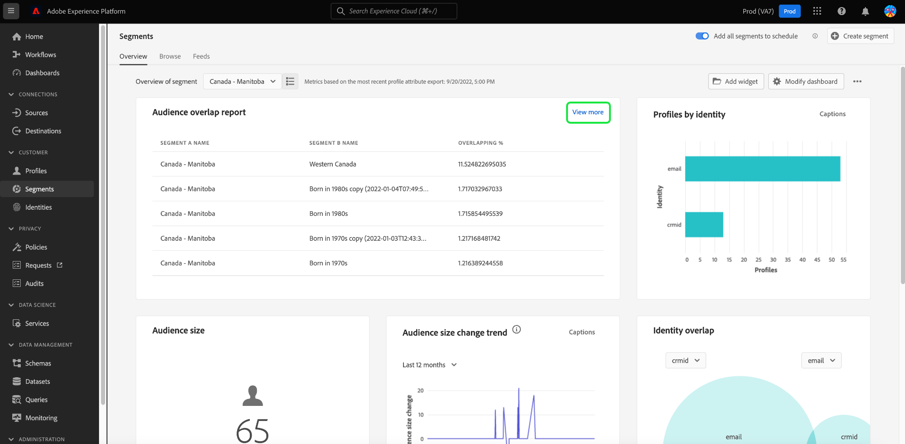

# [!UICONTROL 區段] 儀表板 {#segment-dashboard}

Adobe Experience Platform使用者介面(UI)提供了一個控制面板，您可以透過它檢視有關區段的重要資訊，如每日快照期間所擷取。 本指南概述如何存取及使用UI中的區段控制面板，並提供控制面板中顯示視覺效果的詳細資訊。

如需Platform使用者介面中所有Adobe Experience Platform Segmentation Service功能的總覽，請造訪 [Segmentation Service UI指南](../../segmentation/ui/overview.md).

## [!UICONTROL 區段] 儀表板資料

區段儀表板會顯示貴組織在Experience Platform的設定檔存放區中擁有的屬性（記錄）資料快照。 快照不包含任何事件（時間序列）資料。

快照中的屬性資料顯示的資料與拍攝快照的特定時間點完全相同。 換言之，快照不是資料的近似或樣本，而且區段圖示板沒有即時更新。

>[!NOTE]
>
>自建立快照以來對資料所做的任何變更或更新，都不會反映在控制面板中，直到建立下一個快照為止。

## 探索 [!UICONTROL 區段] 儀表板 {#explore}

若要導覽至 [!UICONTROL 區段] 在Platform UI中，選取 **[!UICONTROL 區段]** 在左側欄中，然後選取 **[!UICONTROL 概觀]** 標籤來顯示控制面板。

>[!NOTE]
>
>如果您的組織剛開始使用Platform，但尚未建立作用中的設定檔資料集或合併原則，請 [!UICONTROL 區段] 儀表板不可見。 取而代之的是 [!UICONTROL 概觀] 索引標籤會顯示連結和檔案，以幫助您開始使用細分。

### 修改 [!UICONTROL 區段] 儀表板 {#modify}

您可以修改 [!UICONTROL 區段] 儀表板，選取 **[!UICONTROL 修改儀表板]**. 這可讓您從儀表板移動、新增和移除Widget，以及存取 **[!UICONTROL Widget資料庫]** 探索可用的Widget並為您的組織建立自訂Widget。

請參閱 [修改儀表板](../customize/modify.md) 和 [Widget程式庫概觀](../customize/widget-library.md) 檔案，以瞭解更多。

### 新增Widget {#add-widget}

選取 **[!UICONTROL 新增Widget]** 導覽至Widget程式庫，並檢視可新增至儀表板的可用Widget清單。

在Widget資料庫中，您可以瀏覽標準與自訂區段Widget的選取範圍。如需如何新增Widget的詳細資訊，請參閱Widget資料庫檔案，瞭解如何 [新增Widget](../customize/widget-library.md#add-widgets).

## 選取區段

儀表板會自動選取要顯示的區段，但您可以使用下拉式選單或區段選取器來變更區段。

若要選擇其他區段，請選取區段名稱旁的下拉式清單，或使用區段選取器開啟區段選取對話方塊。

>[!IMPORTANT]
>
>只有設定檔計數大於零的區段才會顯示在可選區段清單中。

## Widget和量度

區段儀表板是由Widget所組成，這些是唯讀量度，可提供有關您所選區段的重要資訊。

最近一次快照的日期和時間會顯示在最上方 [!UICONTROL 概觀] 區段下拉式清單旁的標籤。 截至該日期和時間，所有Widget資料都是準確的。 快照的時間戳記會以UTC提供，而不是在個別使用者或組織的時區中。

## 標準Widget {#standard-widgets}

Adobe提供多個標準Widget，您可將其用於視覺化與區段相關的不同量度。 您也可以使用建立自訂Widget並與您的組織共用 [!UICONTROL Widget資料庫]. 若要進一步瞭解如何建立自訂Widget，請先閱讀 [Widget程式庫概觀](../customize/widget-library.md).

若要進一步瞭解每個可用的標準Widget，請從下列清單中選取Widget的名稱：

* [[!UICONTROL 對象規模]](#audience-size)
* [[!UICONTROL Audience啟用順序]](#audience-activation-order)
* [[!UICONTROL 對象規模趨勢]](#audience-size-trend)
* [[!UICONTROL 對象人數變化趨勢]](#audience-size-change-trend)
* [[!UICONTROL 依身分割槽分的對象人數趨勢]](#audience-size-trend-by-identity)
* [[!UICONTROL 對象重疊]](#audience-overlap)
* [[!UICONTROL 對象重疊報表]](#audience-overlap-report)
* [[!UICONTROL 身分識別覆蓋]](#identity-overlap)
* [[!UICONTROL 依身分識別劃分的設定檔]](#profiles-by-identity)
* [[!UICONTROL 已排程的啟用]](#scheduled-activations)

### [!UICONTROL 對象規模] {#audience-size}

>[!CONTEXTUALHELP]
>id="platform_dashboards_segments_audiencesize"
>title="對象規模"
>abstract="此 Widget 會顯示選取區段內合併設定檔的總數。此數字會依據套用於您的資料的合併原則而定，並且在最近快照時是正確的。"

此 **[!UICONTROL 對象人數]** widget會顯示拍攝快照時所選區段內的合併設定檔總數。 此數字是將區段合併原則套用至設定檔資料的結果，以便將設定檔片段合併在一起，為區段中的每個人形成一個設定檔。

如需片段和合併設定檔的詳細資訊，請參閱 [即時客戶個人檔案總覽](../../profile/home.md).

### [!UICONTROL 對象規模趨勢] {#audience-size-trend}

>[!CONTEXTUALHELP]
>id="platform_dashboards_segments_audiencesizetrend"
>title="對象規模趨勢"
>abstract="此 Widget 會提供有關符合&#x200B;**任何**&#x200B;區段定義標準的設定檔總數的資訊，這會在過去 30 天、90 天或 12 個月每日快照期間擷取。"

此 **[!UICONTROL 對象人數趨勢]** Widget提供符合條件的設定檔總數的線圖插圖 **任何** 指定期間的區段定義。 對象人數趨勢可在30天、90天和12個月期間進行視覺化。 從Widget的下拉式選單中選擇時段。 對象人數會反映在y軸，而時間則反映在x軸。

此Widget也包含自動 [!UICONTROL 註解] 機器學習模型會分析圖表和區段資料，並自動產生註解以說明主要趨勢和重要事件的功能。 選取 **[!UICONTROL 註解]** 以開啟自動註解對話方塊。

自動註解對話方塊隨即開啟，提供您資料的深入分析。

若要進一步瞭解區段評估，以及設定檔如何符合資格及退出區段，請參閱 [Segment Service檔案](../../segmentation/home.md).

### [!UICONTROL 對象人數變化趨勢] {#audience-size-change-trend}

此Widget提供線圖，說明最近每日快照之間符合指定區段資格的設定檔總數差異。 從概述下拉式選單中選取選擇進行分析的區段。 趨勢分析的期間可以視覺化地呈現超過30天、90天和12個月的期間。 從Widget的下拉式選單中選擇時段。 對象人數會反映在y軸，而時間則反映在x軸。

### [!UICONTROL 依身分割槽分的對象人數趨勢] {#audience-size-trend-by-identity}

此Widget會根據從Widget下拉式選單中選擇的身分型別，說明特定區段的對象人數趨勢。 從概述下拉式清單中選取用於分析的區段。 趨勢分析的期間可以視覺化地呈現超過30天、90天和12個月的期間。 從Widget的下拉式選單中選擇時段。

### [!UICONTROL Audience啟用順序] {#audience-activation-order}

此 [!UICONTROL Audience啟用順序] widget提供三欄表格，列出 [!UICONTROL 目的地名稱]，則 [!UICONTROL 平台]，以及啟動 [!UICONTROL 日期] 對象的。 清單會根據造訪間隔從高到低排序，最多可容納10列。

### [!UICONTROL 對象重疊] {#audience-overlap}

此Widget代表兩個區段中符合兩個區段定義條件的設定檔數目。 從Widget下拉式選單中選取用於比較的區段。 將滑鼠懸停在圓形或文氏圖表交集上，可以看到相關區段定義中包含的輪廓總數。

此Widget可讓您透過視覺化區段定義結果中的相似性，將區段策略最佳化。

### [!UICONTROL 對象重疊報表] {#audience-overlap-report}

此Widget會將特定區段的對象重疊資料製成表格化。 針對從畫面頂端的下拉式選單中選擇的區段，提供從最高重疊百分比到最低重疊百分比排名的五個對象清單。 為清楚起見，您選擇的區段會列在 [!UICONTROL 區段A名稱] 欄。 對象重疊分析僅針對下列專案中所列的第二個區段提供： [!UICONTROL 區段B名稱] 欄。 第三欄提供精確到十二位小數的重疊百分比。

對象重疊報表可協助您建立新的高效能區段。 觀察高百分比的重疊可讓您抑制受眾，並防止將相同的受眾傳送至不同的目的地。 它們也可協助您識別隱藏的深入分析，可能有助於更佳的分段。 低百分比重疊有助於找到要追蹤的不重複設定檔。

選取 **[!UICONTROL 檢視更多]** 以開啟包含更多區段重疊資料的全熒幕對話方塊。

此 [!UICONTROL 對象重疊報表] 對話方塊隨即顯示。 此對話方塊最多可包含50列對象重疊分析，並分為6欄。 選取設定圖示()，以從表格中移除或新增欄。

>[!NOTE]
>
>選取 **[!UICONTROL 重疊]** 欄標題，將結果的排名從最高變更為最低，或從最低變更為最高。

若要以PDF格式下載整個報表，請選取選項功能表(**`...`**)後接 **[!UICONTROL 下載]**.

從報表中選取一列，以開啟重疊分析的文氏圖表。 將滑鼠游標停留在文氏圖表的某個區段上，即可在對話方塊中檢視設定檔計數。

選取 **[!UICONTROL 關閉]** 以返回 [!UICONTROL 區段] 儀表板。

### [!UICONTROL 身分識別覆蓋] {#identity-overlap}

>[!CONTEXTUALHELP]
>id="platform_dashboards_segments_identityoverlap"
>title="身分識別覆蓋"
>abstract="此 Widget 會顯示包含兩個所選身分識別的區段中設定檔的覆蓋。圓圈會顯示每個身分識別的相對大小。包含兩個命名空間的設定檔的數量由圓圈之間的覆蓋表示。"

此 **[!UICONTROL 身分重疊]** Widget會顯示文氏圖表或集合圖表，顯示包含多個身分的區段中的設定檔重疊。

使用Widget上的下拉式選單來選取您要比較的身分。 圓圈顯示每個所選身分的相對大小，包含兩個名稱空間的輪廓數由圓圈之間的重疊大小表示。

如果客戶在多個頻道上與您的品牌互動，則多個身分將會與該個別客戶相關聯，因此您的組織可能會有多個包含多個身分識別片段的設定檔。

若要進一步瞭解身分，請造訪 [Adobe Experience Platform Identity Service檔案](../../identity-service/home.md).

### [!UICONTROL 依身分識別劃分的設定檔] {#profiles-by-identity}

>[!CONTEXTUALHELP]
>id="platform_dashboards_segments_profilesbyidentity"
>title="依身分識別劃分的設定檔"
>abstract="此 Widget 會顯示選取區段中每個合併設定檔身分識別的劃分。"

此 **[!UICONTROL 依身分割槽分的設定檔]** widget會顯示您所選區段中每個合併設定檔的身分劃分。 依身分割槽分的設定檔總數可能會高於區段中的設定檔總數，因為一個設定檔可能會有多個相關聯的身分。 換言之，將針對每個身分顯示的值加總可能會超過區段中的受眾人數總計，因為如果客戶透過多個管道與您的品牌互動，則多個身分可能會與該個別客戶相關聯。

選取 **[!UICONTROL 註解]** 以開啟自動註解對話方塊。

機器學習模型會通過分析資料的整體分佈和關鍵維度來自動產生資料見解。

若要進一步瞭解身分，請造訪 [Adobe Experience Platform Identity Service檔案](../../identity-service/home.md).

### 已排程的啟用 {#scheduled-activations}

此 [!UICONTROL 已排程的啟用] Widget以表格化方式提供最近啟用目的地的檢視。 此表格包含目的地平台、流向此目的地的啟用流程名稱，以及所選區段的啟用開始和結束日期。 如果沒有提供啟用的結束日期，則會顯示為 [!UICONTROL 進行中]. 系統會從頁面頂端的下拉式清單中選取要分析的區段。

Widget可讓您一眼就知道啟用對象的位置和時間，並讓重複或不必要的啟用更加透明。 此累積資訊也會反白標示任何啟用被遺漏的位置。

## 後續步驟

依照此檔案，您現在應該能夠找到區段控制面板並選取要檢視的區段。 您也應該瞭解可用介面工具列中顯示的量度。 若要進一步瞭解如何在Experience PlatformUI中使用區段，請參閱 [Segmentation Service UI指南](../../segmentation/ui/overview.md).
