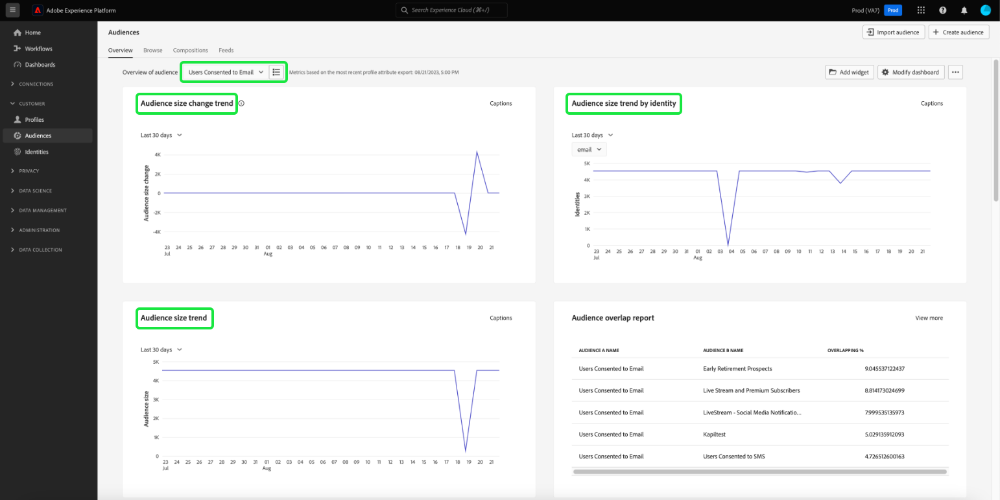

# 同意分析和追蹤

在現今的行銷格局中，您需要瞭解並尊重客戶同意偏好設定。 Adobe Real-time Customer Data Platform可讓行銷人員分析客戶同意，以建立信任、遵守隱私權法規，並提供更個人化的體驗。

本檔案詳細說明如何針對Real-Time CDP資料的各種行銷使用案例建立同意儀表板。 具體來說，它著重於如何根據您的業務需求建立具有適當屬性的對象，然後透過Adobe Experience Platform UI中使用預先設定的Widget來使用深入分析。 此外，也提供使用使用者定義儀表板功能建立自訂Widget的替代方法。

## 使用案例 {#use-cases}

本指南涵蓋的使用案例為同意趨勢和同意重疊。

- **同意趨勢**&#x200B;追蹤使用者同意在一段時間內的趨勢。 分析同意偏好設定變更可協助行銷人員規劃及執行適應這些使用者偏好設定變更的行銷活動。 例如，您可能想要進行目標明確的教育宣傳活動、透明和信任宣傳，或激勵宣傳以促使您做出同意選擇。 您也可以將可能已對同意產生負面影響的行銷活動建立關聯，以主動降低這些行銷活動的頻率。
- **同意重疊**&#x200B;會使用同意管道間的重疊，針對同意多個管道的客戶，在多個管道上提供一致的個人化訊息。 行銷人員可以排定資源優先順序，並將資源配置給某些管道，以便獲得更高程度的同意和個人化訊息，進而引起客戶的共鳴，並提高回應率。

## 建立同意的對象 {#create-consent-audiences}

若要建立同意儀表板，您必須先建立同意聯絡的所有設定檔對象。 若要導覽至Real-time Customer Data Platform區段產生器，請在Platform UI的左側導覽中選取&#x200B;**[!UICONTROL 對象]**。 從[!UICONTROL 對象]儀表板的[!UICONTROL 客戶]索引標籤中，選取檢視右上角的&#x200B;**[!UICONTROL 建立對象]**，然後選取&#x200B;**[!UICONTROL 建置規則]**。

![具有[!UICONTROL 客戶]、[!UICONTROL 受眾]和[!UICONTROL 建立區段]的[!UICONTROL 受眾]儀表板已強調顯示。](../images/insights-use-cases/consent-analysis/create-audience.png)

「區段產生器」隨即顯示。 接著，從可用選項中選取&#x200B;**[!UICONTROL XDM個別設定檔]**。 請參閱檔案以取得有關[規則產生器畫布](../../segmentation/ui/segment-builder.md#rule-builder-canvas)的詳細資訊。

![含有[!UICONTROL XDM個別設定檔]屬性資料夾的區段產生器已反白顯示。](../images/insights-use-cases/consent-analysis/xdm-individual-profile.png)

從可用選項中找出您的同意屬性。 選取&#x200B;**[!UICONTROL 同意和偏好設定]**。

>[!NOTE]
>
>如果您在與Adobe建議欄位群組不同的屬性中維持您的使用者同意，則必須選取這些屬性，而不是下列屬性。

在細分](../../segmentation/consents.md#handling-consent-in-segmentation)檔案中的[處理同意上可找到更多資訊。

![含有[!UICONTROL 同意和偏好設定]屬性資料夾的區段產生器已反白顯示。](../images/insights-use-cases/consent-analysis/consent-and-preferences.png)

會顯示各種同意和偏好設定選項。 由於此示範著重於同意透過各種行銷管道聯絡，因此請選取&#x200B;**[!UICONTROL 行銷偏好設定]**。

![反白顯示[!UICONTROL 行銷偏好設定]資料夾的區段產生器。](../images/insights-use-cases/consent-analysis/marketing-preferences.png)

隨即顯示行銷偏好設定清單。 雖然此範例使用案例聚焦於電子郵件、簡訊和呼叫，但您也可以為任何其他組合或整個選項建立深入分析。 針對每個管道，執行下列步驟以建立對象。

若要開始設定對象，請選取&#x200B;**[!UICONTROL 接收簡訊]** / **[!UICONTROL 接收電子郵件]** / **[!UICONTROL 接收通話]**。

[!UICONTROL Subscriptions]資料夾隨即顯示。 從可用的選項中，選取&#x200B;**[!UICONTROL 選擇值]**&#x200B;屬性並拖曳至中央窗格，然後從下拉式清單中選取所需的值。 在此情況下，請選取&#x200B;**是（選擇加入）**。 接著，根據您的業務需求為對象命名，並提供好記的說明。

>[!NOTE]
>
>建議您建立的對象數量存在軟性限制。 如需詳細資訊，請參閱[分段護欄檔案](../../profile/guardrails.md#segmentation-guardrails)。

![區段產生器中反白顯示[!UICONTROL 是（選擇加入）]值的[!UICONTROL 選擇值]屬性。 對象的名稱和說明也會反白顯示。](../images/insights-use-cases/consent-analysis/choice-value.png)

建立必要的對象後，它們會列在[!UICONTROL 對象] [!UICONTROL 瀏覽]索引標籤中。

>[!NOTE]
>
>建立對象時，您必須等待批次分段工作完成，資料才能開始建立您的同意儀表板。 批次細分說明透過區段定義一次移動所有設定檔資料以產生對應對象的程式。 建立後，會儲存並儲存此對象，以供您匯出和使用。 每24小時自動評估批次區段。

## 使用深入分析 {#consume-insights}

Adobe已建立各種見解，這些見解會自動在設定檔、受眾和目的地儀表板中提供給您。 之後，您建立的任何對象都會自動使用這些預先設定的深入分析。 請參閱標準Widget檔案，以取得[設定檔](../guides/profiles.md#standard-widgets)、[對象](../guides/audiences.md#standard-widgets)和[目的地](../guides/destinations.md)儀表板中可用的深入分析清單。

## 客群重疊 {#audience-overlap}

若要檢閱任何兩個同意對象之間的重疊，請將[!UICONTROL 依合併原則的對象重疊]新增到您的設定檔儀表板，並在下拉式選單中選取所需的對象。 如需深入分析的詳細資訊，請參閱檔案，瞭解如何將Widget [*合併原則所覆蓋的對象*](../guides/profiles.md#audience-overlap-by-merge-policy)&#x200B;新增到儀表板的指示。

<!-- Image needs updating to night mode -->

您可以在「對象」儀表板的「對象重疊」報表中，檢視使用者同意接收所有其他對象之來電的所有對象重疊。 若要檢視同意對象的重疊，請先導覽至[!UICONTROL 對象] [!UICONTROL 概述]標籤。 您可以從此將[!UICONTROL 對象重疊報表] Widget新增至「對象」儀表板。 建立Widget後，從頁面頂端的對象概觀下拉式選單中選取&#x200B;**[!UICONTROL 使用者同意呼叫]**&#x200B;對象。 接著，在對象重疊報表Widget中選取「**[!UICONTROL 檢視更多]**」，最多可檢視50個最上層重疊，以及有關所選區段的最少重疊50個。

<!-- Image needs updating to night mode -->

![已顯示具有對象重疊報表Widget的「對象」儀表板。 使用者同意呼叫對象作為比較對象，且[檢視更多]連結都反白顯示。](../images/insights-use-cases/consent-analysis/audience-overlap-report-user-consent-to-calls.png)

對象重疊報表對話方塊隨即展開，顯示其他對象重疊資料。

<!-- Image needs updating to night mode -->

## 對象人數趨勢 {#audience-size-trends}

當您建立以同意為基礎的受眾時，會自動顯示自您建立受眾日期起最多12個月的趨勢。 若要掌握您客戶同意的完整功能趨勢，請將下列Widget新增至[!UICONTROL 區段] [!UICONTROL 概觀]頁面。 這些見解提供強大的方式，可追蹤您的同意如何隨著時間改變。 它們甚至會與您平行執行的任何行銷活動建立關聯，而這些行銷活動可能會對同意產生正面或負面的影響。 為這些Widget提供的說明適用於同意使用案例。

- [對象人數趨勢](../guides/audiences.md#audience-size-trend)：此Widget提供方法來追蹤您個別同意在一段時間內的變化。
- [對象人數變更趨勢](../guides/audiences.md#audience-size-change-trend)：此Widget會追蹤您客戶同意的每日變更情況。 例如，如果客戶同意的計數下降100,000，則您可瞭解每天發生的變更。
- [依身分割槽分的對象人數趨勢](../guides/audiences.md#audience-size-trend-by-identity)：有了此Widget，您可以追蹤個別同意在一段時間內的變化，但進一步依特定身分（例如電子郵件）篩選。

<!-- Image needs updating to night mode -->

## 對象總覽儀表板 {#audiences-overview-dashboard}

在您建立同意相關的對象（例如「同意使用簡訊的使用者」）後，您可以新增適當的介面工具至對象總覽儀表板，檢視有關對象的重要個人化同意資訊。 導覽至[!UICONTROL 對象] [!UICONTROL 總覽]，並從Widget資料庫新增您選擇的Widget。 您可使用[!UICONTROL 修改儀表板]功能，調整新增至儀表板檢視的任何Widget大小並移動。 您的個人化檢視可以包含深入分析，例如一段時間內的趨勢（最長12個月）、與其他對象的重疊，以及對象的身分組成。 範例檢視顯示如下。

## 使用者定義的儀表板 {#usr-defined-dashboards}

您也可以使用使用者定義的儀表板，建置您自己的Widget。 建立您自己的Widget可讓您完全控制Widget的型別，並讓您直接在Adobe Real-Time CDP中靈活新增篩選器及其他專案。

例如，如果您想在同一張圖表顯示多個同意對象的趨勢，以便檢視每個同意偏好設定隨著時間的變化。 這類視覺效果可在使用者定義控制面板中以最少的步驟和一次性設定完成。 首先，在左側導覽中選取&#x200B;**[!UICONTROL 儀表板]**。 [!UICONTROL 儀表板]工作區會出現。 然後選取&#x200B;**[!UICONTROL 建立儀表板]**。 有關如何[建立控制面板和自訂Widget](../user-defined-dashboards.md)的完整說明，請參閱使用者定義控制面板指南。

當您在Widget撰寫器中[選取您的資料模型](../user-defined-dashboards.md#select-data-model)時，請依序選取`CDPInsights`及&#x200B;**[!UICONTROL 下一步]**。 [!UICONTROL 選取資料表]對話方塊就會顯示。

![反白顯示CDPInsights模型的[選取資料模型]對話方塊。](../images/user-defined-dashboards/select-data-model-dialog.png)

下一個檢視會在左側邊欄中顯示可用表格的清單。 選取 `adwh_fact_profile_by_segment_and_namespace_trendlines`。

在Widget撰寫器中填入您所選表格的資料後，請執行下列步驟：

- [搜尋`[!UICONTROL date]`的[!UICONTROL 屬性]](../user-defined-dashboards.md#add-filter-attributes)，然後使用+圖示將`[!UICONTROL date]`屬性從下拉式功能表新增至X軸。
  
- 搜尋[!UICONTROL 屬性]以尋找`[!UICONTROL count_of_profiles]`，然後使用+圖示將`[!UICONTROL count_of_profiles]`屬性從下拉式功能表新增至Y軸。
- 選取[!UICONTROL Y軸]欄位中的`...` （橢圓）圖示，然後從下拉式選單中選取[!UICONTROL SUM]彙總函式。
  
- 選取[!UICONTROL 標籤]下拉式功能表，並將圖表型別變更為[!UICONTROL 線]。
- 搜尋`[!UICONTROL segment_name]`的[!UICONTROL 屬性]，然後使用+圖示將`segment_name`新增為下拉式功能表中的[!UICONTROL 篩選器]。 [!UICONTROL 篩選器：區段名稱]對話方塊就會顯示。 選取先前建立且與同意相關的對象。 在此範例中，選取&#x200B;**[!UICONTROL 同意撥打電話的使用者]**、**[!UICONTROL 同意簡訊的使用者]**&#x200B;和&#x200B;**[!UICONTROL 同意傳送電子郵件的使用者]**，接著選取&#x200B;**[!UICONTROL 套用]**。
- 搜尋`[!UICONTROL segment_name]`的[!UICONTROL 屬性]，然後從下拉式選單中選取+圖示，將`segment_name`新增為[!UICONTROL 色彩]。
- 開啟[[!UICONTROL 屬性]面板](../user-defined-dashboards.md#widget-properties)，並提供適當的[!UICONTROL Widget標題]和[!UICONTROL 軸標籤]。
  
- 選取&#x200B;**[!UICONTROL 儲存並關閉]**&#x200B;以確認您的設定。

>[!TIP]
>
>您現在可以在儲存儀表板之前，調整大小或將Widget移動至所需的大小和位置。

下圖示範您完成的Widget的顯示方式以及其他可能的自訂深入分析。 如需可建立之Widget型別的詳細資訊，請參閱[資料模型檔案](../data-models/cdp-insights-data-model-b2c.md)。

<!-- The diagram shows straight lines due to a lack of data, however in your environment the trends will reflect the actual changes over time. -->

## 追蹤同意原則 {#consent-policies}

您建立的同意儀表板只會擷取同意和偏好設定屬性的&#x200B;**分佈**。

>[!NOTE]
>
>對於&#x200B;**Adobe Healthcare Shield**&#x200B;或&#x200B;**Adobe Privacy &amp; Security Shield**&#x200B;的客戶，這些儀表板&#x200B;**不會**&#x200B;反映任何同意政策的追蹤。 可用的追蹤包括已建立、已啟用的原則數目，以及對對象成員資格的影響。

## 後續步驟

閱讀本檔案後，您已瞭解如何使用Real-Time CDP Insights建立儀表板，以全面檢視客戶同意偏好設定。 此檔案示範Real-Time CDP如何針對現今以隱私權為中心的環境，提供強大的解決方案，因為收集、細分、分析和根據同意資料的個人化行銷活動對行銷人員至關重要。
