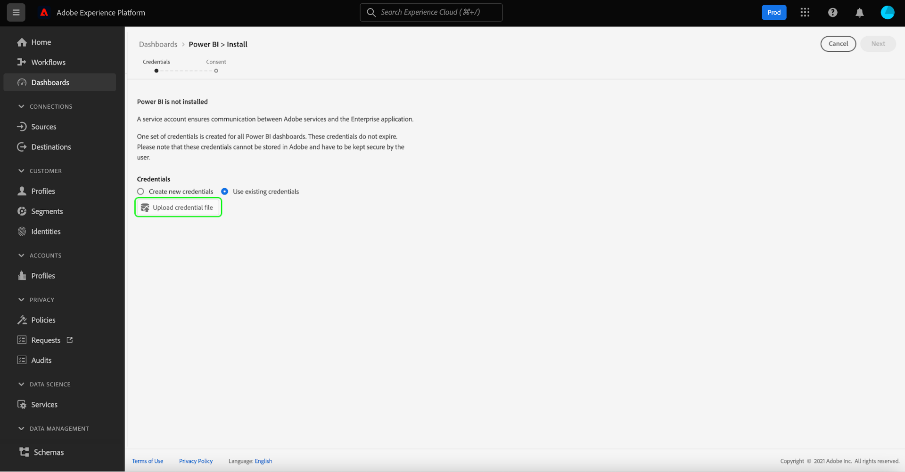
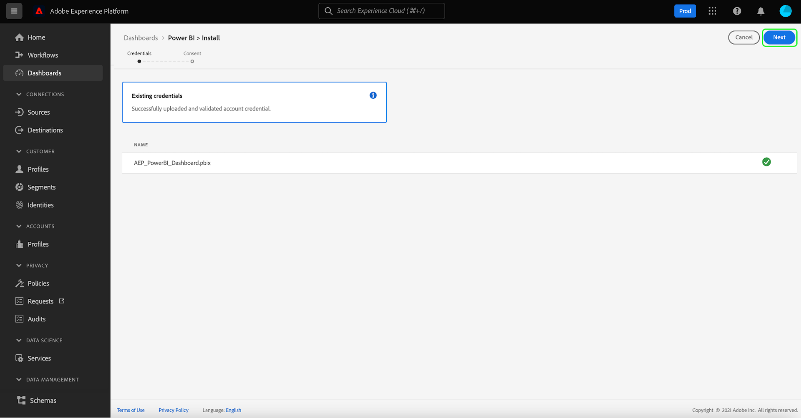
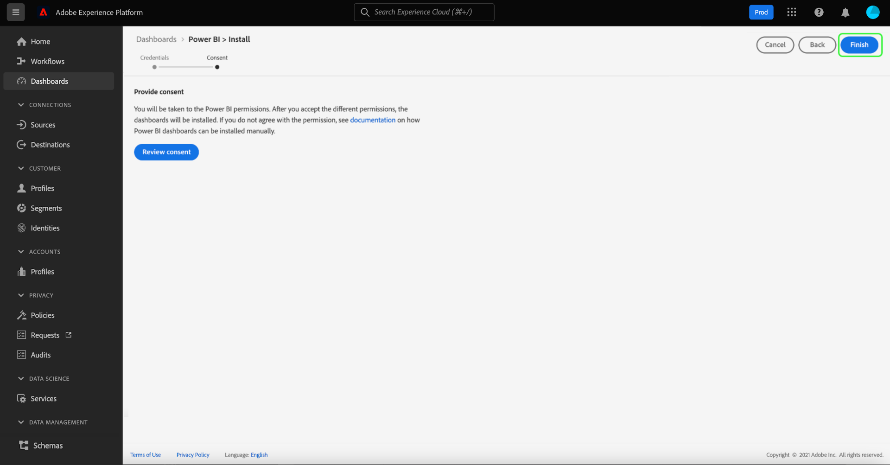

# Power BI控制面板的報表範本

Power BI報表範本功能可讓您建立填入Adobe Experience Platform資料的引人入勝報表。 簡化的安裝程式會自動安裝適用於即時客戶個人檔案、細分和目的地的標準Widget。 安裝程式也會將Power BI連接至您的資料模型，讓您可輕鬆自訂和擴充報表範本。 這些報表可在整個組織間共用，收件者不需要貴組織在Platform上的認證。

本檔案提供如何將Adobe Experience Platform與Power BI應用程式連線，以及使用報表範本，與外部使用者共用重要的Platform資料深入分析的指示。

## 快速入門

繼續本教學課程之前，建議您先充分了解 [綱要組合](../../xdm/schema/composition.md) Experience Platform，以及如何透過 [聯合方案](../../xdm/schema/composition.md#union).

若要安裝Power BI應用程式整合，使用者必須先取得下列Platform權限：

- 管理查詢
- 管理沙箱

若要了解如何指派這些權限，請參閱 [存取控制](../../access-control/home.md) 檔案。

您也必須有Power BI帳戶才能遵循本教學課程。 若要建立帳戶，請導覽至 [Power BI首頁](https://powerbi.microsoft.com/en-us/) 並遵循註冊程式。 此Power BI帳戶的使用者也必須啟用 **建立工作區** 設定的Power BI。 可在Power BI管理入口網站的租用戶設定中找到此設定。 如果您的帳戶是由租用戶或雇主提供，請聯絡您各自的管理員以啟用此設定。

>[!NOTE]
>
>為了讓控制面板索引標籤顯示在Platform UI的左側導覽中，並顯示控制面板詳細目錄檢視，您必須有權存取設定檔、區段或目的地控制面板中的任何一個，作為Platform授權的一部分。

## 安裝Power BI應用程式整合

在Platform UI中，選取 **[!UICONTROL 控制面板]** 在左側導覽中，開啟 [!UICONTROL 控制面板] 工作區。 此 [!UICONTROL 瀏覽] 索引標籤會顯示目前可用的控制面板檢視清單。 若要進一步了解如何檢視可用的控制面板，請參閱 [詳細目錄檔案](../inventory.md).

下一步，選取 **[!UICONTROL 整合]** 標籤。 此時將顯示「Power BI應用程式整合」頁。 從此處，選擇 **[!UICONTROL 安裝]** 以開始安裝。

>[!NOTE]
>
>此 [!UICONTROL 安裝] 按鈕會停用，除非您同時擁有「查詢服務管理」和「管理沙箱」權限。

### 提供憑證

安裝程式的第一步是為Power BI應用程式整合提供非過期的憑據。 提供下列兩個選項： [[!UICONTROL 建立新憑據]](#create-new-credentials) 或 [[!UICONTROL 使用現有憑證]](#use-existing-credentials). 選取適當的切換按鈕以繼續。

#### 建立新憑據 {#create-new-credentials}

生成新憑據時有兩個必填欄位： [!UICONTROL 名稱] 和 [!UICONTROL 指派給]. 此 [!UICONTROL 指派給] 欄位與與您的Power BI帳戶相關聯的電子郵件地址相關。

>[!IMPORTANT]
>
>建立未到期的憑證時，您必須指派特定權限和角色。 必要的權限是「管理沙箱」和「管理查詢服務整合」。 所需角色為Adobe Experience Platform管理員和開發人員角色。 若要了解如何指派這些權限，請參閱 [存取控制](../../access-control/home.md) 檔案。

若要進一步了解如何產生未到期的查詢服務憑證，請參閱 [未到期憑證指南](../../query-service/ui/credentials.md#non-expiring-credentials).

首次產生未到期的憑證後，會將JSON檔案下載至該電腦。 然後，可將此JSON檔案與其他使用者共用，作為完成安裝程式的憑證。

#### 使用現有憑證 {#use-existing-credentials}

您也可以上傳JSON憑證檔案以通過驗證。 這些包含非到期憑證值的JSON檔案會下載至建立非到期憑證時所使用的本機電腦。

>[!IMPORTANT]
>
>要使用現有的非到期憑據，用戶必須已經獲派了憑據。 如果用戶沒有分配憑據，並且無法使用Adobe Admin Console建立新憑據，則用戶無法繼續安裝過程。

選擇 **[!UICONTROL 上載憑據檔案]**，然後在顯示的對話方塊中，選取要上傳的適當JSON檔案。

提供未到期的憑證後，就會由Platform自動驗證。 驗證成功後，會顯示確認訊息。 選擇 **[!UICONTROL 下一個]** 查看Power BI申請的同意協定。

### 提供同意

同意隨即顯示。 選擇 **[!UICONTROL 檢閱同意]** 開啟新視窗，詳細說明Power BI根據其服務條款和隱私聲明存取和使用資料所需的權限。

選擇 **[!UICONTROL 接受]** 授予Power BI存取和使用您的Platform資料的權限。

>[!NOTE]
>
>如果您在提供同意前，隨時退出安裝程式，Power BI應用程式整合將不會安裝至控制面板清單。

提供同意後，報表範本會在安裝程式中自動安裝至Power BI環境中。 然後，Power BI會使用非到期憑證來存取Platform、依序執行所有SQL查詢，並將傳回的資料填入報表範本。

選擇 **[!UICONTROL 完成]** 返回控制面板清單。

現在安裝了Power BI報表範本，該範本會顯示在 [!UICONTROL 瀏覽] 標籤。 選擇 **[!UICONTROL Power BI]** ，導覽至Power BI環境。

>[!IMPORTANT]
>
>Power BI管理員必須確定使用者擁有適當的存取權限，才能在Power BI環境中檢視這些控制面板。

## Power BI工作區

登入後 [Power BI工作區](https://dxt.powerbi.com)，您可以存取的每項服務都可使用報表範本。 報表範本包含設定檔、區段和目的地控制面板 **僅限** （如果它們具有相應的檢視權限）。

依預設，來自設定檔、區段和目的地的標準Widget可在Power BI範本報表中使用。

>[!NOTE]
>
>您必須為指定控制面板啟用編輯權限，才能讓該控制面板安裝在Power BI環境中。

在Power BI中安裝控制面板後，報表範本會依預設顯示給所有使用者。 如果要限制對任何報表範本的存取，請務必從Power BI環境中停用有問題使用者的存取權。

## 自訂Power BI報表範本

透過使用自訂Widget，您可以將自訂屬性新增至資料模型，讓Power BI提供的報表範本更加豐富。

>[!NOTE]
>
>可用於自定義小部件的屬性取決於聯合架構中可用的屬性。 若要了解如何檢視和探索結合結構以利於自訂Widget，請參閱 [union schema UI指南](../../profile/ui/union-schema.md).

### 建立自訂介面工具集

自訂Widget是透過Widget資料庫建立。 請參閱 [介面工具集程式庫概觀](../customize/widget-library.md) 以了解功能和 [建立自訂介面工具集的教學課程](../customize/custom-widgets.md) 以取得特定指示。

>[!IMPORTANT]
>
>新建立的自定義小部件為 **not** 在Adobe Experience Platform控制面板和Power BI報表範本之間自動同步。 在Platform UI中建立的任何自訂Widget都必須在Power BI環境中手動重新建立。

### 在Power BI環境中重新建立自訂介面工具集

一旦控制面板的自訂介面工具集中包含適當的度量和屬性，您就可以修改從Power BI環境中顯示的報表範本。 請參閱 [Power BI檔案](https://docs.microsoft.com/zh-tw/power-bi/) ，了解如何透過其使用者介面編輯報表。

## 刪除Power BI應用程式整合

若要刪除控制面板，請導覽至控制面板清單並選取刪除圖示()。

>[!NOTE]
>
>只有安裝Power BI控制面板的使用者才能從Platform UI刪除整合。

此時會出現確認彈出視窗。 選擇 **[!UICONTROL 刪除]** 以確認程式。

>[!IMPORTANT]
>
>從Platform UI刪除Power BI控制面板會執行 **not** 刪除您的Power BI環境中可用的報表範本。 如果您想要完全刪除Power BI報表範本中保留的資訊，需要登入您的Power BI帳戶，並從該環境中刪除報表範本。 刪除後，使用者可以依照上述相同的安裝指示重新安裝Power BI控制面板。

## 後續步驟

閱讀本檔案後，您就能更深入了解如何將Power BI報表範本整合至Platform，以從您的設定檔、區段或目的地控制面板分享引人入勝的資料深入分析。 請參閱 [控制面板自訂概觀](../customize/overview.md) 進一步了解自訂控制面板。
