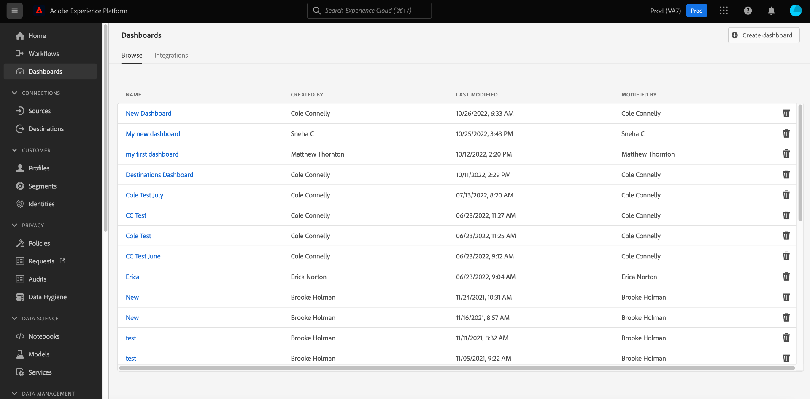

# 檢視已設定的控制面板

如果您的組織在Adobe Experience Platform中有多個可用的控制面板，您可以在使用者介面(UI)中檢閱控制面板清單。

若要檢視貴組織已設定的控制面板，請選取 **[!UICONTROL 控制面板]** 在左側導覽器中，然後選取 **[!UICONTROL 瀏覽]** 標籤。

Platform例項上可用的所有控制面板清單會顯示在 [!UICONTROL 瀏覽] 標籤。 這包括貴組織建立的已透過第三方應用程式設定的整合式控制面板。

您可以從清單中選取控制面板的名稱，以檢視個別控制面板。

選取後，控制面板會在平台UI中或完全整合的應用程式工作區中開啟，這需要您使用必要的憑證登入。

## 建立自訂控制面板

Adobe Experience Platform控制面板可讓您建立和管理自訂控制面板，在其中建立、新增及編輯定制小工具，以視覺化與貴組織相關的關鍵量度。 請參閱 [使用者定義控制面板指南](./user-defined-dashboards.md) 以取得建立和設定自訂控制面板的完整指示。
