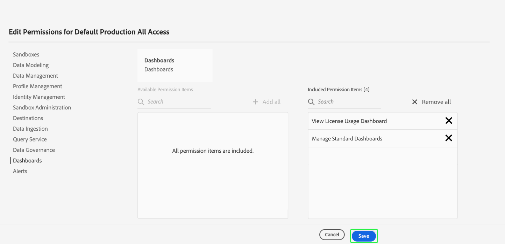

# 控制面板的存取權限

若要授與使用者檢視、編輯和更新控制面板的能力，您必須先啟用權限。 在Adobe Experience Platform中，存取控制是透過Adobe Admin Console提供。 此功能會運用[!DNL Admin Console]中的產品設定檔，將使用者與權限和沙箱連結。

本檔案提供如何提供Admin Console中特定控制面板權限存取權的摘要。 有關獲取和分配訪問權限的詳細資訊，請從閱讀[訪問控制概述](../access-control/home.md)開始。

>[!NOTE]
>
>要配置[!DNL Experience Platform]的訪問控制，您必須擁有具有[!DNL Experience Platform]產品整合的組織的管理員權限。 如需詳細資訊，請參閱[管理角色](https://helpx.adobe.com/enterprise/using/admin-roles.html)上的Adobe Help Center文章。

## 可用權限{#available-permissions}

存取Experience Platform內的控制面板需要兩個主要權限。 這些權限包括：

* **查看許可證使用情況儀表板**:此權限可讓使用者以唯讀方式存取Experience PlatformUI中的授權使用控制面板。
* **管理標準控制面板**:此權限可讓使用者新增尚未在資料倉庫中的自訂屬性。

下列步驟將示範如何使用Admin Console新增這些權限。

## 選取產品設定檔

若要授與使用者對Experience Platform中控制面板的存取權，請從登入[Adobe Admin Console](https://adminconsole.adobe.com)開始，並從頂端導覽中選取&#x200B;**Products**。

從左側導覽的「Experience Cloud」下拉式清單或&#x200B;*所有產品和服務*&#x200B;下方列出的資訊卡中，選取&#x200B;**Adobe Experience Platform**。 從Adobe Experience Platform產品頁面中，選取您要新增控制面板權限的產品設定檔，或選取&#x200B;**新設定檔**&#x200B;以建立新的產品設定檔。

選取的產品設定檔隨即開啟，顯示與該產品設定檔相關聯的使用者。 若要管理產品設定檔的權限，請選取&#x200B;**權限**。

## 新增/編輯權限

**權限**&#x200B;標籤會顯示產品設定檔的所有可用權限。 找出&#x200B;**控制面板**&#x200B;列，並注意到目前顯示「已包含2個中的0個」，這表示產品設定檔未啟用控制面板權限。

若要編輯控制面板權限，請在控制面板列上選取&#x200B;**編輯**。

將開啟&#x200B;**編輯權限**&#x200B;對話框，其中顯示可用權限項目和包含的權限項目。 您可以選取新增權限旁的加號(`+`)，或選取&#x200B;**+新增全部**&#x200B;一次新增所有權限。

有關權限的說明，請參閱本檔案前面的[可用權限](#available-permissions)一節。

>[!NOTE]
>
>您不必為所有使用者啟用所有權限。 根據您的組織結構，您可能想要為特定使用者建立個別的產品設定檔，並授予有限的存取權（例如唯讀）。

新增權限後，選取&#x200B;**Save**&#x200B;以返回產品設定檔。

當您返回產品設定檔時，可以確認&#x200B;**控制面板**&#x200B;列顯示「2/2已包含」，以確認已新增權限。

## 後續步驟

現在您已將存取權限新增至控制面板，組織內的使用者就可以開始在Experience PlatformUI中檢視控制面板，並根據您指派的權限執行其他動作。