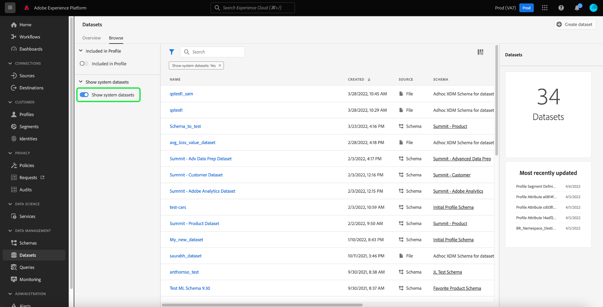

# 使用 [!DNL Query Service]

Adobe Experience Platform通過Experience PlatformUI中提供的儀表板提供有關您組織的配置檔案、段和目標資料的重要資訊。 你可以用Adobe Experience Platform [!DNL Query Service] 瀏覽、驗證和處理資料湖中為這些儀表板供電的原始資料集。

## 入門 [!DNL Query Service]

Adobe Experience Platform [!DNL Query Service] 支援營銷商通過使用標準SQL查詢資料湖中的資料，從其資料中獲取洞見。 [!DNL Query Service] 提供了用戶介面和API，可用於加入資料湖中的任何資料集並將查詢結果捕獲為用於報告、機器學習或即時客戶概要檔案接收的新資料集。

瞭解有關 [!DNL Query Service] 以及它在Experience Platform中的作用，請從閱讀 [[!DNL Query Service] 概述](../query-service/home.md)。

## 訪問可用資料集

您可以使用 [!DNL Query Service] 查詢配置檔案、段和目標儀表板的原始資料集。 要查看可用資料集，請在Experience PlatformUI中選擇 **資料集** 的子菜單。 儀表板列出了組織的所有可用資料集。 將顯示每個列出的資料集的詳細資訊，包括其名稱、資料集所遵循的架構以及最近接收運行的狀態。


### 系統生成的資料集

>[!IMPORTANT]
>
>預設情況下，系統生成的資料集是隱藏的。 預設情況下， [!UICONTROL 瀏覽] 頁籤僅顯示已將所測資料納入的資料集。

要查看系統生成的資料集，請選擇篩選器表徵圖()。


出現包含兩個切換的提要欄， [!UICONTROL 包括在配置檔案中] 和 [!UICONTROL 顯示系統資料集]。 選擇切換 [!UICONTROL 顯示系統資料集] 在可瀏覽的資料集清單中包含系統生成的資料集。



### 配置檔案屬性資料集

配置檔案儀表板透視與您的組織定義的合併策略相關聯。 對於每個活動合併策略，資料湖中都有一個配置檔案屬性資料集可用。

這些資料集的命名約定是 **配置檔案快照導出** 後跟系統生成的隨機字母數值。 例如: `Profile-Snapshot-Export-abbc7093-80f4-4b49-b96e-e743397d763f`。

要瞭解每個配置檔案快照導出資料集的完整模式，可以預覽和瀏覽資料集 [使用資料集查看器](../catalog/datasets/user-guide.md) 的子菜單。


#### 將配置檔案屬性資料集映射到合併策略ID

分配給每個系統生成的配置檔案屬性資料集的字母數字值是一個隨機字串，它映射到您的組織建立的合併策略之一的合併策略ID。 將每個合併策略ID到其相關配置檔案屬性資料集字串的映射保持在 `adwh_dim_merge_policies` 資料集。

的 `adwh_dim_merge_policies` dataset包含以下欄位：

* `merge_policy_name`
* `merge_policy_id`
* `merge_policy`
* `dataset_id`

可以使用Experience Platform中的查詢編輯器UI來瀏覽此資料集。 要瞭解有關使用查詢編輯器的詳細資訊，請參閱 [查詢編輯器UI指南](../query-service/ui/user-guide.md)。

### 段元資料資料集

資料湖中有一個段元資料資料集，其中包含組織的每個段的元資料。

此資料集的命名約定為 **段定義 — 快照 — 導出** 後跟字母數字值。 例如︰`Segmentdefinition-Snapshot-Export-acf28952-2b6c-47ed-8f7f-016ac3c6b4e7`

要瞭解每個段定義快照導出資料集的完整模式，可以預覽和瀏覽資料集 [使用資料集查看器](../catalog/datasets/user-guide.md) 的子菜單。


### 目標元資料資料集

組織所有激活目標的元資料都可作為資料湖中的原始資料集使用。

此資料集的命名約定為 **DIM_目標**。

要瞭解DIM目標資料集的完整模式，可以預覽和瀏覽該資料集 [使用資料集查看器](../catalog/datasets/user-guide.md) 的子菜單。


## （測試版）客戶資料平台(CDP)見解報告

>[!IMPORTANT]
>
>CDP Insights資料模型功能是測試版。 其功能和文檔可能會更改。

CDP Insights資料模型功能公開了SQL，它為各種配置檔案、目標和分段小部件提供了見解。 您可以自定義這些SQl查詢模板，以為您的市場營銷和KPI使用案例建立CDP報告。

CDP報告可讓您深入瞭解您的配置檔案資料及其與段和目標的關係。 有關如何執行以下操作的詳細資訊，請參閱CDP Insights資料模型文檔 [將CDP Insights資料模型應用到您的特定KPI使用案例](./cdp-insights-data-model.md)。

## 示例查詢

以下示例查詢包括可用於 [!DNL Query Service] 瀏覽、驗證和處理為儀表板供電的原始資料集。

### 按標識列出的配置檔案計數

此配置檔案洞察器提供了資料集中所有合併配置檔案的標識細分。

>[!NOTE]
>
>按標識列出的配置檔案總數（即，將每個命名空間顯示的值相加）可能高於合併的配置檔案總數，因為一個配置檔案可能具有與其關聯的多個命名空間。 例如，如果客戶在多個渠道上與您的品牌進行交互，則多個命名空間將與該客戶關聯。

**查詢**

```sql
Select
        Key namespace,
        count(1) count_of_profiles
     from
        (
           Select
               explode(identitymap)
           from
              Profile-Snapshot-Export-abbc7093-80f4-4b49-b96e-e743397d763f
        )
     group by
        namespace;
```

### 按段列出的配置檔案計數

此受眾洞察資訊提供了資料集中每個段內合併的配置檔案總數。 此數字是將段合併策略應用於配置檔案資料的結果，以便將配置檔案片段合併到一起，為段中的每個個體形成單個配置檔案。

```sql
Select          
        concat_ws('-', key, source_namespace) segment_id,
        count(1) count_of_profiles
      from
        (
            Select
              Upper(key) as source_namespace,
              explode(value)
            from
              (
                  Select
                    explode(Segmentmembership)
                  from
                    Profile-Snapshot-Export-abbc7093-80f4-4b49-b96e-e743397d763f
              )
        )
      group by
      segment_id
```

## 後續步驟

通過閱讀本指南，您現在可以 [!DNL Query Service] 執行多個查詢，以瀏覽和處理為配置檔案、段和目標儀表板供電的原始資料集。

要瞭解有關每個儀表板及其度量的詳細資訊，請從文檔導航中可用儀表板的清單中選擇一個儀表板。
