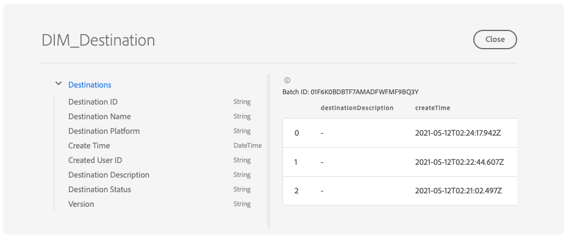

# 探索、驗證及處理儀表板資料集，使用 [!DNL Query Service]

Adobe Experience Platform透過Experience PlatformUI中提供的控制面板，提供您組織設定檔、區段和目的地資料的重要資訊。 然後您可以使用Adobe Experience Platform [!DNL Query Service] 探索、驗證及處理原始資料集，以便在資料湖中支援這些儀表板。

## 開始使用 [!DNL Query Service]

Adobe Experience Platform [!DNL Query Service] 透過啟用標準SQL在Data Lake中查詢資料，支援行銷人員從其資料中獲得深入分析。 [!DNL Query Service] 提供使用者介面和API，可用於聯結Data Lake中的任何資料集，以及將查詢結果擷取為新資料集，以用於報表、機器學習或內嵌至Real-Time Customer Profile。

若要深入瞭解 [!DNL Query Service] 及其在Experience Platform中的角色，請先閱讀 [[!DNL Query Service] 概觀](../query-service/home.md).

## 存取可用的資料集

您可以使用 [!DNL Query Service] 以查詢設定檔、區段和目的地儀表板的原始資料集。 若要檢視您的可用資料集，請在Experience PlatformUI中選取 **資料集** 在左側導覽中開啟「資料集」控制面板。 儀表板會列出貴組織的所有可用資料集。 系統會顯示每個列出資料集的詳細資訊，包括其名稱、資料集所遵守的結構描述，以及最近一次擷取執行的狀態。


### 系統產生的資料集

>[!IMPORTANT]
>
>系統產生的資料集預設為隱藏。 根據預設， [!UICONTROL 瀏覽] 索引標籤僅顯示您已擷取資料的資料集。

若要檢視系統產生的資料集，請選取篩選圖示()。


會顯示一個側欄，其中包含兩個切換 [!UICONTROL 包含在設定檔中] 和 [!UICONTROL 顯示系統資料集]. 選取以下專案的切換： [!UICONTROL 顯示系統資料集] 在資料集的可瀏覽清單中包含系統產生的資料集。


### 設定檔屬性資料集

設定檔儀表板深入分析會繫結至您的組織所定義的合併原則。 對於每個使用中的合併原則，資料湖中都會有一個可用的設定檔屬性資料集。

這些資料集的命名慣例是 **Profile-Snapshot-Export** 後面接著系統產生的隨機英數字元。 例如: `Profile-Snapshot-Export-abbc7093-80f4-4b49-b96e-e743397d763f`.

若要瞭解每個設定檔快照集匯出資料集的完整結構描述，您可以預覽和探索資料集 [使用資料集檢視器](../catalog/datasets/user-guide.md) 在Experience PlatformUI中。


#### 將設定檔屬性資料集對應到合併原則ID

指派給每個系統產生之設定檔屬性資料集的英數字元值是一個隨機字串，可對應至您的組織所建立其中一個合併原則的合併原則ID。 每個合併原則ID與其相關設定檔屬性資料集字串的對應，會保留在 `adwh_dim_merge_policies` 資料集。

此 `adwh_dim_merge_policies` 資料集包含以下欄位：

* `merge_policy_name`
* `merge_policy_id`
* `merge_policy`
* `dataset_id`

您可以使用Experience Platform中的查詢編輯器UI探索此資料集。 若要進一步瞭解如何使用查詢編輯器，請參閱 [查詢編輯器UI指南](../query-service/ui/user-guide.md).

### 區段中繼資料資料集

資料湖中有可用的區段中繼資料資料集，其中包含您組織的每個區段的中繼資料。

此資料集的命名慣例是 **Segmentdefinition-Snapshot-Export** 後面接著英數字元。 例如︰`Segmentdefinition-Snapshot-Export-acf28952-2b6c-47ed-8f7f-016ac3c6b4e7`

若要瞭解每個區段定義快照匯出資料集的完整結構描述，您可以預覽和探索資料集 [使用資料集檢視器](../catalog/datasets/user-guide.md) 在Experience PlatformUI中。


### 目的地中繼資料資料集

貴組織所有已啟用目的地的中繼資料都可作為Data Lake中的原始資料集使用。

此資料集的命名慣例是 **DIM_Destination**.

若要瞭解DIM目的地資料集的完整結構描述，您可以預覽和探索資料集 [使用資料集檢視器](../catalog/datasets/user-guide.md) 在Experience PlatformUI中。



## (Beta) Customer Data Platform (CDP)深入分析報表

>[!IMPORTANT]
>
>CDP Insights資料模型功能為Beta版。 其功能和檔案可能會有所變更。

CDP見解資料模型功能會公開可為各種設定檔、目的地和分段Widget提供見解的SQL。 您可以自訂這些SQl查詢範本，為您的行銷和KPI使用案例建立CDP報表。

CDP報告提供您設定檔資料及其區段和目的地關係的深入分析。 如需如何操作的詳細資訊，請參閱CDP見解資料模型檔案 [將CDP見解資料模型套用至您的特定KPI使用案例](./cdp-insights-data-model.md).

## 範例查詢

以下查詢範例包含可用於下列專案的範例SQL： [!DNL Query Service] 探索、驗證及處理儀表板所需的原始資料集。

### 依身分割槽分的設定檔計數

此設定檔分析提供資料集中所有合併設定檔的身分劃分。

>[!NOTE]
>
>依身分割槽分的設定檔總數（換言之，將針對每個名稱空間顯示的值相加）可能會高於合併的設定檔總數，因為一個設定檔可能會有多個相關聯的名稱空間。 例如，如果客戶在多個頻道上與您的品牌互動，則多個名稱空間會與該個別客戶相關聯。

**查詢**

```sql
Select
        Key namespace,
        count(1) count_of_profiles
     from
        (
           Select
               explode(identitymap)
           from
              Profile-Snapshot-Export-abbc7093-80f4-4b49-b96e-e743397d763f
        )
     group by
        namespace;
```

### 依區段的設定檔計數

此對象分析提供資料集中每個區段內的合併設定檔總數。 此數字是將區段合併原則套用至設定檔資料的結果，以便將設定檔片段合併在一起，為區段中的每個人形成一個設定檔。

```sql
Select          
        concat_ws('-', key, source_namespace) segment_id,
        count(1) count_of_profiles
      from
        (
            Select
              Upper(key) as source_namespace,
              explode(value)
            from
              (
                  Select
                    explode(Segmentmembership)
                  from
                    Profile-Snapshot-Export-abbc7093-80f4-4b49-b96e-e743397d763f
              )
        )
      group by
      segment_id
```

## 後續步驟

閱讀本指南後，您現在可以使用 [!DNL Query Service] 執行數個查詢，以探索及處理原始資料集，為您的設定檔、區段和目的地儀表板提供強大的功能。

若要進一步瞭解每個儀表板及其量度，請從檔案導覽的可用儀表板清單中選取儀表板。
