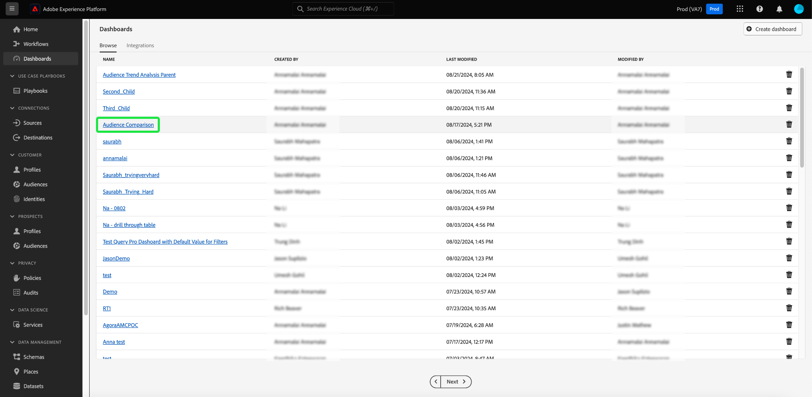

# Export PDF {#export-pdf}

使用[Query Pro模式](./overview.md#query-pro-mode)建立[自訂insight](./overview.md)後，您就可以將圖表資料匯出為PDF格式。 此動作會從您的自訂儀表板概觀中取得。

在儀表板工作區中，從[!UICONTROL 瀏覽]索引標籤中所列的詳細目錄中選取自訂儀表板。

您的自訂儀表板隨即出現。 接著，從UI的右上角選取&#x200B;**[!UICONTROL 匯出]**。

>[!NOTE]
>
>僅限視覺效果的匯出不需要[!UICONTROL 匯出儀表板資料]許可權。 如需詳細資訊，請參閱[[!UICONTROL 檢視更多]檔案](./view-more.md#export)。

**[!UICONTROL 匯出檔案]**&#x200B;對話方塊就會顯示。 最後，選取&#x200B;**[!UICONTROL 下載]**

![下載的[匯出檔案]對話方塊。](../images/sql-insights-query-pro-mode/export-dialog.png)

PDF預覽隨即顯示。 選取&#x200B;**[!UICONTROL 儲存]**&#x200B;以完成程式。

![反白顯示[儲存]的列印預覽對話方塊。](../images/sql-insights-query-pro-mode/print-preview.png)
