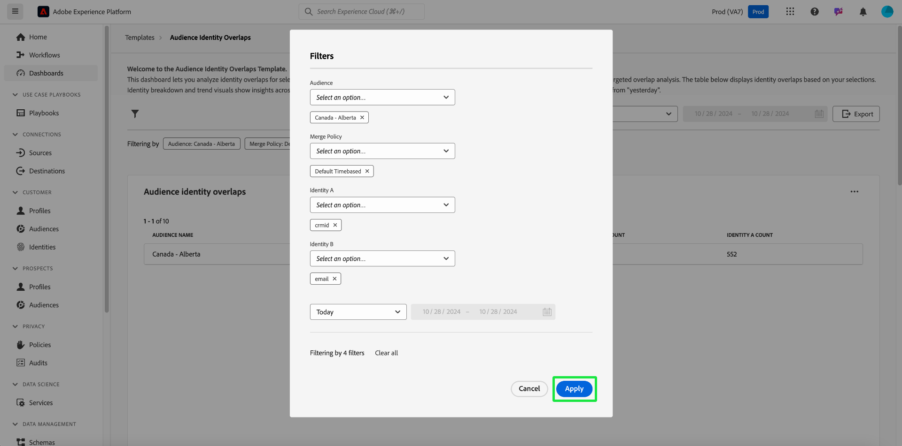
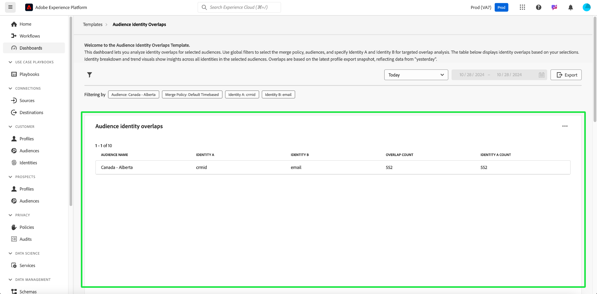

# 客群身分重疊

使用[!UICONTROL 對象身分重疊]儀表板，分析所選對象的身分重疊。 您可以使用對象內不同身分如何彼此相關的深入分析，來最佳化拚接策略、減少備援，並改善客戶細分準確性。 透過改善對身分型別之間重疊的瞭解，開發有效的目標定位策略並簡化客戶互動。

## 篩選對象 {#filter-audiences}

使用自訂篩選器對特定對象和身分型別進行目標分析，確保呈現的資料與您的分析目標一致。 若要開始分析，請選取篩選圖示（）。

**[!UICONTROL 篩選器]**&#x200B;對話方塊就會顯示。 從此檢視中，選擇全域篩選器以設定要比較的對象、合併原則和身分。 從每個區段的下拉式選單中選取要分析的設定

1. 選取&#x200B;**[!UICONTROL 對象]**：選擇您要分析的對象區段（例如，**加拿大 — 艾伯塔**）。
2. 指定&#x200B;**[!UICONTROL 合併原則]**：定義合併原則，以指定如何在選取的對象中組合身分（在範例熒幕擷圖中，已選取&#x200B;**預設基於時間**&#x200B;原則）。
3. 選取&#x200B;**[!UICONTROL 身分A]**&#x200B;和&#x200B;**[!UICONTROL 身分B]**&#x200B;以進行比較&#x200B;**：選擇兩個身分型別以進行比較。 在此範例中，**&#x200B;身分A&#x200B;**&#x200B;被選取為「crmId」，**&#x200B;身分B**&#x200B;被選取為「電子郵件」。
4. **設定日期範圍**：選擇預先定義的範圍，例如「今天」，或使用行事曆欄位手動設定開始和結束日期。

>[!TIP]
>
>若要清除所有自訂全域篩選器，請從[!UICONTROL 篩選器]對話方塊中選取&#x200B;**[!UICONTROL 全部清除]**。 若要移除單一篩選器，請選取篩選器名稱右側的&#39;[!UICONTROL X]&#39;。

選擇篩選器後，選取&#x200B;**[!UICONTROL 套用]**&#x200B;以重新整理儀表板。

## 可用的儀表板深入分析 {#available-insights}

**對象身分重疊**&#x200B;儀表板提供數個視覺效果和表格資料，協助您瞭解對象中的身分重疊和趨勢。

### 客群身分重疊 {#overlaps-table}

**[!UICONTROL 對象身分重疊]**&#x200B;表格會根據您選取的篩選器顯示身分重疊。 使用此資訊來評估不同身分型別之間的重疊，並瞭解身分解析的有效程度。 下表詳細說明每一欄：

| 欄名稱 | 說明 |
|-----------------|-------------------------------|
| **[!UICONTROL 對象名稱]** | 正在分析的對象名稱。 此欄會識別正在檢閱的對象區段，以確保前瞻分析聚焦於預期的目標群組。 |
| **[!UICONTROL 身分A]**&#x200B;和&#x200B;**[!UICONTROL 身分B]** | 正在比較的身分（例如，`crmId`和`email`）。 瞭解正在比較哪些身分型別，可協助您識別哪些身分解析策略造成受眾重疊，並最佳化這些關係。 |
| **[!UICONTROL 重疊計數]** | 同時存在兩個身分的設定檔計數。 此量度提供對象內身分重疊範圍的深入分析。 這項資訊對於評估將多個身分解析為統一設定檔的有效程度至關重要，進而可改善目標定位和個人化策略。 |
| **[!UICONTROL 識別計數]** | 所選對象中包含&#x200B;**身分A**&#x200B;的設定檔總數。 使用此資訊來瞭解對象中主要身分型別的流行程度，並評估其在重疊分析中的角色。 |

### 身分劃分 {#identity-breakdown}

**[!UICONTROL 身分劃分]**&#x200B;圖表顯示所選對象中身分的相對構成。 X軸代表所選對象中的身分總數，而Y軸代表正在分析的對象名稱。 使用此視覺效果來瞭解每種身分型別的流行程度，並評估身分管理策略的影響。 圖表使用不同的顏色來區分身分型別，提供身分如何在對象中分配的快速概覽。

>[!TIP]
>
>將游標停留在欄上可檢視每個身分型別的個人檔案數。

### 對象身分趨勢 {#audience-identity-trends}

**[!UICONTROL 對象身分趨勢]**&#x200B;圖表提供身分總數隨時間變化的深入分析。 X軸代表正在分析的日期範圍，而Y軸代表依對象的身分總數。 使用此量度來追蹤身分成長、評估穩定性，以及評估持續性身分管理工作的有效性。

>[!TIP]
>
>將滑鼠指標暫留在圖表中的日期，可檢視對象在特定日期的身分總數。

## 匯出深入分析 {#export-insights}

分析身分重疊後，您可以匯出資料以供離線分析或報告。 若要匯出您的資料，請選取表格右上角的&#x200B;**[!UICONTROL 匯出]**。 「列印PDF」對話方塊會出現，可讓您將視覺化資料儲存為PDF或列印。

**對象身分重疊**&#x200B;儀表板提供您所選對象中不同身分如何交集的基本深入分析。 運用這些深入分析，您可以調整身分拼接策略、減少備援，並確保您的對象細分更準確有效。

## 後續步驟

閱讀本檔案後，您已瞭解如何使用&#x200B;**對象身分重疊**&#x200B;儀表板，針對選取的對象取得身分重疊的寶貴見解。 若要進一步提升您對受眾細分和身分管理的瞭解，請探索提供全面深入分析的其他資料Distiller範本。 請參閱[對象趨勢](./trends.md)、[對象比較](./comparison.md)和[進階對象重疊](./overlaps.md) UI指南，以繼續改善您的目標定位和參與策略。

