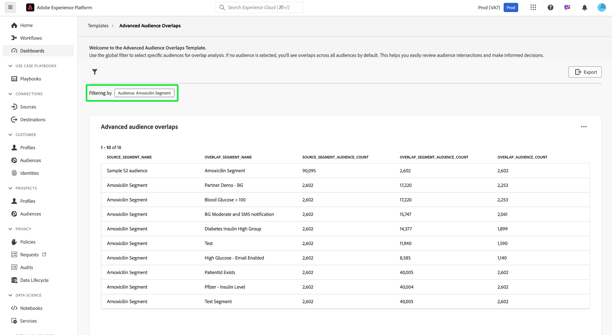

# 進階客群重疊

分析不同受眾區段與[!UICONTROL 進階受眾重疊]儀表板的交集方式，獲得寶貴的見解，以最佳化您的受眾細分和目標定位策略。 檢查清單量度，以識別重疊、調整細分並減少多餘的傳訊。 最終，您可以利用這些見解來建立更有針對性的行銷活動以及有效的行銷工作。 在此控制面板上，您可以檢閱對象交集、套用篩選器和執行詳細的重疊分析，以做出資料導向式決定並改善參與結果。

## 篩選對象 {#filter-audiences}

若要篩選重疊分析的特定對象，請選取篩選圖示()以開啟[!UICONTROL 篩選器]對話方塊。 從這裡，您可以從重疊範本新增或移除對象，以調整您的分析。

[!UICONTROL 篩選器]對話方塊就會顯示。 若要選擇重疊分析的對象，請從&#x200B;**[!UICONTROL 對象]**&#x200B;下拉式清單中選取對象名稱。 您新增的任何對象名稱都會顯示在下拉式清單下方，並帶有標籤。 新增後，您可以依名稱選取「X」來移除它們。 若要移除所有套用的篩選器，請選取&#x200B;**[!UICONTROL 全部清除]**。

## 套用的篩選器 {#applied-filters}

套用篩選器後（在熒幕擷圖範例中為[!UICONTROL Amoxicilin區段]），顯示的對象資料就會縮小。 您選擇新增的任何其他對象會顯示在[!UICONTROL 進階對象重疊]圖表上方的[!UICONTROL 篩選依據]標籤旁。

## 進階對象重疊表格 {#advanced-audience-overlaps-table}

控制面板的主要區段顯示[!UICONTROL 進階對象重疊]表格，此表格提供不同區段之間對象重疊的詳細比較。 表格資料欄如下：

| 欄名稱 | 說明 |
|------------------------------------|----------------------------------------------------------------------------------------------|
| **[!UICONTROL Source_Segment_Name]** | 正在分析的原始對象（例如「阿莫西林區段」）。 |
| **[!UICONTROL 重疊區段名稱]** | 正在比較重疊的對象（例如「血糖> 100」）。 |
| **[!UICONTROL Source_Segment_Audience_Count]** | 來源對象的設定檔總數。 |
| **[!UICONTROL Overlap_Segment_Audience_Count]** | 重疊對象的大小，會依重疊而有所差異。 |
| **[!UICONTROL Overlap_Audience_Count]** | 來源和重疊對象之間的實際重疊對象大小。 |

{style="table-layout:auto"}

## 匯出深入分析 {#export-insights}

篩選和分析對象後，即可匯出資料供進一步的離線分析或報告之用。 若要匯出您的深入分析，請選取表格右上角的&#x200B;**[!UICONTROL 匯出]**。 列印PDF對話方塊會出現，可讓您將資料儲存為PDF或列印。

若要返回[!UICONTROL 範本]總覽，請選取&#x200B;**[!UICONTROL 範本]**。

## 後續步驟

閱讀本檔案後，您已瞭解如何使用&#x200B;**[!UICONTROL 進階對象重疊]**&#x200B;儀表板來分析對象交集，以及進行資料導向式決策。 若要進一步最佳化您的對象細分和目標定位策略，請探索其他提供寶貴見解的Data Distiller範本。 請參閱[對象趨勢](./trends.md)、[對象比較](./comparison.md)和[對象身分重疊](./identity-overlaps.md) UI指南，以繼續增強您的對象參與和細分工作。

