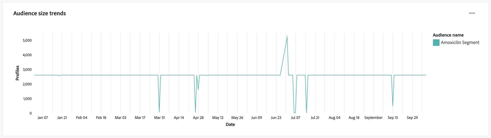

# 客群趨勢

透過[!UICONTROL 對象趨勢]儀表板上的關鍵對象量度的視覺效果，分析對象如何隨著時間變化。 此儀表板可協助您追蹤對象成長、身分數量和單一身分設定檔數量等趨勢，並可讓您進行資料導向式決策。 透過分析這些量度，行銷人員可以最佳化鎖定目標策略、改善對象參與度，以及調整其細分工作，以獲得更有效的行銷活動。

## 篩選對象 {#filter-audiences}

若要開始分析，請使用全域篩選器來選取您要分析的特定對象和日期範圍。 選取篩選圖示()以開啟&#x200B;**[!UICONTROL 篩選器]**&#x200B;對話方塊，您可以：

1. **選取對象**：選擇您要分析的對象（在熒幕擷圖範例中，已選取&#x200B;**Amoxicillin**&#x200B;對象）。
1. **設定日期範圍**：從下拉式功能表中選擇預先定義的範圍，或使用行事曆欄位手動選取開始和結束日期。

設定您的篩選器後，選取&#x200B;**[!UICONTROL 套用]**&#x200B;以更新儀表板。 系統會在特定時段套用您選取的篩選器，並集中顯示所選對象的深入分析。 您的自訂篩選器可確保資料與您的分析目標相關。

## 可用的對象趨勢圖 {#available-charts}

有三個主要圖表可協助您瞭解一段時間內的受眾量度。 對於每個圖表，您可以選取右上方的橢圓(`...`)，然後選取[!UICONTROL 檢視更多]以檢視以表格形式呈現的結果，或是將資料下載為CSV檔案以在試算表中檢視。 如需詳細資訊，請參閱[檢視更多指南](../view-more.md)。

>[!TIP]
>
>您可以將滑鼠移至任何圖表中的特定日期，在對話方塊中顯示個別設定檔計數。

### 對象人數趨勢 {#audience-size-trends}

**[!UICONTROL 對象人數趨勢]**&#x200B;圖表會顯示一段時間內所選對象中的設定檔數量。 這有助於追蹤對象的成長或減少。 您可以使用此圖表來監控參與效率並瞭解對象人數的變化。

### 對象身分趨勢 {#audience-identities-trends}

**[!UICONTROL 對象身分趨勢]**&#x200B;圖表提供對象區段內身分總數的深入分析。 使用此圖表來瞭解不重複身分如何影響對象的整體大小。 它提供對象穩定性和參與的指標。

### 單一身分對象人數趨勢 {#single-identity-audience-size-trends}

**[!UICONTROL 單一身分對象大小趨勢]**&#x200B;圖表顯示只有單一身分的對象成員計數。 此量度有助於瞭解對象的組成（尤其是身分唯一性），並有助於評估身分拼接工作的有效性。

## 匯出深入分析 {#export-insights}

分析量度並套用相關篩選器後，您可以匯出資料以供進一步離線分析或報告。 若要這麼做，請選取表格右上角的&#x200B;**[!UICONTROL 匯出]**。 列印PDF對話方塊隨即顯示。 您可以從該對話方塊將視覺化資料儲存為PDF或列印。

## 後續步驟

閱讀本檔案後，您已瞭解如何從&#x200B;**對象趨勢**&#x200B;儀表板取得一段時間內對象行為的寶貴見解。 若要瞭解其他資料Distiller範本，以協助您做出明智的決定、最佳化細分並改善參與策略，請參閱[對象比較](./comparison.md)、[對象身分重疊](./identity-overlaps.md)和[進階對象重疊](./overlaps.md) UI指南。
