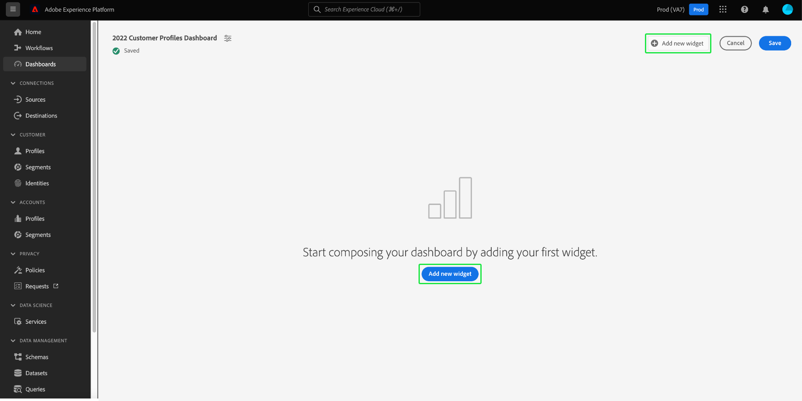

# 標準儀表板

使用Adobe Experience Platform儀表板可透過儀表板功能加速深入分析和自訂視覺效果。 使用此功能來建立和管理自訂儀表板，您可以在其中建立、新增和編輯自訂的Widget，以視覺化與您的組織相關的關鍵量度。

<!-- Getting started / permissions section commented out for Beta. This will be necessary after GA only

## Getting started

To view dashboards in Adobe Experience Platform you must have the appropriate permissions enabled. Please read the [dashboards permissions documentation](./permissions.md#available-permissions) to learn how to grant users the ability to view, edit, and update Experience Platform dashboards using Adobe Admin Console. If you do not have administrator privileges for your organization, contact your product administrator to obtain the required permissions. -->

## 建立自訂儀表板

若要建立自訂儀表板，請先導覽至儀表板詳細目錄。 從Platform UI的左側導覽列中選取&#x200B;**[!UICONTROL 儀表板]**，接著選取&#x200B;**[!UICONTROL 建立儀表板]**。

在新增自訂儀表板之前，儀表板庫存是空的，並顯示「找不到儀表板」。 訊息。 建立後，您的所有儀表板都會列在儀表板詳細目錄中。

<!-- >[!NOTE]
>
>To edit an existing dashboard, select the dashboard name from the inventory list followed by the pencil icon ()
>{width="100" zoomable="yes"} -->

[!UICONTROL 建立儀表板]對話方塊就會顯示。 輸入您想要建立之Widget集合的人性化描述性名稱，並選取&#x200B;**[!UICONTROL 儲存]**。

已購買Data Distiller SKU的使用者可選擇使用自訂SQL查詢來建立其深入分析。 如需此工作流程的指示，請參閱[query pro mode overview](./sql-insights-query-pro-mode/overview.md)。

新建立的空白圖示板會出現，而您選擇的名稱會顯示在檢視的左上角。

## 建立小工具 {#create-widget}

>[!CONTEXTUALHELP]
>id="platform_dashboards_udd_maxwidgets"
>title="小工具的最大數量"
>abstract="儀表板服務最多支援十個小工具。將十個小工具新增到儀表板後，「[!UICONTROL 新增小工具]」選項會停用並顯示為灰色。"

從您的新儀表板檢視中，選取&#x200B;**[!UICONTROL 新增Widget]**&#x200B;以開始建立Widget的程式。

>[!IMPORTANT]
>
>每個儀表板最多可支援10個Widget。 將十個小工具新增到儀表板後，「[!UICONTROL 新增小工具]」選項會停用並顯示為灰色。

### Widget composer

Widget Composer工作區隨即顯示。 接著，選取&#x200B;**[!UICONTROL 選取資料]**，以選擇要從其中新增屬性的資料模型至Widget。

#### 選取資料模型 {#select-data-model}

[!UICONTROL 選取資料模型]對話方塊就會顯示。 從左欄選取資料模型，以顯示所有可用表格的預覽清單。 Real-time Customer Data Platform的預先設定資料模型名為[!UICONTROL CDPInsights]。

>[!TIP]
>
>選取資訊圖示()，以在資料邊欄中顯示太長時檢視完整的資料模型名稱。

預覽清單提供資料模型中所含表格的詳細資訊。 下表提供欄欄位及其潛在值的說明。

| 欄欄位 | 說明 |
|---|---|
| [!UICONTROL 標題] | 資料表的名稱。 |
| [!UICONTROL 資料表型別] | 表格的型別。 可能的型別包括： `fact`、`dimension`和`none`。 |
| [!UICONTROL 筆記錄] | 與所選表格相關聯的記錄數。 |
| [!UICONTROL 查詢] | 連結至所選表格的表格數目。 |
| [!UICONTROL 屬性] | 所選表格的屬性數目。 |

選取「**[!UICONTROL 下一步]**」以確認您選擇的資料模型。 下一個檢視會在左側邊欄中顯示可用表格的清單。 選取表格以檢視所選表格中所包含資料的完整劃分。

### 填入Widget {#populate-widget}

[!UICONTROL 預覽]面板包含[!UICONTROL 樣本記錄]和[!UICONTROL 屬性]的索引標籤。 [!UICONTROL 範例記錄]索引標籤提供來自表格檢視中所選資料表的記錄子集。 [!UICONTROL 屬性]索引標籤會針對與所選資料表關聯的每個屬性，提供屬性名稱、資料型別和來源資料表。

從左側邊欄中可用的清單中選取一個表格，以提供您Widget的資料，然後選取&#x200B;**[!UICONTROL 選取]**&#x200B;以返回Widget Composer。

Widget撰寫器現在會填入您所選表格的資料。

資料模型和目前選取的表格會顯示在左側邊欄的頂端，而可用於建立您的Widget的屬性會列在[!UICONTROL 屬性]欄中。 您可以使用搜尋列來尋找屬性，而不是捲動清單，或選取鉛筆圖示（)。

#### 新增和篩選屬性 {#add-and-filter-attributes}

選取新增圖示()，新增屬性至您的Widget。 出現的下拉式選單可讓您為Widget將屬性新增為X軸、Y軸、顏色或濾鏡。 [!UICONTROL Color]屬性可讓您根據顏色區分X軸和Y軸標籤的結果。 它根據第三個屬性的組成將結果分割成不同的顏色，以達成此目的。

>[!TIP]
>
>如果要翻轉X軸和Y軸的排列，請選取向上和向下箭頭圖示()以切換其排列方式。

若要變更Widget的圖形或圖表型別，請選取[!UICONTROL 標籤]下拉式清單，然後從可用的選項中選擇。 選項包括長條、點、刻度、直線或區域。 選取後，系統會產生Widget目前設定的預覽視覺效果。

將屬性新增為篩選器後，您可以選取要包含或排除Widget中的值。 從屬性清單新增篩選器後，[!UICONTROL 篩選器]對話方塊會出現，您可以在其中使用核取方塊選取或取消選取值。

#### 篩選掉歷史資料 {#filter-historical-data}

若要從您的Widget產生的深入分析中篩選出歷史資料，請新增`date_key`屬性作為篩選器，然後選取&#x200B;**[!UICONTROL 最近日期]**，接著選取&#x200B;**[!UICONTROL 套用]**。 此篩選器可確保用於衍生見解的資料是從最近的系統快照中取得。

![含有[!UICONTROL 最近日期]和[!UICONTROL 套用]的[!UICONTROL 篩選器： date_key]對話方塊已強調顯示。](./images/standard-dashboards/recent-date.png)

或者，您可以建立自訂時段，依篩選資料。 選取&#x200B;**[!UICONTROL 選取日期]**&#x200B;以使用可用日期清單來延長對話方塊。 使用&#x200B;**[!UICONTROL 全選]**&#x200B;核取方塊來啟用或停用所有可用的選項，或分別選取每天的核取方塊。 最後，選取&#x200B;**[!UICONTROL 套用]**&#x200B;以確認您的選擇。

>[!NOTE]
>
>如果`date_key`屬性已經新增為篩選器，請從下拉式選項中選取省略符號，然後選取&#x200B;**[!UICONTROL 編輯]**&#x200B;以變更篩選期間。

![包含個別日期核取方塊的[!UICONTROL 篩選器： date_key]對話方塊已核取及取消核取。](./images/standard-dashboards/select-dates.png)

### 小工具屬性

選取屬性圖示()以開啟屬性面板。 在[!UICONTROL 屬性]面板的[!UICONTROL Widget標題]文字欄位中，輸入Widget的名稱。

在Widget屬性面板中，您可以編輯Widget的多個層面。 您擁有編輯Widget圖例位置的完整控制權。 若要移動圖例，請選取[!UICONTROL 圖例位置]下拉式清單，然後從可用選項清單中選擇所需的位置。 您也可以在[!UICONTROL 圖例標題]文字欄位或[!UICONTROL 軸標籤]文字欄位中輸入新名稱，以重新命名與圖例以及X軸或Y軸關聯的標籤。

#### 儲存您的Widget {#save-widget}

在Widget Composer中儲存時，會將Widget本機儲存至您的儀表板。 如果您想要儲存工作並在稍後繼續，請選取[儲存]。**** Widget名稱下方的勾號圖示表示已儲存Widget。 或者，當您滿意您的Widget時，選取&#x200B;**[!UICONTROL 儲存並關閉]**，讓其他所有可存取您控制面板的使用者都能使用此Widget。 選取&#x200B;**[!UICONTROL 取消]**&#x200B;以放棄您的工作並返回您的自訂儀表板。

>[!TIP]
>
>選取屬性圖示()，檢視其建立的詳細資訊。 您可以在出現的對話方塊中變更圖示板的名稱。

在此工作區中，Widget可以重新排列和調整大小。 選取&#x200B;**[!UICONTROL 儲存]**&#x200B;以保留您的儀表板名稱和已設定的配置。

為了確保Adobe Real-time Customer Data Platform見解儀表板的每個查詢都有足夠的資源來有效執行，API會透過為每個查詢指派並行位置來追蹤資源使用情況。 系統最多可以處理四個同時查詢，因此在任何給定時間都有四個同時查詢空位可用。 查詢會根據並行位置放入佇列中，然後在佇列中等待，直到有足夠的並行位置可用。

### 編輯、複製或刪除Widget {#duplicate}

建立Widget後，您就可以從自訂儀表板編輯、複製或刪除整個Widget。

>[!TIP]
>
>若要在任何現有的自訂控制面板之間切換，請選取左側導覽列中的控制面板，然後從詳細目錄清單中選取控制面板名稱。

選取鉛筆圖示()以進入編輯模式。

接著，選取您要編輯、複製或刪除之Widget右上角的省略符號。 從下拉式選單中選取適當的動作。

>[!NOTE]
>
>複製可讓您自訂深入分析的屬性，以建立唯一的Widget，而不需從頭開始。 如果複製Widget，它會出現在您的自訂儀表板中。 然後，您可以選取新Widget的省略符號，接著選取&#x200B;**[!UICONTROL 編輯]**，以自訂您的分析。

## 後續步驟和其他資源

閱讀本檔案後，您將會更加瞭解如何建立自訂儀表板，以及如何為該儀表板建立、編輯和更新自訂Widget。

若要探索[設定檔](./guides/profiles.md#standard-widgets)、[區段](./guides/audiences.md#standard-widgets)和[目的地](./guides/destinations.md#standard-widgets)控制面板的可用預先設定量度和視覺效果，請參閱其各自檔案中的標準Widget清單。

若要加深您對Experience Platform中控制面板的瞭解，請觀看以下影片：

>[!VIDEO](https://video.tv.adobe.com/v/3409637?quality=12&learn=on)
