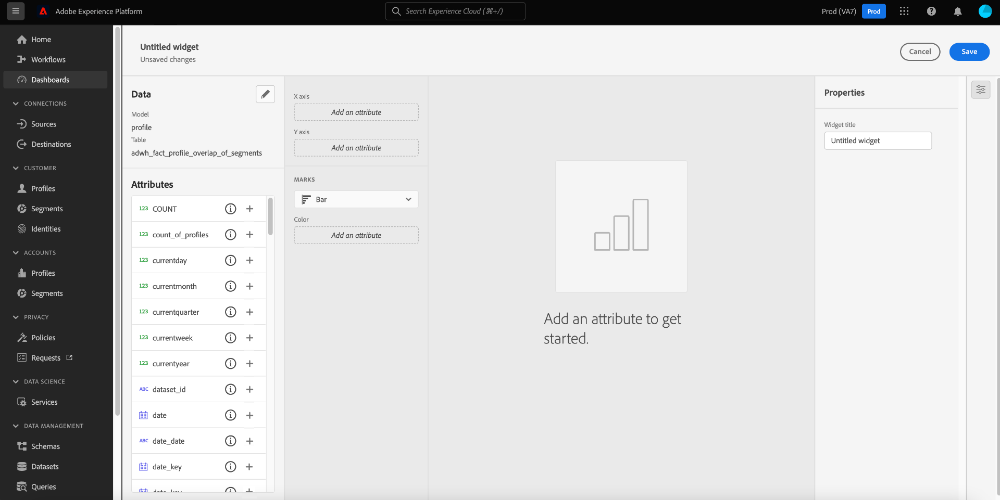

# 使用者定義的控制面板

Adobe Experience Platform控制面板可協助您透過使用者定義的控制面板功能，加速深入分析和自訂視覺效果。 此功能可讓您建立和管理自訂控制面板，在其中建立、新增及編輯定制小工具，以視覺化與貴組織相關的關鍵量度。

<!-- Getting started / permissions section commented out for Beta. This will be necessary after GA only

## Getting started

To view dashboards in Adobe Experience Platform you must have the appropriate permissions enabled. Please read the [dashboards permissions documentation](./permissions.md#available-permissions) to learn how to grant users the ability to view, edit, and update Experience Platform dashboards using Adobe Admin Console. If you do not have administrator privileges for your organization, contact your product administrator to obtain the required permissions. -->

## 建立自訂控制面板

若要建立自訂控制面板，請先導覽至控制面板詳細目錄。 選擇 **[!UICONTROL 控制面板]** 從Platform UI的左側導覽，接著 **[!UICONTROL 建立控制面板]**.

新增自訂控制面板前，控制面板清單為空，並顯示「找不到控制面板」。 訊息。 建立後，所有使用者定義的控制面板都會列在控制面板清單中。

此 [!UICONTROL 建立控制面板] 對話框。 為要建立的小部件集合輸入易記的描述性名稱，然後選擇 **[!UICONTROL 儲存]**.

新建立的空白控制面板會以您選擇的名稱顯示在檢視的左上角。

## 建立介面工具集 {#create-widget}

>[!CONTEXTUALHELP]
>id="platform_dashboards_udd_maxwidgets"
>title="Widget的最大數量"
>abstract="使用者定義的控制面板最多支援10個小工具。 在您新增10個介面工具集至控制面板後， [!UICONTROL 新增介面工具集] 選項已停用且顯示為灰色。"

在新控制面板檢視中，選取 **[!UICONTROL 新增介面工具集]** 以開始介面工具集建立程式。

>[!IMPORTANT]
>
>使用者定義的控制面板最多支援10個小工具。 在您新增10個介面工具集至控制面板後， [!UICONTROL 新增介面工具集] 選項已停用且顯示為灰色。

### 介面工具集撰寫器

介面工具集撰寫器工作區隨即出現。 下一步，選擇 **[!UICONTROL 選擇資料]** 選擇要從中向Widget添加屬性的資料模型。

此 [!UICONTROL 選擇資料] 對話框。 從左欄選取資料模型，以顯示所有可用表格的預覽清單。

>[!NOTE]
>
>使用者定義的控制面板目前僅支援設定檔資料模型。 支援更多選項。

預覽清單提供資料模型中所含表格的詳細資訊。 下表提供欄欄位及其潛在值的說明。

| 欄欄位 | 說明 |
|---|---|
| [!UICONTROL 標題] | 表的名稱。 |
| [!UICONTROL 表格類型] | 表的類型。 可能的類型包括： `fact`, `dimension`，和 `none`. |
| [!UICONTROL 查閱] | 連接到所選表的表數。 |

選擇 **[!UICONTROL 下一個]** 確認您選擇資料模型。 下一個檢視會在左側邊欄中顯示可用表格的清單。 選取表格，即可查看所選表格中所包含資料的完整劃分。

此 [!UICONTROL 預覽] 面板包含標籤 [!UICONTROL 記錄範例] 和 [!UICONTROL 屬性]. 此 [!UICONTROL 記錄範例] 頁簽提供清單視圖中選定表中記錄的子集。 此 [!UICONTROL 屬性] 頁簽為與選定表關聯的每個屬性提供屬性名稱、資料類型和源表。

從左側邊欄的可用清單中選取表格，以提供介面工具集的資料，然後選取 **[!UICONTROL 選擇]** 返回介面工具集撰寫器。

介面工具集撰寫器現在會填入您所選表格的資料。

資料模型和目前選取的表格會顯示在左側邊欄的頂端，而可用來建立介面工具集的屬性會列在「屬性」欄中。

>[!TIP]
>
>您可以選取鉛筆圖示()。

選取新增圖示(./images/user-defined-dashboards/add-icon.png)，以新增屬性至X或Y軸。

接下來，從 [!UICONTROL 標籤] 下拉式清單，產生介面工具集目前設定的預覽視覺效果。 在 [!UICONTROL 屬性] 在畫面右側的邊欄中，在 [!UICONTROL 介面工具集標題] 文字欄位。

當您對介面工具集感到滿意時，請選取 **[!UICONTROL 儲存]**. 介面工具集名稱下方的勾選圖示表示該介面工具集已儲存。

>[!NOTE]
>
>在介面工具集撰寫器中儲存時，會將介面工具集儲存在本機至您的控制面板。 如果您退出控制面板編輯器卻未儲存控制面板，則介面工具集將不會儲存至控制面板。

選擇 **[!UICONTROL 取消]** 返回自訂控制面板。

>[!TIP]
>
>選取控制面板名稱旁的設定圖示，即可查看其建立的詳細資訊。 您可以在顯示的對話方塊中變更控制面板的名稱。

在此工作區中，可以重新排列小部件並調整其大小。 選擇 **[!UICONTROL 儲存]** 以保留控制面板名稱和設定的配置。

## 後續步驟

閱讀本檔案後，您就更能了解如何建立自訂控制面板，以及如何為該控制面板建立、編輯和更新自訂小工具。

若要探索 [設定檔](./guides/profiles.md#standard-widgets), [區段](./guides/segments.md#standard-widgets)，和 [目的地](./guides/destinations.md#standard-widgets) 控制面板，請參閱其個別檔案中的標準Widget清單。
