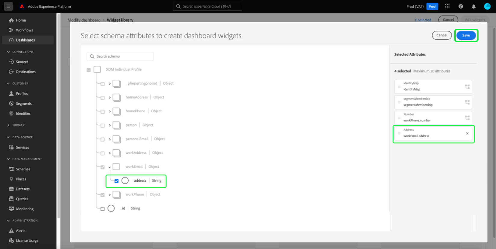

# 介面工具集庫{#widget-library}

在Adobe Experience Platform使用者介面中，您可以使用多個控制面板來檢視及與組織的資料互動。 您也可以將新介面工具集新增到控制面板檢視，以更新其中一些控制面板。 除了由Adobe提供的標準Widget外，您還可以建立自訂Widget並在整個組織中共用它們。

本指南提供新增標準Widget和建立自訂Widget的逐步指示，以自訂Platform UI中[!UICONTROL Profiles]、[!UICONTROL Segments]和[!UICONTROL Destinations]控制面板中顯示的資訊。

有關如何修改[!UICONTROL Profiles]、[!UICONTROL Destinations]和[!UICONTROL Segments]控制面板中小工具的位置和大小的資訊，請參閱[modify控制面板指南](modify.md)。

>[!NOTE]
>
>無法自訂[!UICONTROL 授權使用]控制面板中顯示的介面工具集。 若要深入了解此唯一控制面板，請參閱[授權使用控制面板檔案](guides/license-usage.md)。

## 存取介面工具集程式庫

從任何控制面板（例如「設定檔」控制面板），您可以選取&#x200B;**[!UICONTROL 修改控制面板]**，後面接著&#x200B;**[!UICONTROL Widget程式庫]**&#x200B;以存取Widget程式庫。

>[!NOTE]
>
>[!UICONTROL Widget library]按鈕只會在[!UICONTROL Modify dashboard]被選取後顯示。

## 檢視介面工具集程式庫

[!UICONTROL Widget庫]包含兩個頁簽，分別是[!UICONTROL Standard]和[!UICONTROL Custom]。

* **[!UICONTROL Standard]**&#x200B;標籤包含由Adobe建立的小工具，並可讓您使用這些標準量度來更新控制面板。 若要進一步了解如何將標準介面工具集新增至控制面板，請參閱本指南的[標準介面工具集](#standard-widgets)區段。
* **[!UICONTROL Custom]**&#x200B;標籤允許您在組織內建立和共用小工具。 有關建立自己的小部件的完整步驟，請參閱本指南中的[自定義小部件](#custom-widgets)部分。

## 標準小部件{#standard-widgets}

**[!UICONTROL Standard]**&#x200B;標籤包含由Adobe建立的小工具，並根據可用的控制面板細分為類別。 選取的類別與您輸入介面工具集程式庫的控制面板相符。 換言之，如果您從[!UICONTROL Profiles]控制面板中選取了介面工具集庫，則會選取[!UICONTROL Profiles]類別，而其他類別則會顯示為灰色。

將顯示所選類別的可用小部件。 每個介面工具集會以卡片的形式顯示，提供度量的標題、說明和範例視覺效果。

>[!NOTE]
>
>只能將介面工具集添加到與選定類別匹配的儀表板。 例如，只有來自[!UICONTROL Profiles]類別的Widget才能添加到[!UICONTROL Profiles]控制面板。

### 將標準介面工具集新增至控制面板

若要選擇要新增至控制面板的標準介面工具集，請反白顯示介面工具集，並選取介面工具集的核取方塊。 在至少選擇一個Widget後，**[!UICONTROL 添加Widget]**&#x200B;按鈕將被點亮。

>[!NOTE]
>
>介面工具集庫右上角的計數器會顯示選取的介面工具集總數。

選擇&#x200B;**[!UICONTROL 添加介面工具集]**&#x200B;以將所選介面工具集添加到控制面板。

## 自定義小部件{#custom-widgets}

若要進一步自訂Experience Platform中控制面板的外觀，您可以建立Widget，並與組織中的其他使用者共用。

>[!IMPORTANT]
>
>您的組織最多可在介面工具集資料庫中建立20個自訂介面工具集。

從介面工具集庫中，選擇&#x200B;**[!UICONTROL 自定義]**&#x200B;頁簽以開始建立自定義介面工具集或查看貴組織已建立的自定義介面工具集。

### 編輯綱要

為了建立自訂Widget，必須識別即時客戶設定檔屬性，以確保資料包含在每日快照中。 如果您的組織尚未選取任何設定檔屬性，[!UICONTROL 設定結構]按鈕會顯示在Widget資料庫的右上角。

當至少已選取一個自訂屬性時，[!UICONTROL 編輯架構]按鈕會顯示在Widget資料庫的右上角。 選擇&#x200B;**[!UICONTROL 編輯架構]**&#x200B;以開啟&#x200B;**[!UICONTROL 選擇聯合架構欄位]**&#x200B;對話框以查看所選屬性並添加更多屬性。

>[!IMPORTANT]
>
>組織最多可選取20個屬性。

要選擇屬性，請導航到聯合架構中的屬性（或使用搜索），然後選擇屬性旁的複選框。 選中該複選框還會將該屬性添加到對話框右側的&#x200B;**[!UICONTROL 選定屬性]**&#x200B;清單中。

>[!NOTE]
>
>為了讓屬性可見以供選取，它必須是下列其中一項：字串、日期、日期時間、布林值、短、長、整數或位元組。 地圖和雙重資料類型不受支援，且呈現灰色，因此無法選取。

選擇要添加的屬性後，選擇&#x200B;**[!UICONTROL Save]**&#x200B;以保存屬性並返回自定義小工具頁簽。

重新整理資料時，新選擇的屬性可在每日快照後使用。

### 建立自訂介面工具集

若要建立自訂介面工具集，請從介面工具集庫的中心選擇「**[!UICONTROL 建立]**」，或如果已建立自訂介面工具集，請從介面工具集庫的右上角選擇「**[!UICONTROL 建立介面工具集]**」。

在&#x200B;**[!UICONTROL 建立Widget]**&#x200B;對話方塊中，您可以提供新Widget的標題和說明，並選擇要顯示該Widget的屬性。 要選擇屬性，請選擇要添加的屬性旁邊的單選按鈕。

>[!NOTE]
>
>每個Widget只能選取一個屬性。 此外，如果已為屬性建立了介面工具集，則屬性會顯示為灰色。

對話方塊中會顯示新介面工具集的預覽，其中會顯示包含模擬資料的水準長條圖。

>[!NOTE]
>
>目前所有屬性唯一支援的量度是設定檔計數，而自訂Widget目前唯一支援的視覺效果是水準長條圖。
>
>範例介面工具集中顯示的資料僅供說明之用。 預覽不會顯示貴組織的實際資料。

若要儲存新介面工具集並返回[!UICONTROL Custom]標籤，請選取&#x200B;**[!UICONTROL Create]**。 您的新介面工具集現在可從資料庫選擇介面工具集，然後選取&#x200B;**[!UICONTROL 「新增介面工具集」]**，即可新增至控制面板。

### 封存自訂Widget

將介面工具集新增至程式庫後，可使用&#x200B;**[!UICONTROL Archive]**&#x200B;按鈕進行封存。 您也可以編輯介面工具集以更新標題或說明欄位。

## 後續步驟

閱讀本檔案後，您現在可以存取[!UICONTROL Widget程式庫]，並使用它將Widget新增至控制面板，或為您的組織建立自訂Widget。 要修改儀表板中小部件的大小和位置，請參閱[modify儀表板指南](modify.md)。
