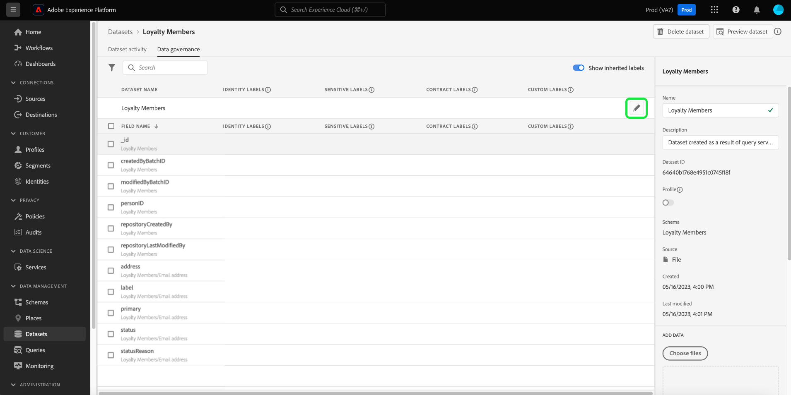

# 資料控管端對端指南

為了控制哪些行銷動作可以在Adobe Experience Platform的特定資料集和欄位上執行，您必須設定下列專案：

1. [套用標籤](#labels) 至要限制其使用情形的結構描述欄位或整個資料集。
1. [設定和啟用資料治理原則](#policy) 決定可用於特定行銷動作之標籤資料種類。
1. [將行銷動作套用至目的地](#destinations) 以指出哪些原則適用於傳送至這些目的地的資料。

設定完標籤、治理原則和行銷動作後，您可以 [測試您的原則執行](#test) 以確保它如預期般運作。

本指南會逐步說明在Platform UI中設定及強制執行資料控管政策的完整程式。 如需本指南所用功能的詳細資訊，請參閱下列主題的概觀檔案：

* [Adobe Experience Platform資料控管](./home.md)
* [資料使用情況標籤](./labels/overview.md)
* [資料使用原則](./policies/overview.md)
* [原則執行](./enforcement/overview.md)

>[!NOTE]
>
>本指南著重於如何設定及強制執行在Experience Platform中如何使用或啟用資料的原則。 如果您嘗試限制 **存取** 如需貴組織內特定Platform使用者的資料本身，請參閱以下專案的端對端指南： [基於屬性的存取控制](../access-control/abac/end-to-end-guide.md) 而非。 以屬性為基礎的存取控制也使用標籤和原則，但適用於與資料治理不同的使用案例。

## 套用標籤 {#labels}

>[!IMPORTANT]
>
>標籤無法再套用至資料集層級的個別欄位。 此工作流程已淘汰，而改為在結構描述層級套用標籤。 不過，您仍可標示整個資料集。 在2024年5月31日之前，先前套用至個別資料集欄位的任何標籤仍可透過Platform UI取得支援。 為確保您的標籤在所有結構描述中保持一致，您必須在未來一年將之前附加至資料集層級欄位的任何標籤移轉至結構描述層級。 請參閱以下小節： [移轉先前套用的標籤](#migrate-labels) 以取得執行此動作的指示。

您可以 [將標籤套用至結構描述](#schema-labels) 因此以該結構描述為基礎的所有資料集都會繼承相同的標籤。 這可讓您在一個位置管理資料控管、同意和存取控制的標籤。 透過在結構描述層級強制資料使用限制，該效果會傳播到下游基於該結構描述的所有資料集。 在結構描述欄位層級套用的標籤支援資料控管使用案例，並且可在資料集工作區中找到 [!UICONTROL 資料控管] 標籤下的 [!UICONTROL 欄位名稱] 欄做為唯讀標籤。

如果您想要對特定資料集強制執行資料使用限制，可以 [直接將標籤套用到該資料集](#dataset-labels) 或該資料集中的特定欄位。

或者，您可以 [將標籤套用至結構描述](#schema-labels) 因此以該結構描述為基礎的所有資料集都會繼承相同的標籤。

>[!NOTE]
>
>如需不同資料使用標籤及其預期用途的詳細資訊，請參閱 [資料使用標籤參考](./labels/reference.md). 如果可用的核心標籤並未涵蓋所有您想要的使用案例，您可以 [定義您自己的自訂標籤](./labels/user-guide.md#manage-custom-labels) 以及。

### 將標籤套用至整個資料集 {#dataset-labels}

選取 **[!UICONTROL 資料集]** 在左側導覽中，然後選取您要套用標籤的資料集名稱。 您可以選擇使用搜尋欄位來縮小顯示的資料集清單。

將會顯示資料集的詳細資料檢視。 選取 **[!UICONTROL 資料控管]** 標籤以檢視資料集的欄位清單以及已套用至這些欄位的任何標籤。 選取鉛筆圖示以編輯資料集標籤。

此 [!UICONTROL 編輯治理標籤] 對話方塊隨即顯示。 選取適當的治理標籤，然後選取 **[!UICONTROL 儲存]**.

### 將標籤套用至結構描述 {#schema-labels}

選取 **[!UICONTROL 方案]** 在左側導覽中，然後從清單中選取您要新增標籤的結構描述。

>[!TIP]
>
>如果您不確定哪個結構描述適用於特定資料集，請選取「 」 **[!UICONTROL 資料集]** 在左側導覽中，然後選取 **[!UICONTROL 結構描述]** 欄中尋找所需的資料集。 在彈出視窗中選取結構描述名稱，該彈出視窗中會顯示在「結構描述編輯器」中開啟結構描述。
>
>

結構描述的結構會顯示在結構描述編輯器中。 從這裡，選擇 **[!UICONTROL 標籤]** 標籤來顯示結構描述欄位的清單檢視，以及已套用至這些欄位的標籤。 選取您要新增標籤的欄位旁的核取方塊，然後選取 **[!UICONTROL 套用存取權和資料治理標籤]** 在右側邊欄中。

>[!NOTE]
>
>如果您想要將標籤新增至結構描述中的所有欄位，請選取頂列的鉛筆圖示。
>
>

此 [!UICONTROL 套用存取權和資料治理標籤] 對話方塊隨即顯示。 選取您要套用至所選結構描述欄位的標籤。 完成後，選取 **[!UICONTROL 儲存]**.

繼續依照上述步驟，視需要將標籤套用至不同的欄位（或不同的結構描述）。 完成後，您可以繼續的下一步 [啟用資料治理原則](#policy).

### 移轉先前在資料集層級套用的標籤 {#migrate-labels}

選取 **[!UICONTROL 資料集]** 在左側導覽中，然後選取您要移轉標籤的資料集名稱。 您可以選擇使用搜尋欄位來縮小顯示的資料集清單。

將會顯示資料集的詳細資料檢視。 選取 **[!UICONTROL 資料控管]** 標籤以檢視資料集的欄位清單以及已套用至這些欄位的任何標籤。 選取您要從欄位中移除之任何標籤旁的取消圖示。 確認對話方塊出現，選取 [!UICONTROL 移除標籤] 以確認您的選擇。

從資料集欄位中移除標籤後，請導覽至結構編輯器以將標籤新增至結構描述。 有關如何執行此動作的說明，請參閱 [有關將標籤套用至綱要的區段](#schema-labels).

>[!TIP]
>
>您可以在右側邊欄中選取綱要名稱，然後選取對話方塊中的連結，該連結會顯示來導覽至適當的綱要。
>

移轉必要的標籤後，請確定您已擁有正確的標籤 [已啟用資料治理原則](#policy).

## 啟用資料治理原則 {#policy}

將標籤套用至結構描述和/或資料集後，您可以建立資料治理原則，以限制特定標籤可用於的行銷動作。

選取 **[!UICONTROL 原則]** 在左側導覽中檢視Adobe定義的核心原則清單，以及貴組織先前建立的任何自訂原則。

每個核心標籤都有相關聯的核心原則，在啟用時，會對包含該標籤的任何資料強制執行適當的啟動限制。 若要啟用核心原則，請從清單中選取該原則，然後選取 **[!UICONTROL 原則狀態]** 切換至 **[!UICONTROL 已啟用]**.

如果可用的核心原則並未涵蓋您的所有使用案例（例如當您使用貴組織下已定義的自訂標籤時），您可以改為定義自訂原則。 從 **[!UICONTROL 原則]** 工作區，選取 **[!UICONTROL 建立原則]**.

![影像顯示 [!UICONTROL 建立原則] 在UI中選取的按鈕](./images/e2e/create-policy.png)

畫面會顯示彈出視窗，提示您選取要建立的原則型別。 選取 **[!UICONTROL 資料治理原則]**，然後選取 **[!UICONTROL 繼續]**.

![影像顯示 [!UICONTROL 資料治理原則] 正在選取的選項](./images/e2e/governance-policy.png)

在下一個畫面中，提供 **[!UICONTROL 名稱]** 和選填 **[!UICONTROL 說明]** 用於原則。 在下表中，選取您要此原則檢查的標籤。 換言之，這些是原則將防止用於您在下一個步驟中指定的行銷動作的標籤。

如果您選取多個標籤，您可以使用右側邊欄中的選項來判斷是否必須顯示所有標籤才能讓原則強制執行使用限制，或是否只需顯示其中一個標籤。 完成後，選取 **[!UICONTROL 下一個]**.

在下一個畫面中，選取此原則將限制先前選取之標籤使用的行銷動作。 選取&#x200B;**[!UICONTROL 「下一步」]**&#x200B;以繼續。

最後一個畫面會顯示原則的詳細資訊摘要，以及原則會針對哪些標籤限制哪些動作。 選取 **[!UICONTROL 完成]** 以建立原則。

原則已建立，但設定為 [!UICONTROL 已停用] 依預設。 從清單中選取原則並設定 **[!UICONTROL 原則狀態]** 切換至 **[!UICONTROL 已啟用]** 以啟用原則。

繼續上述步驟，建立並啟用您所需的原則，然後再繼續進行下一個步驟。

## 管理目的地的行銷動作 {#destinations}

為了讓您已啟用的原則能夠準確判斷哪些資料可以啟用至目的地，您必須將特定行銷動作指派至該目的地。

例如，假設已啟用原則，可防止任何包含 `C2` 標籤不可用於行銷動作»[!UICONTROL 匯出至第三方]「。 將資料啟用至目的地時，此原則會檢查目的地上有哪些行銷動作。 若為「[!UICONTROL 匯出至第三方]」存在，嘗試透過啟動資料 `C2` 標籤導致原則違規。 若為「[!UICONTROL 匯出至第三方]「」不存在，則不會針對目的地和資料強制執行原則 `C2` 標籤可自由啟動。

時間 [在UI中連線目的地](../destinations/ui/connect-destination.md)，則 **[!UICONTROL 治理]** 工作流程中的步驟可讓您選取套用至此目的地的行銷動作，這些動作最終會決定要針對目的地強制執行哪些資料治理原則。

## 測試原則執行 {#test}

一旦您為資料加上標籤、啟用資料控管原則，並將行銷動作指派給目的地，就可以測試原則是否如預期般執行。

如果您正確設定，當您嘗試啟動受原則限制的資料時，啟動會自動被拒絕，並且會顯示原則違規訊息，概述有關導致違規之原因的詳細資料歷程資訊。

檢視檔案： [自動原則執行](./enforcement/auto-enforcement.md) 有關如何解譯原則違規訊息的詳細資訊。

## 後續步驟

本指南說明在啟動工作流程中設定及強制實行資料控管原則的所需步驟。 如需本指南中涉及的資料控管元件的詳細資訊，請參閱下列檔案：

* [資料使用情況標籤](./labels/overview.md)
* [資料使用原則](./policies/overview.md)
* [原則執行](./enforcement/overview.md)
