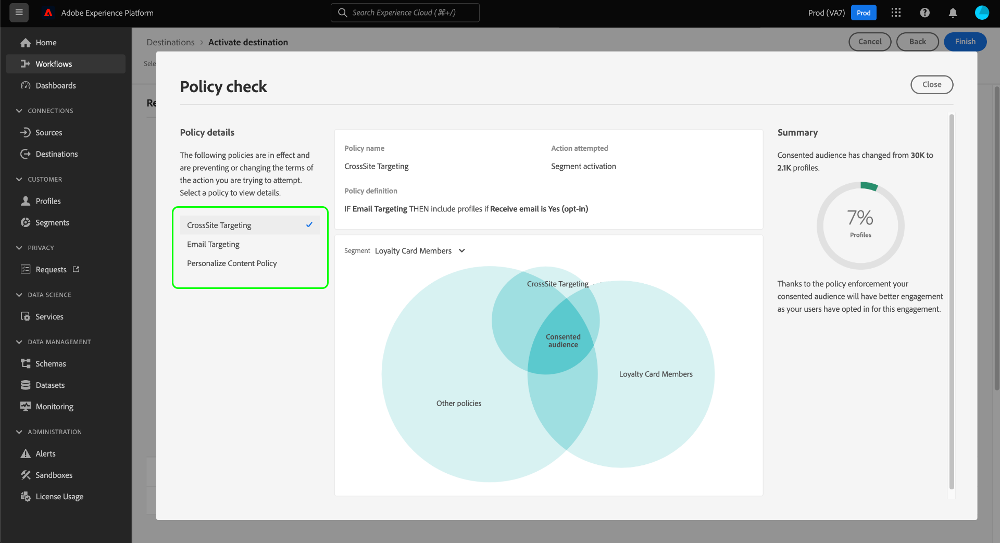

# 自動策略實施

在對資料進行標籤並定義使用策略後，您就可以使用策略強制資料使用符合性。 將對象區段啟用至目的地時，Adobe Experience Platform會在發生任何違規時自動強制使用原則。

## 先決條件

本指南需要對自動執行中的Platform服務有深入的了解。 繼續使用本指南之前，請參閱下列檔案以了解更多資訊：

* [Adobe Experience Platform資料控管](../home.md):Platform透過使用標籤和原則來強制遵循資料使用情形的架構。
* [即時客戶個人檔案](../../profile/home.md):根據來自多個來源的匯總資料，提供統一的即時消費者設定檔。
* [Adobe Experience Platform區段服務](../../segmentation/home.md):內的分段引擎 [!DNL Platform] 用於根據客戶行為和屬性，從您的客戶設定檔建立受眾區段。
* [目的地](../../destinations/home.md):目的地是與常用應用程式預先建立的整合，可順暢地啟動來自Platform的資料，以進行跨通路行銷活動、電子郵件行銷活動、目標廣告等。

## 執行流程 {#flow}

下圖說明如何將策略實施整合到段激活的資料流中：

首次啟動區段時， [!DNL Policy Service] 根據下列因素檢查適用的政策：

* 套用至區段內要啟用之欄位和資料集的資料使用量標籤。
* 目的地的行銷目的。
* 已同意納入區段啟用的設定檔（根據您設定的同意原則）。

>[!NOTE]
>
>如果有資料使用標籤只套用至資料集內的特定欄位（而非整個資料集），則只有在下列條件下，才會在啟用時強制執行這些欄位層級標籤：
>
>* 欄位會用於區段定義中。
>* 欄位會設定為目標目的地的預計屬性。

## 資料處理 {#lineage}

資料處理在Platform中執行原則的方式中起著關鍵作用。 一般而言，資料處理系指一組資料的來源，以及隨著時間而發生的變化（或其移動的位置）。

在「資料控管」中，處理方式可讓資料使用標籤從資料集傳播至使用其資料的下游服務，例如「即時客戶設定檔」和目的地。 這可讓系統在資料通過Platform的歷程中的幾個關鍵點評估和執行策略，並為資料使用者提供發生策略違規的原因的上下文。

在Experience Platform中，政策執行涉及以下血統：

1. 資料會擷取至Platform中，並儲存於 **資料集**.
1. 根據 **合併策略**.
1. 設定檔群組分為 **區段** 基於通用屬性。
1. 區段會啟動至下游 **目的地**.

如下表所述，上述時間表中的每個階段代表一個可能有助於執行政策的實體：

| 資料處理階段 | 在政策執行中的作用 |
| --- | --- |
| 資料集 | 資料集包含資料使用量標籤（套用在資料集或欄位層級），可定義整個資料集或特定欄位可用於的使用案例。 如果將包含特定標籤的資料集或欄位用於策略限制的目的，則會發生策略違規。  從客戶收集的任何同意屬性也會儲存在資料集中。 如果您有同意原則的存取權，任何不符合原則同意屬性要求的設定檔，都會從啟動至目的地的區段中排除。 |
| 合併策略 | 合併原則是Platform用來判斷從多個資料集合為一組片段時，如何排定資料優先順序的規則。 如果配置了合併策略，將具有限制標籤的資料集激活到目標，則會發生違反策略的情況。 請參閱 [合併策略概述](../../profile/merge-policies/overview.md) 以取得更多資訊。 |
| 區段 | 區段規則會定義應包含自客戶設定檔的屬性。 根據區段定義包含的欄位，區段將繼承這些欄位所套用的使用量標籤。 如果您根據目標目的地的行銷使用案例啟用其繼承標籤受目標目的地適用原則限制的區段，則會發生違反原則的情形。 |
| 目的地 | 設定目的地時，可以定義行銷動作（有時稱為行銷使用案例）。 此使用案例與原則中定義的行銷動作相關。 換句話說，您為目的地定義的行銷動作會決定哪些資料使用原則和同意原則適用於該目的地。  如果您啟用區段，而目標目的地的行銷動作的使用標籤受限，便會發生資料使用政策違規情形。  （測試版）啟動區段時，任何不含行銷動作必要同意屬性的設定檔（由您的同意政策定義），都會從啟動的受眾中排除。 |

>[!IMPORTANT]
>
>某些資料使用原則可能會指定具有AND關係的兩個或多個標籤。 例如，如果標籤，原則可能會限制行銷動作 `C1` 和 `C2` 都存在，但不會限制只存在其中一個標籤時的相同動作。
>
>若是自動執行，資料控管架構不會將啟動個別區段至目的地視為資料的組合。 因此，範例 `C1 AND C2` 原則 **NOT** 如果這些標籤包含在個別區段中，就會強制執行。 反之，只有當兩個標籤在啟動後都出現在相同的區段中時，才會強制執行此原則。

當發生違反原則的情況時，UI中顯示的結果訊息可提供有用的工具，用於探索違反的貢獻資料歷程，以協助解決問題。 下一節將提供更多詳細資訊。

## 策略執行消息 {#enforcement}

以下各節將概述Platform UI中顯示的不同策略實施訊息：

* [資料使用策略違規](#data-usage-violation)
* [同意政策評估](#consent-policy-evaluation)

### 資料使用策略違規 {#data-usage-violation}

如果嘗試激活段時發生策略違規(或 [對已啟動的區段進行編輯](#policy-enforcement-for-activated-segments))，此時會防止動作，並顯示彈出視窗，指出已違反一或多個原則。 一旦違規行為觸發， **[!UICONTROL 儲存]** 按鈕會針對您要修改的實體而停用，直到更新適當的元件以符合資料使用原則為止。

在彈出窗口的左欄中選擇策略違規以顯示該違規的詳細資訊。

違規消息提供了違反的策略的摘要，包括策略配置要檢查的條件、觸發違規的特定操作以及問題的可能解決方案清單。

違規摘要下會顯示資料處理圖，讓您能夠直觀地顯示哪些資料集、合併策略、段和目標與策略違規有關。 您當前正在更改的實體將在圖形中突出顯示，以指示流中的哪個點導致違規發生。 您可以在圖形中選取實體名稱，以開啟相關實體的詳細資訊頁面。

您也可以使用 **[!UICONTROL 篩選]** 圖示()，以依類別篩選顯示的實體。 至少必須選取兩個類別才能顯示資料。

選擇 **[!UICONTROL 清單檢視]** 將資料處理顯示為清單。 若要切換回視覺圖表，請選取 **[!UICONTROL 路徑檢視]**.

### 同意政策評估 {#consent-policy-evaluation}

>[!IMPORTANT]
>
>同意政策目前僅適用於已購買的組織 **Adobe醫療保健盾** 或 **Adobe隱私與安全防護**.

若您有 [建立同意政策](../policies/user-guide.md#consent-policy) 和要將區段啟用至目的地時，您可以了解您的同意政策如何影響啟用中包含之設定檔的百分比。

#### 激活前評估

一旦您進入 **[!UICONTROL 檢閱]** 步驟 [啟用目的地](../../destinations/ui/activation-overview.md)，選取 **[!UICONTROL 查看應用的策略]**.

此時會顯示原則檢查對話方塊，顯示同意政策如何影響已啟用區段的已同意對象的預覽。

對話方塊會一次顯示一個區段的同意對象。 要查看不同段的策略評估，請使用圖表上方的下拉菜單從清單中選擇一個。

使用左側邊欄，在所選區段的適用同意政策之間切換。 未選擇的策略在「[!UICONTROL 其他原則]」部分。

圖表顯示三組設定檔之間的重疊：

1. 符合所選區段資格的設定檔
1. 符合所選同意政策資格的設定檔
1. 符合區段其他適用同意政策的設定檔(稱為「[!UICONTROL 其他原則]」)

符合上述三個群組資格的設定檔代表所選區段的同意對象，匯總於右側邊欄中。

將滑鼠指標暫留在圖表中的其中一個對象上，以顯示其包含的設定檔數量。

已同意的對象會以圖表的中央重疊部分表示，並可像其他章節一樣強調顯示。

#### 流運行強制

將資料啟動至目的地時，流程執行詳細資料會顯示因使用中同意原則而排除的身分數量。

## 已激活段的策略強制 {#policy-enforcement-for-activated-segments}

策略實施在段激活後仍適用於段，這將限制對段或其目標的任何更改，從而導致策略違規。 因為 [資料歷程](#lineage) 在策略實施中，以下任何操作都可能觸發違規：

* 更新資料使用量標籤
* 變更區段的資料集
* 變更區段述詞
* 更改目標配置

如果上述任何動作觸發違規，則會阻止保存該動作並顯示策略違規消息，以確保激活的段在被修改時繼續遵守資料使用策略。

## 後續步驟

本檔案說明自動政策執行在Experience Platform中的運作方式。 如需如何以程式設計方式將原則實施整合至使用API呼叫之應用程式的步驟，請參閱 [API型實作](./api-enforcement.md).
