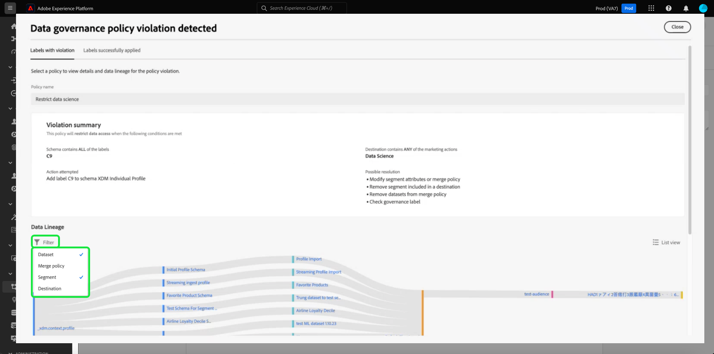
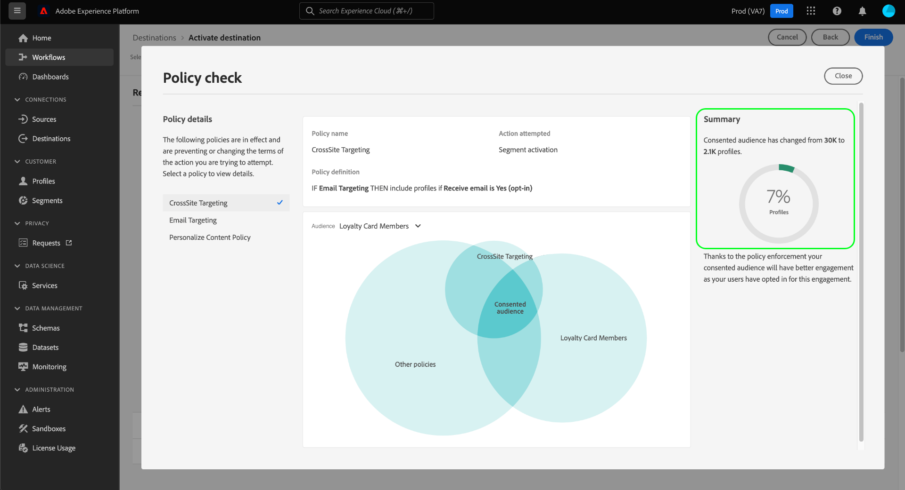

# 自動執行原則

資料使用標籤和原則可供所有Adobe Experience Platform使用者使用。 定義資料使用原則並套用資料使用標籤，以確保正確處理任何敏感、可識別或合約資料。 這些措施有助於強制實施組織的資料治理規則，規範如何存取、處理、儲存和共用資料。

為了協助保護您的組織免受潛在風險和責任的影響，Platform會在啟用目標受眾時發生任何違規時，自動強制執行使用原則。

>[!IMPORTANT]
>
>同意原則和自動同意原則執行僅適用於已購買的組織 **AdobeHealthcare Shield** 或 **Adobe隱私權與安全防護板**.

本檔案著重於資料控管和同意政策的實作。 如需有關存取控制原則的資訊，請參閱以下檔案： [基於屬性的存取控制](../../access-control/abac/overview.md).

## 先決條件

本指南需要您實際瞭解自動執行所涉及的Platform服務。 在繼續使用本指南之前，請參閱以下檔案以深入瞭解：

* [Adobe Experience Platform資料控管](../home.md)：Platform透過使用標籤和原則來強制遵循資料使用規範的架構。
* [即時客戶個人檔案](../../profile/home.md)：根據來自多個來源的彙總資料，提供統一的即時消費者個人檔案。
* [Adobe Experience Platform Segmentation Service](../../segmentation/home.md)：內的分段引擎 [!DNL Platform] 用於根據客戶行為和屬性，從您的客戶設定檔建立對象。
* [目的地](../../destinations/home.md)：目的地是預先建立的與常用應用程式的整合，可順暢地從Platform啟用資料，用於跨頻道行銷活動、電子郵件行銷活動、目標定位廣告等。

## 執行流程 {#flow}

下圖說明如何將原則執行整合至對象啟用的資料流程：

首次啟用對象時， [!DNL Policy Service] 根據下列因素檢查適用的原則：

* 資料使用標籤套用到要啟用的對象中的欄位和資料集。
* 目的地的行銷目的。
* 根據您設定的同意原則，已同意納入對象啟用的設定檔。

>[!NOTE]
>
>如果資料使用標籤僅套用至資料集內的特定欄位（而非整個資料集），則只有符合下列條件時，才會在啟用時強制執行這些欄位層級標籤：
>
>* 這些欄位會用於對象中。
>* 這些欄位會設定為目標目的地的投影屬性。

## 資料譜系 {#lineage}

在Platform中執行原則的方式中，資料譜系扮演關鍵角色。 一般而言，資料譜系是指一組資料的來源，以及資料隨著時間推移會有什麼變化（或移動的位置）。

在資料控管的內容中，歷程可讓資料使用標籤從結構描述傳播到使用其資料的下游服務，例如即時客戶設定檔和目的地。 這可讓您在資料流經Platform歷程中的數個關鍵點評估及執行原則，並向資料消費者提供內容，說明發生原則違規的原因。

在Experience Platform中，原則執行與以下譜系有關：

1. 資料會擷取到Platform並儲存在 **資料集**.
1. 客戶設定檔是透過根據下列規則合併資料片段，從這些資料集識別和建構而來 **合併原則**.
1. 設定檔群組分為 **對象** 根據通用屬性。
1. 對象已啟用至下游 **目的地**.

上述時間軸中的每個階段都代表可能有助於原則執行的實體，如下表所述：

| 資料譜系階段 | 原則執行中的角色 |
| --- | --- |
| 資料集 | 資料集包含資料使用標籤（套用於結構欄位層級或整個資料集層級），可定義整個資料集或特定欄位可用於的使用案例。 如果含有特定標籤的資料集或欄位用於原則限制的目的，則會發生原則違規。  從客戶收集到的任何同意屬性也會儲存在資料集中。 如果您有權存取同意原則，則不符合原則之同意屬性要求的任何設定檔將會從啟用至目的地的對象中排除。 |
| 合併原則 | 合併原則是Platform用來決定在從多個資料集合併片段時如何優先處理資料的規則。 如果您的合併原則已設定為將具有受限制標籤的資料集啟動至目的地，則會發生原則違規。 請參閱 [合併原則概觀](../../profile/merge-policies/overview.md) 以取得詳細資訊。 |
| 對象 | 區段規則會定義應從客戶設定檔中包含哪些屬性。 根據區段定義包含哪些欄位，對象將繼承這些欄位套用的任何使用標籤。 如果您啟用的對象繼承的標籤根據行銷使用案例受到目標目標的適用原則限制，則會發生原則違規。 |
| 目的地 | 設定目的地時，可定義行銷動作（有時稱為行銷使用案例）。 此使用案例與原則中定義的行銷動作相關。 換言之，您為目的地定義的行銷動作會決定哪些資料使用原則和同意原則適用於該目的地。  如果您啟用的對象之使用標籤受限於目標目標的行銷動作，則會發生資料使用原則違規。  （測試版）啟用對象時，不含行銷動作所需同意屬性（由您的同意政策定義）的任何設定檔會從啟用的對象中排除。 |

>[!IMPORTANT]
>
>某些資料使用原則可能會指定兩個或多個具有AND關係的標籤。 例如，如果標籤，原則可以限制行銷動作 `C1` 和 `C2` 都存在，但只要存在其中一個標籤，就不會限制相同的動作。
>
>在自動執行方面，資料控管架構不會將個別對象對目的地的啟用視為資料組合。 因此，此範例 `C1 AND C2` 原則是 **NOT** 如果這些標籤包含在不同對象中，則會強制執行。 相反地，只有在啟用時兩個標籤都出現在同一個對象中時，才會強制執行此原則。

當發生原則違規時，顯示在UI中的結果訊息會提供有用的工具，用於探索違規的貢獻資料譜系以幫助解決問題。 下一節將提供更多詳細資訊。

## 原則執行訊息 {#enforcement}

以下各節概述Platform UI中顯示的不同原則執行訊息：

* [資料使用原則違規](#data-usage-violation)
* [同意原則評估](#consent-policy-evaluation)

### 資料使用原則違規 {#data-usage-violation}

如果嘗試啟用對象時發生原則違規(或 [對已啟用的對象進行編輯](#policy-enforcement-for-activated-audiences))此動作會遭到阻止，且出現彈出視窗，指出已違反一或多個原則。 一旦觸發違規， **[!UICONTROL 儲存]** 在更新適當的元件以符合資料使用原則之前，會針對您正在修改的實體停用按鈕。

選取原則名稱，以顯示該違規的詳細資訊。

違規訊息會提供違規原則的摘要，包括原則設定要檢查的條件、觸發違規的特定動作，以及問題的可能解決方法清單。

違規摘要下方會顯示資料譜系圖，可讓您視覺化哪些資料集、合併原則、對象和目的地與原則違規有關。 您目前變更的圖元會在圖形中反白顯示，指示在流程中的哪個點導致發生違規。 您可以在圖形中選取實體名稱，以開啟相關實體的詳細資訊頁面。

您也可以使用 **[!UICONTROL 篩選]** 圖示()，依類別篩選顯示的實體。 必須選取至少兩個類別才能顯示資料。

選取 **[!UICONTROL 清單檢視]** 以清單形式顯示資料譜系。 若要切換回視覺化圖表，請選取 **[!UICONTROL 路徑檢視]**.

#### 標籤已成功套用 {#labels-successfully-applied}

如果您在標籤結構描述欄位之前建立資料使用原則，當您在標籤套用至結構描述時，可能會遇到治理原則違規對話方塊。 在此情況下，您可以成功為部分結構描述加上標籤。 此 [!UICONTROL 標籤已成功套用] 索引標籤會指出哪些標籤已成功套用，因為該欄位沒有原則限制。

使用資料歷程圖表來瞭解必須先進行哪些其他設定變更，才能將標籤新增至結構描述欄位。

![原則違規對話方塊，其中包含 [!UICONTROL 標籤已成功套用] 索引標籤反白顯示。](../images/enforcement/labels-successfully-applied.png)

### 同意原則評估 {#consent-policy-evaluation}

將對象啟用至目的地時，您可以瞭解 [同意原則](../policies/user-guide.md#consent-policy) 會影響啟用中包含的不同設定檔百分比。

>[!NOTE]
>
>同意政策僅適用於已購買Adobe Healthcare Shield或Adobe Privacy &amp; Security Shield的組織。

#### 付費媒體的同意原則增強功能 {#consent-policy-enhancement}

增強對的同意原則執行 [批次](../../destinations/destination-types.md#file-based) 和 [串流](../../destinations/destination-types.md#streaming-destinations) 已進行目的地（包括付費媒體啟用）。 此增強功能可供Privacy and Security Shield或Healthcare Shield的客戶使用，並會在同意狀態變更時，主動從批次和串流目的地中移除設定檔。 它也能確保立即傳播同意變更，以永遠鎖定正確的對象。

這些改善可讓您的行銷策略獲得更大信任，因為行銷人員不需要手動將同意屬性新增至其區段運算式。 這可確保在撤回同意或不再符合約意原則時，不會無意中將任何行銷體驗鎖定為設定檔。 設定在各種行銷工作流程中應如何管理同意或偏好設定資料之規則的行銷同意原則，現在會在下游解決方案的啟用工作流程中自動實施。

>[!NOTE]
>
>沒有因為此增強功能而導致的UI變更。

#### 啟動前評估

一旦到達 **[!UICONTROL 檢閱]** 步驟時間 [啟用目的地](../../destinations/ui/activation-overview.md)，選取 **[!UICONTROL 檢視套用的原則]**.

原則檢查對話方塊隨即顯示，預覽您的同意原則如何影響已啟用受眾的同意受眾。

此對話方塊一次會顯示一個對象的已同意對象。 若要檢視不同對象的原則評估，請使用圖表上方的下拉式選單，從清單中選取一個對象。

使用左側邊欄，針對選取的對象在適用的同意政策之間切換。 未選取的原則會顯示在&quot;[!UICONTROL 其他原則]「 」區段。

此圖表顯示三組設定檔之間的重疊：

1. 符合所選對象資格的設定檔
1. 符合所選同意原則的設定檔
1. 符合對象其他適用同意政策的設定檔(稱為「[!UICONTROL 其他原則]「（在圖表中）

符合上述所有三個群組的設定檔代表已同意的對象，並在右側邊欄中摘要。

將滑鼠指標暫留在圖表的其中一個對象上，以顯示其中包含的個人檔案數。

同意的對象由圖表的中央重疊部分表示，且可像其他區段一樣反白顯示。

#### 強制執行資料流

當資料啟用至目的地時，流程執行詳細資料會顯示由於作用中同意原則而排除的身分數量。

## 對啟用的對象的原則實作 {#policy-enforcement-for-activated-audiences}

原則執行在啟用對象後仍會套用至對象，將可能導致原則違規的任何變更限制在對象或其目的地。 原因如下 [資料譜系](#lineage) 適用於原則執行，下列任何動作都可能觸發違規：

* 更新資料使用標籤
* 變更對象的資料集
* 變更對象述詞
* 變更目的地設定

如果上述任何動作觸發違規，該動作會阻止儲存並顯示原則違規訊息，以確保您啟用的對象在修改時繼續符合資料使用原則。

## 後續步驟

本檔案說明在Experience Platform中自動執行原則的運作方式。 如需有關如何使用API呼叫以程式設計方式將原則執行整合至您的應用程式的步驟，請參閱以下指南： [API型強制執行](./api-enforcement.md).
