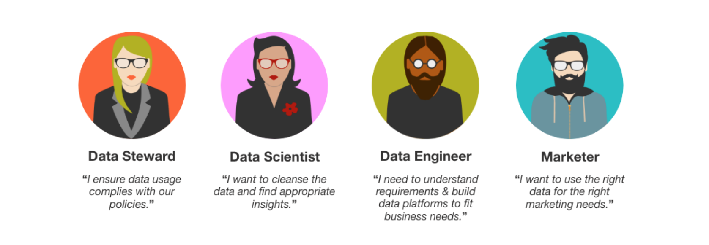

# 資料治理概述

Adobe Experience Platform的核心功能之一是將來自多個企業系統的資料整合在一起，以便營銷人員能夠更好地識別、理解和吸引客戶。 此資料可能受貴組織或法律法規所定義的使用限制所約束。 因此，必須確保資料操作在 [!DNL Platform] 符合資料使用策略。

Adobe Experience Platform資料治理允許您管理客戶資料並確保遵守適用於資料使用的法規、限制和策略。 它在 [!DNL Experience Platform] 包括編目、資料沿襲、資料使用標籤、資料使用策略以及控制資料在營銷活動中的使用。

>[!NOTE]
>
>在Experience Platform中，資料治理只關注資料的使用或激活方式，而與執行操作的用戶無關。 有關如何控制組織內某些平台用戶對特定資料欄位的訪問的資訊，請參閱上的文檔 [基於屬性的訪問控制](../access-control/abac/overview.md) 的雙曲餘切值。

## 資料治理角色

作為一個概念，資料治理既不是自動的，也不是在真空中發生的。 資料治理生態系統的擴張使得最初作為個人角色的角色 — 通常被公認為是資料管理者 — 大幅增長。 如今，資料治理需要持續的管理和監控才能成功，並依賴於資料管理員，他們擁有能夠正確標籤資料的工具，可以建立使用策略，並可以強制遵守這些策略。

雖然資料治理應該由組織內每個人負責，但以下是資料治理週期中的一些基本作用：

### 資料管理員

資料管理員是資料治理的核心。 此角色負責解釋法規、合同限制和政策，並直接將其應用於資料。 根據對這些法規、限制和政策的瞭解，資料管理員的作用包括：

* 查看資料、資料集和資料示例以應用和管理元資料使用標籤。
* 建立資料策略並將其應用於資料集和欄位。
* 將資料策略傳送到組織。

### 行銷人員

營銷人員是資料治理的終點。 他們要求資料管理員、科學家和工程師從資料管理基礎架構中獲得資料。 營銷人員在營銷傘下包括許多不同的專業，包括：

* 營銷分析師要求提供資料，以便能夠瞭解客戶，無論是作為個人還是按組（也稱為細分）。
* 營銷專家和體驗設計師使用資料設計新的客戶體驗。

## 資料治理框架

資料治理框架簡化並優化了資料分類和建立資料使用策略的過程。 一旦應用了資料標籤並制定了資料使用策略，就可以評估市場營銷操作以確保正確使用資料。

資料治理框架有三個關鍵要素：標籤、策略和強制。

1. **標籤：** 將反映與隱私相關的考慮因素和合同條件的資料分類，以符合法規和組織策略。
1. **策略：** 描述允許或不允許對特定資料採取的市場營銷操作類型。
1. **強制：** 使用策略框架來建議並強制實施不同資料存取模式的策略。

## 資料使用標籤

資料管理使資料管理員能夠在資料集和欄位級別應用使用標籤，以根據應用的策略類型對資料進行分類。

資料治理框架包括預定義的資料使用標籤，可用於以三種方式對資料進行分類：

* **合同「C」資料標籤：** 對具有合同義務或與客戶資料治理策略相關的資料進行標籤和分類。
* **標識「I」資料標籤：** 對可標識或聯繫特定人員的資料進行標籤和分類。
* **敏感「S」資料標籤：** 對與敏感資料（如地理資料）相關的資料進行標籤和分類。

>[!NOTE]
>
>請參閱上的指南 [支援的資料使用標籤](labels/reference.md) 的子菜單。

標籤可以隨時應用，在選擇管理資料的方式上提供了靈活性。 最佳做法鼓勵在將資料攝取到 [!DNL Experience Platform]，或資料在 [!DNL Platform]。

請參閱 [資料使用標籤](./labels/overview.md) 的子菜單。

## 資料使用原則

為了使資料使用標籤有效地支援資料合規性，必須實施資料使用策略。 資料使用策略是描述允許或限制您對內部資料執行的市場營銷操作類型的規則 [!DNL Experience Platform]。

市場營銷操作的一個示例可能是希望將資料集導出到第三方服務。 如果有策略表明無法導出個人身份資訊(PII)，並且已將「I」標籤（標識資料）應用到資料集， [!DNL Policy Service] 阻止將此資料集導出到第三方目標的任何操作。 如果發生了其中一次操作嘗試，策略服務將發送一條消息，告訴您資料使用策略已被違反。

可用策略有兩種類型：

* **[!UICONTROL 資料治理策略]**:根據正在執行的營銷活動和由有關資料攜帶的資料使用標籤限制資料激活。
* **[!UICONTROL 同意政策]**:篩選可激活的配置檔案 [目的地](../destinations/home.md) 根據客戶的同意或偏好。

一旦應用了資料使用標籤，資料管理員就可以使用 [!DNL Policy Service] API或 [!DNL Experience Platform] 用戶介面。 有關資料使用策略和市場營銷操作的詳細資訊，請參閱 [策略概述](./policies/overview.md)。

>[!IMPORTANT]
>
>預設情況下，所有資料使用策略(包括由Adobe提供的核心策略)都被禁用。 要考慮實施單個策略，必須手動啟用該策略。

## 後續步驟

本檔案對資料治理和資料治理框架作了高級別介紹。 您現在可以繼續 [資料使用標籤使用手冊](labels/user-guide.md) 並開始向您的體驗資料添加使用標籤。

## 附錄

以下部分提供了有關資料治理的其他資訊。

### 資料治理術語

下表概述了與資料治理和資料治理框架有關的關鍵術語。

| 詞語 | 定義 |
|---|---|
| **合同標籤** | 合同「C」標籤用於對具有合同義務或與貴組織的資料治理策略相關的資料進行分類。 |
| **跨站點資料** | 跨站點資料是來自多個站點的資料的組合，包括現場資料和非現場資料的組合，或來自多個非現場源的資料的組合。 |
| **資料治理** | 資料治理包括用於確保資料在資料使用方面遵守法規和公司政策的戰略和技術。 |
| **資料管理員** | 資料管理員是負責管理、監督和實施組織資料資產的人員。 資料管理員還確保資料治理政策得到保護並得到維護，以符合政府法規和組織政策。 |
| **資料使用標籤** | 資料使用標籤為用戶提供了對反映與隱私相關的考慮因素和符合法規和公司策略的合同條件的資料進行分類的能力。 |
| **資料集標籤** | 標籤可以添加到資料集。 資料集中的所有欄位都繼承資料集的標籤。 |
| **欄位標籤** | 欄位標籤是從資料集繼承或直接應用於欄位的資料治理標籤。  應用於欄位的資料治理標籤不會繼承到資料集。 |
| **地方科學** | 地質是由GPS或RFID技術定義的虛擬地理邊界，使軟體能夠在移動設備進入或離開特定區域時觸發響應。 |
| **標識標籤** | 標識「I」標籤用於對可識別或聯繫特定人的資料進行分類。 |
| **基於興趣的目標** | 如果滿足以下三個條件，則會發生基於興趣的目標（也稱為個性化）:現場收集的資料用於對用戶的興趣做出推斷，用於另一個上下文，例如在另一個站點或應用（非現場）上，並用於根據這些推斷來選擇服務哪些內容或廣告。 |
| **營銷活動** | 在資料治理框架的範圍內，營銷行動是一項 [!DNL Experience Platform] 資料使用者獲取，需要檢查資料使用策略的違規 |
| **政策** | 在資料治理框架中，策略是描述允許或不允許對特定資料採取何種市場營銷操作的規則。 |
| **敏感標籤** | 敏感「S」標籤用於對您和您的組織認為敏感的資料進行分類。 |

## 其他資源

以下視頻旨在支援您對資料治理框架的理解。

>[!VIDEO](https://video.tv.adobe.com/v/29708?quality=12&enable10seconds=on&speedcontrol=on)

以下視頻介紹了Experience Platform中的各種資料治理功能。

>[!VIDEO](https://video.tv.adobe.com/v/36653?quality=12&enable10seconds=on&speedcontrol=on)
