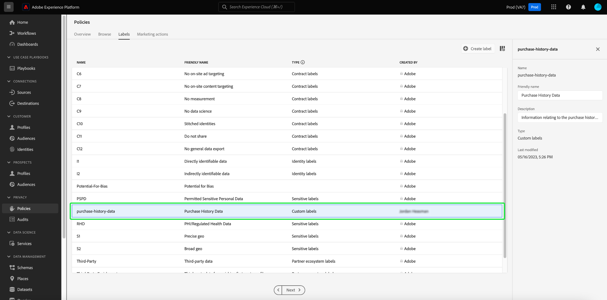

# 管理UI中的資料使用標籤

本使用手冊介紹了在以下位置使用資料使用標籤的步驟： [!DNL Experience Platform] 用戶介面。 使用指南之前，請參閱 [資料治理概述](../home.md) 以便更加健全地引入資料治理框架。

## 在資料集級別管理標籤

為了在資料集級別管理資料使用標籤，必須選擇現有資料集或建立新資料集。 登錄到Adobe Experience Platform後，選擇 **[!UICONTROL 資料集]** 開啟 **[!UICONTROL 資料集]** 工作區。 此頁列出屬於您組織的所有建立的資料集以及與每個資料集相關的有用詳細資訊。

下一節提供了建立新資料集以將標籤應用到的步驟。 如果要編輯現有資料集的標籤，請從清單中選擇該資料集並跳到 [向資料集添加資料使用標籤](#add-labels)。

### 建立新資料集

>[!NOTE]
>
>在此示例中，使用預配置的 [!DNL Experience Data Model] (XDM)架構。 有關XDM架構的詳細資訊，請參見 [XDM系統概述](../../xdm/home.md) 和 [架構組合基礎](../../xdm/schema/composition.md)。

要建立新資料集，請選擇 **[!UICONTROL 建立資料集]** 右上角 **[!UICONTROL 資料集]** 工作區。

的 **[!UICONTROL 建立資料集]** 的上界。 從此處，選擇 **[!UICONTROL 從架構建立資料集]**。

的 **[!UICONTROL 選擇方案]** 螢幕，其中列出了可用於建立資料集的所有可用方案。 選擇方案旁邊的單選按鈕以選擇它。 的 **[!UICONTROL 架構]** 右側的部分顯示有關選定方案的附加詳細資訊。 選擇架構後，選擇 **[!UICONTROL 下一個]**。

的 **[!UICONTROL 配置資料集]** 的上界。 為新資料集提供名稱（必需）和說明（可選，但建議），然後選擇 **[!UICONTROL 完成]**。

的 **[!UICONTROL 資料集活動]** 的子菜單。 在此示例中，該資料集名為「會員成員」，因此頂部導航顯示 **資料集>會員成員**。

### 向資料集添加資料使用標籤 {#add-labels}

在建立新資料集或從清單中選擇現有資料集後 **[!UICONTROL 資料集]** 工作區，選擇 **[!UICONTROL 資料治理]** 開啟 **[!UICONTROL 資料治理]** 工作區。 工作區允許您在資料集級別和欄位級別管理資料使用情況標籤。

要在資料集級別編輯資料使用標籤，請從選擇資料集名稱旁邊的鉛筆表徵圖開始。

的 **[!UICONTROL 編輯治理標籤]** 對話框。 在對話框中，選中要應用於資料集的標籤旁邊的框。 請記住，資料集中的所有欄位將繼承這些標籤。 的 **[!UICONTROL 已應用標籤]** 在選中每個框時，標題將更新，顯示您選擇的標籤。 選擇所需標籤後，選擇 **[!UICONTROL 保存更改]**。

的 **[!UICONTROL 資料治理]** 工作區將重新顯示，其中顯示在資料集級別應用的標籤。 您還可以看到標籤將繼承到資料集中的每個欄位。

請注意，在資料集級別的標籤旁邊會出現一個「x」，允許您刪除標籤。 每個欄位旁邊繼承的標籤旁邊沒有「x」，並且顯示為「灰顯」，無法刪除或編輯。 這是因為 **繼承的欄位為只讀**，表示無法在欄位級刪除它們。

的 **[!UICONTROL 顯示繼承的標籤]** 預設情況下，切換為on ，這允許您查看從資料集繼承到其欄位的任何標籤。 關閉切換將隱藏資料集中任何繼承的標籤。

## 在資料集欄位級別管理標籤

繼續工作流 [在資料集級別添加和編輯資料使用標籤](#add-labels)，也可以在 **[!UICONTROL 資料治理]** 該資料集的工作區。

要將資料使用標籤應用於單個欄位，請選中欄位名稱旁邊的複選框，然後選擇 **[!UICONTROL 編輯治理標籤]**。

的 **[!UICONTROL 編輯治理標籤]** 對話框。 該對話框顯示顯示選定欄位、已應用標籤和繼承標籤的標題。 請注意，繼承的標籤（C2和C5）在對話框中呈灰色顯示。 它們是從資料集級別繼承的只讀標籤，因此只能在資料集級別進行編輯。

通過選中要使用的每個標籤旁邊的複選框來選擇欄位級標籤。 選擇標籤時， **[!UICONTROL 已應用標籤]** 標題更新，以顯示應用於中顯示的欄位的標籤 **[!UICONTROL 所選欄位]** 標題。 選擇完欄位級標籤後，選擇 **[!UICONTROL 保存更改]**。

的 **[!UICONTROL 資料治理]** 工作區將重新出現，此時欄位名稱旁邊的行中將顯示選定的欄位級標籤。 請注意，欄位級標籤旁邊有一個「x」，允許您刪除標籤。

您可以重複這些步驟以繼續添加和編輯附加欄位的欄位級標籤，包括選擇多個欄位以同時應用欄位級標籤。

必須記住，繼承僅從頂級向下移動(資料集→欄位)，這意味著在欄位級別應用的標籤不會傳播到其他欄位或資料集。

## 在架構級別管理標籤

可以直接將標籤添加到該架構中的架構或欄位。 在架構級別應用的任何欄位都將傳播到基於該架構的所有資料集。

請參閱上的教程 [管理模式級標籤](../../xdm/tutorials/labels.md) 的子菜單。

## 管理自定義標籤 {#manage-custom-labels}

>[!CONTEXTUALHELP]
>id="platform_governance_createlabels"
>title="建立標籤"
>abstract="標籤允許您根據應用於該資料的使用策略對資料集和欄位進行分類。 平台提供了一組標準標籤供您使用，但您也可以建立特定於您組織的自定義標籤。"

您可以在 **[!UICONTROL 策略]** 工作區 [!DNL Experience Platform] UI。 選擇 **[!UICONTROL 策略]** 在左導航中，選擇 **[!UICONTROL 標籤]** 的子菜單。 從此處，選擇 **[!UICONTROL 建立標籤]**。

的 **[!UICONTROL 建立標籤]** 對話框。 在此處，為新標籤提供以下資訊：

* **[!UICONTROL 標識符]**:標籤的唯一標識符。 此值用於查找目的，因此應簡短而簡潔。
* **[!UICONTROL 名稱]**:標籤的友好顯示名稱。
* **[!UICONTROL 說明]**:（可選）標籤的說明，以提供更多上下文。

完成後，選擇 **[!UICONTROL 建立]**。

對話框關閉，新建立的自定義標籤將出現在 **[!UICONTROL 標籤]** 頁籤。

現在可以在 **[!UICONTROL 自定義標籤]** 編輯資料集和欄位的使用情況標籤時，或建立資料使用情況策略時。

 

## 後續步驟

現在，您已在資料集和欄位級別添加了資料使用標籤，您可以開始將資料插入 [!DNL Experience Platform]。 要瞭解更多資訊，請從閱讀 [資料攝取文檔](../../ingestion/home.md)。

您現在還可以根據已應用的標籤定義資料使用策略。 有關詳細資訊，請參見 [資料使用策略概述](../policies/overview.md)。

## 其他資源

以下視頻旨在支援您對資料治理的理解，並概述如何將標籤應用於資料集和各個欄位。

>[!VIDEO](https://video.tv.adobe.com/v/29709?quality=12&enable10seconds=on&speedcontrol=on)
