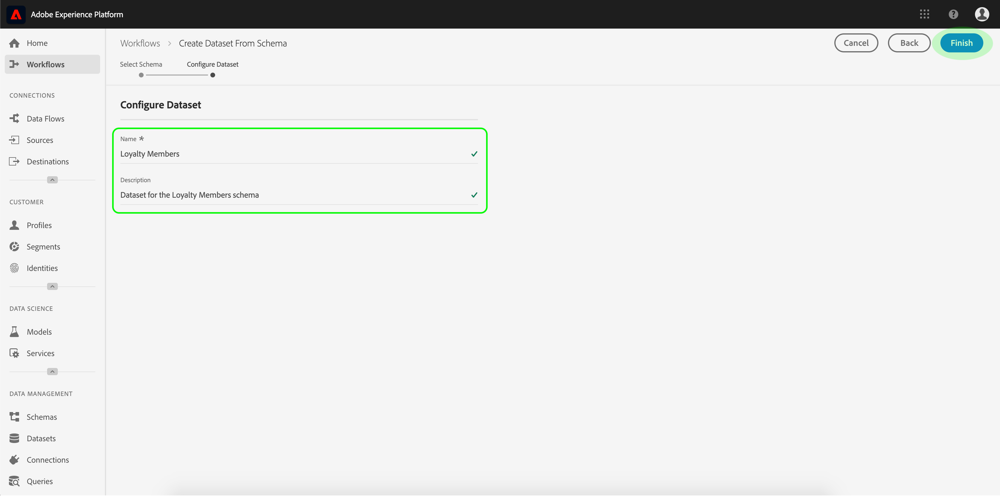
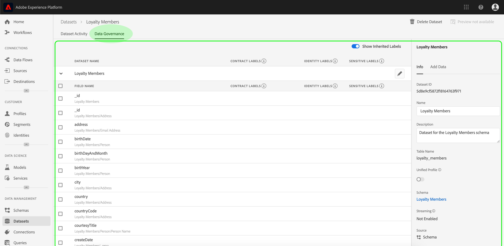
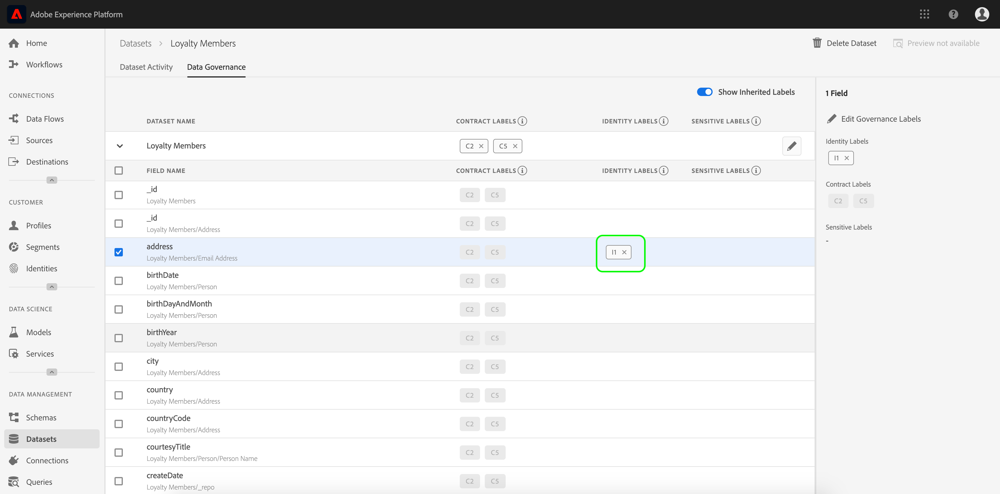

# 資料使用標籤使用指南

本使用指南涵蓋在使用者介面中使用資料使用標籤 [!DNL Experience Platform] 的步驟。 在使用指南之前，請參 [[!DNL Data Governance] 閱概述](../home.md) ，以取得更強穩的架構簡介 [!DNL Data Governance] 。

## 在資料集層級管理資料使用標籤

若要在資料集層級管理資料使用標籤，您必須選取現有的資料集或建立新的資料集。 登入Adobe Experience Platform後，在左側導覽中選 **[!UICONTROL 取「資料集]** 」以開啟「資料集 __ 」工作區。 此頁列出屬於您組織的所有已建立資料集，以及與每個資料集相關的有用詳細資訊。

下一節提供建立新資料集以套用標籤的步驟。 如果您想要編輯現有資料集的標籤，請從清單中選取資料集，然後跳至將資料 [使用標籤新增至資料集](#add-labels)。

### 建立新資料集

>[!NOTE]
>
>在此範例中，使用預先設定(XDM)的架構來 [!DNL Experience Data Model] 建立資料集。 有關XDM架構的詳細資訊，請參見 [XDM系統概述](../../xdm/home.md)[和架構構成基礎](../../xdm/schema/composition.md)。

若要建立新資料集，請按一 **[!UICONTROL 下「資料集]** 」工作區右上角的「建立資 **[!UICONTROL 料集]** 」。

此時會 **[!UICONTROL 顯示「建立資料集]** 」畫面。 在這裡，按一下「從 **[!UICONTROL 結構描述建立資料集」]**。

將 **[!UICONTROL 出現「選擇方案]** 」螢幕，其中列出了可用於建立資料集的所有可用方案。 按一下方案旁邊的單選按鈕以選擇它。 右側 **[!UICONTROL 的]** 「方案」部分顯示有關所選方案的其他詳細資訊。 選擇結構後，按一下「下 **[!UICONTROL 一步]**」。

此時會 **[!UICONTROL 顯示「設定資料集]** 」畫面。 為新資 **料集提供** （必要） **名稱和說明** （可選，但建議使用），然後按一下「 **[!UICONTROL 完成」]**。

此時將 **[!UICONTROL 顯示「資料集活動]** 」頁，顯示有關新建立的資料集的資訊。 在此範例中，資料集名為「忠誠成員」，因此，頂端導覽會顯示「資 **料集>忠誠成員」**。

### 新增資料使用標籤至資料集 {#add-labels}

在建立新資料集或從資料集工作區的清單中選取現有資料集後 **[!UICONTROL ，按一下「資料控管]** 」以開啟「資料 **[!UICONTROL 控管]****** 」工作區。 工作區可讓您在資料集層級和欄位層級管理資料使用標籤。

若要在資料集層級編輯資料使用標籤，請先按一下資料集名稱旁的鉛筆圖示。

將打 **[!UICONTROL 開「編輯管理標籤]** 」對話框。 在對話方塊中，勾選您要套用至資料集之標籤旁的方塊。 請記住，資料集內的所有欄位都會繼承這些標籤。 「套 **[!UICONTROL 用的標籤]** 」標題會隨著您勾選每個方塊而更新，顯示您選擇的標籤。 在您選取所要的標籤後，按一下「儲 **[!UICONTROL 存變更」]**。

 

「資 **[!UICONTROL 料管理]** 」工作區會重新出現，顯示您在資料集層級套用的標籤。 您也可以看到標籤會繼承至資料集內的每個欄位。

請注意，資料集層級的標籤旁會出現「x」，讓您移除標籤。 每個欄位旁繼承的標籤旁沒有「x」，而且會顯示為「灰色」，無法移除或編輯。 這是因為繼 **承的欄位是唯讀的**，這表示無法在欄位層級移除這些欄位。

依預 **[!UICONTROL 設，「顯示繼承的標籤]** 」會開啟，讓您查看從資料集繼承到其欄位的任何標籤。 切換關閉功能會隱藏資料集內任何繼承的標籤。

## 在資料集欄位層級管理資料使用標籤

在資料集層級 [繼續新增和編輯資料使用標籤的工作流程](#add-labels)，您也可以在該資料集的「資料控管 **** 」工作區中管理欄位層級標籤。

若要將資料使用標籤套用至個別欄位，請選取欄位名稱旁的核取方塊，然後按一下「編 **[!UICONTROL 輯控管標籤」]**。

此時將 **[!UICONTROL 顯示「編輯管理標籤]** 」對話框。 對話方塊會顯示標題，其中顯示選取的欄位、套用的標籤和繼承的標籤。 請注意，繼承的標籤（C2和C5）在對話方塊中會變灰。 這些標籤是繼承自資料集層級的唯讀標籤，因此僅能在資料集層級編輯。

 

按一下您要使用之每個標籤旁的核取方塊，以選取欄位層級標籤。 在您選擇標籤時，「已套用 **[!UICONTROL 的標籤]** 」標題會更新，以顯示已套用至「選取欄位」標題中所 **[!UICONTROL 示欄位的標籤]** 。 在您選取欄位層級標籤後，按一下「儲存 **[!UICONTROL 變更」]**。

 

「資 **[!UICONTROL 料管理]** 」工作區會重新顯示，現在欄位名稱旁的列會顯示選取的欄位層級標籤。 請注意，欄位層級標籤旁有&quot;x&quot;，讓您移除標籤。

您可以重複這些步驟，繼續新增和編輯其他欄位的欄位層級標籤，包括選取多個欄位以同時套用欄位層級標籤。

請務必記住，繼承僅從頂層向下移動(dataset → fields)，這表示在欄位級別應用的標籤不會傳播到其他欄位或資料集。

## 管理自訂標籤

您可以在UI的「原則」工作區中 **[!UICONTROL 建立自訂]** ，使用 [!DNL Experience Platform] 標籤。 按一 **[!UICONTROL 下左側導覽]** 中的「原則」，然後按一下「 **[!UICONTROL 標籤]** 」以檢視現有標籤的清單。 在這裡，按一下「 **[!UICONTROL 建立標籤]**」。

此時將 **[!UICONTROL 顯示「建立標籤]** 」對話框。 從這裡，為新標籤提供以下資訊：

* **[!UICONTROL 識別碼]**:標籤的唯一識別碼。 此值用於查閱，因此應簡短且簡明。
* **[!UICONTROL 名稱]**:標籤的好記顯示名稱。
* **[!UICONTROL 說明]**:（可選）標籤的說明，以提供進一步的內容。

When finished, click **[!UICONTROL Create]**.

對話框關閉，新建立的自定義標籤將顯示在「標籤」( **[!UICONTROL Labels]** )頁籤下的清單中。

現在，編輯資料集和欄位的使用 **** 標籤時，或建立資料使用策略時，可以在「自定義標籤」下選擇標籤。

 

## 後續步驟

現在您已在資料集和欄位層級新增資料使用標籤，您就可以開始將資料內嵌至 [!DNL Experience Platform]。 若要進一步瞭解，請先閱讀資料 [擷取檔案](../../ingestion/home.md)。

您現在也可以根據已套用的標籤來定義資料使用原則。 如需詳細資訊，請參閱資 [料使用政策概觀](../policies/overview.md)。

## 其他資源

以下影片旨在支援您對資料集和 [!DNL Data Governance]個別欄位的瞭解，並概述如何套用標籤至資料集和欄位。

>[!VIDEO](https://video.tv.adobe.com/v/29709?quality=12&enable10seconds=on&speedcontrol=on)
