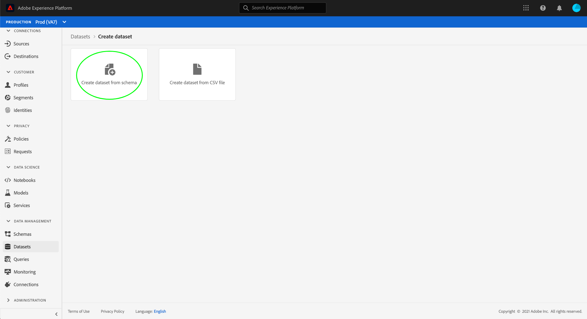

# 在UI中管理資料使用標籤

本使用指南涵蓋在[!DNL Experience Platform]使用者介面中使用資料使用標籤的步驟。 在使用指南之前，請參閱[[!DNL Data Governance] overview](../home.md)以取得[!DNL Data Governance]架構的更強穩簡介。

## 在資料集層級管理標籤

若要在資料集層級管理資料使用標籤，您必須選取現有的資料集或建立新的資料集。 登入Adobe Experience Platform後，在左側導覽中選取&#x200B;**[!UICONTROL Datasets]**&#x200B;以開啟&#x200B;**[!UICONTROL Datasets]**&#x200B;工作區。 此頁列出屬於您組織的所有已建立資料集，以及與每個資料集相關的有用詳細資訊。

下一節提供建立新資料集以套用標籤的步驟。 如果要編輯現有資料集的標籤，請從清單中選擇資料集，然後跳到[向資料集](#add-labels)添加資料使用標籤。

### 建立新資料集

>[!NOTE]
>
>在此範例中，使用預先設定的[!DNL Experience Data Model](XDM)架構來建立資料集。 有關XDM架構的詳細資訊，請參閱[XDM系統概述](../../xdm/home.md)和[架構構成基礎](../../xdm/schema/composition.md)。

若要建立新資料集，請在&#x200B;**[!UICONTROL Datasets]**&#x200B;工作區的右上角選取&#x200B;**[!UICONTROL Create Dataset]**。

出現&#x200B;**[!UICONTROL Create Dataset]**&#x200B;螢幕。 從此處選擇&#x200B;**[!UICONTROL Create Dataset from Schema]**。

出現&#x200B;**[!UICONTROL Select Schema]**&#x200B;螢幕，其中列出可用於建立資料集的所有可用方案。 選擇方案旁邊的單選按鈕以選擇它。 右側的&#x200B;**[!UICONTROL Schemas]**&#x200B;部分顯示有關所選方案的其他詳細資訊。 選擇方案後，選擇&#x200B;**[!UICONTROL Next]**。

出現&#x200B;**[!UICONTROL Configure Dataset]**&#x200B;螢幕。 為新資料集提供名稱（必要）和說明（可選，但建議使用），然後選取&#x200B;**[!UICONTROL Finish]**。

此時將顯示&#x200B;**[!UICONTROL Dataset Activity]**&#x200B;頁面，顯示有關新建立的資料集的資訊。 在此範例中，資料集名為「忠誠成員」，因此，頂端導覽會顯示&#x200B;**資料集>忠誠成員**。

### 將資料使用標籤新增至資料集{#add-labels}

在建立新資料集或從&#x200B;**[!UICONTROL Datasets]**&#x200B;工作區的清單中選取現有資料集後，選取&#x200B;**[!UICONTROL Data Governance]**&#x200B;以開啟&#x200B;**[!UICONTROL Data Governance]**&#x200B;工作區。 工作區可讓您在資料集層級和欄位層級管理資料使用標籤。

若要在資料集層級編輯資料使用標籤，請從選取資料集名稱旁的鉛筆圖示開始。

將開啟&#x200B;**[!UICONTROL Edit Governance Labels]**&#x200B;對話框。 在對話方塊中，勾選您要套用至資料集之標籤旁的方塊。 請記住，資料集內的所有欄位都會繼承這些標籤。 勾選每個方塊時，**[!UICONTROL Applied Labels]**&#x200B;標題會更新，顯示您選擇的標籤。 選擇所需標籤後，請選擇&#x200B;**[!UICONTROL Save Changes]**。

**[!UICONTROL Data Governance]**&#x200B;工作區會重新出現，顯示您已在資料集層級套用的標籤。 您也可以看到標籤會繼承至資料集內的每個欄位。

請注意，資料集層級的標籤旁會出現「x」，讓您移除標籤。 每個欄位旁繼承的標籤旁沒有「x」，而且會顯示為「灰色」，無法移除或編輯。 這是因為&#x200B;**繼承的欄位是唯讀**，這表示無法在欄位層級移除。

預設會開啟&#x200B;**[!UICONTROL Show Inherited Labels]**&#x200B;切換，讓您查看從資料集繼承到其欄位的任何標籤。 切換關閉功能會隱藏資料集內任何繼承的標籤。

## 在欄位層級管理標籤

繼續[在資料集層級](#add-labels)新增和編輯資料使用標籤的工作流程，您也可以在該資料集的&#x200B;**[!UICONTROL Data Governance]**&#x200B;工作區中管理欄位層級標籤。

若要將資料使用標籤套用至個別欄位，請選取欄位名稱旁的核取方塊，然後選取&#x200B;**[!UICONTROL Edit Governance Labels]**。

出現&#x200B;**[!UICONTROL Edit Governance Labels]**&#x200B;對話框。 對話方塊會顯示標題，其中顯示選取的欄位、套用的標籤和繼承的標籤。 請注意，繼承的標籤（C2和C5）在對話方塊中會變灰。 這些標籤是繼承自資料集層級的唯讀標籤，因此僅能在資料集層級編輯。

選取您要使用之每個標籤旁的核取方塊，以選取欄位層級標籤。 在您選擇標籤時，**[!UICONTROL Applied Labels]**&#x200B;標題會更新，以顯示套用至&#x200B;**[!UICONTROL Selected Fields]**&#x200B;標題中所示欄位的標籤。 選擇完欄位級標籤後，請選擇&#x200B;**[!UICONTROL Save Changes]**。

**[!UICONTROL Data Governance]**&#x200B;工作區會重新出現，現在欄位名稱旁的列會顯示選取的欄位層級標籤。 請注意，欄位層級標籤旁有&quot;x&quot;，讓您移除標籤。

您可以重複這些步驟，繼續新增和編輯其他欄位的欄位層級標籤，包括選取多個欄位以同時套用欄位層級標籤。

請務必記住，繼承僅從頂層向下移動(dataset → fields)，這表示在欄位級別應用的標籤不會傳播到其他欄位或資料集。

## 管理自訂標籤

您可以在[!DNL Experience Platform] UI的&#x200B;**[!UICONTROL Policies]**&#x200B;工作區中建立您自己的自訂使用標籤。 在左側導覽中選取&#x200B;**[!UICONTROL Policies]**，然後選取&#x200B;**[!UICONTROL Labels]**&#x200B;以檢視現有標籤的清單。 從此處選擇&#x200B;**[!UICONTROL Create label]**。

出現&#x200B;**[!UICONTROL Create label]**&#x200B;對話框。 從這裡，為新標籤提供以下資訊：

* **[!UICONTROL Identifier]**:標籤的唯一識別碼。此值用於查閱，因此應簡短且簡明。
* **[!UICONTROL Name]**:標籤的好記顯示名稱。
* **[!UICONTROL Description]**:（可選）標籤的說明，以提供進一步的內容。

完成後，選擇&#x200B;**[!UICONTROL Create]**。

對話框關閉，新建立的自定義標籤將顯示在&#x200B;**[!UICONTROL Labels]**&#x200B;頁籤下的清單中。

現在，編輯資料集和欄位的使用標籤時，或建立資料使用策略時，可以在&#x200B;**[!UICONTROL Custom Labels]**&#x200B;下選擇該標籤。

 

## 後續步驟

現在您已在資料集和欄位層級新增資料使用標籤，您就可以開始將資料內嵌至[!DNL Experience Platform]。 若要進一步瞭解，請先閱讀[資料擷取檔案](../../ingestion/home.md)。

您現在也可以根據已套用的標籤來定義資料使用原則。 如需詳細資訊，請參閱[資料使用政策概述](../policies/overview.md)。

## 其他資源

以下視訊旨在支援您對[!DNL Data Governance]的理解，並概述如何將標籤套用至資料集和個別欄位。

>[!VIDEO](https://video.tv.adobe.com/v/29709?quality=12&enable10seconds=on&speedcontrol=on)
