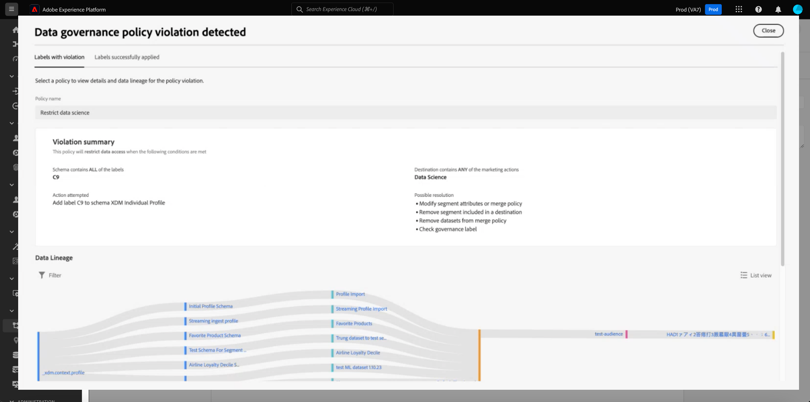

# 管理 UI 中的資料使用標籤 {#user-guide}

>[!CONTEXTUALHELP]
>id="platform_privacyConsole_dataGovernance_description"
>title="控管 Platform 中的資料使用情況"
>abstract="<h2>說明</h2>
Experience Platform 中的資料控管架構可讓您根據資料使用限制來標記屬性和方案，並設定原則來識別和執行特定行銷活動的這些限制。
"

本使用手冊說明在[!DNL Experience Platform]使用者介面中使用資料使用標籤的步驟。

## 管理標籤 {#manage-labels}

若要將標籤套用至您的資料，您需要&#x200B;**[!UICONTROL 管理使用標籤]**&#x200B;許可權，才能用於名為「prod」的預設生產沙箱。 若要建立自訂標籤，您也必須擁有產品設定檔的管理許可權。 每個組織只有一個適用標籤清單，目前不支援刪除標籤。

如需如何指派許可權的詳細資訊，請參閱如何[設定許可權](https://experienceleague.adobe.com/docs/platform-learn/getting-started-for-data-architects-and-data-engineers/configure-permissions.html)的指南，或[存取控制總覽](../../access-control/home.md)。 如果您無法存取貴組織的Admin Console，請聯絡組織管理員。

## 管理結構層級的標籤

您可以直接將標籤新增至結構描述或該結構描述中的欄位。 套用至結構描述層級的任何欄位都會傳播至以該結構描述為基礎的所有資料集。

>[!NOTE]
>
>如果您的資料使用原則是在您標籤欄位之前建立的，則當您在新結構描述中套用標籤時，可能會遇到治理原則違規對話方塊。 此對話方塊指出套用此標籤將違反現有的使用原則。 使用資料歷程圖表來瞭解必須先進行哪些其他設定變更，才能將標籤新增至結構描述欄位。
>
>
>
>如需部分原則違規的詳細資訊，請參閱[資料使用原則違規檔案](https://experienceleague.adobe.com/en/docs/experience-platform/data-governance/enforcement/auto-enforcement#data-usage-violation)。

若要在結構描述層級管理資料使用標籤，您必須選取現有結構描述或建立新結構描述。 登入Adobe Experience Platform後，在左側導覽上選取「**[!UICONTROL 結構描述]**」以開啟「**[!UICONTROL 結構描述]**」工作區。 此頁面列出屬於您組織的所有已建立綱要，以及與每個綱要相關的有用詳細資訊。

![反白顯示[結構描述]索引標籤的Adobe Experience Platform UI。](../images/labels/schema-tab.png)

下一節提供建立新結構描述以套用標籤的步驟。 如果您想要編輯現有結構描述的標籤，請從清單中選取結構描述，然後跳到[新增資料使用標籤到結構描述](#add-labels)。

### 建立新結構描述

若要建立新的結構描述，請選取&#x200B;**[!UICONTROL 結構描述]**&#x200B;工作區右上角的&#x200B;**[!UICONTROL 建立結構描述]**。 請參閱[上的指南以瞭解如何使用結構描述編輯器](../../xdm/tutorials/create-schema-ui.md#create)建立結構描述，以取得完整的指示。 或者，如果需要，您可以[使用結構描述登入API](../../xdm/tutorials/create-schema-api.md)建立結構描述。

### 將資料使用標籤新增到結構描述 {#add-labels-to-schema}

在建立新結構描述或從[!UICONTROL 結構描述]工作區的[!UICONTROL 瀏覽]索引標籤中的清單選取現有結構描述後，請在結構描述編輯器中從結構描述選取欄位。 在[!UICONTROL 欄位屬性]側邊欄中，選取&#x200B;**[!UICONTROL 套用存取權和資料治理標籤]**。

會出現一個對話方塊，可讓您在結構描述層級和欄位層級套用和管理資料使用標籤。 請參閱XDM教學課程，以瞭解[如何新增或編輯XDM結構描述](../../xdm/tutorials/labels.md#select-schema-field)的資料使用標籤。

### 將資料使用標籤新增到特定資料集 {#add-labels-to-dataset}

>[!CONTEXTUALHELP]
>id="platform_privacyConsole_dataGovernance_instructions"
>title="說明"
>abstract="<ol><li>在左側導覽中選取<a href="https://experienceleague.adobe.com/docs/experience-platform/data-governance/labels/user-guide.html?lang=zh-Hant">資料集</a>，然後選取要限制其資料的資料集。</li><li>從資料集的詳細資料檢視中，選取<b>資料控管</b>索引標籤。</li><li>選取要限制的資料集欄位，然後選取<b>編輯控管標籤</b>以根據使用限制來標記資料。</li><li>標記資料後，在左側導覽中選取<a href="https://experienceleague.adobe.com/docs/experience-platform/data-governance/policies/overview.html?lang=zh-Hant">原則</a>，然後選取<b>建立原則</b>。</li><li>選擇建立<a href="https://experienceleague.adobe.com/docs/experience-platform/data-governance/policies/user-guide.html?lang=zh-Hant#create-governance-policy">資料控管原則</a>，然後選取原則將套用到原則的資料使用標籤。</li><li>選取行銷動作，原則將拒絕對包含這些標籤的任何資料。建立原則後，從清單中選擇它並使用右側邊欄中的切換啟用它。</li><li>對於每個啟用的原則，Platform 會阻止包含指定之標籤的任何資料用於定義的行銷動作。當您嘗試對具有關聯的行銷動作的目的地啟用標記的資料時，此強制執行會自動發生。</li></ol>"

>[!IMPORTANT]
>
>標籤無法再套用至資料集層級的欄位。 此工作流程已淘汰，而改為在結構描述層級套用標籤。 在2024年5月31日之前，先前在資料集物件層級套用的任何標籤仍會透過Platform UI受到支援。 為確保您的標籤在所有結構描述中保持一致，您必須在未來一年將之前附加至資料集層級欄位的任何標籤移轉至結構描述層級。 請參閱檔案以瞭解[如何將先前套用的標籤從資料集移轉至結構描述層級](../e2e.md#migrate-labels)的說明。

標籤可以從&#x200B;**[!UICONTROL 資料集]**&#x200B;工作區的&#x200B;**[!UICONTROL 資料控管]**&#x200B;索引標籤套用至整個資料集。 工作區可讓您在資料集層級管理資料使用標籤。

![已反白顯示[!UICONTROL 資料集]工作區的[!UICONTROL 資料控管]標籤。](../images/labels/dataset-governance.png)

若要編輯資料集層級的資料使用標籤，請先選取鉛筆圖示()的資料集名稱。

![ [!UICONTROL 資料集]工作區的[!UICONTROL 資料控管]索引標籤，其編輯鉛筆圖示已反白顯示。](../images/labels/dataset-level-edit.png)

**[!UICONTROL 編輯治理標籤]**&#x200B;對話方塊開啟。 在對話方塊中，勾選您要套用至資料集的標籤旁的方塊。 請記住，這些標籤將由資料集內的所有欄位繼承。 當您勾選每個方塊時，**[!UICONTROL 套用的標籤]**&#x200B;標題會更新，並顯示您選擇的標籤。 選取想要的標籤之後，請選取&#x200B;**[!UICONTROL 儲存變更]**。

![[編輯治理標籤]對話方塊，其標籤核取方塊和[儲存變更]會反白顯示。](../images/labels/apply-labels-dataset.png)

**[!UICONTROL 資料控管]**&#x200B;工作區會重新出現，顯示您已在資料表初始資料列中的資料集層級套用的標籤。 您也可以看到標籤（以個別卡片表示），這些標籤會繼承至資料集中的每個欄位。

![ [!UICONTROL 資料集]工作區的[!UICONTROL 資料控管]索引標籤已套用資料集層級標籤，且已繼承的資料集歸檔標籤已反白顯示。](../images/labels/applied-dataset-labels.png)

### 從資料集中移除標籤 {#remove-labels-from-a-dataset}

在資料集層級新增的標籤，其卡片旁會有「x」。 這可讓您從整個資料集中移除標籤。 每個欄位旁的繼承標籤旁邊沒有「x」，且顯示「灰色」。 這些&#x200B;**繼承的標籤是唯讀的**，表示無法在欄位層級移除或編輯它們。

<!-- ## View labels at the dataset field level {#view-labels-at-dataset-field-level} -->

<!-- To view labels inherited by the dataset from the schema level, select **[!UICONTROL Datasets]** to navigate to the datasets workspace and select the relevant dataset from the list. 

Next, select the **[!UICONTROL Data Governance]** tab to show the labels that have been applied to the dataset. You can also see that the labels are inherited down to each of the fields within the dataset.

The inherited labels beside each field do not have an "x" next to them and appear "greyed out" with no ability to remove or edit. This is because **inherited fields are read-only**, meaning they cannot be removed at the field level. -->

<!--Beleive can cut above here  -->

依預設，**[!UICONTROL 顯示繼承的標籤]**&#x200B;切換為開啟，可讓您檢視從結構描述繼承至其欄位的任何標籤。 切換為關閉會隱藏資料集中任何繼承的標籤。

<!-- Labels applied to the dataset appear in read-only form within the **[!UICONTROL Data Governance]** view for that dataset. 

 -->

>[!NOTE]
>
>在資料集標籤功能遭取代之前套用的標籤，可以透過尋找相關資料集並選取標籤上的取消圖示從資料集中移除。
>
>請參閱檔案以瞭解[如何將先前套用的標籤從資料集移轉至結構描述層級](../e2e.md#migrate-labels)的說明。

## 管理自訂標籤 {#manage-custom-labels}

>[!CONTEXTUALHELP]
>id="platform_governance_createlabels"
>title="建立標籤"
>abstract="標籤可讓您根據適用於該資料的使用原則對資料集和欄位進行分類。平台提供了一組標準標籤供您使用，但您也可以建立您組織專用的自訂標籤。"

您可以在[!DNL Experience Platform] UI的&#x200B;**[!UICONTROL 原則]**&#x200B;工作區中建立您自己的自訂使用標籤。 在左側導覽中選取「**[!UICONTROL 原則]**」，然後選取「**[!UICONTROL 標籤]**」以檢視現有標籤的清單。 從這裡，選取&#x200B;**[!UICONTROL 建立標籤]**。

**[!UICONTROL 建立標籤]**&#x200B;對話方塊就會顯示。 從這裡，為新標籤提供下列資訊：

* **[!UICONTROL 名稱]**：標籤的唯一識別碼。 此值用於查閱目的，因此應簡短明瞭。
* **[!UICONTROL 易記名稱]**：標籤的易記顯示名稱。
* **[!UICONTROL 描述]**： （選擇性）標籤的描述，以提供進一步的內容。

完成後，選取&#x200B;**[!UICONTROL 建立]**。

![原則工作區的[建立標籤]對話方塊中反白顯示[建立]。](../images/labels/create-label-dialog.png)

對話方塊關閉，新建立的自訂標籤會出現在&#x200B;**[!UICONTROL 標籤]**&#x200B;標籤下的清單中。

![原則工作區的[標籤]索引標籤中反白顯示新的自訂標籤。](../images/labels/label-created.png)

現在，編輯資料集和欄位使用標籤或建立資料使用原則時，可以在&#x200B;**[!UICONTROL 自訂標籤]**&#x200B;下選取標籤。

![反白顯示具有自訂標籤的[套用存取權和資料控管標籤]對話方塊。](../images/labels/add-custom-label.png)

## 後續步驟

現在您已在資料集和欄位層級新增資料使用標籤，您可以開始將資料內嵌至[!DNL Experience Platform]。 若要深入瞭解，請先閱讀[資料擷取檔案](../../ingestion/home.md)。

您現在還可以根據已套用的標籤來定義資料使用原則。 如需詳細資訊，請參閱[資料使用原則概觀](../policies/overview.md)。

<!-- The workflow of this video is now outdated. This can be enabled once the video has been updated

## Additional resources

The following video is intended to support your understanding of Data Governance, and outlines how to apply labels to a dataset and individual fields.

>[!VIDEO](https://video.tv.adobe.com/v/29709?quality=12&enable10seconds=on&speedcontrol=on) -->
