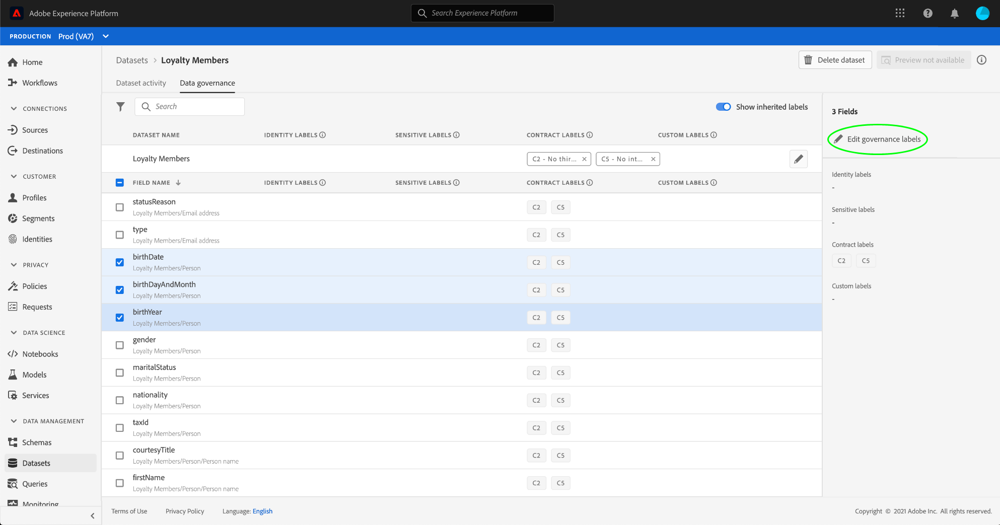

# 在UI中管理資料使用量標籤 {#user-guide}

>[!CONTEXTUALHELP]
>id="platform_privacyConsole_dataGovernance_description"
>title="控管Platform中的資料使用方式"
>abstract="<h2>說明</h2>
「Experience Platform」中的「資料控管」架構可讓您根據資料使用限制來標示屬性和資料集，並設定原則，針對特定行銷動作識別並遵循這些限制。
"

本使用手冊涵蓋在 [!DNL Experience Platform] 使用者介面。

## 在資料集層級管理標籤

>[!IMPORTANT]
>
>只有資料控管使用案例才支援在資料集層級套用標籤。 如果您嘗試為資料建立訪問策略，則必須 [將標籤應用於方案](../../xdm/tutorials/labels.md) 資料集所依據之資料集。 請參閱 [基於屬性的訪問控制](../../access-control/abac/overview.md) 以取得更多資訊。

若要在資料集層級管理資料使用量標籤，您必須選取現有的資料集或建立新的資料集。 登入Adobe Experience Platform後，請選取 **[!UICONTROL 資料集]** 在左側導覽上，開啟 **[!UICONTROL 資料集]** 工作區。 此頁面列出屬於您組織的所有已建立資料集，以及與每個資料集相關的實用詳細資料。

下一節提供建立新資料集以套用標籤的步驟。 如果您想要編輯現有資料集的標籤，請從清單中選取資料集，然後跳到 [將資料使用量標籤新增至資料集](#add-labels).

### 建立新資料集

>[!NOTE]
>
>在此範例中，資料集是使用預先設定的 [!DNL Experience Data Model] (XDM)結構。 如需XDM結構的詳細資訊，請參閱 [XDM系統概觀](../../xdm/home.md) 和 [綱要構成基本知識](../../xdm/schema/composition.md).

若要建立新資料集，請選取 **[!UICONTROL 建立資料集]** 在 **[!UICONTROL 資料集]** 工作區。

此 **[!UICONTROL 建立資料集]** 畫面。 從此處，選擇 **[!UICONTROL 從結構建立資料集]**.

此 **[!UICONTROL 選擇架構]** 畫面中顯示，其中列出所有可用的結構描述，供您建立資料集時使用。 選取架構旁的選項按鈕以加以選取。 此 **[!UICONTROL 結構]** 右側的區段會顯示有關所選架構的其他詳細資訊。 選擇架構後，選擇 **[!UICONTROL 下一個]**.

此 **[!UICONTROL 設定資料集]** 畫面。 提供新資料集的名稱（必要）和說明（選用，但建議使用），然後選取 **[!UICONTROL 完成]**.

此 **[!UICONTROL 資料集活動]** 頁面，顯示新建立資料集的相關資訊。 在此範例中，資料集名為「忠誠會員」，因此會顯示最上層導覽 **資料集>忠誠會員**.

### 將資料使用量標籤新增至資料集 {#add-labels}

建立新資料集或從 **[!UICONTROL 資料集]** 工作區，選取 **[!UICONTROL 資料控管]** 開啟 **[!UICONTROL 資料控管]** 工作區。 工作區可讓您在資料集層級和欄位層級管理資料使用量標籤。

若要在資料集層級編輯資料使用量標籤，請先選取資料集名稱旁的鉛筆圖示。

此 **[!UICONTROL 編輯控管標籤]** 對話框開啟。 在對話方塊中，勾選您要套用至資料集之標籤旁的方塊。 請記住，這些標籤將由資料集內的所有欄位繼承。 此 **[!UICONTROL 套用的標籤]** 標題會隨著您勾選每個方塊而更新，並顯示您選取的標籤。 選取所需標籤後，請選取 **[!UICONTROL 儲存變更]**.

此 **[!UICONTROL 資料控管]** 工作區會重新顯示，顯示您已在資料集層級套用的標籤。 您也可以看到標籤會繼承到資料集內的每個欄位。

請注意，資料集層級的標籤旁會出現「x」，讓您移除標籤。 每個欄位旁繼承的標籤旁邊沒有「x」，並且會顯示為「灰色」，無法移除或編輯。 這是因為 **繼承的欄位為只讀**，表示無法在欄位層級移除。

此 **[!UICONTROL 顯示繼承的標籤]** 切換為「 」預設為「 」，可讓您查看從資料集繼承到其欄位的任何標籤。 切換關閉功能會隱藏資料集內任何繼承的標籤。

## 在資料集欄位層級管理標籤 {#manage-labels-at-dataset-field-level}

>[!CONTEXTUALHELP]
>id="platform_privacyConsole_dataGovernance_instructions"
>title="說明"
>abstract="<ul><li>選擇 <a href="https://experienceleague.adobe.com/docs/experience-platform/data-governance/labels/user-guide.html">資料集</a> 在左側導覽器中，選取您要限制其資料的資料集。</li><li>從資料集詳細資料檢視中，選取 <b>資料控管</b> 標籤。</li><li>選取您要限制的資料集欄位，然後選取 <b>編輯控管標籤</b> 以根據使用限制來標籤資料。</li><li>為資料加上標籤後，請選取 <a href="https://experienceleague.adobe.com/docs/experience-platform/data-governance/policies/overview.html?lang=zh-Hant">原則</a> 在左側導覽器中，然後選取 <b>建立原則</b>.</li><li>選擇建立 <a href="https://experienceleague.adobe.com/docs/experience-platform/data-governance/policies/user-guide.html#create-governance-policy">資料控管政策</a>，然後選擇策略將應用到策略的資料使用量標籤。</li><li>選擇策略將拒絕包含這些標籤的任何資料的行銷操作。 建立原則後，從清單中選取該原則，然後使用右側邊欄的切換按鈕加以啟用。</li><li>對於每個啟用的原則，Platform會防止任何包含指定標籤的資料用於定義的行銷動作。 當您嘗試將標示為的資料啟用至具有相關行銷動作（使用案例）的目的地時，就會自動執行此規範。</li></ul>"

>[!IMPORTANT]
>
>只有資料控管使用案例才支援在資料集欄位層級套用標籤。 如果您嘗試為資料建立訪問策略，則必須 [將標籤應用於方案](../../xdm/tutorials/labels.md) 資料集所依據之資料集。 請參閱 [基於屬性的訪問控制](../../access-control/abac/overview.md) 以取得更多資訊。

繼續工作流程 [在資料集層級新增及編輯資料使用量標籤](#add-labels)，您也可以在 **[!UICONTROL 資料控管]** 工作區。

若要將資料使用量標籤套用至個別欄位，請選取欄位名稱旁的核取方塊，然後選取 **[!UICONTROL 編輯控管標籤]**.

此 **[!UICONTROL 編輯控管標籤]** 對話框。 對話方塊會顯示標題，其中顯示選取的欄位、套用的標籤和繼承的標籤。 請注意，對話方塊中繼承的標籤（C2和C5）會呈現灰色。 這些標籤是從資料集層級繼承的唯讀標籤，因此只能在資料集層級編輯。

選取您要使用之每個標籤旁的核取方塊，以選取欄位層級標籤。 當您選取標籤時， **[!UICONTROL 套用的標籤]** 標題更新，顯示套用至 **[!UICONTROL 所選欄位]** 頁首。 完成欄位層級標籤的選取後，請選取 **[!UICONTROL 儲存變更]**.

此 **[!UICONTROL 資料控管]** 工作區會重新顯示，現在欄位名稱旁的列會顯示選取的欄位層級標籤。 請注意，欄位層級標籤旁有&quot;x&quot;，可讓您移除標籤。

您可以重複這些步驟，繼續為其他欄位新增和編輯欄位層級標籤，包括同時選取多個欄位以套用欄位層級標籤。

請務必記住，繼承只會從上層(資料集→欄位)向下移動，這表示在欄位層級套用的標籤不會傳播至其他欄位或資料集。

## 在結構層級管理標籤

您可以直接將標籤新增至該架構內的架構或欄位。 在結構層級套用的任何欄位，都會傳播至以該結構為基礎的所有資料集。

請參閱 [管理架構層級標籤](../../xdm/tutorials/labels.md) 以取得更多資訊。

## 管理自訂標籤 {#manage-custom-labels}

>[!CONTEXTUALHELP]
>id="platform_governance_createlabels"
>title="建立標籤"
>abstract="標籤可讓您根據適用於該資料的使用原則對資料集和欄位進行分類。平台提供了一組標準標籤供您使用，但您也可以建立您組織專用的自訂標籤。"

您可以在 **[!UICONTROL 原則]** 工作區中 [!DNL Experience Platform] UI。 選擇 **[!UICONTROL 原則]** 在左側導覽中，然後選取 **[!UICONTROL 標籤]** 來查看現有標籤的清單。 從此處，選擇 **[!UICONTROL 建立標籤]**.

此 **[!UICONTROL 建立標籤]** 對話框。 在此處，為新標籤提供下列資訊：

* **[!UICONTROL 識別碼]**:標籤的唯一識別碼。 此值會用於查詢用途，因此應簡短明瞭。
* **[!UICONTROL 名稱]**:好記的標籤顯示名稱。
* **[!UICONTROL 說明]**:（選用）提供進一步內容之標籤的說明。

完成後，請選取 **[!UICONTROL 建立]**.

對話方塊會關閉，而新建立的自訂標籤會顯示在 **[!UICONTROL 標籤]** 標籤。

現在可在 **[!UICONTROL 自訂標籤]** 編輯資料集和欄位的使用量標籤時，或建立資料使用量原則時。

 

## 後續步驟

現在您已在資料集和欄位層級新增資料使用量標籤，可以開始將資料內嵌至 [!DNL Experience Platform]. 若要進一步了解，請先閱讀 [資料擷取檔案](../../ingestion/home.md).

您現在也可以根據已套用的標籤來定義資料使用原則。 如需詳細資訊，請參閱 [資料使用原則概觀](../policies/overview.md).

## 其他資源

以下影片旨在協助您了解資料控管，並概述如何將標籤套用至資料集和個別欄位。

>[!VIDEO](https://video.tv.adobe.com/v/29709?quality=12&enable10seconds=on&speedcontrol=on)
