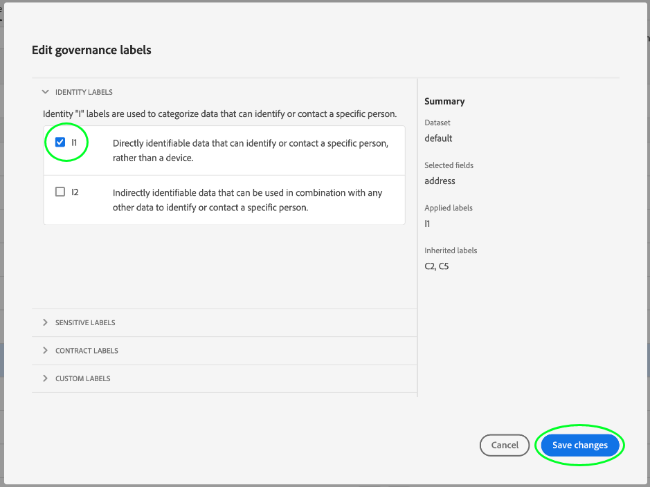

# 資料使用標籤使用指南

本使用指南涵蓋在Experience Platform使用者介面中使用資料使用標籤（也稱為DULE標籤）的步驟。 在使用指南之前，請參閱 [Data Governance概觀](../home.md) ，以取得DULE架構的更強穩簡介。

## 在資料集層級管理資料使用標籤

若要在資料集層級管理資料使用標籤，您必須選取現有的資料集或建立新的資料集。 登入Adobe Experience Platform後，在左側導覽 **[!UICONTROL Datasets]** 中選取以開啟「資料集 __ 」工作區。 此頁列出屬於您組織的所有已建立資料集，以及與每個資料集相關的有用詳細資訊。

下一節提供建立新資料集以套用標籤的步驟。 如果您想要編輯現有資料集的標籤，請從清單中選取資料集，然後跳至將資料 [使用標籤新增至資料集](#add-labels)。

### 建立新資料集

>[!NOTE] 在此範例中，資料集是使用預先設定的體驗資料模型(XDM)架構來建立。 有關XDM架構的詳細資訊，請參見 [XDM系統概述](../../xdm/home.md)[和架構構成基礎](../../xdm/schema/composition.md)。

若要建立新資料集， **[!UICONTROL Create Dataset]** 請按一下工作區右上角的 _[!UICONTROL Datasets]_。

螢幕 _[!UICONTROL Create Dataset]_出現。 在這裡，按一下&#x200B;**[!UICONTROL Create Dataset from Schema]**。

此時 _[!UICONTROL Select Schema]_會出現畫面，其中列出您可用於建立資料集的所有可用結構。 按一下方案旁邊的單選按鈕以選擇它。 右_[!UICONTROL Schemas]_ 側的部分顯示有關所選方案的其他詳細資訊。 選擇架構後，按一下 **[!UICONTROL Next]**。

此時會 _顯示「設定資料集_ 」畫面。 為新資 **料集提供** （必要） **名稱和說明** （可選，但建議使用），然後按一下 **[!UICONTROL Finish]**。

此時 _[!UICONTROL Dataset Activity]_會顯示頁面，顯示有關新建資料集的資訊。 在此範例中，資料集名為「忠誠成員」，因此，頂端導覽會顯示「資_&#x200B;料集>忠誠成員」_。

### 新增資料使用標籤至資料集 {#add-labels}

在建立新資料集或從工作區的清單選取現有資料集後，按一 _[!UICONTROL Datasets]_下以開&#x200B;**[!UICONTROL Data Governance]**啟工作_[!UICONTROL Data Governance]_ 區。 工作區可讓您在資料集層級和欄位層級管理資料使用標籤。

若要在資料集層級編輯資料使用標籤，請先按一下資料集名稱旁的鉛筆圖示。

對話 _[!UICONTROL Edit Governance Labels]_框開啟。 在對話方塊中，勾選您要套用至資料集之標籤旁的方塊。 請記住，資料集內的所有欄位都會繼承這些標籤。 頁_[!UICONTROL Applied Labels]_ 首會隨著您勾選每個方塊而更新，顯示您選擇的標籤。 在您選取所需標籤後，按一下 **[!UICONTROL Save Changes]**。

 

工作 _[!UICONTROL Data Governance]_區會重新出現，顯示您已在資料集層級套用的標籤。 您也可以看到標籤會繼承至資料集內的每個欄位。

請注意，資料集層級的標籤旁會出現「x」，讓您移除標籤。 每個欄位旁繼承的標籤旁沒有「x」，而且會顯示為「灰色」，無法移除或編輯。 這是因為繼 **承的欄位是唯讀的**，這表示無法在欄位層級移除這些欄位。

預 **[!UICONTROL Show Inherited Labels]** 設為開啟，可讓您查看從資料集繼承至其欄位的任何標籤。 切換關閉功能會隱藏資料集內任何繼承的標籤。

## 在資料集欄位層級管理資料使用標籤

在資料集層級 [繼續新增和編輯資料使用標籤的工作流程](#add-labels)，您也可以在該資料集的工作區中管理 _[!UICONTROL Data Governance]_欄位層級標籤。

若要將資料使用標籤套用至個別欄位，請選取欄位名稱旁的核取方塊，然後按一下 **[!UICONTROL Edit Governance Labels]**。

此時將 _[!UICONTROL Edit Governance Labels]_出現對話框。 對話方塊會顯示標題，其中顯示選取的欄位、套用的標籤和繼承的標籤。 請注意，繼承的標籤（C2和C5）在對話方塊中會變灰。 這些標籤是繼承自資料集層級的唯讀標籤，因此僅能在資料集層級編輯。

 

按一下您要使用之每個標籤旁的核取方塊，以選取欄位層級標籤。 當您選取標籤時，標 _[!UICONTROL Applied Labels]_題會更新，以顯示套用至標題中所示欄位的_[!UICONTROL Selected Fields]_ 標籤。 選取欄位層級標籤後，按一下 **[!UICONTROL Save Changes]**。

 

工 _[!UICONTROL Data Governance]_作區會重新出現，現在會在欄位名稱旁的列中顯示選取的欄位層級標籤。 請注意，欄位層級標籤旁有&quot;x&quot;，讓您移除標籤。

您可以重複這些步驟，繼續新增和編輯其他欄位的欄位層級標籤，包括選取多個欄位以同時套用欄位層級標籤。

請務必記住，繼承僅從頂層向下移動(dataset → fields)，這表示在欄位級別應用的標籤不會傳播到其他欄位或資料集。

## 後續步驟

現在您已在資料集和欄位層級新增資料使用標籤，您可以開始將資料收錄到Experience Platform。 若要進一步瞭解，請先閱讀資料 [擷取檔案](../../ingestion/home.md)。

您現在也可以根據已套用的標籤來定義資料使用原則。 如需詳細資訊，請參閱資 [料使用政策概觀](../policies/overview.md)。

## 其他資源

以下視訊旨在支援您對「資料控管」的瞭解，並概述如何將標籤套用至資料集和個別欄位。

>[!VIDEO](https://video.tv.adobe.com/v/29709?quality=12&enable10seconds=on&speedcontrol=on)
